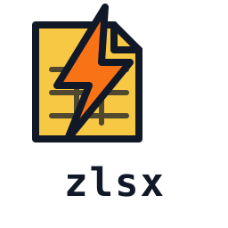
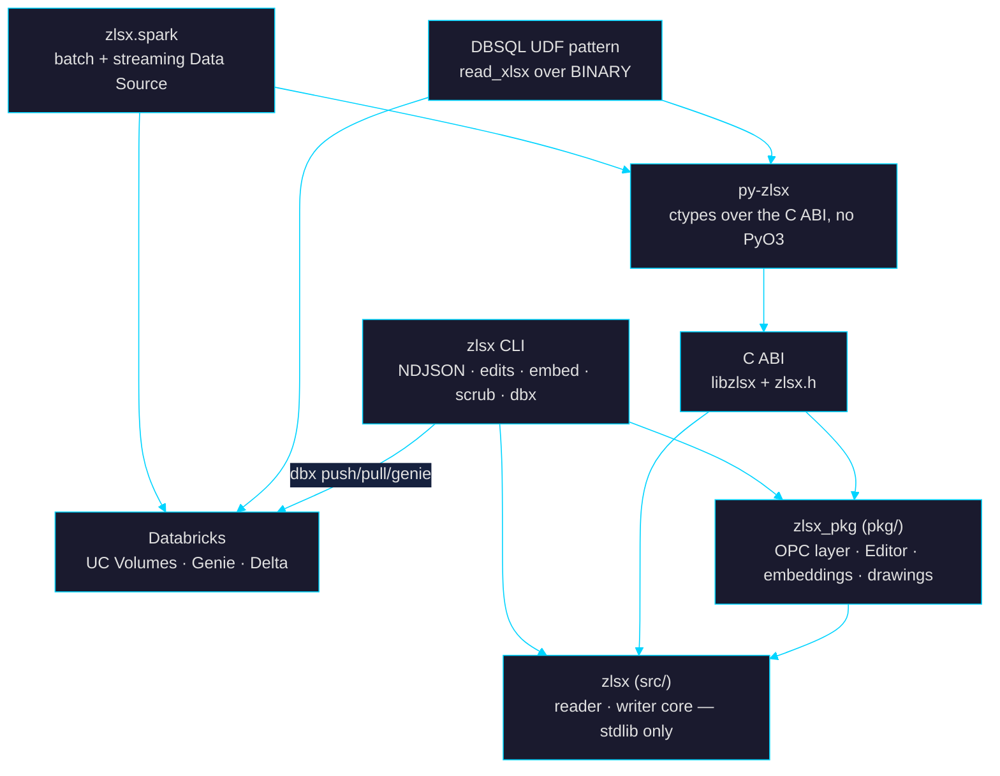

<p align="center">
  
</p>

# zlsx

*Fast `.xlsx` reader, writer, and editor — a single Zig core surfaced as a CLI, a C ABI, Python bindings, and a Spark Data Source.*

<p align="center">
  <a href="https://github.com/laurentfabre/zlsx/actions/workflows/ci.yml"></a>
  <a href="https://github.com/laurentfabre/zlsx/actions/workflows/fuzz-nightly.yml"></a>
  <a href="https://github.com/laurentfabre/zlsx/releases/latest"></a>
  <a href="LICENSE"></a>
  
  
</p>

> **License at a glance** — zlsx is **proprietary**. The repo is public so the
> code can be read, and every person or organization gets a **60-day free
> evaluation of the released binaries and wheels** (artifacts only — no source
> rights). Continued use after 60 days, and any non-evaluation use, requires a
> commercial license: **laurent.fabre@gmail.com**. [Details ↓](#license)

---

## Contents

- [What / Why](#what--why)
- [Highlights](#highlights)
- [Architecture](#architecture)
- [Quick start](#quick-start)
- [Databricks & Spark](#databricks--spark)
- [Feature matrix](#feature-matrix)
- [Performance](#performance)
- [CLI](#cli)
- [Install](#install)
- [Scope: in / out](#scope-in--out)
- [Tests](#tests)
- [Documentation](#documentation)
- [License](#license)

---

## What / Why

zlsx reads, writes, and edits `.xlsx` workbooks with **zero third-party
runtime dependencies** — just Zig's `std.zip` + `std.compress.flate` and a
hand-rolled XML walker scoped to what spreadsheets actually need. One native
core, five ways to consume it:

| Surface | What you get |
|---|---|
| **Zig / C ABI** | `libzlsx.{a,dylib,so,dll}` + [`include/zlsx.h`](include/zlsx.h) — embeddable from any FFI-capable language |
| **CLI** | `zlsx` — "jq for Excel": NDJSON out, edit commands, metadata scrub, embedding tools, Databricks push/pull/genie |
| **Python** | [`py-zlsx`](bindings/python/README.md) — stdlib-`ctypes` binding, wheels bundled with every release |
| **Spark** | [`zlsx.spark`](bindings/python/README.md#spark-pyspark-data-source) — batch **and streaming** Data Source, serverless-verified |
| **Databricks** | [`zlsx dbx`](docs/cli.md#databricks-dbx) + a DBSQL UDF pattern + Genie — [verified integrations](integrations/databricks/README.md) |

Why another xlsx library? The existing options force a trade: calamine (Rust)
is fast but read-only, openpyxl is complete but slow and Python-bound, JVM/POI
wants a heap. Against the implementations measured in
[docs/benchmarks.md](docs/benchmarks.md), zlsx reads fastest at scale, writes
and *edits* as well as reads, and ships as one small static binary or wheel.

---

## Highlights

- **Reader** — ahead of calamine-rust on every corpus fixture beyond the
  ~1.5 ms process-startup floor (up to **1.7×** on a 2.7 MB / 49k-row
  workbook, **38×** faster than openpyxl; tiny ≤30 KB files tie within
  noise), and reads a 76 MB workbook at 293 MB RSS where calamine needs
  1,315 MB. Shared
  strings with rich-text runs, styles, themes, merged ranges, hyperlinks,
  data validations, comments, dates (both epochs), lazy per-sheet streaming
  for big workbooks, and `open_bytes` for in-memory buffers.
- **Writer** — pragmatic openpyxl-parity styling: fonts, 19 fill patterns,
  14 border styles × 5 sides, number formats, alignment, column widths, row
  heights, freeze panes, auto-filter, merged ranges, internal + external
  hyperlinks, the full data-validation family, conditional formatting,
  comments, rich-text cells, defined names, formulas with cached values.
- **Editor** (load-modify-save) — append rows, `setCell`, insert/delete
  rows and columns, add/rename/delete sheets on an *existing* workbook.
  ZIP-substitution
  architecture: untouched entries pass through verbatim, only patched parts
  re-deflate — a 67 KB workbook round-trips in ~5 ms. Structural edits shift
  cell refs, formulas, merged ranges, panes, tables, drawings, comments and
  sparkline / extension formulas together; anything the rewriter cannot shift
  safely is **refused with a typed error instead of corrupting the file**
  ([refusal audit](docs/plans/refusal-audit.md)). One guard remains: sheets
  that *host* a pivot. A sheet a pivot only *reads from* is not detected — the
  S6 audit pinned that with tests, and `zlsx pivots` / `Workbook.pivotTables`
  now name every source sheet; row S7b of `goal_sigmoid.md` closes it.
- **In-workbook embeddings** — store embedding vectors *inside* the workbook
  as OPC parts invisible to Excel; extract / write / prune / strip via
  [`zlsx embed`](docs/cli.md#embeddings-embed). A spreadsheet that carries its
  own RAG index.
- **Metadata scrub** — `zlsx scrub-metadata` removes `docProps` identity
  (author, company, …) outright rather than blanking it.
- **Fuzzed like it matters** — random-byte + mutation-driven fuzz harnesses
  over the reader, the package layer, the byte-splicing edit path and the
  formula engine (the exact target list is in
  [`docs/plans/surface-matrix.md`](docs/plans/surface-matrix.md) §6), plus a
  nightly coverage-guided run (`zig build fuzz --fuzz`); no crashes / panics /
  OOM tolerated.

---

## Architecture



---

## Quick start

### C ABI (any native language)

```c
#include <stdio.h>
#include <zlsx.h>

uint8_t err[256];
zlsx_book_t *book = zlsx_book_open("in.xlsx", err, sizeof err);
if (!book) { fprintf(stderr, "%s\n", (const char *)err); return 1; }

zlsx_rows_t *rows = zlsx_rows_open(book, 0, err, sizeof err);
if (!rows) { zlsx_book_close(book); return 1; }
const zlsx_cell_t *cells;
size_t n;
int32_t rc;
while ((rc = zlsx_rows_next(rows, &cells, &n, err, sizeof err)) == 1) {
    /* cells[0..n]: tagged cells — string / integer / number / boolean / empty */
}
/* rc == 0 → end of sheet; rc == -1 → parse error, diagnostic in err */
zlsx_rows_close(rows);
zlsx_book_close(book);
```

Link the released library from any tarball — `cc app.c -Iinclude -Llib
-lzlsx`. The row reader and the fresh writer are exported nearly one-for-one,
plus an editor subset (append rows, `set_cell`, save, docProps read/strip,
recalc / evaluate) — what each surface has and lacks, per entry point, is
[`docs/plans/surface-matrix.md`](docs/plans/surface-matrix.md); in-memory
workbooks come in via `zlsx_book_open_buffer` (that's what SQL UDFs over
`BINARY` columns use) and go back out via `zlsx_writer_save_to_buffer`
(`Writer.to_bytes()` in Python) for callers with no usable filesystem —
object-store writers, upload bodies, in-process pipelines. A bulk-FFI matrix
surface (`zlsx_matrix_open`)
drains a whole sheet in one call for callers that pay per-call dispatch
overhead. See [`include/zlsx.h`](include/zlsx.h). The Zig core source is
published for reading — native consumers integrate by linking the released
C ABI, which is what the license covers.

### Python

```python
import zlsx

with zlsx.open("workbook.xlsx") as book:
    for row in book.sheet("Summary").rows():
        print(row)          # None | str | int | float | bool per cell
```

### CLI

```bash
zlsx rows file.xlsx --header | jq .fields          # rows as NDJSON dicts
zlsx cells file.xlsx --range B2:B1000 | jq .v      # bounded cell stream
zlsx set-cell in.xlsx --sheet 0 --ref C5 --value '"hi"' --out out.xlsx
zlsx scrub-metadata in.xlsx --out clean.xlsx       # strip docProps identity
```

---

## Databricks & Spark

Databricks has no native xlsx path — `read_files()` has no xlsx format and
Auto Loader stops at `binaryFile`. zlsx closes the gap on three surfaces,
each verified live against a real workspace running released wheels. The
Spark source ships inside the wheel as product surface; the UDF and Genie
patterns are verified reference experiments
([scripts + gotchas](integrations/databricks/README.md)):

**1 · Spark Data Source — batch and streaming.** Pure-Python worker + the
bundled native library: no JVM library install, works on serverless
(Graviton) compute, Spark 4.0+ / DBR 15.4+.

```python
from zlsx.spark import ZlsxDataSource
spark.dataSource.register(ZlsxDataSource)

# Batch: workbooks are a Spark table — no Delta copy needed
df = (spark.read.format("zlsx")
      .option("sheet", "Sales")               # name, index, "a,b", or "*"
      .option("rowsPerPartition", 100_000)    # split big sheets across executors
      .load("/Volumes/main/default/landing/*.xlsx"))

# Streaming: Auto Loader-style file arrival — one ingest per landed workbook
stream = (spark.readStream.format("zlsx")
          .schema("region string, units bigint, revenue double")
          .load("/Volumes/main/default/landing/"))

# Write: single .xlsx (coalesce(1)) or a directory of part-*.xlsx
df.coalesce(1).write.format("zlsx").mode("overwrite").save(".../report.xlsx")
```

Schema inference samples up to `inferRows` rows from every selected sheet of
the first `inferFiles` workbooks (default 10, `0` = all) and widens across all
of them, so a column that is integral in one file and fractional in another
resolves to `double` rather than failing at read time; anything outside the
sample is coerced to the inferred schema (`permissive` nulls non-conforming
cells, `failfast` names the exact file/sheet/row/column). Parts are
serialised in memory and renamed into place, so a reader — or a retried task
— never observes a partial workbook. The streaming source
deduplicates through its checkpoint — offset = fingerprint map
`{path: (mtime, size)}` — so each atomically-landed workbook is ingested
once; files are treated as immutable (a changed fingerprint re-ingests the
workbook). Runs in Lakeflow (SDP) declarative pipelines — verified on
serverless jobs *and* pipelines.

**2 · DBSQL UDF + live view.** The released wheel loads inside the UC Python
UDF sandbox — a workbook in a Volume becomes a SQL view whose next query
reflects the file's current bytes. Genie and agents can sit on a *file*.
Pattern in [`integrations/databricks/read_xlsx_udf.sql`](integrations/databricks/read_xlsx_udf.sql).

**3 · `zlsx dbx` in the static binary.** Workbook-aware transfer, Genie, and
landing-zone governance from the shell — push refuses non-workbooks before
upload, pull parses before the atomic rename, audit answers whether the zone
still matches what was ingested:

```bash
zlsx dbx push report.xlsx /Volumes/main/default/landing/report.xlsx
zlsx dbx genie "what were total units last month?"   # streams SQL + rows as NDJSON

# Governance: content-hash every workbook, diff against the ingestion
# record. Exit 3 on findings, so it drops straight into CI.
zlsx dbx audit /Volumes/main/default/landing/ --table main.default.sales
```

`audit` reports **drift** (a workbook rewritten after ingestion — the
immutable-files convention the streaming source depends on), **orphans** (in
the zone, never ingested), and **disappearances**, keyed on SHA-256 rather
than the `(mtime, size)` fingerprint streaming uses.

---

## Feature matrix

`✓` first-class API · `helper` exposed but caller-driven · `~` partial ·
`—` not implemented · `?` unverified — corrections welcome.

### Reader

| Capability | **zlsx** | calamine-rust 0.26 | openpyxl 3.1 | python-calamine 0.6 |
|---|---|---|---|---|
| Shared strings / inline strings / rich-text | ✓ | ✓ | ✓ | ✓ |
| Numeric / integer / float split | ✓ | ~¹ | ✓ | ~¹ |
| Boolean / error / formula-cached cells | ✓ | ✓ | ✓ | ✓ |
| Date as `DateTime` | ✓² | ✓ | ✓ | ✓ |
| Merged cell ranges | ✓ | ✓ | ✓ | ✓ |
| External-URL hyperlinks | ✓ | ? | ✓ | ? |
| Data validations (list / number / date / custom) | ✓ | — | ✓ | — |
| Rich-text run formatting preserved | ✓⁴ | ~ | ✓ | — |
| Cell styles on read (font / fill / border / align) | ✓⁴ | — | ✓ | — |
| Comments / notes | ✓ | ? | ✓ | — |
| Sheet visibility (`hidden` / `veryHidden`) | ✓ | ✓ | ✓ | ✓ |
| Document properties read | ✓ | — | ✓ | — |
| Document properties **scrub** | ✓ | — | — | — |
| Image / chart anchor extraction | ✓³ | — | ~ | — |
| In-workbook embedding vectors (store / extract / strip) | ✓ | — | — | — |
| Open from in-memory bytes | ✓ | ✓ | ✓ | ✓ |
| Load-modify-save | ✓ | — | ✓ | — |

¹ Single `Float` type for any non-text number — callers cast.
² `Rows.parseDate(col)` combines style lookup + date-format detection + serial
decoding; the raw pieces (`styleIndices`/`isDateFormat`/`fromExcelSerial`) stay
exposed. Serials ≤ 60 return `null` (Excel 1900 leap-bug window).
³ Via the `zlsx_pkg` package layer: `imageAnchors` / `chartAnchors` with
per-sheet anchor coordinates (Strict + Transitional OOXML). Pivots are read as
a typed graph (`Workbook.pivotTables`: tables, caches, sources resolved to their
sheets, field schema; `zlsx pivots` on the CLI) and byte-preserved through
edits; nothing writes them.
⁴ Theme colors are resolved via the workbook palette; the legacy
`indexed="N"` palette and `tint` modifiers are not resolved.

### Writer

| Capability | **zlsx** | xlsxwriter 3.2 | openpyxl 3.1 |
|---|---|---|---|
| Multi-sheet, SST-deduped strings, all primitives | ✓ | ✓ | ✓ |
| Fonts / fills (19 patterns) / borders (14 × 5) | ✓ | ✓ | ✓ |
| Alignment, wrap, custom number formats | ✓ | ✓ | ✓ |
| Column widths / row heights / freeze panes / auto-filter | ✓ | ✓ | ✓ |
| Merged ranges, internal + external hyperlinks | ✓ | ✓ | ✓ |
| Data validations (list / number / date / custom) | ✓ | ✓ | ✓ |
| Conditional formatting | ✓⁴ | ✓ | ✓ |
| Cell comments / notes | ✓ | ✓ | ✓ |
| Formulas, defined names | ✓ | ✓ | ✓ |
| Caller-supplied cached formula result | ✓ | ✓ | — |
| Rich-text runs per cell | ✓ | ✓ | ✓ |
| Images (PNG / JPEG embed) | —⁵ | ✓ | ✓ |
| Charts | — | ✓ | ✓ |
| **Load-modify-save** (edit existing workbooks) | ✓ | — | ✓ |
| Sheet-name validation (Unicode-aware dedup) | ✓ | ~ | ~ |

⁴ `cellIs` / `expression` / `colorScale` / `dataBar` rule types with
differential formats (`addDxf`).
⁵ Image authoring lives on the *editing* layer, not the fresh `Writer`:
`Workbook.addImage` (native size read from the PNG / JPEG / GIF header),
`addImageRange` (`twoCellAnchor`), `addImageAnchored` (explicit extent), with
pixel offsets and appends into a sheet's existing drawing — Zig only today.
The fresh `Writer` has no image API; routing it through that one emitter and
reaching C / Python / CLI is row S5 of `goal_sigmoid.md`. Typed chart emit is
deferred (D2 / S9).

### Spark / Databricks

| Capability | **zlsx.spark** | spark-excel (crealytics) | pandas + openpyxl on driver |
|---|---|---|---|
| No JVM library install (pure-Python + native lib) | ✓ | — (JVM package) | ✓ |
| Databricks **serverless**-compatible | ✓ (verified) | ?⁶ | ✓ |
| Distributed read (per file × sheet partitions) | ✓ | ✓ | — (driver-only) |
| Row-range splits within a sheet | ✓ | ? | — |
| **Streaming source** (file-arrival, checkpoint-deduplicated) | ✓ | — | — |
| Lakeflow / SDP declarative pipelines | ✓ (verified) | ? | — |
| Sample-wide schema inference with type widening | ✓ | ~ | ✓ |
| `permissive` / `failfast` modes | ✓ | ? | — |
| Writer (single-file + `part-*.xlsx`) | ✓ | ✓ | ✓ (driver-only) |

⁶ Serverless compute does not support installing custom JVM libraries, which
is how spark-excel ships; `?` because vendor images may change.

### Packaging

| Axis | **zlsx** | calamine-rust | openpyxl | xlsxwriter | python-calamine |
|---|---|---|---|---|---|
| Native language | Zig | Rust | Python | Python | Rust (PyO3) |
| C ABI + header | ✓ | — | — | — | — |
| Python bindings | ✓ (ctypes) | — | ✓ | ✓ | ✓ |
| CLI | ✓ (read + edit + embed + dbx) | — | — | — | — |
| Spark Data Source | ✓ (batch + streaming) | — | — | — | — |
| Third-party runtime deps | 0⁷ | ~5 crates | 1 (`et-xmlfile`) | 0 | 0 |
| Static-link-friendly | ✓ | ✓ | — | — | — |
| License | Proprietary (60-day free eval) | MIT | MIT | BSD-2 | MIT |

⁷ Zig core, CLI, and the base Python binding: zero. The `[spark]` extra
pulls `pyspark` + `pyarrow` (pyspark's Python data source worker
hard-imports pyarrow).

---

## Performance

Full methodology, per-file matrix, and RSS tables: [docs/benchmarks.md](docs/benchmarks.md).

**Read** — `hyperfine -N` mean, macOS Apple Silicon (lower is better):

| File | zlsx | calamine-rust 0.26 | python-calamine 0.6 | openpyxl 3.1 |
|---|---|---|---|---|
| worldbank_catalog.xlsx — 67 KB, 1,144 SST | **3.3 ms** | 3.8 ms | 22.0 ms | 127.8 ms |
| ecdc_covid.xlsx — 2.7 MB, 49,153 rows | **113 ms** | 193 ms | 386 ms | 1,357 ms |
| wdi_excel.xlsx — 76 MB, 401,395 × 69 | **2.36 s** | 2.78 s | 6.14 s | *too slow* |

zlsx wins every fixture beyond the ~1.5 ms process-startup floor; tiny
(≤30 KB) files tie within noise, with one 4.9 KB fixture going to calamine
by 0.2 ms. The Python readers trail 2.6–39× on wall time depending on
fixture. Peak RSS is the smallest of the pack on all but one fixture (a
41-sheet workbook where calamine edges lazy zlsx, 2.7 vs 3.3 MB) and
structurally lower where it counts: the 76 MB file reads at **293 MB vs
calamine's 1,315 MB**.

**Write** — a 1,001-row × 10-col styled-workbook fixture (per-harness
styling detailed in the [methodology](docs/benchmarks.md)), 20-run
`hyperfine -N` mean; all three rows re-measured together on 2026-07-28:

| Library | Time | Peak RSS | Speedup |
|---|---|---|---|
| **zlsx Writer** | **7.7 ms** | **3.9 MB** | 1.00× |
| xlsxwriter 3.2.9 (`constant_memory`) | 78.5 ms | 25.8 MB | 10.2× slower |
| openpyxl 3.1.5 (`write_only`) | 168.9 ms | 41.8 MB | 21.9× slower |

---

## CLI

Read/query sub-commands emit a uniform NDJSON envelope by default, composing
with `jq`, `awk`, `duckdb`, or an LLM ingest harness; most mutation
sub-commands write the output workbook and stay silent on success
(`embed --prune` and the `dbx` family emit NDJSON summaries). **Full
reference — flags, formats and their exceptions, exit codes, safety
contract: [docs/cli.md](docs/cli.md).**

| Family | Commands |
|---|---|
| Read | `rows` (default) · `cells` · `meta` · `list-sheets` · `comments` · `validations` · `hyperlinks` · `pivots` · `styles` · `sst` |
| Edit | `append-rows` · `set-cell` · `insert-row` · `delete-row` · `insert-column` · `delete-column` · `add-sheet` · `rename-sheet` · `delete-sheet` |
| Privacy | `scrub-metadata` · `embed --strip` · `embed --prune` |
| Embeddings | `embed --extract` · `embed --vectors` |
| Formula | `eval` · `recalc` |
| Databricks | `dbx push` · `dbx pull` · `dbx genie` · `dbx audit` |

```bash
# All string cells across every sheet.
zlsx cells data.xlsx --all-sheets | jq 'select(.t=="str") | {sheet, ref, v}'

# Embed pipeline: extract → your model → write vectors back into the file.
zlsx embed b.xlsx --extract --column A --coverage A2:A100 > rows.ndjson
my-embedder < rows.ndjson > vecs.ndjson
zlsx embed b.xlsx --vectors vecs.ndjson --model M --column A --coverage A2:A100 --out out.xlsx
```

---

## Install

### CLI + libraries (Homebrew)

```bash
brew tap laurentfabre/zlsx
brew install zlsx
```

### Release artifacts

Every [tagged release](https://github.com/laurentfabre/zlsx/releases) ships
prebuilt archives for macOS (ARM64, Intel), Linux (x86_64, ARM64 — static
musl), and Windows (x86_64), plus `SHA256SUMS`. Each archive bundles the
`zlsx` CLI, the standalone `zlsx-extract-images` tool, the shared + static
libraries (`libzlsx.{dylib,so}` + `libzlsx.a`; `zlsx.dll` +
`zlsx_static.lib` on Windows), and `include/zlsx.h` — this is the supported
path for C, Rust, Go, Zig, or any other native integration (link the
released library; the commercial license covers linking against the C ABI,
not compiling the Zig core from source).

### Python

Official wheels for all five platforms are attached to every release:

```bash
pip install ./py_zlsx-<version>-py3-none-<platform>.whl          # core
pip install './py_zlsx-<version>-py3-none-<platform>.whl[spark]' # + Spark extra
```

On Databricks, stage the wheel in a Volume and reference it from your job /
pipeline `environment` — the plain wheel is enough there (pyspark and pyarrow
are preinstalled).

---

## Scope: in / out

**In** — everything in the [feature matrix](#feature-matrix) above, plus:
UTF-8 throughout, XML entity decoding/escaping both directions, archive
defenses on every opener (`Book.open`, `Editor.open`, `Workbook.open` and
their buffer variants: 512 MiB per-part cap, 4096:1 ratio cap and a 2 GiB
whole-archive budget, all checked against the central directory before
anything is inflated — `error.ZipBombSuspected`, CLI exit 4; Zip64 / split /
encrypted refused on the package and editor paths; the three numbers live in
`pkg/control.zig`), control-byte rejection on every cell-text, sheet-name, comment,
defined-name and hyperlink channel (a stray NUL never produces an unreadable
workbook; embedding metadata is the one channel not yet checked — S3c), Unicode-aware sheet-name dedup (NFC +
casefold — `café`/`CAFÉ` collapse, cap is 31 scalars not bytes), and the
`zlsx_pkg` OPC package layer for raw part access.

**Out (by design)**

- **Formula evaluation on the read path** — the reader returns the cached
  `<v>` untouched; the writer accepts formula text + an optional cached
  result and never computes behind your back. Since M6, evaluation is its
  own explicit surface: `zlsx eval` / `zlsx recalc` on the CLI and
  `Workbook.evaluate` / `Workbook.recalculate` / `saveWithRecalc` in the
  package layer (see [`docs/cli.md`](docs/cli.md)).
- **Automatic date decoding** — dates surface as Excel serials; opt in via
  `Rows.parseDate` / `xlsx.fromExcelSerial`.
- **Pivot-aware edits** — pivots round-trip byte-preserved; an admitted row/col
  edit outside a hosted pivot's footprint moves its rectangle, and a row edit
  (or a cell write) that changes a finite-rectangle source's *content*
  refreshes the pivot the way Excel would —
  the cache rebuilt from the cells, its consumers re-laid, their output cells
  rewritten (S7b, `goal_sigmoid.md`) — for the report forms the engine lays
  out (one row field, the values axis, plain aggregates). Every rebuilt
  cache stays marked to refresh at open; a form the engine does not lay out
  refuses a structural edit rather than corrupt it, and leaves a cell-write
  save at that marker alone. The typed read, `Workbook.pivotTables` /
  `zlsx pivots`, names every host and source sheet.
- **Chart authoring** — extraction is in; typed chart emission is not. Image
  authoring exists on the `Workbook` editing layer only (writer matrix
  footnote ⁵); the fresh `Writer` has none yet.
- `.xls`, `.xlsb`, `.ods` — different formats, out of scope permanently.

---

## Tests

Every PR and push to `main` is gated in CI on the full suite:

- **Unit + property tests** — 61 test build steps (1,836 test executions as
  counted by the test runner), including PRNG mutation harnesses over the
  byte-splicing edit path.
- **Fuzzing** — dedicated fuzz build targets (`zig build fuzz`; random-byte
  + mutation-driven) against the reader, the package layer, the byte-splicing
  edit path and the formula engine — target list in
  [`docs/plans/surface-matrix.md`](docs/plans/surface-matrix.md) §6 (the
  drawing-anchor and typed-part parsers have no fuzz target; they get ordinary
  `Workbook` and corpus test coverage) — plus a nightly coverage-guided run
  (`--fuzz`, on macOS under Zig 0.16.0); deep manual
  runs crank iterations via `XLSX_FUZZ_ITERS`. Standing constraint: no
  crashes, no panics, no OOM.
- **Corpus integration** — [real public workbooks](docs/xlsx_test_corpus.md)
  from Frictionless Data, openpyxl, POI, ONS, ECDC, and the World Bank.

---

## Documentation

| Doc | Contents |
|---|---|
| [docs/cli.md](docs/cli.md) | Full CLI reference: flags, NDJSON shapes, exit codes |
| [docs/benchmarks.md](docs/benchmarks.md) | Read + write perf matrix, RSS, methodology, reproduction |
| [integrations/databricks/](integrations/databricks/README.md) | Verified Databricks surfaces + reproduction scripts |
| [bindings/python/README.md](bindings/python/README.md) | py-zlsx: install, API, Spark options, lifetime gotchas |
| [docs/package-layer.md](docs/package-layer.md) | `zlsx_pkg`: raw OPC access, byte-preserving save |
| [docs/jq-for-excel.md](docs/jq-for-excel.md) | CLI design doc (historical — [docs/cli.md](docs/cli.md) is the current contract) |
| [docs/vs_calamine.md](docs/vs_calamine.md) | Feature gap vs calamine (historical snapshot — the [matrix](#feature-matrix) above is current) |
| [include/zlsx.h](include/zlsx.h) | C ABI header |
| [docs/plans/surface-matrix.md](docs/plans/surface-matrix.md) | What each of Zig / C / Python / CLI has, per entry point — the parity truth |
| [docs/plans/](docs/plans/) | Design plans for queued work |

Built against **Zig 0.16.0** (`std.Io` writer-gate APIs, `std.zip.Iterator`,
`std.compress.flate`). zlsx targets Zig 0.16.0 only; older Zig versions are
unsupported.

---

## License

zlsx is **proprietary software** — see [LICENSE](LICENSE). The repository is
public so the source can be read and the project evaluated; that visibility
grants no license to use, copy, modify, or distribute it.

- **60-day free evaluation** for any person or organization — install and
  integrate the **released binaries / wheels** and decide whether to license.
  The trial covers the release artifacts only; it does not include
  source-code rights.
- **All other use** — including any use past the 60 days — requires a
  commercial license from the copyright holder. At the end of the
  evaluation, either license or stop using the artifacts.

> ⚠️ zlsx is **not "open source"** and not source-available in the licensing
> sense — the code is published for reading, nothing more.

### Commercial licensing

If you (or your company) plan to use zlsx in a paid product, internal business
workflow, hosted service, or any commercial setting beyond the 60-day
evaluation, email **laurent.fabre@gmail.com** with:

- Your company name + a brief description of the intended use.
- Whether the use is internal-only or includes redistribution / hosting.
- Approximate scale (workbooks per month, deployment count, user count —
  whatever's natural).

Pricing is negotiable and scales to project size. A commercial license covers
use of the **compiled release artifacts** (binaries, wheels, the C ABI) and
includes source rights **only for the wrapper and integration layer** — the
Python binding (including the PySpark data source), SQL UDF definitions, and
the integration examples — so you can read, adapt, and deploy the glue you
actually operate. The Zig core's source is not licensed for commercial use
under any tier.

### Contributing

Contributions are welcome under the project license + an additional grant that
lets the maintainer offer commercial licenses on contributed code. See
[CONTRIBUTING.md](CONTRIBUTING.md) for the DCO sign-off and inbound-grant
terms.
