# ROADMAP — zlsx plan of record

> **The single plan of record.** This file supersedes and replaces three
> overlapping predecessors, retired 2026-08-14: `goal.md` (north star +
> active track), `goal_plan.md` (the status table), and the post-0.2.9
> roadmap (the shipped-work ledger, kept at
> `docs/plans/archive/post-0.2.9-roadmap.md` for its per-PR detail).
>
> **Authoritative source for knowledge-base section 08, "the plan."**
> `docs/kb/build_site.py` parses the table below at build time. Edit this
> file, re-run `python3 docs/kb/build_site.py`, and the site follows.

_Last updated: 2026-08-26 · `main` at `d99a386` · v0.8.0, Zig 0.16.0_

---

## North star

> **The fastest, safest `.xlsx` library — read *and* mutate-in-place — usable from Zig, C,
> and Python, stdlib-only.** Every row/col edit either rewrites all coordinate-bearing
> parts correctly or refuses with a typed error. Never silently corrupt a workbook.

Performance posture (the bar to hold): 1.7–12× over calamine, 38× over openpyxl,
4× less RAM at MB scale. Write-path strict gate ≤ 7.4 ms.

## Where the truth lives

| For… | Look at |
|---|---|
| The work queue (authoritative) | **this file**, plus `docs/plans/refusal-audit.md` for the refusal axes |
| Rules for agents editing code | `AGENTS.md` |
| The formula engine (shipped, normative) | `goal_formula.md` — cited by 33 source files; §-numbers are load-bearing |
| The missing-features ladder (S0–S11) | `goal_sigmoid.md` — rows graduate into the table below as they start; owner gates per row |
| What each surface (Zig / C / Python / CLI) has, per entry point | `docs/plans/surface-matrix.md` — every capability PR updates it |
| Live plan detail | `docs/plans/` — see the index at the bottom of this file |
| Shipped-work detail, per PR | `docs/plans/archive/` |
| Narrated architecture / conventions / gotchas | `docs/kb/` → `kb.html` (gitignored, private) |

---

## How to read the table

Every piece of work gets a row: what it is, whether it is built, what it
cost, and **what had to exist before it could start**. The dependency
column is the point — it is what makes "what's next" answerable without
re-deriving the graph each time.

Estimates are the **originals**, kept deliberately so they can be checked
against what actually happened. Where a row is new and unestimated the
cell reads `—`.

Status vocabulary is fixed by the site's pill styling — use only these:

| Status | Meaning |
|---|---|
| `done` | Shipped on `main`, gates green. |
| `partial` | Shipped, but with a documented gap in scope. |
| `planned` | Scoped and unblocked; nobody has started. |
| `todo` | Small, known, unblocked — no design work needed. |
| `blocked` | Cannot start; the blocker is named in the Needs column. |
| `deferred` | Deliberately out of scope. Not a backlog item. |

---

## The plan

<!-- ROADMAP:BEGIN -->

| ID | Piece | Status | Estimate | Needs | What it does |
|---|---|---|---|---|---|
| A1 | Sheet-name handling | done | 2-4 wk | — | Name sheets the way Excel does, including non-Latin scripts. |
| A2 | Windows testing | done | 1 wk | — | Prove it runs on Windows, not just that it compiles for it. |
| A3 | Performance guard | done | 1 wk | — | Catch slowdowns automatically instead of noticing months later. |
| B0 | Archive model | done | 4-6 wk | — | A model of the file itself: every part and what it points at. |
| B1 | Checked structures | done | 6-10 wk | B0 | Validated views over each part instead of raw byte wrangling. |
| B2 | Editing rebuild | done | 4-6 wk | B1 | Edits flow through the checked structures, so mistakes are caught before they reach disk. |
| B3 | Writing rebuild | done | 4-6 wk | B2 | One shared path for writing and editing. |
| BF | Crash hunting | done | 3-4 wk | — | Machine-generated hostile inputs, continuously. |
| Z1 | Compiler migration | done | — | — | Move to the current compiler so sibling projects can depend on zlsx. |
| Z3 | Metadata scrub | done | — | B0 | Find and remove author names and company details hidden in the file. |
| Z4 | Hidden sheets | done | — | B1 | Report sheets a person cannot see in Excel but that still hold data. |
| C2a | Extract and replace objects | done | 3-5 wk | B0 | Pull images and charts out, or swap them, without disturbing anything else. |
| C1 | Formula handling | done | 10-14 wk | B1 | Keep formulas correct when rows move. References work, including 3D span endpoints on sheet rename/delete (#188: `RewriteContext.sheet_order` contracts `Sheet1:Sheet3` when an endpoint dies; the rewrite boundary decodes entities in and escapes out; cell and defined-name rewrites patch formula bodies in source-byte space so row metadata, `<f>` attributes and unmodeled defined-name attributes survive byte-identically). Structured refs follow a table-column rename (#190: `Editor.renameTableColumn` rewrites every specifier spelling through the parser's own grammar — qualified, bare `[@Col]` scoped to the table's range, escaped names — plus the table part's own formulas, defined names, DV/CF, and the header cell; names decode/author through the engine's ST_Xstring codec and the walks are comment/CDATA-aware). R1C1 references rewrite as atoms (#192: the tokenizer merges each clean construct into one `.r1c1_ref` token at the existing refusal sites — same reason, same plane, evaluation stays A1-only — closing the fragment corruption where the A1 path row-shifted the `C7` inside `SUM(R[-2]C7,3)`; absolute parts shift like A1 anchors, relative parts respell as `map(host+off) − map(host)` against `RewriteContext.host`, the formula's own cell, so host-only motion respells refs qualified to untouched sheets; no host — defined names, DV/CF — or anything out-of-grid leaves the atom untouched; the formula sweep now runs before the byte transform with a refusal preflight so hosts stay pre-edit and refusals still precede all mutation). Text inside formulas is where the row ends, and it ends in a ruling rather than a rewriter (#194: `Evaluator.referenceFromText` is the only text→reference path in the repo and `fnIndirect` its only caller, so the reachable set is exactly INDIRECT's first argument, A1 mode only — R1C1 mode is a frozen refusal. Excel does not rewrite those literals on any structural edit: `INDIRECT("A5")` still spelling `A5` after rows move is the documented reason the function is used, to pin a reference against exactly these edits. And only the directly-spelled literal is statically knowable, so rewriting it would make one intent track edits or not depending on whether it was written `INDIRECT("A5")`, `INDIRECT("A"&"5")` or `INDIRECT(D1)` — partial coverage here is an observable semantic split, not incomplete optimization. A probe over 17 text-bearing formulas × 6 edits found the bytes already inert, so what shipped is the pin that was missing rather than production code: `expectIdentityUnderEveryEdit` holds the whole formula constant and so cannot express "the reference moved and the literal beside it did not" — the same blind spot that hid the R1C1 fragment corruption — and the property now holds at three layers. Rewriter: the sequence and bytes of `.string` tokens are invariant under every edit, including a `rename_table_column` spelled to MATCH the table and including formulas the edit legitimately rewrites, with exact positive controls (`A5+INDIRECT("A5")` → `A6+INDIRECT("A5")`). Workbook: the four carriers — cell formulas, defined names, DV/CF, the table part — are each swept over their own bytes and share no code path, so each is driven through a real public edit, with `location=` as the deliberate contrast, the one carrier whose whole value is a reference and which therefore does move. Evaluation: `A5` and `INDIRECT("A5")` both answer 55, and after an insert at the top the rewritten `A6` still answers 55 — it followed the cell — while the untouched literal answers 44, having followed the coordinate; that is the distinction a rewrite would erase. Every pin mutation-tested: implementing the leg as literally worded fails them while the pre-existing literal compat test stays green, and that gap is the coverage added). |
| C2b | Create images | done | 2-3 wk | C2a | Add new images to a workbook from scratch. `Workbook.addImage` embeds at the image's native size read from its own header (PNG/JPEG/GIF); `addImageRange` spans a cell range (`twoCellAnchor`); anchors carry pixel offsets; `addImageAnchored` takes a deliberate extent. Sheets that already carry a `<drawing>` get each further image spliced into the existing part — fresh `rId`/`cNvPr` ids, in the host's own Transitional/Strict dialect, at the CT_Worksheet schema slot. Non-picture drawing parts and unresolvable wiring refuse typed. One image per call remains the unit. |
| E1 | Embedding wire format | done | 2-3 wk | B0 | The on-disk shape for vectors stored inside the workbook. |
| E2 | Embedding read side | done | 1-2 wk | E1 | Open a workbook and get its vectors back, validated. |
| E3 | Embedding write side | done | 2-3 wk | E2 | Write vectors in, and point the workbook at them so tools keep them. |
| E0 | Embedding compiler catch-up | done | — | E3, Z1 | Re-apply the embedding work on the current compiler after the migration. |
| E4 | Tool survival test | done | 1-2 wk | E3 | Measure which spreadsheet apps keep the vectors when they save. |
| E4W | Tool survival, Excel on Windows | blocked | 1 d | E4, a Windows host | The one untested app, and the one that decides whether the promise is real. |
| E4B | Carrier survival test | done | 1 wk | E4 | Measure which *other* hiding places survive the apps that erase the vectors. All reachable legs run. Three carriers survive openpyxl + LibreOffice; **Numbers 15.3 strips 5 of 6, including both recovery carriers** — only cell data survives it. |
| ER | Recovery record | done | 1 wk | E4B, durability decision | The ~200-byte provenance record that makes a stripped vector set detectable. Hidden `<definedName>` + `docProps/custom.xml`; `embeddings()` returns `present`/`stripped`/`absent`. Validated against LibreOffice and openpyxl. |
| E5 | Embeddings from Python | done | 2-3 wk | ER | Reach the vectors from Python. `zlsx.embeddings(path)` → present / stripped / absent; vectors as NumPy float32, `valid_mask` for tombstones, provenance recovered on a stripped workbook. |
| E6 | Embeddings from the command line | done | 2-3 wk | E5 | Add, prune and strip vectors without writing code. `zlsx embed` ships four mutually exclusive modes: `--extract` (rows needing embedding, as NDJSON), `--vectors PATH` (write them back), `--prune` (tombstone stale slots), `--strip` (remove parts *and* the recovery record, so the result reports `absent`). |
| D1 | Compute formulas | done | 41 PRs | C1 | Work out what the formulas in a workbook come to, and write the answers back where Excel would. Reversed 2026-08-02 — no longer out of scope. The whole ladder, M-1 to M9d, is in `goal_formula.md`; **v1 complete 2026-08-07** — all 175 frozen names registered, the §13 release gate and §9 perf checks run at M9d. |
| D2 | Author charts | deferred | — | B1 | Deferred on the same reasoning — until row S9 of `goal_sigmoid.md` reverses it for fresh workbooks (needs S5). |
| S0 | Doc truth + surface inventory | done | 3–5 d | — | The first row of the `goal_sigmoid.md` ladder. Reconciled every stale surface claim (the README writer-image footnote described an emission surface the fresh `Writer` never had — image authoring is `Workbook.addImage*`, Zig-only; the Python README called structural edits "a follow-up plan" and the engine "0.9.0+" when both shipped in 0.8.0; this file queued `to_bytes()` after #152 shipped it) and froze the four-surface capability matrix, `docs/plans/surface-matrix.md`, that every later row updates (lint in CI). The inventory also found the pivot guard sees hosting sheets only, no aggregate ZIP budget on any path, the fresh `Writer` a private build module, and four Zig-only surfaces no row covered — the S0 gate (2026-08-26) added rows S3d, S3e, S5b, S11, widened S3b, and recorded six `n/a` rulings. |

<!-- ROADMAP:END -->

---

## What depends on what

```mermaid
%%{init: {'theme': 'base', 'themeVariables': {'primaryColor': '#1a1a2e', 'primaryTextColor': '#e0e0e0', 'primaryBorderColor': '#00d4ff', 'lineColor': '#00d4ff', 'secondaryColor': '#16213e', 'tertiaryColor': '#0f3460', 'fontFamily': 'monospace'}}}%%
graph TD
    B0["B0 archive model ✅"] --> B1["B1 checked structures ✅"]
    B1 --> B2["B2 editing rebuild ✅"]
    B2 --> B3["B3 writing rebuild ✅"]
    B0 --> C2a["C2a extract objects ✅"]
    C2a --> C2b["C2b create images ✅"]
    B1 --> C1["C1 formulas ✅"]
    C1 --> D1["D1 compute formulas ✅"]

    B0 --> E1["E1 wire format ✅"]
    E1 --> E2["E2 read side ✅"]
    E2 --> E3["E3 write side ✅"]
    Z1["Z1 compiler migration ✅"] --> E0["E0 compiler catch-up ✅"]
    E3 --> E0
    E0 --> E4["E4 tool survival ✅<br/>bar NOT met"]
    E4 --> E4W["E4W Excel/Windows ⛔<br/>needs a host"]
    E4 --> E4B["E4B carrier survival ✅<br/>Numbers strips 5/6"]
    E4B --> DEC{{"durability contract<br/>DECIDED 2026-07-26"}}
    E4W -.->|"affects 2a only"| DEC
    DEC --> ER["ER recovery record ✅"]
    ER --> E5["E5 Python ✅"]
    E5 --> E6["E6 CLI ✅"]

    style DEC fill:#0f3460,stroke:#00d4ff,stroke-width:2px
    style E4 fill:#16213e
    style E4W fill:#16213e
    style ER fill:#16213e
```

---

## The critical path, stated plainly

**Everything on the table is `done` except two rows: `E4W` is `blocked`
on a Windows host, and `D2` is `deferred` until S9.** `B0→B1→B2→B3`
closed the archive model, the checked structures, and the unified
read/write path; `C1` closed formula rewriting; `D1` shipped the
evaluator. That is the product, and it is built.

What comes next is the `goal_sigmoid.md` ladder (S0–S11, owner-locked
2026-08-26): mostly parity — closing every `—` the README matrices and
`docs/plans/surface-matrix.md` still show against openpyxl / xlsxwriter /
calamine, with a row `done` only when the capability reaches Zig, the C ABI,
Python *and* the CLI — plus two deliberate reversals of earlier "different
product" rulings, pivot authoring (S8) and chart authoring (S9), both for
fresh workbooks only. Rows join this table as they start; S0 is the first.

### `E4W` — the one blocked row

Excel for Windows is the largest install base and is the only untested
consumer. If it preserves, "Excel-durable" is a real promise. If it
strips, the promise is "durable in zlsx and Excel-for-Mac", which is a
materially weaker product.

It cannot be closed by CI: a GitHub Actions `windows-latest` runner
proves the binary runs on Windows, not that Excel preserves anything,
and Excel is not installed on hosted runners. **It needs a human at a
Windows machine with Excel.** The protocol — generate the six-carrier
fixture here, save it there, verify it back here — is in
`docs/plans/emb-4b-carrier-matrix.md` under "Method"; the verifier's
exit code is the carrier-loss count.

`E4W` gates nothing downstream. It settles how strong clause 2a of the
durability contract is, which is a documentation question about an
already-decided contract.

### The durability contract (decided 2026-07-26)

> **Excel-durable vectors; evidence that survives every measured
> consumer except Apple Numbers.**
> zlsx guarantees that a workbook which loses its vectors *says so*. It
> does not guarantee every tool keeps them — two of the four v1 targets
> provably do not.
>
> Silent best-effort was rejected on the same standard as the row/col
> edit contract: either the operation is correct or it refuses, never
> silently wrong. Putting the vectors somewhere universally durable was
> rejected too — the only carrier that survives everything *and* could
> hold them is cell data, which is user-visible, pollutes the SST, and
> costs 4× in size to serve two of four targets.
>
> What ships instead is a ~200-byte **recovery record** — model id,
> dim, dtype, coverage ranges, hash digest — in a hidden
> `<definedName>` (primary) and `docProps/custom.xml` (secondary),
> carried in both because their removal mechanisms are disjoint. It
> cannot reconstruct the vectors. It makes their absence detectable and
> attributable, so a caller re-embeds deliberately instead of silently
> getting nothing. Full reasoning:
> `docs/plans/embeddings-in-xlsx.md` §Durability contract.
>
> **The risk materialised (2026-07-27).** Numbers 15.3 strips 5 of 6
> carriers, including **both** recovery carriers. A Numbers export
> reports `absent`, not `stripped` — vectors and evidence go together.
> The contract holds for openpyxl and LibreOffice and is false for
> Numbers, and that has to be said in user-facing docs.
>
> It cannot be engineered around: every carrier invisible to the user is
> erased by Numbers, and the only survivor is cell data, which is
> visible. Numbers rebuilds from its own document model, so exactly what
> that model represents survives. Invisibility and Numbers-durability
> are mutually exclusive by construction. Both positions therefore
> ship: the default stays invisible (Goal 3 intact), and
> `recovery_in_cells = true` adds the cell carrier for callers who would
> rather have a visible sheet than a silent loss. Verified against a
> real Numbers 15.3 export in both configurations.

---

## Pro track — Databricks interface

First pro feature: interface zlsx with Databricks, whose native Excel support is
weak (JVM/POI-based `spark-excel` or driver-side pandas+openpyxl). The verified
experiments are in-tree at `integrations/databricks/` (#143); ideation lives in
the private KB (`docs/kb/`, gitignored) alongside the SaaS arc.

Proven end-to-end on a live workspace, using released artifacts only: both
directions (xlsx → Volume → Delta → SQL aggregates, and warehouse table → styled
report xlsx); `spark.read.format("zlsx")` on serverless compute over a Volume
workbook with no Delta copy; a `read_xlsx()` UC Python UDF in pure DBSQL where
the `wb_sales_live` view parses the workbook *file* at query time (edit the file,
the next query reflects it — zero re-ingestion); and Genie answering
natural-language questions against that live view (2026-08-01).

Shipped since: Data Source hardening (per-file×sheet partitions, row-range
splits, type widening, the writer half) in #146, the `zlsx dbx` CLI family
(push / pull / genie) over std.http in #147, the streaming source — Auto Loader
for Excel — in #148, and `zlsx dbx audit` (#149–#154, live-verified against
`workspace.default.zlsx_sales`). The relicense (#102) is load-bearing here: the
proprietary boundary is the pro tier.

**Track queue is empty as of 2026-08-14** — the next Databricks item needs a
fresh scoping decision, not a pull from this list.

The one piece that was scoped outside the track's numbered list also shipped:
**`Writer.saveToOwnedBuffer` → `zlsx_writer_save_to_buffer` → `to_bytes()`**
landed in #152 together with the Spark inference hardening, so a workbook can be
produced without a filesystem on all three library surfaces. Spark parts
serialise in memory and land by rename, so no reader sees a partial workbook.

---

## Candidate follow-ups (value/effort order)

1. **Route `<xm:f>` through the formula rewriter** — removes #140's
   `ExtensionEditUnsafe` guard, which today refuses row/col edits on any sheet
   carrying a sparkline formula. Needs a sheet-name context `sheet_edit.zig`
   does not have. The highest-value remaining lift. The D1 ladder shipped the
   parser and name-resolution layer this needs (2026-08-07), so the
   route-through is now pullable. **Queued as row S2 of `goal_sigmoid.md`.**
2. **Cross-part pivot rewriter** — removes #139's refusal. Bigger lift:
   `<location ref>` + cache field ranges across `xl/pivotTables/*` and
   `xl/pivotCache/*`, a ref graph zlsx has never walked. **Queued as rows
   S6 → S7a/b/c of `goal_sigmoid.md`** (typed read first, then staged lifts).
3. **CDATA-aware shared tag scanner** — candidate for extraction to `ziglib`.

Refusal state: **every row/col-edit refusal axis with a rewriter is lifted** on
`main` (panes, autoFilter, picture, xdr, VML+comments, structured tables, extLst
`xm:sqref` #140). Two axes stay refused, with actual guards: **pivots** (#139)
and **`<xm:f>`** sparkline formulas (#140). The pivot guard walks the edited
sheet's relationships, so it catches sheets that *host* a pivot; a sheet a
pivot only *reads from* (`worksheetSource` in the cache definition) is not
detected today — auditing that is S6's first job. Full axis table:
`docs/plans/refusal-audit.md`.

---

## Deliberately not on this list

`D2` (author charts) was `deferred`, not backlog, on the reasoning that
reading and editing is the product and chart authoring a different one. The
owner reversed that on 2026-08-26 for *fresh workbooks only*: row S9 of
`goal_sigmoid.md` (needs S5, the image-authoring parity row). Editing an
existing unknown chart stays out; the D2 row above keeps `deferred` until S9
starts.

`D1` (compute formulas) **used to sit here on the same reasoning, and no
longer does.** It was reversed on 2026-08-02 and shipped 2026-08-07, with
its own ladder in `goal_formula.md`. The old argument — "evaluation is a
different product" — was answered by scoping the evaluator as a bounded,
oracle-gated tier that refuses rather than half-computes, not by
loosening the product line.

**PyPI publishing** is deferred pending the owner's PyPI login, not
forgotten — `docs/plans/pypi-publishing.md`. **Formula literal masking**
is deferred deliberately — `docs/plans/formula-literal-masking.md`.

Loose ends that are not plan items — the stale Homebrew recipe, the
unpublished Python package, the unverified benchmark columns, the
vendored compiler file — live in knowledge-base section 09, "open work",
sourced from `OPEN_ITEMS` in `docs/kb/build_site.py`.

---

## Plan index

**Live plans** — `docs/plans/`:

| Plan | What it covers |
|---|---|
| `surface-matrix.md` | The four-surface (Zig / C / Python / CLI) capability truth, per entry point; every capability PR updates it |
| `embeddings-in-xlsx.md` | Embedding design doc + the durability contract in full |
| `emb-4-compat-matrix.md` | Tool-survival matrix (E4). Excel-for-Windows column pending |
| `emb-4b-carrier-matrix.md` | Carrier-survival matrix (E4B) + the E4W protocol |
| `refusal-audit.md` | Every row/col-edit refusal axis and its lift status |
| `c-abi-status-v1.md` | Normative for the M9a1 C ABI exports; pins every field offset |
| `pypi-publishing.md` | Deferred — needs the owner's PyPI login |
| `formula-literal-masking.md` | Deferred deliberately; recorded so the gap stays visible |

**Archived** — `docs/plans/archive/`, kept for per-PR traceability:

| Plan | Shipped as |
|---|---|
| `post-0.2.9-roadmap.md` | The full A/B/C-tier ledger, per PR |
| `workbook-overlay.md` | B1 — Workbook typed overlay |
| `editor-rebase.md` | B2 — Editor onto Workbook |
| `writer-rebase.md` | B3 — Writer onto Workbook |
| `load-modify-save.md` | Phase 3c — append-only LMS |
| `streaming-sst.md` | Lazy SST backend (`--sst-lazy`) |
| `cell-mutate.md` | Phase 3d draft — superseded by the B-tier overlay |
| `structural-edits.md` | Phase 3e draft — superseded by the C1 rewriters |
| `goal_evol.md` | The 2026-07-25 nemonym work order — closed |

Also normative, at the repo root: **`goal_formula.md`** — the tier-D1
formula-engine ladder, shipped 2026-08-07. It stays at the root because
33 source files cite its section numbers directly. Beside it,
**`goal_sigmoid.md`** — the live S0–S11 missing-features ladder, kept at the
root the way `goal_formula.md` was while D1 was in flight.
