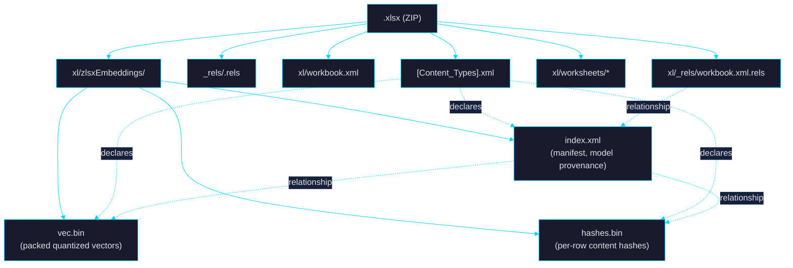
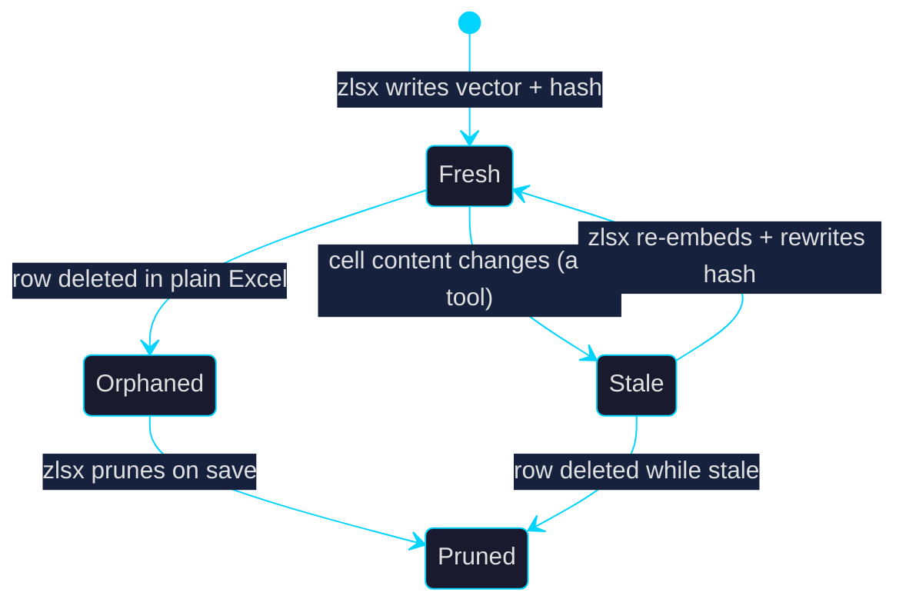

# Embeddings inside .xlsx without breaking tool compatibility

> Design sketch for storing per-row (or per-range) semantic vector
> embeddings inside a .xlsx file such that Excel (mac + Windows),
> LibreOffice Calc, and Apple Numbers round-trip the workbook without
> warnings or data loss, while zlsx can read, write, quantize, and
> invalidate the vectors efficiently. Google Sheets is explicitly
> **out of scope** as a preservation target (see Goals §0).

## Status

~~Design only (2026-05-16). No code yet.~~

**Updated 2026-07-26.** E1/E2/E3 shipped (#123); the compat matrix ran
(emb-4) and the carrier matrix ran (emb-4B, #124). The **durability
contract is decided** — see the section of that name below. It amends
Goal 2, narrows Goal 3, and changes step 6 of the Staleness model.

Measured, not assumed:
- **Vectors** survive Excel-mac and zlsx; Numbers and LibreOffice strip
  them. Excel-for-Windows is still unrun (`E4W`).
- **A recovery record** survives every rebuilder measured so far, in a
  hidden `<definedName>` (primary) and `docProps/custom.xml`
  (secondary). Numbers is unrun and is the live risk.

Google Sheets remains a documented known-stripping consumer, not a
preservation target.

## Goals

0. **Compatibility target set (v1)**: Excel for Mac 16.x, Excel for
   Windows 365, LibreOffice Calc 24.x, Apple Numbers 14.x. Google
   Sheets is NOT a preservation target — the Google Workspace
   converter is documented to convert to/from Excel format and makes
   no fidelity guarantee for arbitrary OPC parts. Any compat-matrix
   row for GS is "informational, expected to strip".
1. A workbook with embeddings opens in vanilla Excel without a
   "we recovered the file" / "we removed features" dialog.
2. ~~A save-then-reopen cycle through any v1 target preserves the
   embedding part byte-for-byte.~~ **Amended 2026-07-26 — the original
   goal is unachievable and was refuted by emb-4.** Split in two:
   - **2a — vectors.** A save-then-reopen preserves the embedding part
     structurally through **Excel and zlsx**. Numbers and LibreOffice
     Calc rebuild the archive from their own model and drop it. That
     is a property of their OOXML export filters, not something zlsx
     can influence.
   - **2b — detectability.** A save-then-reopen through *any* v1
     target preserves enough for zlsx to know, on next open, that
     vectors existed and are gone, and with what provenance. See
     **Durability contract** below.
3. The embedding part is **invisible** in the cell grid — it does not
   show up as a visible sheet, a *visible* defined name, a comment, or
   any user-visible feature. (Originally "a defined name" without
   qualification. Narrowed 2026-07-26: the recovery record uses a
   `<definedName hidden="1">`, which Excel's Name Manager does not
   list. The vectors themselves remain in the custom OPC part and are
   still bound by the unqualified rule.)
4. zlsx can detect staleness: if a cell value changes in another
   tool, zlsx knows on next open which embeddings need recomputing.
5. File size overhead is bounded (≈ 1–2 KB per row of int8-quantized
   1536-d vector after deflate; see Sizing).

## Non-goals

- Embeddings of formatting, formulas, or non-text values. v1 targets
  text-cell semantic search and RAG.
- Cross-workbook embedding sharing. The vectors live inside the
  .xlsx; one workbook → one embedding part set.
- Model interoperability. The part records its provenance (model
  name + dimension + dtype), but two workbooks with different model
  provenances cannot mix vectors.
- Google Sheets fidelity (see Goals §0).
- Preserving Office digital signatures across an embedding write
  (see Caveats — signatures are invalidated by any package mutation,
  which is the expected behavior for added relationships).

## Durability contract (decided 2026-07-26)

**The promise: Excel-durable vectors, universally-durable evidence.**

> zlsx guarantees that a workbook which loses its vectors **says so**.
> It does not guarantee that every tool keeps the vectors — two of the
> four v1 targets provably do not.

This is the reconciliation §Goals.0 was blocked on. It rests on two
measurements, not on judgement: `emb-4-compat-matrix.md` (which
carriers hold the vectors) and `emb-4b-carrier-matrix.md` (what
survives the tools that don't).

### What was decided, and against what

emb-4 established that Numbers and LibreOffice strip
`xl/zlsxEmbeddings/*` — parts removed, not merely unreferenced, so no
reader-side scan recovers them. The choice was between accepting
"Excel-durable, best-effort elsewhere" and documenting it loudly, or
carrying a recovery path. That choice could not be made until emb-4B
established that a recovery path was even possible. It is: three
carriers survive both measured rebuilders.

**Rejected: silent best-effort.** "The vectors may vanish and you
won't know" fails the same standard as the row/col edit contract —
either the operation is correct or it refuses, never silently wrong.
A vector set that disappears without trace is the embedding-arc
equivalent of a silently corrupted workbook.

**Rejected: putting vectors somewhere durable.** The only carrier that
survives everything *and* could hold vectors is cell data, which
violates Goal 3 outright (visible under Sheet ▸ Unhide), pollutes the
SST, and costs 4× in size for base64. Not worth it to serve two of
four targets.

**Adopted: a recovery record in a durable carrier.** ~100–200 bytes of
provenance — model id, dim, dtype, coverage ranges, and a digest over
the hash set — carried where the rebuilders don't reach. It is not the
vectors and cannot reconstruct them. It makes their absence
*detectable and attributable*, which is what lets a caller re-embed
deliberately instead of silently getting nothing.

### Carrier choice

**Primary: `<definedName hidden="1">`. Secondary: `docProps/custom.xml`.**

Both survive both measured rebuilders. They are carried together
because their *removal* mechanisms are disjoint — Document Inspector ▸
Document Properties and Personal Information strips `docProps` and
does not touch defined names; a tool that normalizes names does not
touch `docProps`. Redundancy costs ~200 bytes, which is noise against
a vector set.

| Carrier | Why / why not |
|---|---|
| `<definedName hidden="1">` | **Primary.** Survives both rebuilders. `hidden="1"` keeps it out of Excel's Name Manager, which is what narrows Goal 3 rather than breaking it. No Document Inspector module enumerates defined names. |
| `docProps/custom.xml` | **Secondary.** Survives both rebuilders, but Inspector ▸ Document Properties removes it — a common corporate pre-share flow, hence secondary rather than primary. |
| cell data | Rejected: survives everything, but visible under Sheet ▸ Unhide (violates Goal 3), pollutes the SST. |
| `customXml/` | Rejected: fails openpyxl, *and* Inspector ▸ Custom XML Data targets it by name. Strictly worse on both axes. |
| `<extLst>` | Rejected on measurement. The extension point ECMA-376 sanctions for vendor data, and the intuitive first choice — stripped by both openpyxl and LibreOffice. Do not re-derive this as the obvious answer. |

### Encoding requirements (measured, not assumed)

Round-tripping the record through LibreOffice showed three
normalizations a reader MUST tolerate. Each would be a silent
recovery-record loss if the parser were written to match its own
writer's bytes:

1. **`hidden="1"` becomes `hidden="true"`.** Both are valid
   `xsd:boolean` lexical forms. Accept `1`, `true`, `0`, `false`.
2. **The payload is XML-escaped.** A `"quoted string"` formula comes
   back as `&quot;quoted string&quot;`. Unescape before parsing.
3. **The element gains attributes** (`function="false"`,
   `vbProcedure="false"`). Match on `name=`, never on the whole tag.

Capacity is ~255 chars per name in practice. One coverage fits
comfortably; many do not. The record therefore **chunks across
numbered names** (`_zlsxRecovery0`, `_zlsxRecovery1`, …) rather than
truncating — a truncated provenance record is worse than none, because
it reads as authoritative.

### What this changes downstream

The Staleness model's step 6 currently says the caller must track
externally whether a workbook had embeddings, "zlsx itself does not
know". With the recovery record, **zlsx knows.**
`EmbeddingsMissing` stops being a caller-supplied assertion and becomes
a detected state carrying provenance. That is the concrete API
consequence, and it is what unblocks E5: the Python surface can now
express "these vectors were stripped by some tool, here is what they
were" instead of being unable to distinguish that from "never had
any".

### Known risk, stated plainly

**Numbers is unmeasured**, and it is the most aggressive rebuilder of
the four. If it strips defined names *and* `docProps/custom.xml`, the
recovery record does not survive it and the contract weakens to
"detectable except through Numbers". That would not invalidate the
design — the carriers are declared in one place and the record is
~200 bytes — but it would need saying out loud in the user-facing
docs. Running that leg is the single highest-value open measurement.

`E4W` (Excel for Windows) remains open for the *vector* half of the
contract. If Excel-Win preserves like Excel-mac, "Excel-durable" is a
real promise; if it strips, 2a collapses to "zlsx-durable" and the
recovery record carries proportionally more weight.

## Recommendation: custom OPC part

.xlsx is OPC (Open Packaging Conventions) packaged as ZIP. ECMA-376
Part 2 §9.1.7 requires conforming **consumers** to not fail on
unknown relationships, and permits — but does **not** mandate —
preservation of unknown parts and relationships on write. In
practice, Excel, LibreOffice, and Numbers all preserve well-declared
unknown parts on a passive save (i.e. one where the user did not
modify the file). The "MUST preserve" guarantee comes from observed
implementation behavior plus the spec's "MAY preserve" permission,
NOT from a spec mandate. This is load-bearing for the whole design:
if a future Excel build starts stripping unknown parts on save, v1
surfaces `EmbeddingsMissing` to the caller on the next zlsx open
(see Staleness model §6) and the caller decides whether to
re-embed. zlsx itself never auto-re-embeds, because re-embedding
costs API money and only the caller knows whether the strip was
expected (Google Sheets round-trip, openpyxl save) or surprising
(an Excel regression worth filing a bug).

### Part layout



### Manifest deltas

Two path conventions in play:
- **`[Content_Types].xml` Override `PartName`** values are absolute
  package paths, MUST start with `/`, use forward slashes (ECMA-376
  Part 2 §10.1.2.3).
- **Relationship `Target`** values are URI references resolved
  against the .rels file's logical base (the package root for the
  package-level `_rels/.rels`; the directory containing the source
  part for nested `<dir>/_rels/<file>.rels`). For
  `xl/_rels/workbook.xml.rels`, the base is the `xl/` directory, so
  a relationship from `workbook.xml` to `xl/zlsxEmbeddings/index.xml`
  uses `Target="zlsxEmbeddings/index.xml"` (relative) — NOT
  `Target="xl/zlsxEmbeddings/index.xml"` (which would resolve as
  `xl/xl/zlsxEmbeddings/...`). Absolute `Target="/xl/..."` form is
  also legal but discouraged for relationships between parts in the
  same logical subtree.

The fixed-position parts (always present when embeddings exist):

| File | Change |
|---|---|
| `[Content_Types].xml` | Add **one** Override per part. Always present: `PartName="/xl/zlsxEmbeddings/index.xml"` with ContentType `application/vnd.laurentfabre.zlsx.embedding-index+xml`. Per coverage block (see below): one Override for that coverage's vec.bin and one for its hashes.bin. ContentTypes are `application/vnd.laurentfabre.zlsx.embedding-vec` and `application/vnd.laurentfabre.zlsx.embedding-hash` (no `+octet-stream` structured suffix — that suffix is reserved for media types built on `application/octet-stream` per RFC 6839, which these are not). |
| `xl/_rels/workbook.xml.rels` | Add one `Relationship Target="zlsxEmbeddings/index.xml"` Type `http://schemas.laurentfabre.dev/zlsx/2026/relationships/embeddings`. |
| `xl/zlsxEmbeddings/index.xml` (new) | Manifest: model name, dimension, dtype, hash algorithm, one or more `<coverage>` blocks. |
| `xl/zlsxEmbeddings/_rels/index.xml.rels` (new) | One Relationship per coverage's vec.bin and hashes.bin sub-part, with Targets relative to the `xl/zlsxEmbeddings/` base. Types `.../zlsx/2026/relationships/embedding-vec` and `.../zlsx/2026/relationships/embedding-hash`. |

Per-coverage sub-parts are pathed deterministically as
`xl/zlsxEmbeddings/<coverage_id>/vec.bin` and
`xl/zlsxEmbeddings/<coverage_id>/hashes.bin`. So for the
Title+Body example, the package contains:

```
/xl/zlsxEmbeddings/index.xml
/xl/zlsxEmbeddings/_rels/index.xml.rels
/xl/zlsxEmbeddings/title/vec.bin
/xl/zlsxEmbeddings/title/hashes.bin
/xl/zlsxEmbeddings/body/vec.bin
/xl/zlsxEmbeddings/body/hashes.bin
```

The path prefix `xl/zlsxEmbeddings/` is vendor-namespaced. Note that
`xl/embeddings/` is reserved by Excel itself for embedded OLE objects
(`xl/embeddings/oleObject1.bin`, `Microsoft_Excel_Worksheet.xlsx`,
etc., per the SpreadsheetML examples in ECMA-376 Part 1 §15) — we
cannot use that path or zlsx data would collide with Excel's own
embedded-object handling and "Inspect Document → Embedded Documents"
sweep. The vendor-prefixed path `xl/zlsxEmbeddings/` (camelCase to
match the Office convention of `xl/customXml`, `xl/threadedComments`,
etc.) is unused by any known Office feature as of Office 365 build
2026.

### Why NOT `customXml/`

Excel's "Inspect Document → Document Inspector → Custom XML Data →
Remove All" specifically targets `customXml/itemN.xml` parts and
strips them. Power users who run the inspector (commonly suggested
in corporate compliance flows before sharing files) would silently
lose embeddings. The `xl/zlsxEmbeddings/` path is not enumerated by
any of the inspector's modules (Custom XML Data, Hidden Worksheets,
Document Properties and Personal Information, Headers and Footers,
Hidden Rows and Columns, Invisible Content, Embedded Documents,
Macros, Ink Annotations, Task Pane Add-ins, External Content) — but
this is an enumeration argument, not a guarantee: a future Office
update could add an "Unknown Parts" sweep. Monitor.

### Why NOT a hidden worksheet

- Bloats the cell grid model with thousands of base64 strings.
- Visible in the **Sheet → Unhide** dialog in Excel; user-curious
  clicks reveal a wall of opaque data.
- Pollutes the SST with base64 garbage; breaks shared-strings
  optimizations.
- Triggers Excel's "Hidden sheets contain data" warning on share.
- 4× size penalty (base64 of binary).

### Why NOT `docProps/custom.xml`

Custom document properties are scalar-only (string / number / date /
bool); no binary blobs. Even string properties are length-capped by
Excel (~255 chars in practice).

### Why NOT a sidecar file

`workbook.xlsx` + `workbook.xlsx.emb` next to each other means email
attachment, cloud-sync drag-and-drop, "Save As", and rename all
break the link. Inside the archive is the only durable place.

---

## Wire format

All integer fields in binary parts are **little-endian** (matches
Zig's `std.mem.readInt(..., .little)` and the .xlsx ZIP container's
own conventions).

### `index.xml`

```xml
<?xml version="1.0" encoding="UTF-8" standalone="yes"?>
<embeddings xmlns="http://schemas.laurentfabre.dev/zlsx/2026/embeddings"
            version="1"
            model="text-embedding-3-small"
            dim="1536"
            dtype="int8-sym-per-vec"
            hash_algo="xxh3-64">
  <coverage id="title"
            worksheet_target="worksheets/sheet1.xml"
            range="A2:A10001" column="A"
            count="10000"
            include_formulas="false"
            vec_rId="rId1" hash_rId="rId2"/>
  <coverage id="body"
            worksheet_target="worksheets/sheet1.xml"
            range="B2:B10001" column="B"
            count="10000"
            include_formulas="false"
            vec_rId="rId3" hash_rId="rId4"/>
</embeddings>
```

Schema notes:

- **`<coverage>` is plural in v1.** N coverage blocks per index;
  Title+Body and similar multi-column cases work without v2 deferral.
- **`@id`** is a functional key, not just a label. Rules:
  - Required, unique within the index.
  - Charset `[A-Za-z0-9_-]`, length 1..63 chars.
  - Used both as the sub-part directory name
    (`xl/zlsxEmbeddings/<id>/vec.bin`) and as a stable handle in the
    zlsx public API (`wb.embeddings().coverage("title")`).
- **`@worksheet_target`** is the relationship Target string from
  `xl/_rels/workbook.xml.rels` pointing at the worksheet part (e.g.
  `worksheets/sheet1.xml`). This is the stable sheet identifier for
  v1. Rationale: ECMA-376 Part 1 §18.2.19 does NOT mandate that
  `<sheet sheetId>` is stable across the workbook's lifetime — it
  merely requires uniqueness within the workbook at any given moment
  (and Microsoft's MS-OI29500 note confirms the standard places no
  stronger restrictions). Tools that delete and recreate sheets can
  reassign sheetIds. The worksheet **part name** is stable across
  renames (which are display-name changes only) and is the field
  consumed by every consumer that needs to resolve "which worksheet".
- **`@range`** is the A1-style range the coverage applies to.
- **`@column`** is informational — pins which column within the
  range carries the text being embedded (the range itself is
  inclusive of header rows the user might want to keep out of
  coverage, hence `A2:A10001` not `A:A`).
- **`@count`** is the row count, MUST equal `(@range.last_row -
  @range.first_row + 1)` and MUST equal the `count` in the binary
  headers of the referenced vec.bin and hashes.bin. Mismatch is a
  parser error.
- **`@include_formulas`** (boolean, default `false`): when `false`,
  rows whose source cell type is `f` (formula) are excluded from the
  coverage entirely — they get a sentinel hash (`u64::MAX`) and a
  zeroed vector slot. Rationale: formula cached results can be
  missing in zlsx-written files (which omit `<v>` for some formulas)
  but always present in Excel-written files, creating a permanent
  hash-mismatch loop. Opt-in only when the user knows the workbook
  is Excel-written (cached results present).
- **`dtype`** values (v1): `f32`, `binary16` (IEEE 754, 5-bit
  exponent), `bfloat16` (8-bit exponent — preserves dynamic range,
  common for modern embedding models), `int8-sym-per-vec`
  (symmetric, one f32 scale per row), `int8-asym-per-vec`
  (asymmetric, one f32 scale + one i8 zero-point per row). The
  ambiguous spelling `f16` is rejected — use `binary16` or
  `bfloat16`.
- **`version`** is a single major integer. Forward-compat rule: a
  reader encountering `version > KNOWN_MAX` rejects with
  `EmbeddingVersionUnsupported`. Backward-compat rule: unknown XML
  attributes / child elements ignored; unknown `dtype` values
  rejected.
- **Coverage overlap**: two coverages in the same index MUST NOT
  share any (worksheet_target, cell) pair. Validation runs at parse
  time; overlap rejects with `EmbeddingCoverageOverlap`. Rationale:
  ambiguity about which embedding represents a given cell is worse
  than a clean error.
- **Relationship target uniqueness**: each vec/hash sub-part has
  exactly one inbound relationship; aliasing (two `<coverage>` rIds
  resolving to the same Target) rejects with
  `EmbeddingDuplicateRelationshipTarget`.

### `vec.bin`

Header (24 bytes, all little-endian — 4 × u32 = 16 bytes, then 8 bytes
of dtype + reserved):

```
struct VecHeader {
    u32 magic;        // bytes 'Z','V','E','C' on disk → reads as 0x4345565A LE  (offset 0)
    u32 version;      // 1                                                       (offset 4)
    u32 dim;          // 1536                                                    (offset 8)
    u32 count;        // 10000                                                   (offset 12)
    u8  dtype;        // 0=f32, 1=binary16, 2=bfloat16, 3=int8_sym_per_vec, 4=int8_asym_per_vec  (offset 16)
    u8  reserved[7];  // MUST be zero in v1                                      (offset 17)
};
// Record 0 starts at byte offset 24.
```

`parseVecHeader` MUST validate the byte offset of record 0 with an
inline `comptime` assertion against `@sizeOf(VecHeader)`; the parser
test suite re-asserts the offset at runtime.

Followed by `count` records, layout per dtype:

| dtype | Record |
|---|---|
| `f32` (0) | `f32 values[dim]` |
| `binary16` (1) | `u16 half_values[dim]` (IEEE 754 binary16 bit pattern) |
| `bfloat16` (2) | `u16 bf16_values[dim]` (top 16 bits of f32) |
| `int8_sym_per_vec` (3) | `f32 scale; i8 values[dim]` — `float = (i8 / 127) * scale` |
| `int8_asym_per_vec` (4) | `f32 scale; i8 zero; i8 values[dim]` — `float = ((i8 - zero) / 127) * scale` |

The dtype byte in the header MUST match the `dtype` string in
`index.xml`; mismatch is a parse error. The version byte enables
adding new dtypes later without breaking older readers (they reject
`version > KNOWN_MAX`).

### `hashes.bin`

Header (16 bytes, all little-endian):

```
struct HashHeader {
    u32 magic;        // bytes 'Z','H','S','H' on disk → 0x4853485A LE
    u32 version;      // 1
    u32 count;        // 10000 (MUST match index.xml count)
    u32 reserved;     // MUST be zero in v1
};
```

Followed by `count × u64` xxh3-64 values (little-endian). One
hash-blob per coverage; the coverage element's `hash_rId` resolves
which blob. Algorithm pinned in `index.xml@hash_algo`.

#### Tombstone contract (load-bearing)

`hash == 0xFFFFFFFFFFFFFFFF` (`u64::MAX`) is the **sole** tombstone
/ no-vector marker. It is used uniformly across three v1 cases:

1. **Sparse coverage** — row's source cell is empty / blank and was
   intentionally skipped at embed time.
2. **Formula-excluded** — `<coverage include_formulas="false">` and
   the row's cell type is formula.
3. **Redaction** — a previously-embedded row was deleted in plain
   Excel; the redaction sweep zeroed the vec record and overwrote
   the hash with `u64::MAX`.

Query-time contract (binding on all consumers — zlsx core, Python
binding, CLI, third-party tools that read the format):

- Slots with `hash == u64::MAX` MUST be skipped before any
  similarity score / cosine / dot-product computation. Scoring a
  zero vector against a normalized query is undefined behavior
  (cosine = 0/0 = NaN under most conventions); we forbid it
  contractually instead of relying on per-consumer norms.
- The Python binding exposes a `valid_mask: NumPy bool[count]`
  alongside the vector array, computed as `hashes != u64::MAX`.
- A compact-iterator alternative (`for slot in
  view.iter_live()`) skips tombstones at iteration time.

Recompute contract (for `wb.embeddings().recompute()`):

- For each covered row, compute `canonical_hash` against current
  cell state.
- Slot was tombstone (`stored == u64::MAX`):
  - Current cell is non-embeddable (blank / formula-excluded /
    error and `include_formulas` matches): **slot stays valid-empty**;
    no stale entry produced.
  - Current cell IS embeddable: **slot is stale** (the row became
    embeddable since last embed; caller may want to re-embed).
- Slot was non-tombstone (`stored != u64::MAX`):
  - Current cell is non-embeddable: **slot is stale + needs-tombstone**;
    on next zlsx-mediated save, the slot transitions to tombstone.
  - Current cell hash differs: stale.
  - Current cell hash matches: fresh.

Boolean cells: `<v>` content is parsed strictly as either `0` or
`1`. Any other byte sequence (`TRUE`, `true`, `false`, etc.) is
rejected as malformed OOXML. Number `<v>`: locale-independent per
spec — `.` decimal separator only; comma-decimal forms are rejected
as malformed.

`@worksheet_target` resolution: normalize URI dot-segment elements
(strip leading `./`, resolve `../` against the .rels file's base
directory) before hashing. Do NOT case-fold; OPC part names are
case-sensitive per ECMA-376 Part 2 §10.1.2.

### Hash canonicalization (the load-bearing piece)

Hash input is the concatenation, with `0x1F` (ASCII unit separator)
delimiters, of:

```
worksheet_target \x1F row_1based_decimal_ascii \x1F cell_kind \x1F cell_payload
```

`worksheet_target` is the same string used in `@worksheet_target` on
the parent `<coverage>` element — the workbook-rels Target pointing
at the worksheet part (e.g. `worksheets/sheet1.xml`). Stable across
sheet renames; changes only if the workbook is restructured by a
tool that rewrites part paths.

`cell_kind` and `cell_payload` per cell type (the canonical-form
rule is the contract — third-party reimplementations MUST follow it
byte-for-byte for hashes to match):

| Cell type | `cell_kind` | `cell_payload` |
|---|---|---|
| Empty / blank | `b` | (empty string) |
| Inline or shared string | `s` | SST-resolved text → flatten rich-text runs (concatenate run text in document order, drop all run formatting) → DROP `<rPh>` phonetic-ruby children entirely (they are NOT part of the visible text) → trim Unicode whitespace by codepoint property `White_Space=Y` per UCD 15.1 → NFC-normalize (per `unicode/nfc.zig`). The trim uses an explicit lookup table generated from `PropList.txt`; the table is checked into the repo (Unicode-version-pinned). |
| Boolean | `B` | `0` or `1` |
| Number (raw, no number-format applied) | `n` | Parse `<v>` as f64 using Zig's `std.fmt.parseFloat(f64, ...)`, then re-emit using the **shortest-round-trip** canonical form (Ryu algorithm; Zig 0.15 stdlib `std.fmt.formatFloat` with `.{ .mode = .scientific, .precision = null }` if shortest-round-trip → otherwise vendor Ryu). Special cases: `0.0` and `-0.0` both emit as `0`; `+inf` / `-inf` / `nan` MUST NOT appear (Excel rejects them at write time, but if seen, fall back to `cell_kind = e`, payload `#NUM!`). This canonical form makes Excel's `<v>0.1</v>`, LibreOffice's `<v>1.0000000000000001E-1</v>`, and zlsx's emit byte-identical post-canonicalization. |
| Date / time | `n` (treated as number) | Same as number — date display strings depend on the host locale, so we hash the raw serial. The user-facing model docs MUST disclose this so users embedding date columns understand they are embedding serials. |
| Error | `e` | The error string verbatim (`#REF!`, `#N/A`, ...) |
| Formula | `f` (only when `include_formulas="true"`) | The cached formula RESULT (`<v>` child of the formula cell) using the appropriate `cell_kind` rule above for the result type. If no cached result exists in the file (some writers omit it, notably zlsx-written-then-Excel-unopened files), the row is excluded from the coverage with sentinel hash. Formulas are excluded from the coverage entirely when `include_formulas="false"` (the default — see `<coverage>` schema). |

This canonical form means a sheet rename does NOT invalidate
hashes; only changes to the canonical text/value or to the
worksheet part path do.

Numeric canonicalization is the load-bearing piece for cross-tool
interop. Implementations MUST validate against the test vectors in
`tests/embeddings/canonical-numbers.txt` — the v1 parser includes a
self-check on init that round-trips every test vector through the
canonicalizer and the hasher.

---

## Caveats and mitigations

| Caveat | Mitigation |
|---|---|
| Excel "Inspect Document → Remove All" sweeps custom XML, hidden sheets, embedded documents, etc. | Use `xl/zlsxEmbeddings/` path — none of the known inspector modules enumerate it. Re-verify with each Office major release. |
| Cell edits in plain Excel silently invalidate embeddings | `hashes.bin`; zlsx detects mismatch on open, surfaces stale rows |
| Google Sheets converts unknown OPC parts out of existence on upload→export | **Documented**: GS is out of scope (Goals §0). zlsx detects missing-on-reopen and surfaces `EmbeddingsMissing` to the caller; the caller decides whether to spend API money on re-embedding. zlsx itself never auto-re-embeds. |
| Excel "Save As .xlsx" from Excel itself should preserve (verify) | Compat matrix |
| Workbook structure changes (insertRow/deleteRow in Excel) shift cells beneath embedded vectors → vectors map to wrong rows | Hash-based invalidation catches this; vectors with no matching hash get marked stale, not silently misattributed |
| Size growth on dense embeddings | int8 quantization + deflate → ~1.2 KB/row for 1536-d; document |
| Antivirus / DLP scanners flag unknown binary parts | Use vendor-tree MIME types (`application/vnd.laurentfabre.zlsx.*`); document the magic-number signature in the format docs so DLP rules can identify the part |
| Model drift: workbook has vectors from model X, user later runs zlsx with model Y wired in | `index.xml` carries `model=` provenance; mismatch → refuse to add vs. existing, force re-embed-all |
| Multiple embedding columns on one sheet | v1 supports N coverage blocks per `index.xml` with separate vec/hash sub-parts — no v2 deferral. |
| Sparse embeddings (only some rows have text) | `hashes.bin` `u64::MAX` sentinel = "no embedding for this row"; vec slot still allocated but content undefined. Expected sentinel collision rate at 10⁹ rows is 5.4×10⁻¹¹ — negligible. |
| Office digital signatures invalidate on any package mutation | **Adding the embedding part invalidates any existing Office signature.** Documented as non-goal (Goals "Non-goals" §). zlsx-on-signed-workbook surfaces `EmbeddingsRequireUnsignedWorkbook` and refuses to write rather than silently corrupting the signature. |
| OneDrive / SharePoint AutoSave + Excel co-authoring may strip unknown parts via the Office Web service | **Known unknown**. The Office Web pipeline is not bound by the desktop preservation behavior. Compat matrix MUST cover OneDrive-AutoSave + Excel-Web. If stripping is observed, document GS-style "stripped on cloud-edit; zlsx surfaces `EmbeddingsMissing` on next local open; caller-mediated re-embed only". |
| Embeddings are sensitive derived data; row deletion in plain Excel leaves orphaned vectors in the part | **Redaction policy (v1) — dense slots with sentinel zeroing**: the on-disk format is dense — slot `i` of `vec.bin` and `hashes.bin` corresponds to row `(first_row + i)` of `@range`, always. `@count` always equals `(last_row − first_row + 1)`. When a row is deleted in plain Excel, on the next zlsx-mediated open the redaction sweep overwrites that slot's hash with `u64::MAX` and zeroes its vec.bin record bytes. The `count` and `@range` do NOT change; the slot-to-row mapping stays stable. When zlsx itself deletes a row via its typed API, the range shrinks and all slots after the deleted row are physically removed from vec.bin/hashes.bin (count and @range both adjusted in a single save). Until the next zlsx-mediated save, orphaned-from-Excel vectors persist on disk — pre-share recommendation: `zlsx embed --prune <file>` to force a zlsx-mediated save, or delete the `xl/zlsxEmbeddings/` directory wholesale. |
| Embeddings can leak intent even when source text is deleted | Same policy as above. Additionally provide `zlsx embed --strip <file>` CLI to remove the embedding part wholesale before sharing. |

---

## Sizing

For a 100k-row workbook with one text column being embedded by
`text-embedding-3-small` (1536-d):

| dtype | Raw per row | Compressed per row (deflate) | 100k rows total |
|---|---|---|---|
| `f32` | 6144 B | ~5800 B (incompressible) | ~580 MB |
| `binary16` | 3072 B | ~2900 B | ~290 MB |
| `bfloat16` | 3072 B | ~2900 B | ~290 MB |
| `int8_sym_per_vec` (one f32 scale per row) | 1540 B | ~1200 B (8-bit values compress) | ~120 MB |
| `int8_asym_per_vec` (one f32 scale + one i8 zero per row) | 1541 B | ~1200 B | ~120 MB |

Recommendation: **`int8_sym_per_vec` is the v1 default**, with
`int8_asym_per_vec` as the fallback when a user's calibration data
shows >1% recall loss with symmetric. `bfloat16` is the recommended
intermediate if the user explicitly chooses lossless-enough storage
and is willing to pay 2.5× the size of int8.

**Quality claim — explicitly unverified.** The folklore that int8
symmetric loses <1% recall@10 on modern dense embeddings is NOT a
measured number for this design and is intentionally NOT cited here.
The emb-4 compat run includes a recall benchmark on a real corpus
(see "Validation plan" — recall harness against MTEB-equivalent
fixture); the v1 quantization default may change based on that
measurement. Until the benchmark runs, all quantization claims are
conjectures.

Worth contrasting with the workbook itself: a 100k-row × 10-column
text workbook with sharedStrings deflated lands around 30–80 MB. A
120 MB embedding overhead is 1.5–4× the host workbook — significant
but not pathological. If embeddings exceed the host workbook by
more than 5×, zlsx should warn and suggest a sidecar `.emb.xlsx`
twin file with a cross-reference.

The "(one f32 scale per dim)" variant from the prior draft — total
size `4·dim + dim` bytes per row, i.e. `5·dim` bytes — is dropped
from v1. Per-dimension scales add cost (5×) for negligible recall
gain on modern post-projection embeddings; revisit if a user surfaces
a real recall regression on per-vec.

---

## Staleness model



On `Workbook.openWithEmbeddings(path)`:
1. Read `index.xml` → resolve model, dim, dtype, coverage blocks.
   Validate per-coverage `count` against `(@range.last_row -
   @range.first_row + 1)` and against the binary headers.
2. Open each `vec.bin` and `hashes.bin` part. Read model:
   - zlsx's existing PartStore (`pkg/store.zig`) arena-decompresses
     parts on first access. The decompressed slice lives in
     PartStore's arena for the workbook's lifetime; embeddings reuse
     that slice. **No new mmap infrastructure is introduced** —
     reusing PartStore's existing buffer model keeps the design
     within audited code paths.
   - PartStore's existing 512 MiB per-part decompress cap
     (`pkg/store.zig:1266`) applies. For embeddings this caps:
     - `int8_sym_per_vec`, 1536-d: ~340k rows per coverage's vec.bin.
     - `bfloat16` / `binary16`, 1536-d: ~170k rows.
     - `f32`, 1536-d: ~85k rows.
     A coverage that would exceed the cap on write surfaces
     `EmbeddingExceedsArchiveLimit` and refuses. Users hitting this
     should either pick a more aggressive quantization, split into
     multiple coverages (e.g. by sheet), or wait for v1.1 streaming.
   - On Windows, files Excel has open with exclusive write locks are
     a non-issue for the read path because PartStore reads bytes
     into an arena buffer at open time (not lazy-mmap), then the
     file handle is closed.
3. For each covered row, recompute `xxh3-64(canonical_content)`
   using Zig 0.15.2's `std.hash.XxHash3` (no vendored impl needed),
   compare to stored. Build a `stale_rows: []u32` index.
4. Expose `wb.embeddings().stale()` so callers can decide:
   re-embed-now, mark-for-batch, or read-anyway-and-accept-staleness.

   **Contract**: `stale()` returns the snapshot computed at open
   time. It does NOT auto-refresh after caller-driven mutations via
   the typed API (`setCell`, `deleteCell`, `insertRow`, etc.); the
   caller must call `wb.embeddings().recompute()` to re-walk the
   coverage rows and rebuild `stale_rows` against current cell
   state. This explicit-recompute model keeps the API predictable
   (no hidden walk per typed mutation) and lets callers batch
   edits.
5. **Redaction sweep**: identify hashes that no longer match any
   live row in the coverage range (i.e. row deleted in plain Excel).
   Mark for prune on next save.
6. **If `xl/zlsxEmbeddings/index.xml` is absent, read the recovery
   record** (hidden `<definedName>`, falling back to
   `docProps/custom.xml`) per the Durability contract.
   - **Record present** → the vectors were stripped by some consumer.
     Surface `EmbeddingsStripped` carrying the recovered provenance:
     model id, dim, dtype, coverage ranges, hash-set digest. The
     caller now knows *what* to re-embed, not merely that something
     is missing.
   - **Record absent too** → the workbook never had embeddings, or
     passed through a consumer that strips even the record (see the
     Numbers risk above). Return `null`; this is not an error.

   ~~caller tracks this externally — zlsx itself does not know~~ —
   superseded 2026-07-26. zlsx detects the stripped state itself; that
   is the whole point of the recovery record.

   zlsx still does NOT automatically re-embed: it costs money, and
   only the caller knows whether the strip was expected (a deliberate
   LibreOffice round-trip) or surprising (an Excel regression worth
   filing). The record changes what zlsx *knows*, not who decides.

On `Workbook.save()`:
- If embeddings unchanged: passthrough the part bytes (SHA256
  byte-identity, same contract as zlsx's existing save path).
- If embeddings mutated OR redaction sweep flagged orphans
  (zero-fill in place per the redaction policy above) OR zlsx
  itself shifted rows via its typed API (range + count adjusted):
  emit fresh `vec.bin` + `hashes.bin` per coverage + rewrite
  `index.xml` per-coverage `@count` and `@range`. The dense
  invariant `@count == range.last_row − range.first_row + 1` is
  preserved across every save path. Top-level Content_Types and
  rels unchanged on update-in-place; if a coverage was added or
  removed, the affected Override + Relationship entries are
  added/removed.
- **`@worksheet_target` dangling** (sheet deleted in another tool
  between zlsx-mediated opens): on next zlsx open, the orphaned
  coverage surfaces `EmbeddingCoverageOrphaned(coverage_id)` to the
  caller. The caller chooses: (a) drop the coverage entirely; (b)
  remap to a different worksheet via the typed API; (c) keep the
  coverage and accept all rows are stale. zlsx itself does NOT
  auto-drop, to preserve the "no automatic destructive action"
  property elsewhere in the design.
- **No streaming-write API in v1.** The earlier-draft
  `addPartStreaming` callback design is dropped: ZIP local file
  headers require CRC32 and compressed+uncompressed sizes up front,
  and PartStore's existing `addPart` pre-compresses into arena
  memory (`pkg/store.zig:321`). The 512 MiB cap referenced
  elsewhere is **read-side** (it bounds decompression at
  `pkg/store.zig:1266`), not enforced by `addPart` itself; the
  embedding writer therefore performs its own pre-write size check
  and refuses with `EmbeddingExceedsArchiveLimit` before calling
  `addPart`, matching the same 512 MiB ceiling so a workbook zlsx
  writes will always be a workbook zlsx can re-read. A streaming
  variant using ZIP data descriptors is feasible but is a larger
  PartStore refactor than v1 wants. Users hitting the cap fall back
  to higher-quantization or split coverages; v1.1 may add the
  streaming variant if real demand surfaces.

---

## Open questions

1. **Relationship URI**: provisional value
   `http://schemas.laurentfabre.dev/zlsx/2026/relationships/embeddings`.
   The `laurentfabre.dev` domain is owned by the project maintainer
   (Laurent Fabre). Whether to register a longer-lived domain
   (e.g. `zlsx.io`) before shipping is open. **Decision required
   before any part bytes ship**, because changing the URI later
   invalidates every workbook in the wild. Until the URI is final,
   this design is BLOCKED on a written domain-ownership decision.
2. **MIME prefix**: `application/vnd.laurentfabre.zlsx.*` follows
   RFC 6838 vendor tree. IANA registration is open: we will not
   register before the format reaches v1.0 stability, but we will
   register before any third-party tooling encounters these MIME
   types. Until registered, the types are "in use, not registered"
   — DLP and antivirus vendors will not recognize them as known.
3. **Quantization default**: `int8_sym_per_vec` is the v1 default
   pending the emb-4 recall benchmark on a representative corpus
   (target: a real RAG eval set, not just MTEB). The default flips
   to `int8_asym_per_vec` if symmetric loses >1% recall@10.
4. **Hash algorithm — xxh3-64 vs sha256**: xxh3 is 5–20× faster.
   Collision math: at N=10⁹ distinct row hashes, expected collision
   count is N²/(2·2⁶⁴) ≈ 0.0271; probability of ≥1 collision is
   ≈ 2.67% (1 − e^(−N²/2^65)). Workbooks of that scale are rare; for
   typical workbooks (N ≤ 10⁶), collision probability is ≈ 2.7×10⁻⁸.
   Pin xxh3 in v1. sha256 is reserved for a future
   `hash_algo="sha-256"` if cryptographic provenance is required.
5. **Wire format versioning**: v1 contract is
   `version = single major int`. Reader semantics:
   - `version > KNOWN_MAX` → `EmbeddingVersionUnsupported`; the
     reader does NOT try to parse newer files.
   - Unknown `dtype` values, unknown XML attributes, unknown child
     elements → ignored on read (forward-compat for compatible
     extensions), but unknown `dtype` is rejected because we cannot
     read the binary without knowing the layout.
   - Writers always emit the highest version they understand.
6. **Encryption / Office signatures**: out of scope for v1.
   - Office workbook **encryption** (the standard Excel "Protect
     Workbook → Encrypt with Password" feature, which wraps the
     whole archive in CFB/IRM) wraps embeddings transparently —
     zlsx cannot decrypt those workbooks today, but if it could,
     the embeddings would survive.
   - Office **digital signatures** are invalidated by any package
     mutation. zlsx refuses to write embeddings to a signed
     workbook (surfaces `EmbeddingsRequireUnsignedWorkbook`).
7. **Read model for vec.bin** — resolved in "Staleness model"
   above: reuse PartStore's existing arena-decompress buffer; no
   new mmap infrastructure, no OS-specific code path. Earlier
   drafts proposed POSIX-mmap + Windows-heap-read split; that was
   the wrong answer because (a) it duplicates PartStore's work, (b)
   it introduced a temp-file privacy concern, and (c) PartStore's
   existing buffer model already handles Windows write-lock cases
   correctly (file handle closed after read).
8. **Smart staleness on `insertRow`**: when plain Excel inserts a
   row in the middle of the embedded range, every hash after the
   insert mismatches. v1 marks all stale (conservative, safe). v1.1
   may add a hash→slot remap pass that recovers unchanged content
   in O(N): build a multimap from old hashes, look up each new
   row's hash, rewrite `vec.bin` ordering. Deferred to v1.1 — not
   a v1 blocker.

---

## Validation plan (compat matrix)

A prototype `pkg/embedding_part.zig` (reader + writer + content
hash) is the first deliverable. Then a manual 3-tool matrix on a
single fixture before any production code is shipped.

| Tool | Open without warning | Save and reopen — part survives | Edit cell — hash mismatch detected |
|---|---|---|---|
| Excel for Mac 16.x (desktop, local file) | ❓ | ❓ | ❓ |
| Excel for Windows 365 (desktop, local file) | ❓ | ❓ | ❓ |
| Excel for Mac 16.x — OneDrive AutoSave on | ❓ | ❓ (cloud-side rewrite may strip; verify) | ❓ |
| Excel for Windows 365 — OneDrive AutoSave + co-author | ❓ | ❓ (cloud-side rewrite may strip; verify) | ❓ |
| Excel for the Web (Office.com) | ❓ | ❓ (Office Web pipeline is the strictest; expected to strip) | ❓ |
| LibreOffice Calc 24.x | ❓ | ❓ | ❓ |
| Numbers 14.x | ❓ | ❓ (Numbers .xlsx export is lossy in general) | ❓ |
| openpyxl (Python) | N/A read-only — preserves on load+inspect | ❌ expected — openpyxl writer rebuilds the archive from in-memory model and drops unknown parts | N/A |
| pandas (`pd.read_excel` / `pd.ExcelWriter`) | N/A read-only | ❌ expected via openpyxl engine | N/A |
| calamine (Python `python-calamine`) | ✅ read-only by design | N/A — calamine is read-only | N/A |
| Google Sheets (out of scope — informational) | ❌ expected | ❌ expected | N/A |
| Office digital signature added BEFORE embeddings | N/A | N/A | N/A — zlsx refuses to write |
| Office digital signature added AFTER embeddings | ❓ (signature should cover the embedding part) | ❓ | ❓ |
| zlsx 0.5 (this repo) | ✅ (by construction) | ✅ | ✅ |

**Third-party Python ecosystem note**: openpyxl's writer
(`openpyxl/writer/excel.py`) emits a fresh ZIP from openpyxl's
in-memory workbook model on save; arbitrary unknown parts are NOT
in that model and are silently dropped. Any pandas pipeline that
goes `read_excel → mutate → ExcelWriter` will strip embeddings. The
documented mitigation, per CLAUDE.md and the `xlsx-io` skill, is to
use `zlsx` (or `py-zlsx`) for the round-trip — zlsx preserves
unknown parts by construction. If users insist on openpyxl, they
must save through zlsx after the pandas mutations.

The compat matrix MUST be re-run end-to-end before v1 ships, and
again on each major Office update. emb-4 in the implementation plan
owns this. Any "stripped" outcome on a v1-target row is a v1
blocker; "stripped" on OneDrive AutoSave is documented (recover via
zlsx re-embed) and is NOT a v1 blocker but DOES need user-facing
docs.

Known prior art that suggests the approach is sound: PowerPoint
add-ins persist arbitrary OPC parts under `customXml/` and Office
preserves them; Excel itself uses similar custom parts for the
PowerQuery DataMashup and the Power Pivot model (`xl/model/*`,
`xl/customData/*`). The mechanism is well-trodden, just not
typically by third parties.

---

## Open path to implementation

Roughly the same shape as the C2a (object extract) and dr-1
(modern drawing) lifts already shipped:

1. **emb-1** — `pkg/embedding_part.zig`: pure functions over byte
   slices. `parseIndex`, `parseVecHeader`, `parseHashHeader`,
   `quantizeF32ToI8Sym`, `quantizeF32ToI8Asym`, `f32ToBfloat16`,
   `canonicalizeNumber` (Ryu shortest-round-trip), `canonicalizeText`
   (rich-text flatten + rPh drop + Unicode whitespace trim + NFC),
   `xxh3Canonical` (full canonicalization composed). No allocator-
   owning surfaces; takes input slices, writes to caller-provided
   buffers. Unit-tested in isolation against handcrafted byte
   fixtures plus `checkAllAllocationFailures`. Includes a
   parser-fuzz seed corpus and `tests/embeddings/canonical-numbers.txt`
   cross-tool number canonicalization vectors.
2. **emb-2** — `Workbook.embeddings()` accessor returning a
   `?EmbeddingView`. Reads `xl/zlsxEmbeddings/index.xml` if present,
   else null. Slices into PartStore's arena-decompressed buffer for
   vec.bin / hashes.bin — no new copy, no mmap.
3. **emb-3** — Writer surface: `wb.setEmbeddings(model, dim, vectors, coverage)`.
   Allocates the three new parts, registers Content_Types overrides,
   adds the workbook→index relationship. Hash recomputation lives
   here.
4. **emb-4** — Compat matrix: manual run-through of the table above.
   Failures get logged with the exact part-stripping behavior; any
   "open with warning" outcome is a v1 blocker.
5. **emb-5** — Python binding surface: `book.embeddings()` returns
   a NumPy-shaped view; `book.set_embeddings(...)` accepts a NumPy
   array. The C ABI carries dtype enums.
6. **emb-6** — CLI: `zlsx embed <file> --column A --model openai`
   shells out to a user-provided embedding endpoint, writes the
   part, byte-stable save. Out-of-band model invocation keeps the
   binary's zero-runtime-dep contract.
7. **emb-fuzz** — fuzz the index parser (Linux nightly). Hash
   collision robustness is implicitly covered by xxh3's own test
   suite; the part-parser is the new attack surface.

Estimate: emb-1 + emb-2 + emb-3 ≈ 3–4 weeks; emb-4 compat run is
the longest pole because each tool needs hand-driving.

---

## Cross-references

- `pkg/store.zig` — PartStore is where `addPart` was added (B0
  addPart) and is the substrate for emb-3.
- `unicode/nfc.zig` — reused for canonical hash input.
- `docs/plans/post-0.2.9-roadmap.md` — this work slots after Tier C
  closes; not on the current critical path.
- `docs/plans/saas-v1-plan.md` — the SaaS arc has a separate
  embedding story (server-side vector store); on-disk embeddings
  here are the **offline / power-user** complement, not a
  replacement.
