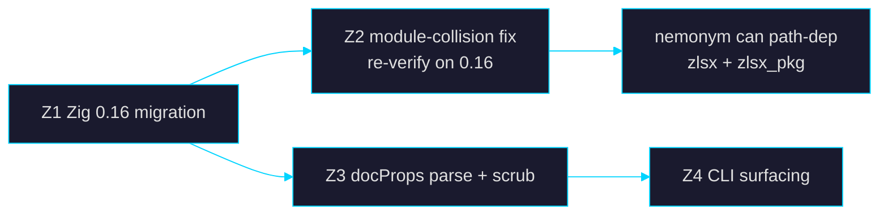

# goal_evol.md — zlsx evolution work order

*Everything found missing in the 2026-07-25 nemonym survey, packaged as
implementable goals for a fresh session in this repo.*

> **STATUS 2026-07-26 — CLOSED.** All four goals landed on main:
> **Z1 + Z3 + Z4** in #120 (`a2352c6`: 0.16 migration + docProps scrub +
> sheet-state surfacing; 56 files, +5815/−2689), with coverage-guided
> fuzzing unblocked on 0.16 in `7403bfd` (Linux x64 remains the only
> fuzz target — macOS Mach-O / Windows COFF breaks are upstream,
> documented in `AGENTS.md`). **Z2** verified resolved on 0.16 and
> locked in as a **permanent fixture** at `tests/consumer/` (imports
> `zlsx` + `zlsx_pkg` + `writer` in one build graph; 1029/1029 tests
> green). `scrub-metadata` is a live CLI subcommand and docProps
> crossed the C ABI (3-file rule honored).
> **Deliberately deferred by the implementer**: merging
> `zlsx-extract-images` back into the CLI — now possible, but it drops
> a shipped binary, so it's the owner's packaging call.
> **Still open**: the PyPI publish workflow blocker (`d369ced` adds
> diagnosis). This file is retained as the acceptance-criteria record;
> the living goal file is now `goal.md`.

> **Driver**: the sibling project `~/Projects/Pro/nemonym` (pseudonymization
> harness — see its `PLAN.md`) will consume zlsx as its XLSX
> mask/round-trip engine. Its core primitive already exists here
> (`zlsx_pkg.Editor.setCells` — byte-preserving load-modify-save), but
> three gaps block or degrade that use. A matching work order exists at
> `../pdf.zig/goal_evol.md`.
>
> **Read first**: `AGENTS.md` (defensive-programming canon §168–204, the
> stale-API guard table §226–244, and the three-module collision note
> §140). PR gates: `scripts/ci/` (test-presence, monotonic test count,
> **ABI 3-file transaction**: `src/c_abi.zig` + `include/zlsx.h` +
> `bindings/python/zlsx/_ffi.py` must move together).

---

## Gap summary (verified against source, 2026-07-25)

| # | Gap | Evidence | Unblocks |
|---|---|---|---|
| Z1 | **Pinned to Zig 0.15.2** — cannot join a 0.16 build graph (nemonym, pdf.zig, ziglib are all 0.16); also `zig build test` cannot even link locally on macOS 26.4 (libSystem stubs: `_clock_gettime`, `_malloc_size`…) | `AGENTS.md` header enumerates the exact 0.16 breakages (`std.Thread.Mutex`→`std.Io.Mutex`, `std.time.nanoTimestamp` removed, `std.process.Child.run` signature); all CI workflows pin 0.15.2 | nemonym path-dep; local macOS testing; workspace uniformity |
| Z2 | **Three-module collision** — `cli_mod`, `zlsx_pkg`, and `writer` cannot coexist in one compilation (why `zlsx-extract-images` is a separate exe) | `AGENTS.md:140` | consumers importing `zlsx` + `zlsx_pkg` together (nemonym needs both: reader + Editor) |
| Z3 | **`docProps/{core,app}.xml` blindness** — no typed parser, no scrub; PII (`dc:creator`, `cp:lastModifiedBy`, company) passes through every round-trip untouched and invisible | zero `docProps` hits in `src/`; only reachable as raw bytes via `PartStore.part(...)` | metadata PII scan + scrub for nemonym; honest `meta` output for everyone |
| Z4 | **Hidden sheets invisible in CLI** — `SheetState{visible,hidden,very_hidden}` is parsed (`pkg/typed_parts/workbook_xml.zig:42`, surfaced via `Worksheet.state()` at `pkg/workbook.zig:5221`) but `list-sheets`/`meta` never print it (zero `hidden` hits in `src/cli.zig`) | grep verified 2026-07-25 | a masking pipeline must *warn* when a workbook smuggles hidden/veryHidden sheets |

**Explicitly out of scope** (log as deferred, do not drift):
- Formula evaluation, pivot/chart authoring, `.xls`/`.xlsb` (README non-goals).
- Masking string literals *inside formulas* — needs a formula text
  rewriter beyond `formula_rewriter`'s ref-rewriting; nemonym-side
  concern for now, note it in `docs/plans/` and move on.

---

## Dependency order



Z1 first — everything else lands on the 0.16 tree so nothing is
migrated twice. Z3/Z4 are independent of Z2.

---

## Z1 — Zig 0.16 migration

Migrate the whole tree (src/, pkg/, tests/, bench harness, build.zig)
from 0.15.2 to 0.16.0. The known breakage list is in the `AGENTS.md`
header; ziglib's migration commits (`648d906`, `5220dd8` in
`../ziglib`) and pdf.zig's 0.16 idioms (`std.Io` param threading,
`std.Io.File.stdout().writer(io, &buf)`) are the local references.
Update: all `.github/workflows/*.yml` pins (`mlugg/setup-zig@v2`
version + the raw-curl musl fallback), `build.zig.zon`
`.minimum_zig_version`, and rewrite the `AGENTS.md` stale-API guard
table for the 0.16 world. Bump version; keep the pyproject version
mirror in sync.

**Acceptance gate (machine-verifiable):**

```bash
~/.zvm/0.16.0/zig build test                       # exit 0 — ON macOS: this is the
                                                   # first green local test run since 26.4
~/.zvm/0.16.0/zig build test-corpus                # exit 0
~/.zvm/0.16.0/zig build -Dtarget=aarch64-linux-musl  # compile-only cross sanity, exit 0
grep -Ec '0\.15\.2' .github/workflows/*.yml        # prints 0, exit 1
# C ABI unchanged unless intentional; if touched, 3-file rule + pytest:
python3 -m pytest bindings/python/zlsx/test_basic.py  # exit 0 (against freshly built libzlsx)
# Fuzz: 0.15.2 limited std.testing.fuzz to Linux x64 — re-verify on 0.16
# and either re-enable macOS fuzz or document that it's still upstream-blocked.
```

---

## Z2 — Module-collision fix (or verified non-issue on 0.16)

On 0.15.2, any file importing `writer` gets claimed by both `cli_mod`
and `zlsx_pkg` trees. On 0.16, re-verify; if it persists, restructure
so the import graph is a DAG with `writer` owned once (likely: make
`zlsx_pkg` import the `zlsx` module rather than reaching into `src/`
files directly). The observable contract, not the mechanism, is the
gate:

**Acceptance gate:**

```bash
# Scratch consumer with .dependencies = .{ .zlsx = .{ .path = "../zlsx" } }
# whose main.zig imports BOTH:
#   const zlsx = @import("zlsx");          // Book.open + Rows
#   const pkg  = @import("zlsx_pkg");      // Editor.open + setCells + save
# opens a fixture, reads a cell, sets it via Editor, saves, re-reads.
~/.zvm/0.16.0/zig build && ./zig-out/bin/consumer   # exit 0, prints round-trip OK
# And zlsx's own binaries still build in the same graph:
~/.zvm/0.16.0/zig build run -- --help               # exit 0
```

If the collision forces keeping `zlsx-extract-images` separate, that's
acceptable — the gate is only about *external consumers* importing both
modules.

---

## Z3 — docProps typed parse + scrub

New typed part `pkg/typed_parts/doc_props_xml.zig`:

1. **Read**: `DocProps` struct — core.xml (`dc:creator`,
   `cp:lastModifiedBy`, `dc:title`, `dc:subject`, `dc:description`,
   `cp:keywords`, `cp:category`, `dcterms:created`, `dcterms:modified`,
   `cp:revision`) + app.xml (`Company`, `Manager`, `Application`,
   `HyperlinkBase`) + presence-flag for `docProps/custom.xml`.
   Exposed as `Workbook.docProps()` and `Editor`-level equivalent.
2. **Scrub**: `Editor.stripDocProps(mask)` — rewrite the two parts via
   `PartStore.replacePart` with the masked fields removed/blanked,
   everything else byte-preserved. Mask covers at minimum:
   creator, lastModifiedBy, company, manager, title, subject,
   description, keywords, custom.xml (drop whole part + its
   Content_Types/rels entries).
3. **C ABI + Python**: `zlsx_docprops_*` getters + `Editor.strip_doc_props()`
   in `py-zlsx` — the 3-file transaction rule applies.

**Acceptance gate:**

```bash
# Fixture with known author "Jane Q. Fixture" and company "AcmeCorp":
./zig-out/bin/zlsx meta fixture.xlsx --output pretty-json | grep -c 'Jane Q. Fixture'   # ≥1
./zig-out/bin/zlsx scrub-metadata fixture.xlsx --out clean.xlsx                          # exit 0
unzip -p clean.xlsx docProps/core.xml | grep -Ec 'Jane|AcmeCorp'                         # 0, exit 1
unzip -p clean.xlsx docProps/app.xml  | grep -Ec 'AcmeCorp'                              # 0, exit 1
# Byte-preservation everywhere else — cell data identical:
diff <(./zig-out/bin/zlsx rows fixture.xlsx --all-sheets) \
     <(./zig-out/bin/zlsx rows clean.xlsx  --all-sheets)                                 # exit 0
python3 -m pytest bindings/python/zlsx/test_basic.py                                     # exit 0
~/.zvm/0.16.0/zig build test                                                             # exit 0, count monotonic
```

---

## Z4 — Surface hidden sheets (and docProps) in the CLI

- `list-sheets` gains a `state` field per sheet
  (`visible|hidden|veryHidden`) in every output format.
- `meta` gains a `doc_props` object (from Z3) and a
  `hidden_sheet_count` / `very_hidden_sheet_count` summary so a caller
  can gate on it with `jq` alone.

**Acceptance gate:**

```bash
# Fixture with one veryHidden sheet:
./zig-out/bin/zlsx list-sheets hidden_fixture.xlsx --output pretty-json \
  | grep -c '"veryHidden"'                                   # ≥1
./zig-out/bin/zlsx meta hidden_fixture.xlsx --output pretty-json \
  | python3 -c 'import json,sys; d=json.load(sys.stdin); sys.exit(0 if d["very_hidden_sheet_count"]>=1 else 1)'   # exit 0
~/.zvm/0.16.0/zig build test                                 # exit 0
```

---

## Definition of done for this work order

1. All four gates green on 0.16, including a green **local macOS**
   `zig build test` (the 26.4 blocker is gone with the migration).
2. Scratch consumer proves `zlsx` + `zlsx_pkg` co-import (Z2).
3. `scrub-metadata` round-trip gate passes with cell-data `diff` clean.
4. CI workflows on 0.16; release + pypi + bench workflows still green
   (bench is report-only, but must not error).
5. README: feature matrix rows for docProps read/scrub + sheet-state
   surfacing; `docs/plans/` gets a one-page note deferring
   formula-literal masking.
6. `AGENTS.md` stale-API table rewritten for 0.16; version bumped and
   mirrored in `bindings/python/pyproject.toml`.

Suggested session split (context budget): **Session A** = Z1 (migration
is bulk mechanical churn — keep it single-focus, commit per subsystem).
**Session B** = Z2 + the scratch-consumer fixture. **Session C** = Z3 +
Z4 (they share fixtures and the typed-parts idiom).
