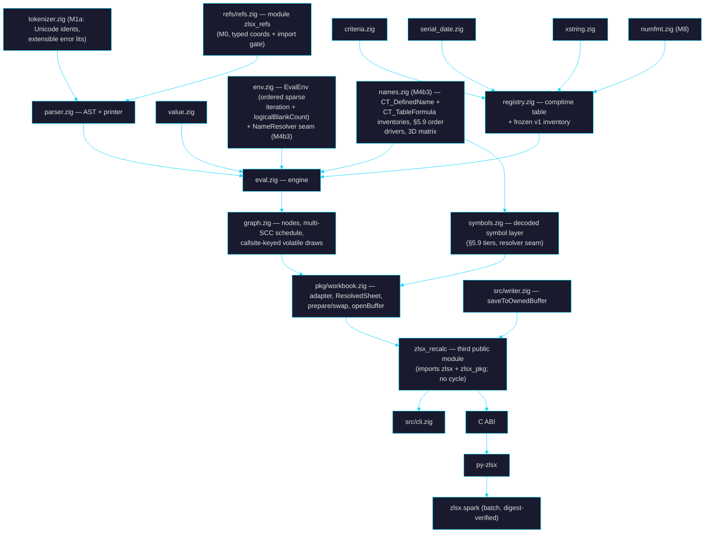

# 🎯 Goal — the zlsx formula interpreter (tier D1)

> Living plan for building, testing, and improving a **formula evaluation engine**
> inside zlsx, under the same constraints as the rest of the project: stdlib-only,
> Zig 0.16.0, TigerStyle-defensive, byte-splice fidelity, refuse-rather-than-half-do,
> measured performance. Companion to `goal.md` / `goal_plan.md`; detail specs in
> `docs/plans/formula-*.md`. **Self-contained: every normative contract appears in
> this document in full — no reference to any prior revision is normative.**

_Created: 2026-08-02 · Revision: **v21** (post Codex rounds 1–20 — 412 findings
dispositioned; see §15) · Status: **SHIPPED (2026-08-07)** — the 41-row ladder
(M-1 … M9d) is complete and landed on `main` as one rebase-merged PR
(`feat/m9d-eng`: 48 ladder commits, plus the Linux `syncDir` EBADF fix the
ubuntu lane required). All 175 frozen names registered; §13 gate green; the
four §9 `--gate` lanes green. **The two ⛔ owner decisions are closed
(2026-08-08): both ceilings waived for v0.8.0** (§9.1) — evaluate 936.98 ms
(**1.87×** its 500 ms ceiling) and first-recalc RSS 506.7 MiB (**33.4×** its
3×-model-bytes ceiling) ship under recorded owner waivers. Neither ceiling is
renegotiated; perf/memory rows targeting both stay open candidates for the
next minor._

_The Codex SHIP-READY review loop remains parked by owner directive after
round 20; round 21 was never run._

_**M-1 landed 2026-08-03** (docs-only planning flip; see §13.1) and rides in
the chain as the cherry-pick `b2399f5`._

---

## Table of contents

1. [What / Why — the D1 reversal](#1-what--why)
2. [Decision log (locked)](#2-decision-log)
3. [Constraints inherited](#3-constraints)
4. [What exists today](#4-what-exists-today)
5. [Architecture](#5-architecture)
6. [Milestone ladder](#6-milestone-ladder)
7. [Function registry](#7-function-registry)
8. [Testing & oracles](#8-testing--oracles)
9. [Performance & limits](#9-performance--limits)
10. [Refusal & error taxonomy](#10-refusal--error-taxonomy)
11. [Interactions with existing arcs](#11-interactions)
12. [API surface per layer](#12-api-surface)
13. [Documentation flips](#13-documentation-flips)
14. [Risks](#14-risks)
15. [Review log](#15-review-log)

---

## 1. What / Why

**What**: (a) workbook recalculation filling every formula cell's cached `<v>`,
including as part of save on the Workbook/Editor path and — via the `zlsx_recalc`
orchestrator module and `Writer.saveToOwnedBuffer` (§5.10) — the fresh-Writer
path; (b) standalone formula evaluation against a workbook context. One engine;
customer layers CLI, C ABI, Python, Spark-batch; Zig `pkg` as the source-visible
internal foundation (no core-source rights in any tier, `LICENSE:5-30`).

**Why now**: (1) `emitCell` drops cached values on rewritten/new formulas
(`pkg/workbook.zig:366,5476` — "Tier D1" named); edits leave non-uniform
staleness. (2) Non-Excel consumers (Spark source, UDF, Genie) read `<v>` —
stale caches are silent data corruption; the commercial argument. (3) #140's
refusal wants a real parser (`goal.md`: "highest-value remaining lift").

**Reversal recorded** at §13's enumerated checklist; the planning flip is
**M-1** and precedes all code.

**Non-goals** (deferred, do not drift): chart/pivot authoring; `.xls`/`.xlsb`;
VBA/add-in/UDF execution; external links; RTD/CUBE; Python-in-Excel; what-if
data tables (refusal); LAMBDA/LET (parse-and-refuse); relative-ref defined
names (refusal); localized function names; locale-sensitive *input* outside
pinned grammars (typed refusal, never a fabricated error value — §5.4b);
streaming-source recalc; namespace-prefixed SpreadsheetML (preflight refusal;
scanners match literal names today — `sheet_xml.zig:421`,
`xlsx_test_corpus.md:58`); **`fullPrecision="0"`
(precision-as-displayed) refuses through all of v1** — support is an M10+
capability after numfmt, not an M8 side effect; **top-level multi-area
reference results** (typed refusal at every public layer in v1 — §5.4c);
OS-timezone resolution (stdlib-only Zig 0.16 has no portable resolver —
**all layers default to UTC** unless an explicit `--utc-offset` is given;
TZif integration is an M10+ milestone). Compatibility Version 2 is **in
scope** (§5.4d) — CV2 is the default for new Current-Channel workbooks since
April 2026, so refusing it would refuse normal files.

---

## 2. Decision log

Locked 2026-08-02 by Laurent (axioms; changing one reopens the plan):

| # | Decision | Consequence |
|---|---|---|
| D-1 | Both recalc-on-save and standalone eval | `recalculate()` (in-memory transaction) + `saveWithRecalc` (file transaction, §5.7.9) + Writer path via orchestrator; eval at every layer |
| D-2 | Registry phased to 300+, Core ~60 first | Core gate = M4e ✅ — **59** cumulative (M4c 20 + M4d 17 + M4e 22), counted from the frozen inventory committed at M3a rather than from this row. Past the gate: M4f ✅ adds 19 (F1c-text) → **78**, M4g ✅ adds 15 (F1c-date) → **93** |
| D-3 | Dual fidelity modes | §5.4; `.excel` carries `platform_profile` + `collation_v1` |
| D-4 | Dynamic arrays from the start | Array-first eval from M3a with the normative shape/coercion table (§5.3b); persistence staged behind proof gates; authoring via explicit `FormulaWrite.dialect` |
| D-5 | Iterative calc honoring `calcPr` | CalcState workbook-derived; multi-SCC schedule normative (§5.6c) |
| D-6 | Pinned clock/seed | RunInputs = instant + UTC offset + seed; volatile draw schedule keyed per call site (§5.6d) |
| D-7 | All customer layers in v1 (Spark batch-only) | v1 = **M9d** |
| D-8 | Four ground-truth sources | All adapters at M1b; volatiles excluded from **every external** value oracle (§8.2) |

---

## 3. Constraints

- Zero deps; Zig 0.16.0 — `std.Io` explicit in every file/buffer API
  (`AGENTS.md:250-260`; precedent `Book.openBuffer(allocator, io, bytes)`,
  `src/xlsx.zig:795-811`); TigerStyle; bounds-checked narrowing (`AGENTS.md:107`).
- **Module graph is law** (`build.zig:20-23` forbids
  `writer → zlsx_pkg → workbook → zlsx → writer`): Writer-path recalc composes
  in a **third public module `zlsx_recalc`** (§5.10) exported alongside the two
  existing public modules (`build.zig:143-157,408-438`), with a
  `tests/consumer` dependency test. `src/formula/` never imports `pkg/`
  (`EvalEnv` only; CI grep gate, M0). Fuzz wiring explicit (`build.zig:746`);
  wiring is part of each PR gate.
- Byte-splice fidelity with raw-entry identity assertions (§8.4;
  `store.zig:695`).
- Refuse rather than half-do.
- Performance under existing lanes; single-mode whole-graph bench builds
  (the `build.zig:1030` mixed-mode trap fixed in the bench PR) (§9).
- Five test layers; `checkAllAllocationFailures` incl. reports (prepared
  pre-swap, §5.7.4).
- C ABI: 3-file transaction; `zlsx_status_v1` numeric contract inline
  (§12.3); error channel on every fallible export; **write only
  `min(caller_size, known_size)` — bytes beyond the known prefix are never
  touched** (canary-tail tests); release fn per owned descriptor; field-width
  boundary tests.
- Licensing boundary; lazy-analysis gate.

---

## 4. What exists today

Verified 2026-08-02 on `main` @ `07c99f0`:

| Fact | Evidence | Consequence |
|---|---|---|
| Tokenizer round-trip lossless; `Table1[A1]` mis-tokenized; **identifier predicate ASCII-only; error whitelist closed** | `tokenizer.zig:77,266-274,309-339` | M1a: correction fixtures; **Unicode identifier grammar** (sheet/defined names are not ASCII-only) + **extensible error-literal rule** (unknown `#…!`/`#…?` lexemes tokenize as `.error_lit`, byte-preserved) with astral/combining/unknown-error round-trips |
| Many A1/ref helpers, mixed bases | rewriter; `xlsx.zig:241,2564`; writer; `workbook.zig:381,391,5396`; `sheet_plan.zig`; `sheet_edit.zig:117,1955`; `table_edit.zig:354`; `cli.zig:1065,4392` | M0: rg-derived consolidation + typed `SheetIndex`/`Row1`/`Col0` |
| Shared slaves recognized only self-closing; early slaves dropped | `xlsx.zig:2099` | **CLOSED (M4b2)**: classification is by attribute (`t="shared"` + `ref` = master, without = slave), sheet-wide topology validated, slaves translated. `calamine_non_monotonic_si.xlsx` writes `<f si="1" t="shared"></f>` — the shape the reader drops |
| Formula text + identifiers XML-escaped; **`<f>` attributes discarded by the typed parser** | `sheet_xml.zig:489-535`, `workbook_xml.zig:24,58` | M4b1 decode boundary + decoded symbol layer; **CLOSED (M4b2)**: the complete `CT_CellFormula` inventory is a table `classifyFormula` reads, one fixture per row, unknown attribute refuses (§5.7.2) |
| Scanners literal-match `<sheetData>/<row>/<c>` | `sheet_xml.zig:421` | Namespace preflight refusal (M4b1) |
| Delta model can't carry formula+cache; **`Writer.save` is path-only; its archive inputs are private** | `workbook.zig:353,5410,6206`; `writer.zig:484-512,940` | `ResolvedSheet` (§5.7.3); **`Writer.saveToOwnedBuffer(allocator, io)`** producer API (M5c; allocator-first per `AGENTS.md:194`) — `pkg/fresh_emit.zig:107` alone cannot serve an external orchestrator |
| `PartStore.open` path-only, retains `io`; calcChain rels owner-relative (`Target="calcChain.xml"`), `removeRelationshipsTo` matches absolute | `store.zig:105-144,1510`; corpus `phpoi_test1.xlsx` | `Workbook.openBuffer(allocator, io, bytes)` — borrow ends at return, store copies (Book precedent); **rel-target half CLOSED (M5b2)**: the recalc transaction resolves the calcChain rel through `PartStore.resolve` (owner-relative to `xl/workbook.xml`) and removes override + relationship by identity, attribute-aware — `removeRelationshipsTo` is left alone for its other callers, and the relative/absolute/noncanonical spellings are fixtured. `Workbook.openBuffer` itself stays M5c |
| `calcPr` partial; `date1904` absent from typed view; CV extension unparsed | `workbook_xml.zig:89,286-318` | **CLOSED (M4b2)**: complete `CT_CalcPr`, `sheetCalcPr`, `date1904` → `t="d"`'s epoch, extensions preserved byte-exact; every corpus `<calcPr>` round-trips (§5.7.6). CV2's feature name stays unpinned until M7b's byte-diff |
| `cm`/`vm` = one-based metadata indexes; no parser; **spec-vs-Office collection resolution differs** | MS-OE376 | M4a typed reader; **transition rows name the exact collection (cellMetadata vs valueMetadata), record type, indexing, and missing-record behavior — pinned empirically by byte-diffed Excel references at M7b**, not assumed from the base schema |
| Tables can carry `calculatedColumnFormula`/totals formulas | `table_edit.zig:39` | M4b3 producer inventory + refusal when member cells lack `<f>` |
| Cached text may need C0 controls; emitters reject forbidden XML bytes | `sheet_plan.zig:1153` | **CLOSED (M4f)**: the codec landed at M4b1 (`decode.zig:596-657`); M4f is the row that first PRODUCES such text — `CHAR(1)` — and round-trips it from a formula result through `encodeAuthoredString` → `decodeCarrier(.string)`, including the `_x005F_` escape of a literal `_x0041_`. M5b1 writes it back |
| ABI errors today: `0/-1` + error buffer; `write_row_with_formulas` has no dialect param | `c_abi.zig:1837-1920,1927` | New exports keep errbuf + add diag; **FormulaWrite stays Zig-only at M7c; the versioned C export lands at M9a2** |
| CLI reserves 130/143; flushes completed records on signal | `docs/cli.md:224-227,268`; `cli.zig:1718` | Exit tables include 130/143; **no-output guarantee applies to workbook-file mutation only; eval NDJSON streams may be prefix-valid on cancellation** (§12.2) |

Hazards fixed, not inherited: shared-attr strip; typed-overlay gaps;
`formula-literal-masking.md:42-48` misstatement (M-1 correction + cache policy
table).

---

## 5. Architecture

### 5.1 Module map



**M0 placement (decided 2026-08-03).** The coordinate module roots at
top-level `refs/`, not `src/formula/`, for the same reason as `unicode/`:
a file belongs to exactly one module's package tree, and the consumers
span `zlsx` (`src/`), `zlsx_pkg` (`pkg/`), `zlsx_sheet_plan`, and
`zlsx_workbook_xml_plan`. Under `src/` or `pkg/` the compile fails with
"file exists in modules 'zlsx' and 'zlsx_refs'".

M0 also found more duplication than the ladder row anticipated: **six**
A1 parsers and **seven** column-letter formatters, disagreeing on column
base (0- vs 1-based), case handling, and whether `A01` is a valid row —
including two structs both named `CellRef` with different bases, and one
file (`pkg/sheet_plan.zig`) that disagreed with itself. All are now
adapters over `zlsx_refs`, each preserving its own policy via explicit
options rather than being silently unified; `refs/import_gate.zig` runs
in `zig build test` and fails on any new hand-rolled base-26 codec.

### 5.2 Grammar contract

**Tokens (M1a)**: `.op_spill`, `.op_at`, `.structured_ref` (with `'[ '] '# '@`
escapes), `.external_ref` (refused typed); 3D/full-col structural. **Unicode identifiers (normative grammar)**: start = `XID_Start ∪ {_, \}`,
continue = `XID_Continue ∪ {_, .}` (**backslash start-only**; `a\b`
refuses, fixtured); max 255 code points; invalid UTF-8 →
typed refusal; **classification precedence**: cell reference → R1C1-shape
rejection → TRUE/FALSE → function/name. Fixtures: combining marks, astral
starts, cell-looking names.
**Extensible error literals**: known ten match the whitelist; any other
`#…!`/`#…?` lexeme tokenizes as `.error_lit` with bytes preserved (rich/future
errors round-trip). Round-trip holds for all. Compat gate: previously-
recognized constructs rewrite byte-identically; `Table1[A1]` correction
fixtured.

**M1a decisions (shipped 2026-08-03).** Nine points the row left open or
got wrong, pinned here because M2 builds directly on them:

1. **Refusals are out-of-band, not errors.** The tokenizer never fails
   on malformed input (only OOM) — failing would break the round-trip
   every downstream byte-identity gate rests on. `scan()` returns
   `{tokens, refusals}` with a typed `Refusal.Reason` per construct
   (`invalid_utf8`, `identifier_too_long`, `backslash_after_start`,
   `r1c1_reference`, `external_reference`, `unterminated_*`), each
   annotated with the §10 plane-2 error M2 raises for it. `tokenize()`
   keeps the pre-M1a signature for the rewriter.
2. **`?` dropped from the identifier set** (it was in the pre-M1a
   predicate). Excel does not accept `?` in defined names, and the
   normative grammar is `XID_Continue ∪ {_, .}`. Correction, fixtured.
3. **Extensible-error rule is bounded**: `#` + 1..62 bytes of
   `[A-Za-z0-9_/.]` + `!`/`?`, cap 64 bytes total. Unbounded, a stray
   `#` swallows the rest of the expression looking for a terminator. A
   `#` matching neither the whitelist nor this rule is `.op_spill`.
4. **Bare `RC` is NOT rejected as R1C1** — `RC` is also column 471, so
   `RC:RC` is a live A1 full-column reference and the A1 reading wins
   under the §5.2 precedence. Rejection covers `R<n>C<n>` (≥1 digit)
   plus `R[`/`C[` by lookahead. `RC1` never reaches the rule: it is a
   cell reference.
5. **`.external_ref` also covers the `[1]` workbook-index form**, and
   the *whole chain it qualifies* is untouchable — `[1]Sheet1!A1`
   tokenizes as an ordinary `name bang cell_ref` triple that the
   rewriter would otherwise happily shift. `isOpaqueQualifier` +
   `endOfExternalReference` in `rewriter.zig` are the guard; the compat
   suite is what proves it.
6. **`$1` needs its own scan branch.** Digits cannot start an
   identifier, so the `$` of the absolute full-row form `$1:$1` would
   otherwise strand as a lone lexeme and split a construct the pre-M1a
   tokenizer kept whole.
7. **`a\b` yields two adjacent names, not name-unknown-name.** `\` is
   start-only, so it terminates the first identifier and starts a
   second. The refusal is the signal; the token shape is incidental.
8. **The regen gate normalises through `zig fmt`** before diffing: the
   committed tables are formatted and `zig fmt` column-aligns long
   scalar lists, so a raw diff reports whitespace churn on byte-correct
   data. Running it also proved the committed casefold/NFC tables
   reproduce exactly from their pinned inputs.
9. **`refs/` was missing from `build.zig.zon` `.paths`** (M0 gap — the
   packaged module could not have built); added with
   `THIRD_PARTY_NOTICES.md`.

**Still open (owner action):** `LICENSE` needs the third-party-data
carve-out saying the Unicode-derived tables are licensed separately.
`THIRD_PARTY_NOTICES.md` flags it; the carve-out itself is not a code
change and is not made here.

**Parser (M2)**: AST + canonical printer (parse→print→parse structural
equality). Precedence (oracle-pinned rows): `:` > ` ` > `,`(ref) >
unary`±`(right; `=-1^2=1`) > `%` (interaction fixtures) > `^` (left; `2^3^2=64`)
> `*` `/` > `+` `-` > `&` > comparisons.

**Full-row references**: `1:1` / `1:5` join full-column refs as
structurally-recognized, evaluable constructs (bounds `[1, 1 048 576]`,
sparse `RangeSet` membership, graph range-node edges; fixtures `SUM(1:1)`,
`COUNTBLANK(2:3)`); structural *rewriting* of full-row/col refs remains the
rewriter's documented out-of-scope (`rewriter.zig:22`) and an M10+ item —
evaluation and rewriting are independent capabilities.

**Array constants**: `{…}`, `,` columns / `;` rows (re-disambiguated inside
braces), elements = signed numeric literals, strings, TRUE/FALSE, error
literals; rectangularity required (ragged → typed parse refusal); no
refs/calls/nesting. **Leading `=`**: stored text is body-only; standalone APIs
strip exactly one optional `=` after whitespace; `==` → parse refusal.
**Structured refs**: full item-specifier grammar (`#All #Data #Headers
#Totals #This Row`, `@`, column ranges, combined forms, escapes). **Prefixes**:
layered `_xlfn.` / `_xlfn._xlws.` / `_xlfn.SINGLE`→`@`; `_xlpm.` refused;
original spelling preserved.

**M2 decisions (shipped 2026-08-03).** Fifteen points the row left open
or got wrong, pinned here because M3a builds directly on them:

1. **Number literals are not converted.** The AST keeps the source
   spelling and defers `parseDecimal` to M3a1. Converting here would
   force a rounding policy before §5.4 pins one, and the canonical
   printer would then have to *re-render* every literal — turning a
   round-trip property into a formatting bet.
2. **The canonical printer is canonical, not byte-preserving.** Byte
   fidelity stays the tokenizer's contract (`format(tokenize(x)) == x`);
   the parser drops insignificant whitespace and normalises booleans to
   `TRUE`/`FALSE`. Everything a canonical form cannot re-derive rides in
   the AST verbatim: number spellings, string bodies, error spellings,
   sheet-name quoting and its `''` escapes, structured-ref column names,
   and the `_xlfn.` layers. Parenthesised groups keep an explicit node —
   dropping redundant parens would change the structure the round-trip
   is asserting.
3. **A call requires `(` adjacent to the name.** M1a's classification
   precedence is normative, so `SUM (A1)` keeps the kinds M1a assigned
   it and parses as an *intersection*, not a call. Excel would read it
   as a call; the divergence is unreachable through the workbook path
   because stored `<f>` never spaces a call. Fixtured, and preferred
   over shipping two classifiers that disagree.
4. **`A1 -1` is subtraction, not an intersection.** `+` and `-` are
   excluded from the primary-starter set that turns whitespace into the
   intersection operator. Without the exclusion every `A1 -1` in the
   corpus silently becomes an intersection with a negative literal.
5. **`_xlfn.SINGLE(x)` and `@x` unify into one node.** Same operator,
   two spellings: the node carries a `form` discriminator and the
   original callee text, so downstream sees one shape and the printer
   still hands back what was written. Unification requires exactly one
   argument; anything else stays an ordinary call for the registry to
   reject on arity.
6. **`;` outside braces is `FormulaLocaleSensitiveInput`, not a syntax
   error.** Inside braces it is the array row separator. The tokenizer
   emits `.arg_sep` for both bytes, so the parser re-disambiguates on
   the byte — the one place a token kind alone is not enough.
7. **Full-span references are matched on the tokens, before any node
   exists.** `A:A` and `1:1` are recognised speculatively, which keeps
   the flat node array free of orphaned operands and makes
   `max_ast_nodes` count only live nodes. Out-of-grid spans (`XFE:XFE`,
   `1:1048577`) are deliberately **not** full spans: they stay generic
   ranges over names and reach §5.9, which is where `#NAME?` is
   provable.
8. **Structured-ref item specifiers are a set.** The canonical form
   orders them `#All #Data #Headers #Totals #This Row` regardless of how
   they were written, so two spellings of one selection compare equal.
   `@` sets `this_row` and records `at_shorthand` purely as a print
   form. A bare part starting with an unescaped `#` **must** be a known
   item specifier — `Table1[#Nope]` is malformed, not a column named
   `#Nope` (that is `Table1['#Nope]`).
9. **Column names are kept raw, with their `'` escapes intact**, so
   printing needs no allocation and no re-escaping; `decodeColumnName`
   resolves them for the M4b1 symbol layer. The bracketing rule is
   stricter than the grammar needs — only `,` and `:` are genuinely
   ambiguous, but the canonical form brackets anything outside
   letters/digits/`_`/`.`/non-ASCII, because Excel writes
   `Table1[@[Col A]]` and a canonical `Table1[@Col A]` would be a
   spelling no other reader emits.
10. **Refusals are a union, not an error set.** A refusal without a span
    is not actionable and a Zig error carries no payload, so `parse`
    returns `Parsed{ok|refused}` and reserves `error.OutOfMemory` for
    the only real error. Tokenizer refusals are checked **before**
    parsing and the first in detection order wins, so the diagnostic
    names the construct rather than whatever syntax error it went on to
    cause.
11. **Three of the seven §9 parse limits are dominated at defaults.** A
    code point is at most four UTF-8 bytes and
    `max_formula_utf8_bytes = 4 × max_formula_chars`, so the byte cap
    can be *reached* but never exceeded first; every token spans at
    least one code point and `max_tokens > max_formula_chars`; nodes are
    bounded by tokens. All three stay enforced and boundary-tested at
    lowered ceilings, because `Limits` is caller-adjustable.
12. **"No lost bytes" is an invariant, not a test.** `parse` accumulates
    every consumed token's length — speculative matches rewind it with
    the cursor — and asserts the total equals the input length on
    success; `trailing_input` is what makes reaching the end mandatory.
    Since M1a proved the tokens tile the input exactly, that total is a
    proof no byte was skipped. The fuzz target adds the structural half:
    spans nest inside their parent, and siblings are ordered and
    disjoint.
13. **Oracle pinning is by fidelity.** `ieee` manifests are compared
    bit-exactly; `excel` manifests to 15 significant digits, which is
    §5.4's own display rule — an excel-fidelity manifest records
    `0.1+0.2` as `0.3`, so demanding exact bits there would test zlsx
    against a rounding policy M3a1 has not landed. The tolerance cannot
    blur a precedence question: the discriminating cases differ by a
    factor of 8 (`2^3^2` = 64 vs 512) and by sign (`-1^2` = 1 vs −1).
14. **`&` and the reference-operator ranks are spec-pinned, not
    oracle-pinned.** No committed manifest mixes `&` with `+` or with a
    comparison, and none exercises `,` or the intersection space. They
    ship as fixtures **labelled as such** rather than claimed as
    oracle-derived; closing that gap needs new oracle cases, not a new
    parser.
15. **§5.9 ships as a spec artifact plus classification, not
    resolution.** There is no workbook at M2. The parser records
    call-vs-value use, the peeled prefix layers, the original spelling,
    and the `_xlnm.` flag; both resolution orders are exported as
    checked arrays that M4b3 consumes.

**Deferred to M10+:** call classification when whitespace separates the
name from `(` (decision 3) — it needs a lexer-level rule the rewriter
shares, not a parser-local override.

### 5.3 Value model & array semantics

**5.3a Types**: `ScalarValue` = number(f64, finite) | text | boolean |
err(known|rich) | blank — the only Matrix element, **internal to the evaluator**; the public boundary uses `PublishedScalar`/`PublishedMatrix` (no blank variant) with **one mandatory blank→0 conversion** shared by Zig, CLI, C, and Python.
`Value` adds missing_arg / array(*Matrix, non-recursive) / reference(RangeSet)
at evaluator layer. Blank ≠ missing_arg ≠ `""`. Rich errors preserved,
never produced. **Per-form evaluation contracts** (each fixture-pinned with
volatile-draw, error, and dependency-capture tests in every branch position):
`IF` and `CHOOSE` are **lazy for scalar selectors** (taken branch only;
zero runtime draws in dead branches); **array selectors switch to
per-element masking** (both branches evaluate broadcast to the mask shape;
per-element errors stay per-element). **Static vs runtime split
(normative)**: the dependency GRAPH always carries static syntactic edges
for every arm; laziness governs only runtime evaluation and volatile draws.
Mixed-mask IF/IFERROR/IFNA fixtures at M4c; **CHOOSE fixtures at M4e**; `IFERROR`/`IFNA` evaluate the value arg, then the fallback only on
error; **`IFS` and `SWITCH` are EAGER** — Excel evaluates all arms
(observable via volatiles and dependencies), so zlsx does too; `AND`/`OR`
eager.
**Empty matrices are unrepresentable results**: any zero-row/zero-column
array normalizes to `#CALC!` at the producing function's boundary (Excel's
own answer; both modes — never persisted, never streamed). Criteria module
(M3b). Per-run arena.

**5.3b Shape & coercion table (normative, lands with M3a; dialect-indexed)**:

| Context | DA dialect | Legacy dialects |
|---|---|---|
| Scalar where array expected | lift to 1×1 | same |
| Binary op, shapes (r₁×c₁)·(r₂×c₂) | broadcast dims of size 1; result (max r × max c); incompatible (both >1 and unequal) → elementwise `#N/A` fill per Excel (fixture-pinned) | same evaluation, but result consumed per intersection rules |
| **Reference** where scalar expected | no implicit intersection (the reference spills/iterates per function DA-awareness) | **implicit intersection**: same-row → row-projected element; same-column → column-projected; else `#VALUE!` (fixture-pinned) |
| **Array** (non-reference) where scalar expected | spills/iterates per DA-awareness | **top-left reduction** — arrays reduce to their top-left element, NOT row/col intersection (Excel distinguishes references from arrays; fixture-pinned) |
| Reference in value context | dereference (single rect → matrix/scalar) | same + implicit intersection rules |
| `@expr`, expr is a **single-cell reference** | **the reference unchanged** (`=@A1` yields A1's value regardless of the evaluation row/col — Excel's single-item exception precedes intersection) | same |
| `@expr`, expr is a **multi-cell reference** | row/column intersection with the evaluation site: 1-D vector → element on the shared axis; **2-D range → the cell at the intersection of the evaluation row AND column iff the range spans both**; no intersection → `#VALUE!` | identical, explicit spelling |
| `@expr`, expr is an **array** | **top-left element** (`@SEQUENCE(3)` → 1) | same |

Oracle tests per row: operators, scalar-arg functions, array-arg functions,
spill references, legacy formulas, `@SEQUENCE(…)`, `@{1,2;3,4}`,
off-axis `=@A1`, 2-D `@` ranges (spanning and non-spanning),
horizontal/vertical ranges, out-of-range intersections.

**Standalone-eval dialect (normative)**: dialect is a stored-cell property
(`EvalEnv.dialectOf`), so standalone evaluation — which has no stored cell —
takes an explicit `dialect` at **every layer that has standalone eval**
(Zig: `RunInputs.dialect`, default `.dynamic_array`; CLI `--dialect
da|legacy`; C run-inputs field; Python kwarg), echoed in every
resolved-context record and in every cache/fingerprint key. **Spark has no
standalone-eval operation in v1**, so it exposes no dialect option — its
recalc derives dialect from workbook provenance like any stored-cell recalc.
Identical text can legitimately evaluate differently under `legacy`, which
is why the choice is the caller's, never inferred.

**Scalar coercion matrix (normative, M3a)** — provenance × context ×
fidelity. Provenances: numeric/text/bool literal, blank cell, text cell,
bool cell, error. Contexts: arithmetic op, comparison, `&`, function arg by
coercion class. The matrix (every cell = a fixture):

| Provenance ↓ / Context → | arithmetic | comparison | `&` concat | direct fn arg (numeric class) | via range (aggregate class) | lookup key | criteria operand | SORT element |
|---|---|---|---|---|---|---|---|---|
| blank cell | 0 | cross-type rules (pinned) | `""` | 0 | **skipped** | matches blank | blank rules | sorts first (pinned) |
| `""` text | `#VALUE!` | text compare | `""` | `#VALUE!` | skipped | text match | `""` criterion | text order |
| numeric text (invariant grammar) | coerced | **cross-type: number < text < logical; never cross-equal** (pinned) | as text | coerced | **NOT coerced** (Excel ignores text in ranges) | exact-text unless numeric-key (pinned) | coerced | text order |
| locale-flavored text | refusal | text compare | as text | refusal | ignored | text | refusal | text order |
| non-numeric text | `#VALUE!` | text compare | as text | `#VALUE!` | ignored | text | text | text order |
| boolean | 1/0 | logical > text > number (pinned) | `"TRUE"`/`"FALSE"` | 1/0 | **ignored via ranges, counted as direct args** (Excel split, pinned per aggregate) | logical match | logical rules | logical order |
| error | propagates | propagates | propagates | propagates | propagates (unless skip-class) | propagates | propagates | pinned position |

Rules: text in arithmetic parses **through the pinned
invariant grammar only** (plain decimal/scientific forms; `"1"+1=2`); text
that parses only under some locale (e.g. `"1,5"`) →
`FormulaLocaleSensitiveInput` refusal, never a guessed number and never a
guessed `#VALUE!`; non-numeric text in arithmetic → `#VALUE!` (that IS
Excel's locale-independent answer for e.g. `"abc"+1`). Every cell of the
matrix is a fixture. **Ordinary comparisons (`=`, `<>`, `<`, `<=`, `>`,
`>=`) are case-INsensitive on text** (Excel semantics; `EXACT` is the
case-sensitive function): equality and ordering use case-folded comparison
via the full non-Turkic fold (`unicode/casefold.zig` — the single
normative algorithm of `collation_v1`, §5.4b) — `A/a` equal, `ß/ss/SS`
fold-equal (fixtured), no Unicode normalization applied (code points as
stored); divergences from Excel's locale collation recorded per `collation_v1`.

**5.3c Error propagation order (normative)**: operator operands evaluate
left-to-right; the first error encountered is the result. Eager function
arguments evaluate in declaration order; first error wins unless the
registry's propagation class says otherwise (**provenance-aware per
function, never family-wide**: `COUNT` counts numbers only — errors in
ranges neither counted nor propagated, direct scalar args coerce;
**`COUNTA` counts error-valued cells and `""`**; `COUNTBLANK` per its blank
class; `COUNTIF(S)` criteria can match errors — direct/reference/error/
bool/text/`""`/blank fixtures each;
`observe` — ISERROR/IFERROR/IFNA; `per_element` — elementwise array ops keep
errors per cell). Errors inside ranges surface in the deterministic iteration
order of §5.6a (first stored error in area/sheet/row-major order wins for
propagating aggregates). Mixed-error fixtures: IF, AND/OR, SUM over
error-bearing ranges, VLOOKUP, array ops.

**M3a1 decisions (shipped 2026-08-03).** Sixteen points the row left
open or got wrong, pinned here because M3a2 builds directly on them:

1. **Two number constructors, not one.** `ScalarValue.fromNumber`
   asserts finiteness — an evaluator handing over a number it computed
   knows it is finite, and a non-finite one is a bug in the caller.
   `fromArithmetic` converts instead, because N4a's whole point is that
   an overflow *is* a legitimate outcome (`#NUM!`). One constructor
   doing both would either assert on a real overflow or let a
   non-finite value into a `ScalarValue`, and both are worse than
   having two names.
2. **`provenanceOf` returns null for an actual number.** The §5.3b
   matrix has seven rows and none of them is "already a number".
   Returning a row anyway would invite a caller to look up a
   disposition the normative table never stated.
3. **The locale classifier's bias runs one way, deliberately.** A false
   positive turns a case Excel answers with `#VALUE!` — a *successful*
   plane-1 result — into a plane-2 refusal that stops a whole
   recalculation; a false negative only costs a less informative error.
   So `LocaleSensitive` requires a specific shape: a single decimal
   comma, digit groups of exactly three under one consistent separator,
   or currency/percent affixes around an otherwise-invariant number.
   `1.2.3`, `1,23,456`, and `1 23` are not numbers under any locale and
   get `#VALUE!`. Both sides are fixtured.
4. **N1a applies to every ingress except `.cache_import`.** §5.4 pins
   `literal` → N1a and `cache_import` → N1b but leaves
   `text_coercion` / `function_arg` / `criteria` unstated. They round
   like literals — Excel's `="1.2345678901234567"+0` yields the
   15-digit value — and the cached `<v>` is the one input that is
   *already* binary64, where re-rounding would corrupt a value nobody
   asked us to reinterpret. Fixtured across all five ingresses in both
   modes.
5. **Space trimming is a property of the ingress, not of the text.**
   `.literal` and `.cache_import` are stored forms and take their bytes
   exactly; the three coercion ingresses trim ASCII spaces because that
   is what Excel does with user text. `" 1 "` therefore parses on one
   path and not the other — from one parser, which is the point of
   there being only one.
6. **N2's threshold is spec-pinned and provisional.** No committed
   manifest contains a zero-snap case and the Excel oracle leg is
   parked (M1b), so nothing on disk decides it. `2^-48` relative
   (`zero_snap_relative_shift_v1`) snaps the textbook cases —
   `1.1-1.0-0.1` and `0.1+0.2-0.3` — and is a **named constant** so
   pinning it later is a one-line change with a fixture behind it.
   Additive scope is enforced by construction rather than by comment:
   `multiply` and `divide` never call the snap at all.
7. **N5 has to choose between two renderings, and the choice is not
   cosmetic.** Zig's `{d}` and `{e}` share the shortest-round-trip
   digit generation and differ only in layout, so the shortest
   round-tripping text is simply the shorter of the two. Positionally,
   `5e-324` is **326 bytes** — a caller sizing a buffer for "a number"
   would be wrong by an order of magnitude. `formatNumber` therefore
   generates the positional form into private scratch and copies it out
   only when it wins; `format_buf_len` is 32 and is a real bound.
8. **`-0` is where the committed excel-fidelity evidence and §5.4
   disagree — and it is the adapter, not the rule.** §5.4 says `.excel`
   normalizes `-0` → `+0` at publication "(fixture-backed)". The only
   committed excel-fidelity manifest is **LibreOffice**, which records
   `-0` with bits `0x8000000000000000`. LibreOffice is not Excel and
   the Excel leg is parked, so nothing on disk can settle it. §5.4's
   rule is implemented as written; the row is listed in
   `excel_adapter_divergences` and skipped from the excel-leg oracle
   tie **by name**, with the skip count asserted — not silently
   dropped.
9. **Excel-fidelity manifests pin to 15 significant digits, not to
   bits.** LibreOffice records `0.1+0.2` as `0.3` (bits
   `0x3FD3333333333333`): its `<v>` carries the display-rounded value.
   That is a serialization property of the adapter, **not** evidence
   that excel-fidelity arithmetic rounds — §5.4 says publication is
   post-N2/N3 binary64 and says nothing about rounding results. So the
   tie compares excel manifests at 15 significant digits and `ieee`
   manifests bit-exactly. M2 reached the same rule independently for
   its precedence pins.
10. **Subnormals are oracle-decided; most of §5.4 is not.** Both
    manifests record `2^-1074` as `0x1` and `1E-308/10000000000` as
    `0x316A2`, across fidelities. Exactly **three** of the nine
    divergence points are oracle-backed — subnormals, overflow, and
    division by zero — *(M3a2 makes it four: see M3a2 decision 1)* —
    and each point carries an `evidence` field
    saying `oracle` or `spec_pinned` rather than implying support it
    does not have. A test asserts the count.
11. **The Divergence ×2 gate asserts agreement as well as
    disagreement.** A gate that only looked for differences would pass
    if the modes diverged *everywhere*, which is exactly as wrong as
    not diverging at all. Every point carries `must_differ` or
    `must_agree`, both halves are asserted to have fired, and the probe
    array is length-checked against the point array so a rule cannot be
    added without a probe.
12. **`collation_v1` takes the fold as a parameter, and the concrete
    fold is imported only by the test section.**
    `src/unicode/casefold.zig` already belongs to the `zlsx` module's
    package tree (`src/xlsx.zig:25` imports it relatively), so a named
    module rooted on the same file collides the moment `zlsx` imports
    the formula engine — the failure M0 hit with `refs/` and M1a with
    `unicode/xid.zig`. (**M4f moved the file to top-level `unicode/`**,
    which dissolves the collision half of this argument; the parameter
    stays, because injecting the fold is the better design and not
    merely the compiling one.) **Verified on 0.16.0**: a file-scope
    `const` referenced only from a `test` block is not resolved in a non-test
    build, so M3a2+ consumers compile `value.zig` without declaring the
    import and the collision never arises. Injection keeps the
    semantics independent of the build graph regardless.
13. **Fold-equal implies equal for *ordering*, not just equality**, and
    comparing folded sequences gives that for free: `A`/`a` and
    `ß`/`ss`/`SS` come back `.eq` under `<` and `>`. A raw tie-break
    would break it, which is why SORT/SORTBY's tie-break lives outside
    the comparator under its own name (`sort_tiebreak_policy`).
14. **Byte order over folded UTF-8 *is* code-point order**, so the
    comparator needs no decoding pass. A property of the encoding,
    recorded so nobody later "fixes" it into a slower loop.
15. **`collation_v1` deliberately does not normalize, unlike sheet-name
    dedup.** `casefold.excelSheetNameEql` applies NFC because
    composed/decomposed sheet names should dedup; §5.3b says text
    comparison uses code points as stored. Both behaviours are fixtured
    side by side — `café` precomposed vs decomposed is *equal* as a
    sheet name and *unequal* as text — so the difference reads as
    intentional rather than as a missing call.
16. **The shape and coercion tables ship as executable lookups.** Eight
    shape rows × two dialects and the 7×8 = 56 coercion cells are
    `switch` tables, with a fixture asserting every cell and a coverage
    check proving that neither the table nor the fixture can lose a row
    without the other noticing.

**Still open (needs the parked Excel oracle leg):** N2's zero-snap
*threshold* (decision 6) and the `.excel` signed-zero policy
(decision 8). M3a2 turned the snap's **existence** into oracle-backed
evidence (M3a2 decision 1), but the threshold is now only bounded
below — `> ~1.85e-16` relative — and nothing on disk bounds it above;
the signed-zero policy is unchanged and still `spec_pinned`. Neither
can be confirmed until the M1b Excel adapter runs.

**Deferred to M4f — CLOSED (2026-08-04):** moving
`src/unicode/casefold.zig` to top-level `unicode/` (decision 12). The
file now sits at `unicode/casefold.zig` beside `nfc.zig`, `xid.zig` and
M4f's new `casing.zig`; `zlsx` imports it by name like every other
consumer, and `src/unicode/` no longer exists.

**M3a2 decisions (shipped 2026-08-03).** Seventeen points the row left
open, got wrong, or discovered — pinned here because M3b, M4b1, and
every F-batch build directly on them:

1. **The oracle decides a rule §5.4 never stated, and it upgrades N2
   from text to evidence.** `(0.1+0.2)=0.3` is recorded **TRUE** by the
   LibreOffice excel-fidelity manifest and **FALSE** by the hand-spec
   `ieee` one. A comparison is a subtraction against zero, which puts it
   inside N2's *additive* scope — and that reading is the only one under
   which both committed manifests are satisfied at once. Numeric
   comparison therefore routes through `applyZeroSnap`, the N2
   divergence point's `evidence` flips to `oracle` (three → four), and
   M3a1's "no committed manifest contains a zero-snap case" is
   superseded. This is the **one change M3a2 makes to `value.zig`**: one
   enum literal and the count assertion that guards it. Leaving the
   label at `spec_pinned` would have understated evidence that is now on
   disk, which is the failure mode the `evidence` field exists to
   prevent.
2. **`TRUE` and `FALSE` were missing from the frozen v1 list.** The
   ladder's M4c row enumerates 18 names; the committed manifests contain
   `TRUE()+1`, which M1a already tokenizes as a *call* (`.name`,
   `paren_open`, `paren_close`) and not as a boolean literal. A row the
   oracle can decide and the registry cannot answer is a gap, so both
   names join F1a-1: M4c goes 18 → 20 and the Core gate 57 → 59. The
   inventory file is the count source, so the ladder row was corrected
   to match it rather than the reverse.
3. **The frozen inventory is a committed TSV, not a Zig array.**
   `src/formula/function_inventory_v1.tsv` — 175 rows of
   `name<TAB>milestone<TAB>batch`, sorted, unique, tagged. Data because
   §7 makes it the authoritative count source for *every later PR*:
   regenerating a number from a file a shell can read is a different
   activity from re-reading a table someone has to compile. Three tests
   guard it — the total, per-milestone counts against the ladder, and
   strict ascending order (uniqueness and sort in one assertion).
4. **A formula's result is a value, so a top-level reference
   dereferences through the same §5.3b row as an operand.** `=A1:A3`
   spills under `dynamic_array` and intersects under `legacy` because
   `reference_in_value` says so, not because the top level is special.
   The one thing the top level *does* add is §10's multi-area refusal,
   checked before the dereference so `(A1:A2,C1:C2)` refuses while
   `SUM((A1:A2,C1:C2))` still works.
5. **Runtime dependency capture happens where a reference is
   CONSTRUCTED, not where it is read.** `IFS` is eager, so its untaken
   arms evaluate to references it never dereferences — and capturing at
   the point of read would report them as unread, which is exactly
   backwards. §5.3a's split is between *evaluated* and *not evaluated*;
   capture is placed to measure that.
6. **The volatile-draw counter lives in the seam.** `DrawSource.draw`
   increments before it calls out, so "zero draws in the dead branch" is
   a property of the evaluator rather than of how carefully a fixture
   was wired. M3b replaces the callback with `rng_v1`; the counter and
   its meaning do not move.
7. **Eagerness is asserted positively.** `IFS(FALSE,RAND(),TRUE,RAND())`
   draws **2** and `AND(FALSE,RAND()>2)` draws **1** — fixtures that
   fail if anyone "optimizes" a short-circuit in. A test that only
   checked results would pass either way.
8. **Coercion classes are behaviour, not documentation.** The dispatcher
   applies each slot's class before the implementation runs, so `SQRT`
   receives a number or an error and never re-derives a coercion. This
   is what keeps `SQRT(-1)` a statement about the radicand — `#NUM!` —
   with no possibility of it being a missing coercion in disguise.
9. **Whether an array lifts is the dialect's decision, not the
   function's.** `SQRT({4,9})` is `2` under `legacy` (the table's
   `top_left_reduction`, which is a reduction and explicitly *not* an
   intersection) and `{2,3}` under `dynamic_array`. A mixed signature —
   a range slot beside a scalar one — refuses as `NotYetImplemented`
   rather than guessing ahead of M7a's decision table.
10. **`SQRT(-1)` is a second excel-adapter divergence, and the two
    excel-fidelity manifests disagree with EACH OTHER about it.** The
    hand-spec suite records `#NUM!` (Excel's answer); LibreOffice
    records `#VALUE!`. That disagreement is itself the proof that the
    row is about the adapter and not about the rule, so it joins `-0` in
    a named `excel_adapter_divergences` list with the skip count
    asserted — never silently dropped.
11. **Wrong arity is `FormulaMalformedInput`, not `#VALUE!`.** Excel
    cannot store a formula whose argument count its own registry
    rejects, so such input did not come from a workbook. An unregistered
    *call* is `FormulaUnsupportedFunction` (§7) and an unresolvable
    *name* in value position is a plane-1 `#NAME?` (§5.9) — three
    different answers to three different questions.
12. **Not-yet-implemented is its own named refusal with an enumerated
    membership.** `NotYetImplemented` maps to
    `FormulaUnsupportedConstruct` but is listed separately in
    `not_yet_implemented`, currently one entry: 3D sheet spans (M4b3).
    A later row deletes a line and watches a test fail until it does —
    which conflating the two would have made impossible.
    **Settled at M4b3**: the row deleted that entry, the list is empty,
    and the watching test is the one that used to expect
    `NotYetImplemented` from a span. M4b3 also split off
    `UnsupportedConstruct` for what v1 refuses *on purpose* (§5.6g's
    ineligible 3D contexts, §5.9's disqualified names, a table
    reference), so the enumerated list keeps meaning "not at this row"
    rather than drifting into "never".
13. **The five required registry fields carry no defaults, and a test
    reads `@typeInfo` to prove it.** An omitted propagation class is how
    `COUNTA` quietly becomes `COUNT`. Three comptime checks back it up:
    the two parallel per-slot tables must agree on slot count, a
    `.plain` form must have an impl and no lazy slot, and a deferring
    form must have a lazy slot and no impl.
14. **The empty matrix normalizes at the call boundary and nowhere
    else**, and is tested by invoking a test-local `Function` whose impl
    returns `error.EmptyMatrix` — rather than by adding a fake entry to
    the shipped table. The first v1 function that can produce one is
    `FILTER` at M7a; the boundary is ready before it.
15. **The fake implements the merge, not a stub of it.** Entries sort by
    `(row, col, layer descending)` on insert, so ordered iteration is
    independent of insertion order *by construction* — there is no code
    path that could return backing order because there is no backing
    order — and a merged read is a lower bound rather than a scan. Both
    iterators carry their state inline behind a compile-time size bound,
    so iteration allocates nothing.
16. **Zig runs an imported file's tests only once something in it is
    referenced.** `eval.zig`'s test artifact reported *0 tests* while
    the file had no test of its own, silently taking `registry.zig`'s
    eleven with it. `test { _ = registry; _ = env; }` is not decoration.
17. **Operator chains are folded iteratively, and the evaluator's depth
    limit is its own field.** Every value operator is left-associative,
    so `1+1+1+…` parses as a tree as deep as it is long — and a
    5 000-term sum, comfortably inside Excel's 8 192-character limit,
    overflowed the stack when the walk recursed into it (caught by a
    fixture, not by a review). `Evaluator.binary` now descends the left
    spine on the heap and folds it back, which preserves §5.3c's
    left-to-right operand order exactly while leaving recursion bounded
    by *parenthesis* nesting — something §9 already bounds at 256. The
    residual `max_expr_depth` is a separate `Options` field. **Three
    depths exist and none substitutes for another**:
    `Limits.max_parse_depth` (256, recursing grammar productions),
    §9's `max_eval_depth` (512, dependency-closure recursion — M5a's
    graph, not an expression), and `max_expr_depth` (AST nodes on the
    stack). Reusing the parser's 256 would have refused a 300-term sum
    that parsed perfectly well; reusing §9's name would have collided
    two unrelated quantities. §9 gains a row for the new one.

**Spec-pinned at M3a2 (no committed manifest decides them):** `IF`'s
omitted third argument is `FALSE`; `CHOOSE` truncates its index toward
zero and is `#VALUE!` outside `1..n`; `IFS`/`SWITCH` with no match are
`#N/A`; `AND`/`OR` over no logical value at all is `#VALUE!`; a
disjoint `intersect` is `#NULL!`; a multi-area reference in a *value*
context is `#VALUE!`; `A1#` against a non-anchor is `#REF!`; a
reference to an unknown sheet is `#REF!`.

### 5.4 Numeric & text fidelity

**`excel_fp_rules_v1`** (fixture-pinned, oracle build recorded): N1a 15-digit
literal ingress (`.excel`) / N1b full-binary64 `<v>` import / N2 zero-snap (**additive scope only**: applies to `+`/`-` results near zero — never multiplication, division, or function results; counterexample fixtures for each) /
N3 subnormal & `-0` / N4 per-function quirks / **N4a finiteness** (overflow →
`#NUM!`, `0/0` → `#DIV/0!`; asserted at returns + pre-serialization) / N5
shortest-round-trip (+`fitsExactlyInF64`). Publication = post-N2/N3 binary64.
**One decimal-ingress primitive**: `parseDecimal(fidelity, ingress)` where
`ingress ∈ {literal (N1a), cache_import (N1b), text_coercion, function_arg,
criteria}` — the ONLY decimal-text→f64 path. **Caller→ingress table
(normative)**: formula literals → `literal`; **present numeric `<v>` values only** → `cache_import` (SST indices parse as bounded integers, and numeric-looking SST *content* stays text until §5.3b coercion — there is no SST-number ingress path); §5.3b arithmetic coercion → `text_coercion`;
`VALUE`/`NUMBERVALUE`/`DATEVALUE`/`TIMEVALUE` components → `function_arg`;
criteria operands → `criteria`. Paired fixtures push identical decimal text
through every path in both fidelity modes; a second parser diverging is
structurally impossible.

**`ieee_fp_rules_v1` (normative — the `.ieee` mode is a contract, not an
absence)**: literals convert binary64-nearest (full text, no truncation);
every operation is IEEE-754 binary64 round-to-nearest-even; **no zero-snap**;
**signed zero preserved bitwise**; **subnormals preserved**; N4 per-function
quirks still apply (they are correctness, e.g. `MOD` sign); N4a finiteness
still applies (overflow → `#NUM!` — Excel's value domain is shared by both
modes); N5 serialization identical. **Signed-zero comparison policy**:
`.excel` normalizes `-0` → `+0` at cell publication (fixture-backed);
`.ieee` preserves it; §8.3's bit-exact comparisons apply the mode's policy
consistently for scalars, arrays, cached values, and goldens. M3a's
"Divergence ×2" gate runs every divergence-point fixture under both rule
tables.

**5.4a Serial dates**: 0–60 domain (60 = fictitious 1900-02-29; 0 =
1900-01-00), 1904 clean; boundaries pinned; reader contract untouched.
Landed M3b as `src/formula/serial_date.zig` — **the 1900 epoch is two
epochs** (serials 1–59 count from 1899-12-31, 61+ from 1899-12-30) and
both invented days are representable rather than errors; see the M3b
decisions block in §5.5. **`WEEKDAY` counts serials, not calendar days
(M4g decision 1)**: the phantom day makes the two disagree by one
everywhere below serial 61, and Excel counts serials — `WEEKDAY(1)` is
Sunday though 1900-01-01 was a Monday. The 1904 system has no phantom
and no drift, only a different phase.

**5.4b Locale, collation, platform**: locale-sensitive **parses**
(VALUE/DATEVALUE/TIMEVALUE/TEXT/NUMBERVALUE) carry pinned invariant grammars;
outside-grammar input → `FormulaLocaleSensitiveInput` refusal (never a
fabricated `#VALUE!`). **The line the grammar draws (M4g decision 2): a
spelling refuses exactly when the locale would change what it MEANS, not
merely how it looks.** So `"1.5"` parses and `"1,5"` refuses; `DATEVALUE`
accepts ISO and every named-month form unconditionally, accepts `M/D/YYYY`
whenever one field settles the order (`"1/15/2020"` can only be January
15th anywhere), and refuses `"1/2/2020"`, which is two dates. `TIMEVALUE`
has no such refusal — a clock has one field order everywhere. **Locale-sensitive OUTPUT is pinned invariant in v1**
— there is deliberately no locale field in `RunInputs`: `TEXT`/`FIXED`/
`DOLLAR` render invariant en-US forms and `NUMBERVALUE`'s omitted separators
default to `.`/`,` — each a recorded, fixtured divergence from Excel's
locale behavior; a locale profile is an M10+ addition that would join every
fingerprint/cache key when it lands. **`collation_v1`** — ONE comparator, stated once: **lexicographic order of
full-non-Turkic-folded code-point sequences** (`unicode/casefold.zig`;
`ß` folds to `ss`) governs ordinary `=` `<>` `<` `<=` `>` `>=`, SEARCH,
wildcards, lookup equality AND ordering, criteria, and SORT/SORTBY.
**Positional matching over expanding folds**: the fold keeps a
folded-unit→original-unit map; `?` consumes **one code point — version-INdependent** (CV changes exactly
the index units of LEN/MID/FIND/SEARCH/REPLACE **and, corrected at M4f,
LEFT/RIGHT — seven, not five**: a count of characters cannot mean UTF-16
code units in MID and code points in LEFT inside one workbook (M4f
decision 1) — wildcards,
criteria, COUNTIF/MATCH/XMATCH are NOT CV-dependent; oracle-pinned);
`*`/`~` operate on original units; SEARCH returns positions in its
CV-dependent unit — fixtures: `ß` expansion, ligatures, combining marks,
astral. Comparator exceptions —
**MIN/MAX are NOT in this list** (they never compare text: direct text args
coerce-or-`#VALUE!`, text in ranges ignored, no numbers → 0 — §5.3b row,
fixtures); **one total preorder** governs ALL text ordering and caseless equality:
compare **full-folded code-point sequences, nothing else** — fold-equal
strings (`A`/`a`, `ß`/`ss`/`SS`) are EQUAL for `=`, `<>`, `<`, `>`, lookups,
and sorting semantics alike (a raw tie-break would make them unequal and is
therefore *not* part of the semantic order; the shipped fold primitive
defines equality this way, `unicode/casefold.zig:53-70`). SORT/SORTBY
use **stable source position** as a private, non-semantic tie-break among
fold-equal elements. Registry-level **match policies**: `.folded` (default — `=`, SEARCH, wildcard consumers), `.raw` (**FIND and SUBSTITUTE are case-sensitive**, like EXACT; CODE/UNICODE raw), `.arg_selected` (TEXTBEFORE/TEXTAFTER/TEXTSPLIT via `match_mode`). Every text function's policy is explicit registry data. Each divergence from Excel's
locale collation recorded; `ß`/`SS`/`ST` ordering fixtures included. Registry metadata flags every collation-touching
function. **`casing_v1` (module + SpecialCasing generator IN M4f with LOWER/UPPER; M8b adds only PROPER's word segmentation)**: versioned, locale-neutral **full Unicode casing** (**UnicodeData simple mappings + unconditional SpecialCasing + the locale-independent Final_Sigma rule; locale-conditional (tr/az/lt) rejected** — the generator stops before UnicodeData casing fields, `gen_unicode_tables.py:138-172`; SpecialCasing-backed — `ß`→`SS` is a length-changing full mapping that simple one-to-one mappings cannot express; a vendored SpecialCasing table joins the existing generator, `scripts/gen_unicode_tables.py`, which today emits only case-fold + NFC). Fixtures: every length-changing mapping, dotted/dotless I (invariant; Turkish divergence recorded), `ß`→`SS` (oracle-pinned), ligatures, combining marks, astral letters. `CHAR`/`CODE`: `platform_profile` (default `.windows_1252`);
Mac-oracle exclusion 128–255 + CP-1252 spec cases.

**5.4c Multi-area results**: a top-level result that is still a multi-area or
multi-sheet reference after evaluation → **typed refusal
`FormulaResultNotRepresentable` at every public layer in v1** (single rects
dereference; in-formula consumption of unions/intersections is unaffected;
Excel-match for top-level multi-area display is M10+ if demanded).

**5.4d Compatibility Version — BOTH versions in v1**: the 2024 workbook CV
extension changes **surrogate-pair (code-point) handling** — CV2 treats a
surrogate pair as one character in LEN/MID/FIND/SEARCH/REPLACE **plus
LEFT/RIGHT (M4f decision 1)** (not grapheme
clustering; variation selectors/modifiers stay separate). **A CV1 index
that falls between the halves of a surrogate pair is
`FormulaResultNotRepresentable`** — Excel returns a lone surrogate, which
UTF-8 cannot carry (M4f decision 2). **CV2 is the
default for newly created Current-Channel workbooks since April 2026**, so
refusing it would refuse normal files. Parsed + preserved (M4b2);
`CalcState.text_compat` v1|v2; **absent CV metadata = CV1** (matches pre-CV workbooks; fresh Writer emits no metadata part, `fresh_emit.zig:45` → CV1; CV2 authoring for fresh files = M10+; oracles: absent/CV1/CV2/fresh); **both semantics implemented in M4f** (the
shared text layer counts UTF-16 code units for CV1 and code points for CV2
in the five affected functions); oracle fixtures authored under each version
where the host Excel permits, hand-spec cases otherwise (astral-plane
fixtures for both).

### 5.5 Run inputs vs workbook calc state

```zig
pub const RunInputs = struct {
    now_utc_ms: i64,
    utc_offset_min: i32 = 0,         // ABI int32_t; validated [-1440,1440]
                                     // pre-narrowing (AGENTS.md:107).         // fixed civil offset for NOW()/TODAY().
                                     // DEFAULT IS UTC AT EVERY LAYER — Zig 0.16
                                     // stdlib has no portable local-tz resolver
                                     // and zlsx is stdlib-only; callers pass an
                                     // explicit offset (CLI --utc-offset) or get
                                     // UTC, documented. TZif is M10+. DST and
                                     // midnight boundary fixtures both epochs.
    rng_seed: u64,                   // rng_v1 (xoshiro256**). Seeded randomness
                                     // is an INTENTIONAL DIVERGENCE from Excel in
                                     // both modes (Excel's RNG is unspecified);
                                     // RAND-family Excel-fidelity tests check
                                     // shape/type/range/same-context repeatability
                                     // only — never sequences.
    fidelity: FidelityMode = .excel,
    platform_profile: PlatformProfile = .windows_1252,  // v1 enum CLOSED: {windows_1252}.
                                     // --now: RFC 3339, 'Z'/numeric offset, seconds
                                     // precision, years 1900-9999; timestamp-offset
                                     // vs --utc-offset conflict = error.
    dialect: EvalDialect = .dynamic_array,  // standalone eval only. Effective-input
                                     // PROJECTIONS differ by operation: standalone
                                     // eval keys/echoes dialect; recalc derives
                                     // dialect per stored cell (EvalEnv.dialectOf),
                                     // NORMALIZES this field out of its fingerprint
                                     // and omits it from echoes — no phantom key.
    limits: Limits,
    deadline: ?std.Io.Timestamp = null,  // .awake clock of the SAME std.Io
                                     // (Zig 0.16 has no 'Instant'; Io.zig:778,793);       // absolute monotonic (std.Io.Clock.now(.awake, io));
                                     // same safe points as cancel; no helper thread;
                                     // first to fire wins. EXCLUDED (with cancel) from
                                     // EffectiveRunInputs — never fingerprinted/keyed;
                                     // an optional requested-timeout duration is echoed
                                     // separately; byte-determinism is scoped to runs
                                     // that complete uncancelled.
    cancel: ?CancelToken = null,     // no-alloc union over the two storage
                                     // kinds: *const std.atomic.Value(bool)
                                     // (multi-threaded) | *const volatile
                                     // sig_atomic_t-style flag (signal-safe,
                                     // single-threaded CLI); one
                                     // isTriggered() seam. Zig surfaces
                                     // cancellation as error.Cancelled in
                                     // RecalcError/EvalError, mapping to C
                                     // -5 / CLI 130-143-3.
                                     // EXCLUDED from EffectiveRunInputs: never part of
                                     // fingerprints, cache keys, or echoes — cancellation
                                     // appears only in terminal/report status.
                                     // cooperative cancellation:
                                     // polled between cell evaluations and at
                                     // bounded work intervals inside long ops;
                                     // §5.7.9 defines the non-cancellable commit
                                     // region. CLI --deadline arms it; C ABI
                                     // exposes a token (§12.3); Python maps
                                     // timeout= / KeyboardInterrupt onto it.
};
pub const CalcState = struct {       // WORKBOOK-DERIVED, never caller-writable
    date_system, iteration, full_precision, text_compat,
};
pub const EvalSite = struct { row_1based: Row1, col_0based: Col0 };
```

Adapters resolve defaults once and echo resolved values (report, manifests,
Spark plan) — **per-layer default table (normative)**: CLI — `now` = one
`std.Io` wall-clock read at startup (ms), `seed` = 8 bytes from the
`std.Io` random source (**entropy or clock failure → exit 6**, its own status — exit 4 stays exclusively allocator failure, §12.2), offset 0; Python — same
sources once per call; Spark — driver values; **Zig and C have NO defaults
— `RunInputs.now_utc_ms` and `.rng_seed` are required caller-supplied fields
and the library never reads a clock or an entropy source on its own; only the
CLI, Python, and Spark adapters resolve omitted values**; every layer echoes its exact
resolved values: CLI `--now/--utc-offset/--seed/--mode/--profile/--dialect`;
Python kwargs; Spark `zlsx.recalc` (activation, `"true"`), `zlsx.recalcNow`,
`zlsx.recalcUtcOffsetMin` (**default 0 = UTC**, like every layer),
`zlsx.recalcSeed`, `zlsx.recalcMode`, `zlsx.recalcProfile` (defaults:
driver instant / **UTC** / random-once / excel / windows_1252; no dialect
option — Spark has no standalone eval, §5.3b). Typed coordinates throughout (`SheetIndex`, `Row1`, `Col0`;
conversions at named boundaries only). `current_sheet` required at every
layer (CLI: shipped `--sheet N | --name NAME` grammar, one mandatory for
`eval`; Python: required positional). A1 never shifts at eval; `EvalSite`
only for argless ROW/COLUMN, `@` intersection row/col, `#This Row`; missing →
`FormulaAnchorRequired`. Determinism: equal RunInputs + bytes + build +
target ⇒ byte-equal; cross-target CI goldens; wall-clock only as cancellation.

**M3b decisions (shipped 2026-08-03).** Eighteen points the row left
open, got wrong, or discovered. They span §5.4a (serial dates), §5.3b
(criteria), §5.5 (run inputs), and §9 (the byte budget), and are
collected here because that is the section whose subject — what a run is
*given* — covers all four.

1. **The library reads no clock and no entropy source, and the type
   system says so.** `now_utc_ms` and `rng_seed` are required fields
   with no defaults, and a test reads `@typeInfo` to prove every other
   field has one. A default would mean the library resolved an input on
   its own, and "equal inputs ⇒ equal output" would be false in a way no
   test could see.
2. **`ResourceLimits` is a second limits struct, not an extension of
   `parser.Limits`.** §9 holds three different kinds of limit: parse
   *shape* (M2, enforced while parsing), aggregate *bytes and counts*
   (this row, enforced by an allocator wrapper), and *work* counters —
   cell evaluations, SCC passes — which can burn CPU without allocating
   and therefore need explicit counters (M5a2). Three mechanisms, three
   structs; merging them would put an enforcement point in a struct that
   cannot reach it.
3. **An exhausted budget is a refusal, not an allocation failure.**
   `std.mem.Allocator` can only say `OutOfMemory`, so `Budget` records
   the **first** category to trip and the evaluator maps that onto
   `FormulaLimitExceeded`. Without the record, "your formula asked for
   too much" and "this machine is out of memory" are the same error, and
   only one of them is the caller's to fix.
4. **Nothing mutates on a refusal.** The charge is checked *before* the
   backing allocator is called, so a rejected allocation leaves the
   counter and the heap exactly as they were. Below/at/above boundary
   tests for all five categories.
5. **`matrix_cells` is charged as a count, through an explicit
   `charge`, not through the allocator.** §9 bounds *cells* so that the
   limit means the same thing whatever `@sizeOf(ScalarValue)` happens to
   be; routing it through byte accounting would silently re-scale it.
6. **Three of the five categories have a charge site at M3b, and the
   gap is named rather than hidden.** `run_arena` (the arena is built
   over the budget), `string_payload` (concatenation, number formatting,
   string-literal unescaping — borrowed text is *not* charged, because
   the run did not create it), and `matrix_cells`. `retained_asts` and
   `diagnostics` have no producer inside the evaluator: ASTs belong to
   the caller and the diagnostic sink is M6's. The **mapping** is proven
   for all five; the charge sites arrive with their producers.
7. **The 1900 epoch is two epochs, and is written as two constants.**
   Serials 1–59 count from 1899-12-31 and serials 61+ from 1899-12-30.
   Expressing that as one epoch plus a correction is the same arithmetic
   wearing a disguise; two named constants make the discontinuity
   impossible to lose, and a comptime assertion pins their difference at
   exactly one day.
8. **Both invented days are representable, not errors.** Serial 0 is
   `1900-01-00` and serial 60 is `1900-02-29`, a date that never
   happened. Both appear in real workbooks, so a converter that refused
   them would refuse files Excel opens. A `Fictitious` tag names which
   one, so a caller that ignores it still gets a sensible `year`/
   `month`/`day` rather than an out-of-band sentinel.
9. **The round trip is tested over the whole domain, not a sample.**
   ~3 M serials per system, walked in milliseconds. Every interesting
   failure in date arithmetic is within two days of a boundary, which is
   exactly what sampling misses. A separate monotonic-and-gapless test
   covers the failure a round trip alone permits: two serials mapping to
   one date.
10. **Excel's documented maxima are asserted against the calendar, not
    trusted.** `2958465` and `2957003` are checked at comptime against
    `daysFromCivil(9999,12,31)`, and their 1462-day difference — the
    constant every 1900↔1904 conversion turns on — is pinned too.
11. **A criterion is not a comparison: it is type-restricted.** `">5"`
    never matches a text cell, even though §5.3b's total preorder puts
    every text above every number. Applying the preorder here would make
    `COUNTIF(A:A,">5")` count words — wrong, and the kind of wrong that
    looks right in a small fixture. **Spec-pinned**: no committed
    manifest contains a criteria row.
12. **Wildcards need a folded-unit → original-code-point map, and
    per-code-point folding is what produces it.** §5.4b says `?`
    consumes one code point of the *original*, so `"?"` matches `ß`
    while `"?s"` does not, and `"ss"` matches it because a literal run
    may span an expansion — provided it lands on a code-point boundary,
    which is what stops `"s"` from matching half a folded `ß`. The
    non-Turkic full fold is defined per code point, so folding
    code-point-wise and folding the whole string agree byte for byte
    (fixtured over a 16-string corpus) and only the former yields the
    map. No change to `casefold.zig` was needed.
13. **"Has a wildcard" and "needs the pattern matcher" are different
    questions.** The first implementation conflated them and
    `COUNTIF(range,"~*")` silently failed to match a literal `*`: the
    escape still has to be stripped even when no wildcard survives it.
    The field is `is_pattern`, and `hasWildcards` is tested separately.
14. **Blank positions are scanned as runs, and whether a blank
    satisfies the criteria is computed once per scan.** It is the same
    answer at every position in a run; computing it per position is
    exactly what would make `COUNTIF(A:A,"")` walk 1 048 576
    coordinates. `ScanResult.visited` counts every position covered, so
    a run-based cursor can be audited for double-counting.
15. **`ScanResult` must not be blanket-reset.** `result.* = .{}`
    discarded the caller's `hits` storage — found by a fixture reading
    back `0xAAAAAAAA`, not by review. The reset preserves it.
16. **`rng_v1` is written out rather than taken from
    `std.Random.DefaultPrng`.** The plan names xoshiro256\*\*; the
    stdlib's default is a different member of the family, and a stdlib
    default is free to change between Zig releases — which is precisely
    what a *versioned* generator must not do. Twenty lines of explicit
    state is the cheaper guarantee.
17. **The KATs were cross-checked against an independent
    implementation, not recorded from this one.** A golden generated by
    the code it guards proves only that the code agrees with itself.
    `splitmix64(0)`'s published first output `0xE220A8397B1DCDAF`
    anchors the seeding half from outside the repository.
18. **`deadline` and `cancel` are absent from `EffectiveRunInputs` by
    construction, and the dialect projection differs per operation.** A
    field that is not in the struct cannot leak into a cache key, so the
    exclusion needs no filter anyone could forget. `effective` takes an
    `Operation` because standalone eval keys on the caller's dialect
    while a recalc derives it per stored cell and normalizes it out —
    keying on it there would split identical work across two entries.

**Spec-pinned at M3b (no committed manifest decides them):** the
type-restriction rule above; `""` matches true blanks and `""` cells
while `"<>"` matches everything else; an error *spelling* (`"#N/A"`) is
an error operand and matches error cells, which is why `COUNTIF` can
match what `COUNT` cannot count; a text criterion never matches a
logical cell and vice versa (§5.3b's cross-type rule); a trailing `~`
escapes nothing and is dropped; wildcards are inert under an ordering
operator.

**Also verified at M3b:** criteria scanning reads through `EvalEnv`
directly rather than through `Evaluator.readRange`, and the areas are
still captured as runtime dependencies — because M3a2 records a
reference where it is *constructed*, not where it is read. Fixture-pinned
rather than assumed.

### 5.6 Graph, order, cycles, dynamic refs

**5.6a `EvalEnv`** (M3a; typed coords; explicit error sets):
`cellValue(SheetIndex, Row1, Col0)`; `rangeIterator(range)` — a **sparse
LOGICAL iterator (normative)**: one ordered pass merging (a) stored cells,
(b) staged deltas/appends of the logical view, (c) values computed earlier in
this run, and (d) **virtual spill tails** — cells materialized by an
already-evaluated dynamic-array anchor that remain scratch-only until
transactional staging (§5.8). A stored-cells-only interface would make
`C1=SUM(A1:B2)` read stale or blank inputs for a 2×2 spill computed at A1 in
the same run. `cellValue` reads the same merged view. Layer precedence:
computed > staged > stored, with spill tails owned by their anchor
(§5.8a ownership). Iteration stays sparse (no 1M-coordinate walk) and is
ordered per area → sheet → row-major, independent of backing insertion order
and of which layer supplied a cell (randomized-insertion test);
**same-run spill-grow / spill-shrink range-dependency tests at M7a** — a
grow must be visible to dependents evaluated after the anchor, a shrink must
clear its tails from every subsequent read; **`logicalBlankCount(range, class)`** with **operation-specific blank
classification** (Excel's own split): `.isblank_class` = true blanks only;
`.countblank_class` = true blanks **plus cells whose (cached or computed)
value is the empty string** — COUNTBLANK counts `=""` results while
ISBLANK is false and COUNTA is true for them (fixture matrix: true blank /
`=""` / `0` / error, over sparse full columns); **both classes count over
the SAME merged logical view as `rangeIterator`** (a cell occupied only by a
same-run spill tail is not blank in either class — fixture-pinned); both
computed without walking 1M coordinates (A:A benches);
**criteria alignment (normative)** — `SUMIF`/`AVERAGEIF` **project** a
differently-sized sum/average range from its top-left cell using the
criteria range's dimensions (Excel's documented rule — the ranges need not
be same-shape); `*IFS` functions require equal-dimension ranges (else
`#VALUE!`, pinned) and use an **N-way sparse cursor** (not repeated pairwise
zips) over all criteria ranges + the aggregation range, with logical blanks
as runs. Fixtures: unequal SUMIF ranges, 3+-criteria SUMIFS, full-row and
full-column ranges; whole-column perf tests; lands before any criteria
function that takes a separate range; multi-area union overlap double-counting
fixture-pinned; `resolveSheet/Name/Table`, `spillShape`, `dialectOf`,
`calcState`. In-memory fake (M3a); pkg adapter (M4b1).

**5.6b Nodes** (M5a1, shipped): formula cells; **spill-tail nodes**
(each depending on its anchor, so a shape change is a node-set change);
range nodes, one per distinct area, which is what makes the edge count
readers **+** producers rather than readers × producers; **3D span
nodes**, one edge per member sheet (§5.6g); name nodes; table producers.
A reference to a coordinate holding no formula contributes **no edge** —
a constant cannot be recalculated, so it cannot constrain an order.
Areas resolve against a producer index sorted **twice** (row-major and
column-major), probed through whichever order has **fewer stored
coordinates in the band it would walk** — counted, not inferred from the
area's extent (M5d4) — the corrected form of "interval buckets", and what
keeps `SUM(A:A)` and `SUM(1:1)` both proportional to what is stored.
Order: SCC condensation, then **Kahn with a min-heap** over the
condensation DAG — canonical, not merely reproducible — tie-break
(SheetIndex, Row1, Col0), generalized across kinds by a total order on
node keys whose every term is content rather than an insertion ordinal.

**5.6c Multi-SCC iteration schedule (normative)**: build the condensation DAG;
process components in topological order; an **SCC iterates to its own
convergence before any downstream node evaluates** (downstream sees final
values only); each SCC gets its own pass counter bounded by **both** the
semantic `iterateCount` (clamped to Excel's max 32 767) **and** the resource
ceiling `max_scc_iterations` — whichever binds first decides the outcome, and
the two outcomes differ (see the exhaustion rule below); defaults off/100/0.001;
**the transition table, pinned (M5a2)**: `iterateCount` 0 → 100 (Excel's own
minimum is 1, so a zero is an unset attribute and an unset attribute is the
schema default) · `iterateCount` > 32 767 → 32 767 · `iterateDelta` < 0 → 0.001 ·
**`iterateDelta` = 0 → 0.001, the SAME row as negative** — under a strict
`< iterateDelta` a zero tolerance is satisfied by nothing at all, not even by a
value that did not move, so it is an unsatisfiable bound rather than a request
for exact equality; reading it as exact equality would need an exception inside
the comparison, and a comparison with an exception in it is one two
implementations will eventually disagree about · non-finite `iterateDelta` never
reaches the table (`calc.parseCalcState` refuses the part). Gauss–Seidel
visibility inside a pass. **Order divergence, declared**: Excel iterates via a mutable
calculation chain whose order evolves during recalc; zlsx's fixed
coordinate-order Gauss–Seidel is an **intentional documented divergence**
(determinism requires it), gated by order-sensitive circular-workbook
fixtures that record where converged values differ from Excel's and assert
convergence itself agrees. Convergence per cell: numbers **`abs(new − previous) < iterateDelta`**
(magnitude — a raw signed difference would instantly 'converge' any
decreasing value; increasing/decreasing/sign-crossing + boundary + signed-
zero fixtures); text/bool/blank/errors two-pass equality; arrays: shape equality AND per-element convergence — same-type elements
use their type's rule; **any type transition or shape change = not
converged** (mixed/oscillating/error-transition fixtures; NaN impossible
per N4a). **SCC
seed table**: numeric cache → value; text/bool/error cache → 0; **absent `<v>` (uncached formula) → 0; malformed `<v>` → pre-mutation typed refusal, never a zero seed** (a malformed cache cannot be both 'unparseable input' and a number); array anchors **with a declared/metadata shape** → zero-filled
that shape; array anchors with **no recoverable shape** (e.g. newly authored
dynamic formulas) → a pre-iteration **shape pass** evaluates the anchor once
outside the cycle to fix its shape; if the shape then changes between
iterations → `#SPILL!` (indeterminate) — shape-mutating cycles never spin.
First-run vs resume pinned (`A1=(A1+1)/2` parity fixture). **Two distinct
exhaustion outcomes — semantic bound vs resource ceiling (normative)**: the
**semantic** bound is the workbook's own `calcPr@iterateCount` (clamped to
32 767); reaching it is Excel's documented behavior and returns **success +
`non_converged_cells`**. The **resource** ceiling `max_scc_iterations` (§9)
is caller-supplied; when it is **strictly lower** than the workbook's
`iterateCount` and is the bound actually hit, the run returns
**`FormulaLimitExceeded` with zero mutation** (equal bounds are the
workbook's answer — the caller permitted exactly what the file asked for,
so calling that a resource refusal would refuse a run nothing constrained) — a resource cap must never silently write caches computed
with fewer iterations than the workbook requested (that would contradict D-5,
and §9 limits are Plane-2 refusals at every layer). Which bound fired is
recorded per SCC. Fixtures: caller ceiling above / equal to / below
`iterateCount`; convergence before either bound (success); ceiling hit in one
SCC while another converges (the whole run refuses, zero mutation).
Iteration-off cycles → `FormulaCycle`. Idempotence scoped to
acyclic/converged. Fixtures with interacting cyclic + acyclic components.

**5.6d Volatile draw schedule (rng_v1)**: draws keyed by **(invocation path, stable AST callsite ordinal, SCC-pass, element ordinal)** — **exactly those four, and no component term (M5a2)**: §5.6e resets a changed SCC's pass counter and re-seeds it, so the same cell re-runs pass 1 while belonging to a *different* component, and a component term would make that a new key and a fresh draw — which is precisely the "a discovery pass cannot perturb a result" §5.6e requires. The path already names the cell and a cell is in one component at a time, so the term buys nothing and costs the property it sits beside. The invocation path is the CALLING owner plus the chain of name/table expansion **edges, each segment carrying its reference-occurrence ordinal** (so `A1=N+N` with `N=RAND()` draws twice — the two `N` references are distinct occurrences; nested repeated names and repeated table/RANDARRAY producers likewise), plus the materialized row for table producers; standalone roots use a constant path. **Volatile oracle policy (unified — supersedes any other statement)**: external oracles verify only enumerated observable properties via statistical/property protocol — repeated-reference inequality (`N+N`), per-reference re-execution, result type/range; **draw counts and sequencing are internal-KAT-only** — two `RAND()` in one cell are
distinct call sites; `RANDARRAY` elements draw by element ordinal; memoized
for the rest of the recalc; dynamic-edge rebuild and shape-stabilization
passes **reuse** memoized draws. KATs: PRNG seed/sequence (M3b);
multi-callsite `RAND()+RAND()` (M4d); draw order under lazy branches (M4d);
graph-order + rebuild-reuse (M5a); RANDARRAY element ordinals (M7a);
iterative-SCC pass keys (M5a).

**5.6e Dynamic refs — outer/inner loop integration (normative)**: the
**outer loop** is graph rebuild (runtime-edge capture → recondense → at most
`max_dynamic_passes` = 3); the **inner loop** is per-SCC iteration (§5.6c).
After a topology change: SCCs whose membership changed (merged, split, or
gained/lost edges) **reset their pass counters and re-seed from current cell
values**; unchanged SCCs keep their converged state; the re-evaluation set is
the transitive dependents of every changed node plus all changed SCCs.
Volatile draws stay memoized across rebuilds (§5.6d) — discovery passes
cannot perturb results. Exhaustion → `FormulaDynamicRefUnstable`.
Volatile-shaped spills must repeat their shape across passes else `#SPILL!`
(indeterminate). Fixtures: INDIRECT flipping a cycle open/closed, OFFSET
merging two SCCs, spill-shape change re-splitting a component.

**5.6f Standalone eval staging**: M4b3 `Workbook.evaluate` is cache-based
(referenced formula cells yield cached `<v>`; missing → blank), labeled
internal; M5a adds dependency-closure evaluation. Exposure: **CLI at M6,
C ABI + Python at M9a, Spark at M9b** — all after closure semantics exist.
Both behaviors tested; no silent switch. **Purity contract**: `evaluate`
is scratch-only — closure evaluation, spills, volatile draws, and graph
state live in the run arena and never mutate Workbook logical state or
serialized bytes; gated by logical-state + serialized-byte identity tests
across success, refusal, cancellation, and injected OOM.

**5.6g 3D references**: inclusive sheet-span expansion in workbook order;
**frozen v1 eligible list — exactly {SUM, COUNT, COUNTA, AVERAGE, MIN,
MAX}**, each oracle-tested; every other reference-consuming function
refuses 3D spans typed; **context legality**: 3D refs inside CSE/DA array
formulas or intersection (`@`/implicit) contexts refuse pre-eval and
pre-persist (oracle cases); edges per member sheet;
missing/reordered endpoints → pinned `#REF!` semantics.

**5.6h Legacy CSE placement (normative, in declared-range terms)**: let the
declared range be D (rows_D × cols_D) and the evaluated array R (rows_R ×
cols_R). **Only a 1×1 scalar R broadcasts** — it fills every cell of D.
**Every non-scalar R — including 1×N and N×1 vectors — is placed by
coordinate, never replicated**: cell (i,j) of D takes R(i,j) when i ≤ rows_R
**and** j ≤ cols_R; **`#N/A` wherever D extends beyond R in EITHER
dimension**; surplus of R beyond D is **truncated** (discarded). The round-7
per-dimension broadcast rule was wrong — Excel replicates scalars only and
pads a CSE range larger than its returned array with `#N/A`. Error R
propagates to every D cell. 2D fixtures for each combination (D>R in both
dimensions, D<R, mixed per-dimension, and **1×N into M×N / N×1 into N×M,
each asserting the `#N/A` fill rather than replication** — oracle-pinned,
because that is precisely where the superseded rule diverged).

### 5.7 Recalc pipeline

`Workbook.recalculate(alloc, io, run, opts, diag) RecalcError!RecalcReport` —
an **in-memory transaction** (§5.7.9 separates the file transaction).

1. **Model build** over the logical view (staged deltas + appends); namespace
   preflight; XML decode boundary + decoded symbol layer; dataTable refusal;
   attribute-based shared classification + topology validation; slave translation via an **AST copy-translation matrix** (independent of the byte rewriter's M10+ full-row/col deferral): (Δrow,Δcol) over relative refs incl. **full rows/columns, mixed absolutes, 3D spans, spill refs, refs in lazy branches**; off-grid → `#REF!`; fuzzed + oracled per row; CSE per
   §5.6h; dialect via M4a metadata (ambiguity → refusal).
3b. **Embedding stale-coverage policy** (numbered where it RUNS — after
   step 3's staging, before candidate serialization; ordering normative): coverage hashes bind to canonical cell payloads
   (`docs/plans/embeddings-in-xlsx.md:455-462,610-618`; drift detection
   `pkg/workbook.zig:775,1942-1960`). After evaluation and staging, compare
   the **canonical before/after payload of EVERY staged cell intersecting
   ANY coverage** — incl. created/changed/cleared spill tails (value cells;
   stale-able even under `include_formulas=false`); AST reachability is
   never the test; any hash-affecting overlap **refuses in v1** (`FormulaStaleEmbeddings`, coverages in diag) —
   `zlsxER1` has no status field and `hashes.bin` no stale sentinel
   (`recovery_record.zig:29-33,112-150`; `embeddings-in-xlsx.md:540-558`);
   `.mark_stale` requires a versioned record migration, **M10+**.
   Never a silent commit of changed `<v>` under old hashes. Tests: success,
   refusal, cancellation, injected OOM.
2. **`CT_CellFormula` attribute policy (complete inventory)**: `t`, `si`,
   `ref` — modeled (§5.6h/shared); `ca` ("Calculate Cell") — an always-recalculate/dirty **hint**, preserved;
   NOT function volatility, never touches RNG scheduling; **`aca` (always-calculate-array) — CALCULATION GRANULARITY, not
   volatility**: `true` = the legacy array calculates whole; `false` =
   Excel may calculate cells individually. Parsed + preserved; zlsx
   evaluates CSE arrays whole under both values (identical results in
   acyclic graphs — oracle for both states); a **circular CSE array with
   `aca="false"` refuses** (per-cell granularity inside a cycle is
   semantics we don't reproduce) (M4b2);
   `dt2D`/`dtr`/`del1`/`del2`/`r1`/`r2` — data table machinery →
   `FormulaDataTableUnsupported`; `bx` → **`bx="true"` refuses** (name-assignment semantics, unsupported); `bx="0"`/`false` — which Office requires when present — is accepted + preserved; **`xml:space` parsed + preserved** (Excel emits it on `<f>`; whitespace-sensitive fixtures); **unknown attributes → pre-mutation
   typed refusal** (the current parser discards attributes,
   `sheet_xml.zig:489-535` — silent normalization is exactly what we refuse
   to do). Raw spans always preserved.
   **Input cell-type contract (M4b1)** — the mapping the current parser
   lacks (unknown `t` silently becomes a number today,
   `sheet_xml.zig:540-549`): `t` absent/`n` **with a present `<v>`** → `parseDecimal(cache_import)`; absent `<v>` on a non-formula cell → `blank`; absent `<v>` on a formula cell → uncached (§5.6c seeds / §5.6f pre-closure reads);
   `s` → SST index → decoded string (ST_Xstring input decode);
   `inlineStr` → decoded string; `str` → text; **`t` never overrides the
   uncached rule (normative precedence)**: formula-cell-plus-absent-`<v>` is
   decided FIRST and is always *uncached*, whatever `t` says — a formula cell
   may legitimately carry `t="b"`/`t="e"` with no cached value, and the b/e
   lexical tables below apply **only when `<v>` is present**; `b` → boolean via a **normative lexical table** — exactly
   `0` or `1`, whitespace-free (the reader's lax rule, `xlsx.zig:1981-1985`,
   is a reader concern); other tokens, or an **empty** `<v>`, → pre-mutation
   refusal; **absent `<v>` on a NON-formula `t="b"` cell → pre-mutation
   refusal** (nothing to interpret); `e` → `ErrorValue` via its table — known-ten
   grammar or rich `#…!`/`#…?` pattern, byte-preserved; malformed or **empty**
   `<v>` → pre-mutation refusal; **absent `<v>` on a NON-formula `t="e"` cell
   → pre-mutation refusal**; oracle rows are authored separately for the
   formula and non-formula cases of both `t="b"` and `t="e"`; `d` → serial via a **normative lexical table (M4b2, with `date1904`)**: accepted forms exactly `YYYY-MM-DD` and `YYYY-MM-DDTHH:MM:SS[.fff]` (≤3 fractional digits); **timezone offsets refuse** (Office supports a limited ISO-8601 subset, not the full grammar); range-checked against the active epoch; invalid text → pre-mutation typed refusal; Excel/LO fixtures per row; **unknown `t` →
   pre-mutation typed refusal**, never a silent number.
3. **Evaluate** (§5.6). **Stage into `ResolvedSheet`** — raw spans + (raw
   `<f>` + attrs) + new cached results + setCell replacements + appends;
   deltas consumed once. Transitions: number → `t` removed, shortest-rt;
   text → `t="str"` + ST_Xstring-encoded `<v>`; boolean → `t="b"` 0/1;
   error → `t="e"` literal (rich preserved); **blank publication → numeric 0**
   (`=A1` on empty A1 caches `<v>0</v>`; spill gaps publish 0; fixtures:
   `=A1`, omitted arg, spill-with-gaps, ISBLANK, `""`; internal blank exists pre-publication only — standalone eval publishes through the SAME blank→0 conversion, §12.2); `""` →
   `t="str"` + empty `<v></v>`. Slaves keep `<f>` any-shape, gain `<v>`.
   Pre-M7 gate: non-1×1 / DA anchor / CSE → `FormulaSpillPersistUnsupported`,
   zero mutation.
4. **Prepare/swap — ONE candidate, swap LAST**: every mutation — formula
   caches, spill mutations, **calcChain removal and calc-state changes
   (steps 5–6 describe staging components, not post-swap actions)**,
   report, diagnostics — stages into a single candidate; `recalculate()`
   swaps as the final pipeline operation; `saveWithRecalc` orders
   serialize-candidate → rename → swap (§5.7.9). No workbook/package bytes or candidate allocations
   mutate after the swap (sole exemption: the caller-owned report's
   preallocated durability slot, §5.7.9). Over complete PartStore state
   (parts, overrides, rels,
   `rels_by_owner`, typed views) **plus fully-constructed report +
   diagnostics** — all allocation in prepare. **Borrow-lifetime preservation
   (normative)**: `Workbook.sheet()` returns stable pointers
   (`workbook.zig:1119-1127`) and `cellByRef()` promises Workbook-lifetime
   validity (`:6484-6492`), while view replacement currently frees old
   arenas (`:4757-4761`) — the swap keeps worksheet-slot addresses stable **for nonstructural recalc
   only** (structural add/delete keeps its documented invalidation,
   `workbook.zig:3574`) and **retains the ENTIRE superseded generation — old PartStore (source handle + part arena)
   AND typed views — until `Workbook.deinit`** (sheet leaf strings borrow
   part bytes, `sheet_xml.zig:3-9`, not view arenas — retaining views alone
   would dangle); retention is **counted, not documentary**: `max_retained_generations`
   (default 4) plus retained-byte accounting — with `SourceBacking` (M5b0) all generations SHARE one ref-counted source handle (fd budget = one total); reclaiming requires
   **`Workbook.deinit` and reopen** (borrows are Workbook-lifetime,
   `workbook.zig:6484-6492`); repeated-recalc tests gate RSS, allocation accounting,
   borrow validity, and fd count; hold-across-REPEATED-recalc borrow tests across success,
   refusal, cancellation, and injected OOM; swap and everything after
   no-fail (failing-allocator-proven; post-failure reads; bounded report
   storage + truncation flags; the report carries a **preallocated dormant
   durability slot** — a fixed flag + errno field flipped without
   allocation if post-rename dir-fsync fails, since that outcome is
   discovered only after all allocation must be done). Cancellation polled
   during eval and before swap; cancelled runs leave memory untouched.
5. **calcChain removal**: rel target resolved relative to `xl/workbook.xml`
   (owner-relative norm, corpus-verified); part + rel + content-type removed
   atomically; relative/absolute/noncanonical tests; Excel-opens-clean.
6. **Calc-state policy** (complete; unknown attrs byte-preserved;
   round-tripped): `calcId` — see the truthful-producer state below (byte-level
   assertion: every successful recalc emits `calcId="0"` +
   `fullCalcOnLoad="1"`) · `calcMode` preserved
   (`markRecalcOnLoad` per-mode pinned) · iteration fields honored+preserved
   (clamps §5.6c) · `fullPrecision="0"` → **refusal through v1** ·
   **truthful producer state (supersedes both prior policies)**: after a successful zlsx recalc, `calcId` is set to `"0"` (unknown/older producer — preserving Excel's ID would claim Excel produced zlsx's caches, and Excel trusts calcId/calcFeatures when deciding whether to recalc) and `fullCalcOnLoad="1"` is SET (Excel re-verifies on open, harmlessly; non-Excel consumers — the commercial target — read the fresh `<v>` either way); `calcMode` + iteration settings preserved; `calcCompleted` per pinned oracle state; relaxation of these conservative signals = M10+ after Excel-open oracles across calcId/calcFeatures combos ·
   `calcCompleted` transition pinned · `calcOnSave`/`forceFullCalc`/`refMode`
   parsed+preserved · `concurrentCalc(ManualCount)` preserved · worksheet
   `sheetCalcPr@fullCalcOnLoad` **preserved in v1** (same provenance policy); `calcFeatures` parsed + preserved (M4b2) ·
   CV extension parsed+preserved · absent elements created only when needed.
7. **Refusals**: whole-recalc default + census; `.keep_stale_and_mark`
   (byte-identical except `fullCalcOnLoad="1"`) — **eligibility
   (normative): mark-only may suppress ONLY `FormulaUnsupportedFunction`/
   `FormulaUnsupportedConstruct`; `FormulaMalformedInput`, signature,
   embedding, limit, cancellation, and I/O failures ALWAYS refuse**;
   `markRecalcOnLoad()` honestly named. Purity baseline: staged-state save without recalc ≡ save
   after refused recalc.
8. **Report**: prepared pre-swap; counts, passes, `non_converged_cells`,
   dynamic passes, census, resolved-RunInputs echo.
9. **`saveWithRecalc` — the file transaction (ordering normative)**: run
   prepare fully → serialize output bytes **from the prepared (unswapped)
   state** → write temp → **`File.sync(io)`** (file contents durable) →
   **final cancellation poll** → atomic rename (**the commit point**) →
   swap in-memory state (no-fail, immediately after rename) → directory
   fsync on POSIX **after the swap** — a dir-fsync failure at that point is
   a **committed-with-durability-warning diagnostic** (the rename succeeded;
   memory and file are consistent; status stays success with a
   `durability_warning` flag), never an error that could contradict the
   already-committed state. **The rename-through-swap span is
   non-cancellable**; the last poll sits immediately before rename, so
   cancellation can never commit a file; the CLI's exit mapping is
   commit-aware — a signal arriving after rename reports success, not
   130/143. **Existing/overwritten destinations (incl. Python's permitted
   save-over-source, `__init__.py:2994`)**: the temp file lives in the
   destination's directory and rename replaces atomically, so the promise
   is precisely "**destination bytes are unchanged until the commit
   point**" — pre-commit failure leaves the prior destination intact;
   "no output file exists" applies only to initially-absent destinations.
   `pkg/atomic_file.zig:119-127` currently flushes without syncing:
   **`AtomicFile.finish` gains `File.sync(io)` before rename** (M5d scope);
   injected-failure tests around sync, rename, post-rename dir-fsync, and
   the state commit. Any failure before rename ⇒ memory untouched AND
   destination bytes unchanged (or destination still absent if it never
   existed) — tested at every injected failure point for BOTH cases;
   rename success ⇒ memory and file consistent.
   `recalculate()` alone swaps at step 4 with no file involved. Both
   allocation-failure-swept.

### 5.8 Dynamic arrays & spill

**5.8a Decision table** (fixture-pinned): fits+owned/empty → spill; foreign
non-empty → `#SPILL!`(obstruction); sheet edge → (edge); table → (table);
merge → (merge); volatile-shape unstable → (indeterminate); >
`max_matrix_cells` → `FormulaLimitExceeded`. Ownership: spilled cells record
their anchor; shrink clears own tails; competing anchors resolve in calc
order; tail mutations ride the transaction. Tests: shrink/grow/anchor-error/
overwritten-tail/racing.

**5.8b Persistence — approved mutation set**: M7b1 may mutate `<v>`+`t`,
anchor `f@ref`, owned tail create/clear, **worksheet `<dimension ref>`
expansion when a spill extends the used range** (dimension maintenance is
already a recognized distinct mutation, `docs/plans/structural-edits.md:100`;
byte-diff gate covers it; spills that would extend the dimension refuse
until this mutation is proven), and enumerated `cm`/`vm`
transitions — **each row names the exact metadata collection
(cellMetadata vs valueMetadata), record type, one-based index, and
missing-record behavior, pinned empirically from byte-diffed Excel-authored
references** (spec and Office behavior differ; we pin what Office writes).
Every transition carries an Excel-opens-clean proof or refuses. Others →
`FormulaSpillPersistUnsupported` until M7c (authoring; part-graph spec from
byte-diffed references). `#SPILL!` cached value vs rich metadata split
maintained.

**5.8c Authoring dialect**: `FormulaWrite{ text, dialect: .scalar (default) |
.dynamic_array | .cse(ref) }` — **Zig-only at M7c**; the versioned C export
(`…_v2` with dialect; existing `zlsx_sheet_writer_write_row_with_formulas`
untouched, `c_abi.zig:1837-1920`) + Python land at M9a2 with probes. v1
authors `.scalar`; M7b1 recalculates/persists **existing** CSE only; **both `.cse` and `.dynamic_array` authoring land at M7c**.

**M4a decisions (shipped 2026-08-03).** Seventeen points the row left
open, got wrong, or discovered. They span §5.3b (dialect), §5.6a
(`dialectOf`), §5.8b (`cm`/`vm`) and §10 (refusals), and are collected
here because §5.8b is where the `cm`/`vm` contract lives.

1. **Everything in the part is spec-pinned, and the sources are named.**
   No committed manifest in `tests/oracle/fixtures/` contains a metadata
   row and no workbook in `tests/corpus/` carries an `xl/metadata.xml`
   part, so nothing here is oracle-decided. The element and attribute
   inventory comes from ECMA-376 `sml-sheetMetadata.xsd`, `c@cm`/`c@vm`
   from `CT_Cell` (`xsd:unsignedInt`, default `0`), one-based indexing
   from `:133` above, and the type names from what Office writes. M7b
   still re-pins the *transitions* from byte-diffed references; nothing
   at M4a writes, so nothing at M4a front-runs that.
2. **The classification table is the parser, not documentation.**
   `element_inventory` has one row per schema element — 20 — and
   `childOf(parent, name)` is a loop over it. An element with no row has
   no legal position anywhere, so the parse refuses instead of skipping.
   A table that only *described* the reader would drift from it in the
   first commit that added an element.
3. **Two tables, because the part has two kinds of "type".** Elements are
   schema-defined and closed; metadata *type names* are producer-defined
   strings and open. That is why `unknown` is a first-class row of
   `type_classification` with a treatment rather than an error case —
   there is no schema to consult about a name Excel invents next year.
4. **Names that the schema overloads by position get distinct members.**
   `bk` under `cellMetadata` and `bk` under `futureMetadata` are
   different records; so are `t` under `mdx` and the `t` attribute of
   `rc`. A reader that resolved element names globally would classify
   whichever it saw first.
5. **Only `XLDAPR` is interpreted, and the refusal is a property of the
   reference — not of the file.** A workbook full of rich values
   recalculates cleanly as long as the run neither reads nor writes a
   cell that points at one. That is what makes `CellRole` a parameter of
   resolution rather than a fact about the workbook: the input side and
   the result side ask the same question and get the same answer, and the
   role only decides which side the diagnostic names.
6. **All value metadata refuses, which is deliberately wider than the
   row's `XLRICHVALUE`/unknown.** Office declares `XLDAPR` with
   `cellMeta="1"` — it is a *cell* metadata type. Reached through `vm` it
   means something this reader has never been shown, and the safe reading
   of "never been shown" is a refusal (`dynamic_array_in_value_metadata`),
   not a dialect.
7. **Value metadata is checked before cell metadata.** A cell carrying
   both a dynamic-array mark and a rich value must refuse; checking `cm`
   first would hand back a dialect a caller could act on before noticing
   the part it must not touch.
8. **Pre-mutation is a property of the API, not of the caller's
   discipline.** `resolveRun` is two-phase: phase 1 classifies every cell
   and writes nothing, phase 2 fills the output only once no refusal is
   possible. A single-pass loop would leave every cell before the
   rich-value one already resolved. Fixtured with a poisoned output
   buffer, on the input side and the result side, and asserted by the
   fuzz target on every input it survives parsing.
9. **Parse-time and resolution-time refusals are different questions.**
   The part being unreadable — bad XML, an unclassifiable element, an
   attribute the schema does not define — refuses at parse. A rich value
   refuses at the reference. Collapsing the two would make an untouched
   rich value refuse a whole workbook, which is the over-refusal that
   makes people disable the check.
10. **One-based, and the `0` default is the argument.** `cm="0"` means
    "no metadata"; a zero-based index could not distinguish that from
    "the first block". The base schema's prose and Office's behaviour
    differ here (`:133`), and this reader follows Office.
11. **`count` attributes are recorded and not enforced.** Resolution
    indexes by position. `tests/corpus/poi_MalformedSSTCount.xlsx` is
    this repo's standing evidence that producers miscount, and refusing a
    file Excel opens over a hint is a worse failure than ignoring it —
    the hint is exposed for diagnostics instead.
12. **An unknown attribute on an interpreted element refuses**, so
    `CT_MetadataType`'s 28 attributes ship as data. The booleans are
    parsed and validated, then discarded except `cellMeta`: a
    "validated then dropped" attribute is classified, an unread one is
    not.
13. **`<!DOCTYPE>` refuses outright.** An entity-expanding metadata
    reader is a denial-of-service surface with no upside;
    `tests/corpus/poi_xxe_in_schema.xlsx` is why this repo takes that
    seriously. Foreign content under `<ext>` is skipped wholesale by
    depth, bounded by `max_skip_depth`.
14. **Every inert element's payload is reachable only through a type that
    refuses.** That is the invariant that makes "recognized and skipped"
    safe for `metadataStrings`, `mdxMetadata` and `futureMetadata`: no
    cell can consume them without first meeting `XLMDX`, `XLRICHVALUE`
    or an unknown name. The interpreted set is exactly seven elements and
    a test names them.
15. **Type names match exactly, case included.** A differently-cased or
    entity-escaped spelling classifies as `unknown` and therefore
    refuses. The alternative is inferring "this is probably `XLDAPR`"
    about a part we are about to overwrite values under.
16. **`env.zig` stays a leaf: the dependency points the other way.**
    `EvalEnv` gains `DialectResolver` — a context pointer and a function
    pointer — and `metadata.zig` binds itself to it
    (`CellDialectResolver`). The `Fake` gains `cm`/`vm` per cell and
    answers `dialectOf` through the resolver when one is attached, so
    every test written before the reader existed still means what it
    said.
17. **The env-level error collapses onto the class that always
    refuses.** `EvalEnv` can only say `error.MetadataRefused`; the
    precise plane — `FormulaUnsupportedConstruct` for a rich value,
    `FormulaMalformedInput` for a broken part — travels with the
    resolver's own `Refusal`, which the report carries. Where the detail
    is already gone (`eval.planeTwo`) the mapping is
    `FormulaMalformedInput`, because collapsing onto a mark-eligible
    class could let `.keep_stale_and_mark` suppress a refusal §5.7.7 says
    must stand. §10's taxonomy keeps one home: `metadata.zig` imports
    `parser.PlaneTwo` rather than restating it.

**M4b1 decisions (shipped 2026-08-03).** Nineteen points the row left
open, got wrong, or discovered. They span §5.6a (`EvalEnv`), §5.7.1–2
(decode boundary, input cell-type contract), §5.9 (symbols) and §9
(limits), and the corpus decided four of them against what the row had
written down.

1. **The corpus decided the row axis, and it decided it against the
   plan.** The row scoped implicit coordinates to `<c>` and said a
   `<row>` without `r` should refuse. `tests/corpus/wdi_excel.xlsx` —
   the World Bank's WDI export, 13.9M cells — omits `r` on **both**
   `<row>` and `<c>` throughout, and `src/xlsx.zig:1858-1864` already
   reconstructs it. Refusing would have refused a workbook this repo
   reads today. The rule is now the same on both axes: the row after the
   predecessor, first row 1.
2. **A row's number is provisional until its first cell.** A producer
   that omits `r` on the row may still put it on the cells, and then the
   cells are the authority — which is exactly what the reader's
   `recoverRowFromFirstCell` does. Deferring means both readings agree on
   the same file instead of silently placing values two rows apart.
3. **`<row r="0">` refuses where the reader skips it.**
   `tests/corpus/poi_poc_shared_strings.xlsx` carries one. A reader may
   drop a row it cannot place; an engine that writes values back cannot,
   because a dropped row recalculates as blank cells.
4. **Three carrier classes, not two.** FORMULA and STRING are the row's
   named pair, but numeric/boolean/error `<v>` bodies needed a third
   (`lexical`): they decode like formulas (entities only) and *author*
   like neither — this engine generates their spelling, so there is
   nothing to escape and nothing that can fail to encode.
5. **Authoring a formula can fail, and that is the asymmetry's price.**
   With no ST_Xstring stage, a formula containing a character XML cannot
   represent has nowhere to go: `unencodable_formula_char`, not an
   invented escape. Emitting `_x0001_` there would produce a formula that
   reads back as seven literal characters.
6. **Identifiers are STRING carriers; bodies are FORMULA carriers.**
   `CT_Sheet@name`, `CT_DefinedName@name`, `CT_Table@name` and
   `CT_TableColumn@name` are ST_Xstring-typed and decode both passes; the
   `<definedName>` body, `<f>`, `<calculatedColumnFormula>` and
   `<totalsRowFormula>` are the exception the row already named. One
   fixture puts the same seven bytes in a name and in its own body and
   pins the two answers side by side.
7. **The preflight is a sweep, not a check.** Every part the run will
   read — workbook, shared strings, every sheet, every table — is
   namespace-checked before *any* of them is decoded, so a bad
   vocabulary on sheet 9 cannot be discovered after sheet 1 has been
   modeled. ISO Strict is refused as **classified** rather than unknown:
   the vocabulary is nearly the same, and the parts it differs in are
   exactly the parts recalc reads.
8. **Foreign-namespace attributes are exempt from the inventory;
   foreign-namespace elements inside `<sheetData>` are not.**
   `x14ac:dyDescent` is on nearly every row Excel writes, so refusing a
   namespaced extension would refuse the ordinary case. An unrecognized
   element inside `<sheetData>` could be wrapping cells, so skipping it
   would drop them: that refuses. Everything outside `<sheetData>` is
   skipped wholesale without inspection.
9. **Two `<c>` at one coordinate refuse.** Last-wins and first-wins are
   both defensible, which is why neither is chosen silently.
10. **`max_modeled_cells` is §9's name and §9's default (64M) — and it
    does not bound memory.** Modeling `wdi_excel.xlsx` costs ~7 GB at
    13.9M cells, well inside the limit. The cell count is a shape bound;
    the **byte** budget (`max_run_arena_bytes`, §9 aggregates, counted
    allocator) is what actually protects the process, and wiring it
    through the model builder is M5's. Recorded here because the gap is
    real and the number in §9 does not close it. The adapter charges the
    limit workbook-wide (each sheet scans against what the sheets before
    it left), not per sheet.
11. **The engine is ONE module, and it had to become one.**
    `pkg/workbook.zig` reaching `env`, `value` and `decode` as separate
    modules would compile `env.zig` twice and build an `EvalEnv` the
    evaluator could not accept. Worse, `src/xlsx.zig` imported
    `formula/rewriter.zig` by relative path, which would have put
    `tokenizer.zig` in both `zlsx` and the engine module — "file exists
    in modules" is a build error, not a subtlety. `xlsx.zig` now reaches
    the rewriter through the named module, and the engine is named once.
12. **The pkg-facing module declares no `zlsx_casefold`.** That
    dependency exists only for the TEST sections of `value.zig` and
    `symbols.zig`; declaring it in a compilation that also contains
    `zlsx` claims `src/unicode/casefold.zig` for two modules. Two module
    objects, one root file, one of them test-only. (M4f moved the file
    out of `src/`, so the claim is no longer contested — but the
    pkg-facing module DOES now declare `zlsx_casing`, which cannot be
    test-confined because `UPPER` and `LOWER` compute with it.)
13. **A refusal is a normal return, so `errdefer` does not fire.** Every
    scan entry point releases its arena through `defer if (!keep)`, and
    the fuzz target is what proves a refused parse frees what it
    allocated.
14. **`Builder.deinit` is idempotent.** An ownership rule a caller has to
    remember is one a caller gets wrong under injected OOM — the
    `consumed` flag makes the obvious `defer b.deinit()` correct on every
    path, including the one where the allocator fails between the last
    `add` and `finish`.
15. **`Workbook.open` double-freed its `PartStore` on every failing
    open**, found by this row's allocation-failure sweep:
    `fromStore` takes ownership *including on failure*, and both it and
    `open` had an armed `errdefer`. A workbook with no
    `xl/workbook.xml` segfaulted instead of returning
    `MissingWorkbookPart`. Fixed in `open` and `empty` by disarming
    before the hand-off.
16. **`dialectOf` routes through M4a, and a dangling `cm` refuses.** A
    `cm="1"` on a workbook with no `xl/metadata.xml` is
    `index_out_of_range`, not a guessed dialect; the precise refusal is
    retrievable from the adapter (`lastDialectRefusal`) because the env
    interface can only say `error.MetadataRefused` (M4a decision 17).
17. **`spillShape` answers null through this row.** A spill's extent is
    not recoverable from cached `<v>` values, and inventing one would
    make `A1#` resolve to a guess. §5.8's stored spill state arrives at
    M7a.
18. **The adapter is proven by the fake's own suite.** Ordering,
    precedence, both blank classes, the N-way cursor's modes and its
    run/position accounting, unknown-sheet, sheet resolution — one test
    body, two harnesses, and the adapter's harness authors real sheet XML
    and reads it back through the decode boundary rather than injecting
    cells directly.
19. **`PartStore.addPart` does not refresh the rels cache;
    `replacePart` does** (`store.zig:688`). Only a test-construction
    consequence — real packages come from `open`, which parses every rels
    part — but it is why the in-memory workbook builder seeds an empty
    rels part and then replaces it, the same two-step `Workbook.empty` +
    `addSheet` takes.

**M4b2 decisions (shipped 2026-08-04).** Fourteen points, in
`src/formula/calc.zig` (the attribute inventory, the topology, the
translation matrix, the calc state), `serial_date.zig` (the `t="d"`
table), `decode.zig` (the epoch plumbing) and the adapter. The corpus
decided five of them.

1. **One corpus workbook decided the whole classification rule.**
   `tests/corpus/calamine_non_monotonic_si.xlsx` writes its shared
   slaves as `<f si="1" t="shared"></f>` — an open/close pair with an
   empty body, not the self-closing form `xlsx.zig:2099` recognizes — so
   a shape-based reader loses nine of that workbook's twelve shared
   cells and recalculates them as blanks. The rule is the schema's:
   **`t="shared"` with `ref` is a master, without `ref` is a slave**,
   whatever shape the element has. The same file writes attributes in
   the order `ref si t`, so order-independence is corpus-decided too.
2. **`si` is a key, not an ordinal, and `ref` is not a topology gate.**
   Same workbook: masters appear in the order 1, 0, 2, and
   `ref="A3:A7"` names two rows that have no cell at all. So nothing
   assumes `si` counts up, and a slave is never checked against its
   master's declared range. What *is* checked is order — a master must
   precede its slaves sheet-wide, because a slave is defined by
   translating a formula it has not been given yet.
3. **Two failure modes, two passes.** A slave whose master appears
   *later* and a slave whose `si` names no master are different
   statements about a file, and a single pass could only report the
   second. Masters are collected first; slaves are classified against
   the finished set.
4. **The master is the single source of truth for a slave's formula.**
   ECMA-376 requires a slave's body, when written, to *be* the
   translated formula, so the two agree by construction and either would
   be conformant. The master wins because that is one parse per group
   rather than one per cell — `Masters` exists for exactly that — and
   the slave's body is preserved and read by nothing.
5. **Translation is an AST copy, and a reference operand collapses
   whole.** `rewriter.zig` shifts text and defers full rows and columns
   to M10+; a slave cannot defer, so translation copies the tree, shifts
   every *relative* half by (Δrow, Δcol), and prints. An endpoint that
   leaves the grid takes its entire operand to `#REF!` — never
   `#REF!:B2`, which is a spelling the format has no token for
   (MS-XLS `PtgRefErr`/`PtgAreaErr`). A qualifier survives its target:
   `Sheet1!#REF!`, which is what Excel writes.
6. **Collapse is a consequence of *this* translation, tracked as one.**
   A `#REF!` the file already carried is left where it is, so
   `translate(ast, 0)` is provably the identity — asserted on every
   fixture in the matrix, byte for byte. Without the distinction, a
   formula nothing moved would come back rewritten.
7. **Children always have lower indices than their parents**, so one
   ascending pass over the node array *is* a post-order walk and the
   collapse rule sees its operands already decided. Asserted rather than
   assumed (`assertChildrenBelow`).
8. **The differential test needed a genuinely independent translator.**
   The reference implementation scans the formula *text* for A1
   references where `translate` walks a tree; they share nothing but
   `coords`. It is deliberately naive, so the generator emits only
   formulas it can read and only deltas that stay on the grid — every
   construct it cannot handle (quoted sheet names, spills, structured
   references, the off-grid collapse) has a fixture in the matrix
   instead. 2 000 randomized cases, and the identity case doubles as a
   print round-trip.
9. **`<calcPr>` preserves unknown attributes where `<f>` refuses
   them.** The opposite policy, deliberately: an unread `<f>` attribute
   can change what a cell's formula *is*, and an unread `<calcPr>`
   attribute cannot change what any cell contains. Refusing the latter
   would refuse files that open everywhere. A *known* attribute with an
   unknown value still refuses — an unclassified `calcMode` decides
   whether the workbook recalculates.
10. **The round-trip is reconstructed, never echoed.** `writeCalcPr`
    rebuilds the element from the parsed attribute region and the
    open/close form, so the corpus test proves the parse *kept* what it
    needs rather than proving `memcpy` works. The two shapes that catch
    a naive writer are both in the corpus: `<calcPr/>` with no
    attributes at all, and `wdi_excel.xlsx`'s `<calcPr calcId="40001" />`
    with a space before the `/>`.
11. **The `t="d"` table lives in `serial_date.zig`, not with the calc
    state.** It needs the epoch, which is calc state, but putting it in
    `calc.zig` would have made `decode.zig` import `calc.zig` while
    `calc.zig` imports `decode.zig`. `serial_date` already owns the
    calendar including both invented 1900 days, and its
    `DateOutOfRange` *is* the range check §5.7.2 asks for — a second one
    would have been a second answer. `decode.Options` gains
    `date_system`, and the adapter reads `<workbookPr date1904>` **before
    the first sheet is scanned**, which is the only ordering under which
    the same eight bytes cannot mean two serials.
12. **`t="d"` with no `<v>` joins `b` and `e`.** A `t` that promises a
    value the cell does not have is `missing_cached_value`, and the
    uncached rule still wins first: a formula cell with no `<v>` is
    uncached whatever `t` says. `date_cell_unsupported` is gone; its
    successor `bad_date_cache` is a malformed-input refusal, not an
    unsupported-construct one, because the construct is now supported.
13. **CV2's marker is left unpinned on purpose.** The calcFeatures
    extension is recognized by URI, its feature names are collected, and
    every `<ext>` is preserved byte-exact — but which feature name
    carries §5.4d's compatibility version is pinned the way §4 pins
    every Office-vs-schema difference: from a byte-diffed Excel
    reference (M7b). A name absent from the table leaves `text_compat`
    at CV1, §5.4d's documented default, so nothing is lost and nothing
    is invented; `textCompatOf` takes the table as a parameter so the
    mapping is tested today against a synthetic row.
14. **`classifySheet` leaked its first list when the second failed**,
    found by this row's allocation-failure sweep: two `toOwnedSlice`
    calls inside one struct literal have no `errdefer` between them, and
    the first list is already owned by nothing by the time the second
    fails. Ownership now moves one list at a time. The same shape is why
    every refusal path in this file releases explicitly — a refusal is a
    normal return, so `errdefer` never fires (M4b1 decision 13).

**M7a decisions (shipped 2026-08-06).** Fifteen points the row left
open, got wrong, or discovered. They span §5.8a (the decision table and
ownership, `src/formula/spill.zig`), §5.3b (the mixed-signature lift,
`eval.zig`), §5.6d (RANDARRAY's ordinals), the decode boundary
(`<mergeCells>`) and the model hosts (`pkg/workbook.zig`,
`pkg/recalc_run.zig`).

1. **The decision table is one function over a host vtable, and the
   ownership protocol travels with it.** `spill.decide` and
   `spill.place` run over `spill.Host` — the workbook model, the
   closure driver's scratch model and the fuzz's fake grid implement
   the same five entries — for the reason M4a's classification table IS
   the parser: a table each host restated would drift in the first
   commit that changed one of them.
2. **Decision order, pinned.** The rectangle must FIT the grid before
   anything else is well-defined — a coordinate past `XFD1048576`
   cannot be probed — then §5.8a's own listing order: foreign
   non-empty, table, merge. Both pair cases are fixtured: table+merge
   answers `table`; a merged range whose covered cell also holds a
   value answers `obstruction`, because the value check runs first.
3. **A 1×1 dynamic result is never blocked.** It occupies exactly its
   own cell; a scalar inside a table or a merge is an ordinary formula
   result, which is why the early return precedes every probe.
4. **Placement is the dynamic dialect's, and `cm = 0` is legacy — so
   spilling is opt-in by metadata.** A legacy cell's array narrows to
   its top-left exactly as every pre-M7a host behaved: a legacy CSE's
   tails are its own STORED slave cells, and running the decision table
   over them would obstruct on the anchor's own declared range. Plain
   `<f>SEQUENCE(3)</f>` without XLDAPR stays narrowed; only marked
   anchors place. §5.6h's declared-range placement stays where it was —
   the stored slaves already carry a CSE's readable tails, so the model
   has nothing to place for one.
5. **`dialectOf` skips run-produced layers**, found by this row: the
   merged read answered the COMPUTED entry, whose `cm` is 0, so an
   iterating dynamic-array anchor would have flipped to legacy on its
   second pass. Latent since M5a2 — nothing dynamic iterated until now.
6. **The `#SPILL!` classes live beside the value, never inside it.**
   `ErrorValue` is compared non-exhaustively in five files, so a payload
   arm was a trap; the cell's value stays the bare spelling Excel shows
   and the class is the model's per-anchor record (`spill.Registry`,
   `WorkbookEnv.spillClassOf`). `(indeterminate)` keeps its home in the
   iterate report (§5.6c's shape-change rule) — the one class a
   placement can never decide, because a placement sees ONE shape.
7. **A tail is a cell that names its owner** (`Cell.spill_anchor`,
   layer `.spill_tail`). Shrink clears by the registry's recorded
   extent rather than by scan, and a failed publication retracts ITSELF
   by the NEW shape (`errdefer`), because the rollback journal only
   names cells that published successfully — a half-placed spill cannot
   wait for a rollback that will never reach it.
8. **Racing anchors resolve in calc order through occupancy alone.** An
   anchor's coordinate holds its formula, so the anchor later in calc
   order meets the earlier one's formula cell or its tails and blocks;
   no arbitration code exists to disagree with the table. The graph's
   sorts-first tail-ownership rule (M5a1 decision 12) is untouched — it
   decides node identity for DECLARED ranges, not placement.
9. **`A1#` needed no evaluator change, and its grow/shrink visibility
   is ordinary capture.** M3a2 shipped the postfix complete against
   `spillShape`; wiring the adapter's registry lit it up. The extent
   dependency is noted where the returned range is READ (`readRange`),
   so a dependent's re-evaluation after a grow is §5.6e's ordinary
   runtime capture, not a special case.
10. **`OneCell` carries the snapshot whole.** `scalarOf`'s narrowing
    was the single point every host lost the tails at; it is gone, and
    the pre-M7 persistence gate still reads the SHAPE from the
    publication record — regression-pinned with a spill the same run
    placed (`SEQUENCE(3)` refuses `FormulaSpillPersistUnsupported`
    with zero mutation, and the CLI's stream grammar carries the
    matrix unchanged).
11. **`<mergeCells>` is the one interpreted element outside
    `<sheetData>`.** §5.8a's merge row needs geometry the scan used to
    skip wholesale (M4b1 decision 8's stated exception is now real);
    `count` is recorded nowhere (M4a decision 11), an unknown attribute
    refuses (decision 12), and `$` is accepted because refusing an
    unambiguous spelling would refuse a file Excel opens.
12. **The mixed-signature lift is "scalar slots lift, whole slots
    hold".** `liftable()` is no longer a gate — `INDEX(A1:B2,{1;2},1)`
    is two INDEXes down one table — and a per-element result that is
    itself an array reduces to its top-left (`SEQUENCE({1,2})` is
    `{1,1}`, §5.3b's nested-array rule). `.value_any` slots deliberately
    do NOT lift: `VLOOKUP`'s array key keeps M4e's observation
    semantics, because lifting is a property of SCALAR classes only.
13. **SEQUENCE and RANDARRAY are not `da_aware`, and the gate proves
    the flag against the shape.** `da_aware` is the literal statement
    that a function consumes arrays itself; the producers' slots are all
    scalar, so they lift like anything else. The batch gate pins
    `da_aware == !liftable()` for all seven, so the flag and the
    dispatch it describes cannot disagree.
14. **RANDARRAY is one scaled draw per element, keyed by §5.6d's
    ordinal.** RANDBETWEEN's inward bounds and single-draw discipline,
    generalized; the bound check precedes the loop, so a refused range
    consumed NOTHING and the schedule is unperturbed. KATs pin same
    seed ⇒ same array bit-for-bit, element distinctness, the counter,
    and memo reuse at decided keys.
15. **SORT's comparator is §5.3b's column as written, and the ladder's
    benches are the one deferral.** Blanks first (the pinned row —
    Excel sinks them; recorded divergence), number < text < logical,
    errors pinned last, fold-equal text EQUAL with stable source
    position as the only tie-break, descending flipping non-ties only.
    §9's "M7a adds large-spill and SORT/UNIQUE benches" is NOT in this
    row's gate and ships in the PR polish round — deferred, dated here
    so it cannot silently vanish.

**M7b1 decisions (shipped 2026-08-06).** Fifteen points. They span
§5.8b (`spill_transitions`, `src/formula/resolved.zig`), the decode
boundary (`RowSlot`/`DimensionSpans`/`f_ref`), and the staging seam
(`pkg/recalc_run.zig`, `WorkbookEnv.spillOutcomeOf`). Every DA
transition refuses today; the row shipped with the refusal as the
pinned fixture, per the milestone's own gate.

1. **The table is data, and the seam is the proof path.**
   `spill_transitions` rows carry {collection, record type, one-based
   index rule, missing-record behavior, reference}; `patch` is
   `patchWithTable(&spill_transitions)`, fixtures prove the builders
   through an injected table, and the production rows are all
   `reference: null` → `transition_unproven`, the refusal NAMING its
   row. `missingReferences()` is the machine-readable park list.
2. **Four DA rows, (was × now).** The stored cache (`#SPILL!` or not)
   crossed with the placed outcome (spilled/blocked):
   `da_spill_rewrite`, `da_spill_to_blocked`, `da_blocked_to_spill`,
   `da_blocked_rewrite`. All four are cellMetadata / `XLDAPR` /
   existing-`cm` / dangling-refuses; each awaits a byte-diffed
   Excel-authored pair (proposed home
   `tests/oracle/fixtures/spill_persist/<row>/`), authored via the
   same Excel unblock as M1b.
3. **CSE went live without a transition row because no metadata byte
   exists to transition.** A covered legacy CSE is `<v>`+`t` on cells
   that all exist — M5b1's proven mutation set applied over the
   declared range. Coverage IS the gate: anchor at the declared
   top-left and every declared cell staged this run (target or
   append), else `cse_range_mismatch`; a slave with no `<c>` still
   refuses `cell_insertion_unsupported`.
4. **Four new EditKinds, one equality contract.** `f_ref_replace`,
   `cell_insert`, `cell_remove`, `dimension_ref_replace` each gained an
   `approvedRange` arm; `verifyConfinement` gained `Geometry`
   (slots + rows + dimension) and answers insert points from the same
   pure `tailInsertPoint` the planner uses — one derivation, so the
   checker cannot drift from the builder.
5. **`f@ref` is THE exception to "no edit addresses a byte inside
   `spans.f`", and it is exactly the raw ref value.** The scan records
   it (`CellSpans.f_ref`) and the spans invariant test pins the
   carve-out at attribute-value width.
6. **Tail clear is whole-`<c>` removal, and a formula-carrying cell
   has no removable range at all** — `approvedRange` answers null, and
   `tail_clear_foreign` refuses when the stored ref claims content it
   does not own (a formula, or a simultaneously staged target). A
   keep-the-styled-shell clear waits for the reference that would show
   Office writing one.
7. **The clear set derives from the anchor's STORED ref — the file's
   one record of the prior extent — never from a re-decision.**
   `stage()` carries `spill.Outcome` from the model's registry
   (`WorkbookEnv.spillOutcomeOf`) into `Publication.role`; a DA anchor
   staged without its outcome refuses generically
   (`dynamic_array_anchor`), because the patcher will not reconstruct
   a placement the model already made.
8. **Geometry §5.8b does not name refuses by name.** A missing or
   duplicated `<row>` (`tail_row_missing`), a self-closing row
   (`tail_row_self_closing`), a `spans` attribute that would go stale
   (`tail_row_spans_stale`): row creation, row reopening and spans
   maintenance are not in the approved set, and each is an enumerable
   refusal rather than a silent widening of it.
9. **Dimension is recorded always, interpreted once.** The scan
   records `DimensionSpans` unconditionally; the patcher parses it
   only when created tails extend it — BR-only monotonic widening, TL
   bytes kept, absent element = nothing to maintain, unparseable +
   needed = `dimension_unparseable` (structural-edits.md:100's
   weakest-obligation row, §5.8b-hardened at exactly the moment
   staleness stops being tolerable).
10. **`vm` refuses permanently at the patcher too**
    (`value_metadata_write`): a setCell publication reaches the write
    side without ever meeting the resolver, so M4a decision 6's
    refusal is enforced at both ends.
11. **The scan grew rows, dimension and `f_ref` the way M7a grew
    `<mergeCells>`.** Two `<dimension>`s refuse; an unknown
    main-namespace attribute on one refuses (M4a decision 12); row
    numbers resolve by the same first-cell authority the model uses,
    so geometry and slots cannot disagree about where row N is.
12. **Tail publications from `stage()` land with the first committed
    reference.** Until one exists the anchor's refusal precedes every
    tail on every reachable path, and emitting model-side tail values
    would be plumbing with no reader — dated here so it cannot
    silently vanish when a reference unlocks its row.
13. **The `#SPILL!` split held.** A blocked anchor caches the bare
    `#SPILL!` (`t="e"`) with an anchor-only ref; rich error metadata
    is never invented; blocked-stays-blocked is byte-identical — zero
    edits, the fixture's own statement that refusal and no-op are
    different things.
14. **The edit sort became stable.** Two created tails in one empty
    row share a zero-width insertion point, and `(start, end)` cannot
    order them — the planner's column order is the order, and an
    unstable sort was free to lose it.
15. **DONE-WHEN 5 lands on both sides of the file boundary.** File
    side: M5b2's rename/sync injections re-run over the multi-cell
    staging M7b1 opened (anchor + slave, destination and memory intact,
    no temp debris). Model side: the M7a regression stays — a spill
    the model placed refuses persistence with the part
    pointer-identical, plus an allocation-failure sweep over the
    proven path.

**M7b2 decisions (shipped 2026-08-06).** Twelve points, in
`src/formula/registry.zig` (six new rows, the five folds and ADDRESS),
`criteria.zig` (two fields on `ScanResult`, nothing on parse/match),
`eval.zig` (fixtures only) and `tests/bench/synth_criteria_mix.zig`
(the workload). Every fixture ships `spec_pinned` — the committed
manifests predate the batch, and the evidence gate counts 0 oracle
rows from them rather than declaring it.

1. **The family is one function with five folds.** `runIfs` parses
   every criterion once, orders the areas the way `criteria.scan`
   reads them — criteria ranges first, the aggregation range last —
   and runs ONE N-way aligned pass under `.require_equal`. `COUNTIFS`
   alone starts its range/criterion cycle at slot zero, having no
   aggregation range; the registry rows state that as `fixed.len`, not
   as a comment. Nothing re-derives a matching rule and nothing scans
   per pair, which is what the module's own docstring promised at M3b.
2. **`ScanResult` grew extremes, not a second pass.** `numeric_min`
   and `numeric_max` accumulate in the same numeric branch the
   total/count always used, and are meaningful only when
   `numeric_count > 0` — `MINIFS`/`MAXIFS` answer 0 over no matching
   number, where `AVERAGEIFS` keeps AVERAGEIF's `#DIV/0!` verbatim.
   The parse/match contract is untouched.
3. **An unpaired criteria tail is a refusal, not a value.** The
   registry's arity can bound a tail but cannot state its parity, so
   the implementations do: `(args.len − lead) % 2 ≠ 0` refuses
   `MalformedInput`, the same taxonomy as any arity Excel could not
   have written, fixtured with `expectError` in every fold.
4. **Mismatched dimensions stay §5.6a's `#VALUE!`.** The typed error
   is `error.ShapeMismatch` inside the engine; at the value plane the
   pinned answer is `#VALUE!`, exactly `runScan`'s reading, and the
   projection SUMIF is allowed is deliberately NOT — a
   same-count-different-shape fixture (5×1 beside 1×5) pins that the
   check is dimensions, not cell count.
5. **Errors in ranges are values, not verdicts.** All five folds are
   `per_function_provenance`: a criterion can MATCH an error cell
   (`COUNTIFS(F1:F1,F1)` is 1), an error in the aggregation range is a
   non-number the fold ignores, and both argument orders are fixtured
   per §5.3c. ADDRESS is the batch's one `.propagate` row and takes
   declaration order from the dispatcher — `ADDRESS(F1,F2)` answers
   `#DIV/0!` and `ADDRESS(F2,F1)` answers `#N/A`.
6. **ADDRESS is text out, never a reference.** It does not carry
   `reference_producing` — the M5a2 pair stays exactly two, and the
   gate that counts them keeps passing untouched. The asymmetry is
   deliberate: ADDRESS may *produce* R1C1 text while v1 still refuses
   to *read* R1C1 (INDIRECT's construct refusal), and the
   `INDIRECT(ADDRESS(2,3))` round trip is fixtured from both sides.
7. **Sheet quoting is pinned conservatively.** Bare iff ASCII,
   letter-or-underscore first, alphanumeric-or-underscore throughout;
   everything else quoted with embedded quotes doubled; the empty
   sheet text keeps Excel's bare `!`. Quoting too much is safe in a
   way the reverse is not, and Excel's own documented example
   (`'[Book1]Sheet1'!R2C3`) lands quoted for free.
8. **Elided is not omitted, even where the default is famous.**
   `optNum`'s rule (`LEFT(a,)` is not `LEFT(a)`) reaches ADDRESS
   through the scalar pipeline, which collapses an elided slot to
   blank before any all-scalar implementation sees it: an elided `abs`
   is 0 and therefore `#VALUE!`, an elided `a1` is FALSE and therefore
   R1C1. Only a slot absent from the call takes the documented
   default. The first fixture draft assumed `missing_arg` reached the
   implementation, and the test said otherwise — the pipeline's
   behavior is the pin, recorded here so nobody re-litigates it.
9. **The grid bounds the spelling.** Rows 1…1 048 576, columns
   1…16 384, truncation toward zero, in BOTH styles — `#VALUE!`
   beyond, and R1C1's zero/negative relative offsets deliberately
   unreachable. Pinned pending the parked Excel oracle leg, which is
   the one thing that could move it.
10. **Evidence stayed honest at zero.** The three-valued
    `manifestVerdict` gate from M7a runs unchanged over the new batch:
    0 decided rows and 0 excluded rows, counted from the committed
    manifests, every fixture `spec_pinned`. `MEDIAN` (frozen, M7b3)
    replaces `SUMIFS` as the canonical unregistered name in the three
    places that pinned it — registry, evaluator, workbook.
11. **The sweep grew a batch, not a hole.** The M4e alphabet, builder
    and shape-runner are batch-agnostic, so the new sweep is the six
    names against every shape at one and two arguments, each padded to
    its own minimum arity (`SUMIFS` runs at three, not the two it
    would reject), both fidelity tables, every input evaluated twice,
    floored above 5 000 evaluations.
12. **The bench prices the cursor, not the graph.**
    `synth_criteria_mix` keeps 512 whole-column report formulas FIXED
    across sizes and varies only the stored rows they scan (1 000 /
    10 000), so the two sizes separate the per-stored-cell cost from
    everything paid per formula; `small` is the identity size, digest
    recorded under the F1 mix's own discipline. The wrong cache is −1,
    not 0, because `MINIFS` over the region holding the value 0 really
    is 0 — a cache that is accidentally right is a cell the recalc
    silently leaves out of the measurement, and it did (496 of 512)
    until the cache moved. Same binary, one `--workload` flag; the
    M5d4 lanes re-ran beside the new ones and the median gate stayed
    green.

**M7b3 decisions (shipped 2026-08-06).** Ten points, in
`src/formula/registry.zig` (eleven new rows, the collection, the one
sort, the batch gates) and `eval.zig` (fixtures only). The batch where
a propagation class the plan assumed uniform split in two under its own
test.

1. **One collection, one sort.** `collectNumbers` is SUM's
   range/direct split verbatim — a range contributes numbers only, a
   direct argument coerces, and the first error in §5.6a's iteration
   order stops the fold — and `sortedNumbers` is the ONE ascending
   sort every order-statistic name reads: MEDIAN, PERCENTILE.INC,
   QUARTILE.INC, LARGE, SMALL and RANK.EQ share the view rather than
   sorting per name. A multi-area union is one collection here
   (`MEDIAN((A1:A2,A5:A6))` walks both areas) where the criteria
   family a screen above answers `#VALUE!` — the aggregate walker
   never needed one rectangle.
2. **The propagation class splits by shape, and a test discovered
   it.** The variadic six are `.propagate`: every slot is
   `.aggregate`, so the dispatcher's scalar scan plus the collector's
   §5.6a walk ARE declaration order. The fixed five carry a scalar
   slot beside a reference slot, and the dispatcher cannot see an
   error inside a reference — under `.propagate`,
   `PERCENTILE.INC(F1,F2)` answered the SECOND argument's error, and
   the both-orders fixture caught it. They ship
   `per_function_provenance` with declaration order taken by the
   implementations — `lookupPropagate`'s arrangement with the
   opposite verdict on the collection's interior, because an error
   inside a stats range is the fold's error where an error inside a
   lookup table is a value the lookup may return.
3. **The empty collection has four different answers, each pinned.**
   MEDIAN, LARGE, SMALL, PERCENTILE.INC and QUARTILE.INC answer
   `#NUM!`; the four moment names answer `#DIV/0!` (what their
   division would have said — its mean is 0/0); RANK.EQ answers
   `#N/A` (absent from the empty collection is still absent); and
   MODE.SNGL answers `#N/A` by the no-mode route. Nothing anywhere
   in the batch invents a zero the way MIN and MAX do.
4. **`#DIV/0!` is spelled by the division, `.P`/`.S` is only the
   divisor.** `foldMoments` is one computation — mean, then summed
   squared deviations — and VAR.S over a sample of one divides by
   `n − 1 = 0`, which really is what a sample of one has no variance
   BY. `VAR.P(5)` is 0 and `VAR.S(5)` is `#DIV/0!`, one fixture
   apart. MEDIAN's even case overflows through its addition to
   `#NUM!` (`MEDIAN(1.7E+308,1.7E+308)`), the same instrument SUM's
   running total uses.
5. **INC interpolation is rank `k·(n−1)`, and the fixtures land on
   exact binary.** Knots answer the sorted element, between-knot
   ranks interpolate linearly; the battery's percentile column holds
   five values so `n − 1` is a power of two and every k that is a
   multiple of 1/8 compares EQUAL, not close. `QUARTILE.INC(a,q)` IS
   `PERCENTILE.INC(a,q/4)` — one helper — and the q1 fixture pins
   the same cell to the same answer through both spellings.
6. **RANK.EQ ties share the top rank in both directions.** One
   sorted view, two binary searches: descending counts the strictly
   larger, ascending the strictly smaller, and `.EQ`'s letter is that
   every tied value answers the count's rank. Zero or an omitted
   order is descending; any other number is ascending (Excel reads
   the slot as a logical, so 2 ascends). Absent from the collection
   is `#N/A`.
7. **MODE.SNGL's tie-break is §5.6a's first encounter, pinned.** The
   walk is over the UNSORTED collection with a sorted copy answering
   "how many"; strictly-greater bookkeeping keeps the first winner,
   and a starting best of one is why a value seen once is not a
   mode. Three tied pairs answer the first-seen 5 — pinned pending
   the parked Excel leg, which is the one thing that could move it.
8. **Truncation toward zero then bounds — the house rule reaches k
   and quart.** `LARGE(a,1.9)` reads rank 1, `QUARTILE.INC(c,1.9)`
   is q1, and `SMALL(a,0.5)` truncates to 0 and answers `#NUM!` —
   CHOOSE/ADDRESS/SEQUENCE's rule, pinned pending the parked Excel
   leg. The scalar slot still lifts (M7a's mixed signature):
   `LARGE(A1:A8,{1;2})` is two ranks down one collection, held, not
   re-collected.
9. **Evidence stayed honest at zero.** The three-valued
   `manifestVerdict` gate runs unchanged over the new batch: 0
   decided rows and 0 excluded rows, counted from the committed
   manifests, every fixture `spec_pinned`. `TEXT` (frozen, M8a)
   replaces `MEDIAN` as the canonical unregistered name in the three
   places that pinned it — registry, evaluator, workbook.
10. **The sweep grew a batch, and the floor scaled with it.** The
    M4e alphabet, builder and shape-runner untouched: eleven names
    against every shape at one and two arguments, each padded to its
    own minimum arity (`PERCENTILE.INC` runs at two, not the one it
    would reject), both fidelity tables, every input evaluated
    twice, floored above 9 000 where M7b2's six names floored at
    5 000.

**M7c decisions (shipped 2026-08-06).** Eleven points, in
`src/formula/resolved.zig` (the authoring gate, `f_insert`, three
table rows), with the public spelling re-exported along the
`RunInputs` chain (`pkg/recalc_run.zig` → `pkg/root.zig` →
`recalc/recalc.zig`). The row where authoring joined the persistence
discipline instead of growing a second one.

1. **`FormulaWrite` lives at the projection seam.** `Publication`
   gained `authored: ?FormulaWrite` — the same layer setCell
   publications ride, so an authored formula is a staged delta like
   every other and consumes exactly once. The caller evaluated the
   text before staging (the result rides the same publication); the
   patcher verifies what only bytes can get wrong. Zig-only per
   §5.8c/§12.1 — `zlsx_recalc.FormulaWrite` is the public spelling,
   and the versioned C export + Python land at M9a2.
2. **One new approved mutation, not a family.** `f_insert`: a whole
   `<f>…</f>` into an existing `<c>` that has none, at `CT_Cell`'s
   first-child point (`open_end`). The self-closing shape carries its
   `<f>` inside `reopen_self_closing`'s replacement — one reopened
   tag, not an insertion into bytes that do not exist yet. The one
   tie — `f_insert` and `v_insert` both at `open_end` — is ordered by
   the planner's list order under M7b1's stable sort, which is that
   decision doing new work.
3. **Authoring writes formulas where none exist.** A target already
   carrying an `<f>` — any kind, even bodiless — refuses
   `formula_overwrite_unsupported`. Rewriting a body would address
   bytes inside `spans.f`, and M7b1 decision 5's carve-out (`f@ref`
   and nothing else) survives M7c intact; a body-rewrite mutation
   waits for its own approval.
4. **Metadata staleness outranks the dialect.** `vm` refuses first
   (M4a's order, permanently); a `cm`-carrying target refuses
   `authored_under_cell_metadata` — the record narrates a formula
   that would no longer be there.
5. **Text validity is split where the allocator is.** Pass one runs
   an allocation-free predicate (`authored_text_unencodable`: empty,
   or a control character) that is exactly
   `decode.encodeAuthoredFormula`'s, so the refusal precedes any
   output byte and the emitter's refusal arm is provably
   unreachable. Parser-level validation lives with the evaluation
   that produced the staged result, not in the patcher.
6. **The table extended through its own seam.** Three rows appended —
   `da_author_spill`, `da_author_blocked`, `cse_author` — M7b1's
   rows byte-untouched and their park-list order preserved.
   `Collection.none` and `IndexRule.authored_cm`/`.none` say
   honestly what each row touches: an arm that pretended a CSE
   authoring transitions cellMetadata would name bytes the mutation
   never addresses.
7. **A reference alone cannot flip the DA authoring rows.** The
   authored `cm`, its XLDAPR record, the metadata part, its content
   type and its rel are part-graph mutations whose SPEC — and
   therefore whose builder — arrives with the byte-diffed reference
   set (§5.8b's own words). Until then `da_author_*` refuses
   `transition_unproven` on every table, injected ones included, and
   the fixture pins that. This is a stated asymmetry with M7b1's
   "committing a reference flips exactly one row": for authoring,
   the reference and the builder land together, dated here so the
   flip cannot happen by accident.
8. **CSE authoring is geometry-first, and the geometry is shared.**
   Anchor at the declared top-left, every declared cell staged —
   `declaredRangeCovered`, one derivation for the M5b1-era CSE gate
   and the authoring gate, so "covered" cannot mean two things.
   Geometry contradictions name themselves on BOTH tables;
   only a clean geometry reaches the `cse_author` row. The builder
   IS proven through the injected seam — anchor
   `<f t="array" ref>` spelled canonically (normalized, not caller
   bytes, `planAnchorExtras`' precedent) plus the covered range on
   M5b1's proven kinds — and the committed reference re-pins what
   Office writes AROUND one (`aca`, calcChain) when it lands.
9. **Role contradictions are staging refusals.**
   `authored_role_contradiction` (FormulaMalformedInput, the
   `duplicate_publication` plane): a `.scalar`/`.cse` write carrying
   a placement role, or an authored publication staged as someone's
   tail — where the contradiction outranks even
   `tail_without_anchor`, because whose bytes these are is settled
   before whether the owner exists. A `.dynamic_array` write staged
   without its placement keeps refusing generically
   (`dynamic_array_anchor`, M7b1 decision 7 at authoring).
10. **The refusal enumeration derives from the table.** The test
    walks `spill_transitions` under an exhaustive switch on
    `SpillTransition.Id` — a row added without an authoring attempt
    fails to COMPILE — and `missingReferences()` surfaces all seven
    unproven rows in table order; the park-list test derives its
    expectation from the table too, with the count pinned once so a
    vanished row cannot hide behind the derivation.
11. **End-to-end is the file's statement, not the fixture's
    memory.** The scalar proof: author → patch (the bytes a save
    stages verbatim) → byte-diff against the expected document →
    fresh `scanSheet` → the real parser and evaluator over the
    re-opened stored values → the evaluation agrees with the
    re-opened cache. The carrier split rides the same fixture: the
    `<f>` body takes the FORMULA carrier (`&lt;`, `&quot;`, no
    ST_Xstring stage) while the cached `<v>` takes the STRING
    carrier, in one cell, and the re-open reads both back.

**M8a decisions (shipped 2026-08-07).** Fourteen points, in
`src/formula/numfmt.zig` (the grammar, the matrix, the renderer),
`registry.zig`/`eval.zig` (TEXT and its batteries), and
`pkg/workbook.zig` (`formatCellValue`). The row where cell display and
`TEXT()` became one question with one answer.

1. **The support matrix is the surface, and it is data.** One row per
   grammar construct — 42, walked exhaustively against the `Construct`
   enum — each `rendered` (byte-exact, per-row fixtures) or `refused`
   with a typed `Refusal.Reason` naming its own row.
   `refusedConstructs()` is the surfaced park list, derived from the
   table with the count pinned once at 7 — `spill_transitions`'
   discipline verbatim: promoting a construct flips exactly one row
   and every derived test follows unedited.
2. **One derivation, two callers.** `TEXT()` renders with the run
   arena under `RunInputs`' epoch; `Workbook.formatCellValue` renders
   with its caller's allocator under the epoch it reads from
   `workbookPr@date1904` itself (a caller-set epoch would silently
   redate every serial). A byte-equality test pins the two: neither
   adds a byte the other would not.
3. **Grammar refusals ride three planes, and TEXT fabricates
   nothing.** Malformed codes → `FormulaMalformedInput`;
   locale/calendar/numeral-shaping rows →
   `FormulaLocaleSensitiveInput`; the §9 length limit →
   `FormulaLimitExceeded`. The one `#VALUE!` TEXT produces is Excel's
   own answer: a serial with no date under date tokens
   (`TEXT(-1,"yyyy")`), surfaced at the display seam as the typed
   `serial_out_of_range` instead — each caller picks its spelling for
   the same condition.
4. **§5.4b's line decides the letters.** Bare `e` refuses as calendar:
   under a Japanese calendar it counts eras, under en-US it happens to
   count years — a spelling whose MEANING the locale changes. `aaa`
   refuses as a locale table zlsx does not carry. An unescaped ASCII
   byte the grammar gives no meaning refuses `unknown_token` — Excel
   renders some of these silently; guessing which would be an
   improvisation, not a grammar.
5. **General is N5, stated once.** `value.formatNumber` is the repo's
   one answer to how a number prints, and `numfmt` does not grow a
   second: `"General"`, the number-through-`@` bridge, and the
   unmatched-condition fallback all take its bytes. Excel's
   width-aware 11-digit cell General is column geometry — a consumer
   concern, M10+ if ever.
6. **One rounding rule, decimal all the way.** Half away from zero on
   the shortest-round-trip digit string — never a second float
   operation. Scale commas divide before rounding; percent multiplies
   before it; time decomposes AFTER the serial is rounded once at the
   finest displayed unit (`12:00:59.6` under `hh:mm` is `12:01` with
   the carry visible everywhere); date-only formats truncate instead
   (`45000.9` is still `2023-03-15`).
7. **Explicit conditions switch the sign regime off.** Positional
   sections abs the negative arm; any `[>n]` condition disables
   positional handling entirely and the value keeps its sign in every
   section. No section matching → the General spelling of the raw
   value, spec_pinned and FLAGGED for the parked Excel leg.
8. **Fill and skip are TEXT parity.** `*x` emits nothing, `_x` one
   space — pinned to what `TEXT()` observably does, because one
   derivation cannot mean two widths. A width-aware fill belongs to
   the consumer that knows the column.
9. **Fractions search honestly or fall back honestly.** Dynamic
   denominators take the continued-fraction best approximation
   (semiconvergent close, ties to the smaller denominator) —
   spec_pinned; Excel's own search has undocumented quirks the parked
   oracle leg will adjudicate. A fixed denominator never blanks
   (`5 0/8` is information, the caller's ruler) and never carries
   without an integer part (`?/8` on 0.999 stays `8/8`). Magnitudes
   the search cannot hold exactly (2^53; 9·10^12 improper) take the
   General spelling — a saturated fraction would be a lie with a
   denominator.
10. **Day names count serials, not the civil calendar.** `ddd` under
    1900 drifts with Excel's phantom week exactly as `WEEKDAY` does —
    serial 1 is Sunday, serial 60 is Wednesday on a day that never
    happened — because two answers to "what day is this cell" is the
    failure the shared module exists to prevent. Serials 0 and 60
    render their fictitious dates (M3b decision 8's other half).
11. **The value arms are total.** Booleans bypass every section as
    TRUE/FALSE; a blank formats as the number 0; the empty format
    answers `""` (Excel's own quirk, pinned); text with no `@` section
    passes through unchanged; a number reaching an `@` section takes
    its General spelling — the same bytes concatenation would use.
12. **Two named limits, boundary-tested.** `max_format_chars` = 255
    code points (Excel-aligned, `max_formula_chars`' counting);
    subsecond digits ≤ 3 = `serial_date.max_fractional_digits` — the
    lexical and display layers agree on how fine a serial gets.
13. **The built-in id table has its canonical copy now.**
    `numfmt.builtinFormatCode` (0–49, the same deliberate
    locale-negotiated skips); every id parses under the grammar and
    `describesDate` reproduces the known date-id set 14–22/45–47. The
    two existing copies (`pkg/workbook.zig`, `src/xlsx.zig`) stay
    until the heuristic-flip row retires them onto this one.
14. **The TEXT-heavy bench (§9) rides M8c.** The F3 batch is where
    TEXT-family names land in volume; a bench over one function would
    baseline the wrong mix. Dated here so the deferral is a decision,
    not an omission.

**M8b decisions (shipped 2026-08-07).** Nine points, in
`unicode/casing.zig` (`toProper` — the segmenter and its byte-exact
fixtures), `registry.zig` (one row, one delegation) and `eval.zig`
(the batch fixtures and their evidence check). The row where casing
learned where words begin.

1. **One derivation, in the module that owns the tables.** `fnProper`
    is a one-line delegation to `casing.toProper`: which scalars begin
    words AND what title-casing does to them are decided in the same
    walk, so a second caller can never disagree with the first about
    either half. The registry row is only the wiring — whole-string
    like UPPER/LOWER, so no compatibility version or collation flag
    can reach it, and §7's five-field discipline reads all of that
    off the row.
2. **The segmenter is Final_Sigma's machinery pointed the other
    way.** `beginsWord` walks backwards over the SAME
    `cased`/`case_ignorable` intervals `isFinalSigma` shipped in M4f,
    asking about the start of the word instead of its end. No new
    table, generator never reopened — the M4f decision that shipped
    `title` mappings with nothing calling them pays off exactly here.
3. **The invariant boundary rule, pinned.** A cased scalar
    title-cases when the nearest preceding non-case-ignorable scalar
    is absent or not cased, and lowercases otherwise; a case-ignorable
    scalar is transparent (it neither starts nor ends a word); every
    other non-cased scalar ends the word. Digits and hyphens end words
    without being them — `2-way street` → `2-Way Street`, `76budGET`
    → `76Budget` — which is also Excel's answer.
4. **The apostrophe class is the named divergence.** `'` (Single_
    Quote), `.` (MidNumLet) and `:` (MidLetter) are Case_Ignorable, so
    they are transparent and `don't` answers `Don't` where Excel
    answers `Don'T`; `j.r.r. tolkien` answers `J.r.r. Tolkien` where
    Excel capitalizes after every stop. Recorded spec_pinned pending
    the parked oracle leg (§8.2) — when that leg runs, these are the
    fixtures that would move, and the evidence check is the test that
    would say so.
5. **An uncased letter ends a word, and the trade is named.** Telling
    a caseless LETTER (Hebrew, CJK) from a non-letter takes the
    Alphabetic property — a second table this row refuses to add. So
    `中文a` answers `中文A` where Excel would treat `文` as a letter.
    Recorded divergence, same evidence class as the apostrophe.
6. **Titlecase is the third table, not uppercase.** `džungla` →
    `Džungla` (U+01C6 → U+01C5, the tri-form digraph; UPPER answers
    `DŽ`), and word-initial `ß` → `Ss` under SpecialCasing's full title
    mapping — length-changing like its uppercase `SS` but not equal
    to it. The digraph fixture is why `title_entries` and
    `upper_entries` can never be merged.
7. **Final_Sigma still decides the lowered tail.** The lower direction
    inside PROPER is the SAME lower: `ΟΔΟΣ ΣΟΦΟΣ` → `Οδος Σοφος` with
    a final ς in both words, because the mid-word/final distinction
    survives being reached through segmentation.
8. **The byte path is a fast path, not a dialect.** ASCII and
    invalid-UTF-8 inputs take `properBytes`, whose case-ignorables
    (`'` `.` `:` `^` `` ` ``) come out of the same table via the same
    predicate; a fixture pins the same apostrophe answer on both
    paths. An unreadable byte ends the word and passes through
    untouched — total, like the fold and the two casings.
9. **Evidence at zero, again.** The committed manifests predate
    PROPER, so the batch's oracle-row count is pinned at 0 under the
    M4d three-valued checker, and `NUMBERVALUE` (M8c) is promoted
    canonical unregistered in the four pinned places PROPER vacated
    (registry, eval, workbook ×2) with the running total moved to 121.

**M8c decisions (shipped 2026-08-07).** Thirteen points, in
`registry.zig` (nineteen rows and their implementations), `eval.zig`
(the batch fixtures and their evidence check), and `tests/bench/`
(the §9 TEXT-heavy workload). The row where the batch size itself was
the first decision.

1. **Nineteen, counted from the TSV.** The ladder prose says
    seventeen because it folds `NETWORKDAYS.INTL` and `WORKDAY.INTL`
    into their parents; the frozen inventory holds one row per name
    and the batch test regenerates 19 from it — the count source §7
    names, doing exactly the job it was frozen for. Running total 140.
2. **Weekdays are counted over SERIALS, batch-wide.** One
    `mondayDow` restates `WEEKDAY`'s phase arithmetic (M4g decision
    1), and every M8c function that asks what day a serial is —
    ISOWEEKNUM, WEEKNUM, both NETWORKDAYS, both WORKDAY — reads it,
    so none of them can disagree with `WEEKDAY` about where a week
    starts. ISO weeks run in serial space too: the week is the
    serial's own Thursday's, and a Thursday below the epoch's first
    serial closes the year BEFORE the epoch — pinned 52 under 1900
    (1899 opened on a Sunday) and 53 under 1904 (1903 on a Thursday).
    Below serial 61 all of this diverges from the proleptic calendar
    exactly as `WEEKDAY` does, deliberately and everywhere at once.
3. **FIXED and DOLLAR are TEXT with a derived code.** M8a's "one
    derivation, byte-proven" carried forward: both build a
    `numfmt_v1` code ("#,##0" + zeros) and render through the one
    renderer, so no second formatter's digits can disagree with
    `TEXT`'s. A negative decimals count folds into the VALUE by
    ROUND's own `.half_away` before the code is built — the grammar
    has no token for a negative place. DOLLAR renders |x| under the
    single positive section and wraps the parentheses itself, which
    keeps the derived code short of `max_format_chars` at every legal
    decimals count (a two-section spelling would not be at 127).
    Past 127 places both answer Excel's `#VALUE!`.
4. **NUMBERVALUE inherits §5.3b's three-way split, and its
    separators are arguments about the split.** The normalized
    spelling (whitespace gone everywhere, group separators stripped
    left of the decimal, the decimal become `.`, trailing percents
    counted) goes through the SAME `parseDecimal` VALUE uses: numeric
    → number, non-numeric → `#VALUE!`, numeric-only-under-some-locale
    → the typed refusal (`NUMBERVALUE("€5")` refuses, uncatchable,
    fixtured). Omitted separators default to `.`/`,` — §5.4b's pin,
    a recorded divergence from locale Excel — and an explicit decimal
    separator that collides with the DEFAULT group separator demotes
    the default to "no grouping" (`NUMBERVALUE("2,5",",")` is 2.5,
    the function's whole reason to exist), while two EXPLICIT
    colliding separators are `#VALUE!`. The empty text is 0.
5. **The TEXTBEFORE family shares one literal-match enumerator, and
    its failure planes are Excel's split.** `#VALUE!` for an empty
    delimiter, instance 0, or an instance past the text's own length;
    `#N/A` — a catchable value — for a delimiter merely not found at
    the asked instance, unless the caller's `if_not_found` stands in.
    `match_end` appends one zero-width instance at the end of the
    text, both directions. `match_mode` 1 selects §5.4b's comparator
    through `criteria.fold`'s positional map — a folded hit that
    begins or ends inside an expansion has not matched whole
    characters and does not count — which is the `.arg_selected`
    match policy the registry row declares.
6. **TEXTSPLIT's pad is used AS an element, never propagated.** Its
    default IS `#N/A` — what a ragged split's missing cells answer —
    so an explicit error pad fills cells the same way. An empty
    delimiter beside a real one means "no split on this axis"
    (`TEXTSPLIT(text,,";")` spells rows-only); both delimiters absent
    is `#VALUE!`; `ignore_empty` drops empty fields on both axes and
    a row with nothing left is not a row; everything dropped is the
    empty rectangle, `#CALC!` like every empty DA result.
7. **UNICHAR/UNICODE complete M4f's pair by having no flags.** Same
    shapes as CHAR/CODE, no `platform_sensitive` — a Unicode scalar
    is the same character on every platform, which IS the difference
    between the pairs (M4f decision 12's other half). The failure
    split is Excel's: zero and the supra-Unicode range ask for no
    character (`#VALUE!`), a surrogate half asks for one UTF-8 cannot
    hold (`#N/A`). UNICODE is `.raw` like CODE.
8. **One weekend mask, one holiday set.** The `.INTL` weekend
    argument is a Monday-first 7-bit set built from Excel's number
    codes (1–7 walking pairs, 11–17 single days) or a 7-character
    `"0000011"` text mask; NETWORKDAYS is the `.INTL` machinery under
    the Saturday+Sunday constant. `"1111111"` is legal for the count
    — a week with no workdays counts zero — and `#VALUE!` for the
    walk, which could never arrive. Holidays fold once: errors
    propagate, text and logicals are `#VALUE!`, out-of-domain serials
    `#NUM!`, blanks vanish; the count deduplicates by adjacency in
    the sorted set and counts weekday occurrences in closed form (no
    walk), while WORKDAY's walk is bounded by the serial domain and
    steps past more days than the domain holds refuse `#NUM!` before
    walking anywhere.
9. **DAYS360 and YEARFRAC's 30/360 bases read ONE table.** The US
    arm is OpenFormula's NASD statement — Excel's "ending date
    becomes the 1st of the next month" prose is arithmetic-identical
    to leaving a 31 in place, so the shorter rule is the one written,
    pinned pending the oracle leg. YEARFRAC orders its endpoints
    itself (never negative) where DAYS360 keeps the sign; basis 1's
    denominator is 366 within one nominal year exactly when the
    closed interval touches a Feb 29, and the average length of every
    year touched past that. DATEDIF keeps Excel's quirks by name:
    `"D"` is serial subtraction like DAYS, `"MD"` borrows the length
    of the month before the end date (leap February included), a
    later start is `#NUM!`, the unit folds ASCII case.
10. **The epoch flag follows what a function READS.** DAYS is serial
    subtraction — the same number under either epoch — so it is
    unflagged like TIME (§7's honesty), though its DOMAIN is still
    checked under the active system, like the clock functions.
    Everything that opens the calendar or a week boundary is flagged.
11. **`PMT` promoted canonical unregistered** in the four pinned
    places NUMBERVALUE vacated (registry, eval, workbook ×2) — the
    first name of M9c1's frozen list, the next row that registers.
12. **The §9 TEXT-heavy bench exists now** (`synth_text_mix`,
    digest-pinned at its identity size): six row-local text formulas
    per data row — PROPER over TRIM, TEXTBEFORE raw, TEXTAFTER
    folded, NUMBERVALUE, FIXED and DOLLAR through numfmt — so the
    formula count scales WITH the data and the two sizes state the
    marginal per-row cost of the text stack. Recorded in §9.1;
    the M8a deferral (decision 14) closes here.
13. **Evidence at zero, a third time.** The committed manifests
    predate F3: every fixture ships `spec_pinned`, the three-valued
    checker guards the label in both directions, and the oracle-row
    count is pinned at 0. The parked Excel leg (§8.2 — quit `Book1`,
    run `scripts/oracle/regenerate.sh`) is the one thing that moves
    it, and the NASD 30/360 pins, the TEXTBEFORE empty-delimiter
    `#VALUE!`, and NUMBERVALUE's separator-demotion rule are the
    fixtures that leg would test first.

### 5.9 Name & identifier resolution

Call position → strip layered prefixes → registry; unregistered →
`FormulaUnsupportedFunction`. Value position → sheet-scoped name (shadowing)
→ workbook name → table → `_xlnm.` builtins → `#NAME?` (provable there). All
matching over the decoded symbol layer, case-folded. **`CT_DefinedName`
attribute inventory (M4b3, complete — 16 rows)**: refusal-when-referenced —
`function`, `vbProcedure`, `xlm`; inert-preserved — `functionGroupId`,
`publishToServer`, `workbookParameter`, `comment`, `customMenu`,
`description`, `help`, `shortcutKey`, `statusBar`, `xml:space`; **unknown
attributes → pre-mutation typed refusal** (typed view keeps
name/formula/scope/hidden, `workbook_xml.zig:58-68`); explicit M4b3
deliverable.
Name bodies = graph
nodes (M5a; depth-guard interim M4b3); opaque payloads inert unless
referenced; relative-ref names → typed refusal v1; `_xlpm.`/LAMBDA/LET refused.

**M4b3 decisions (shipped 2026-08-04).** Nineteen points, in
`src/formula/names.zig` (the two inventories, §5.9's drivers, the 3D
matrix), `symbols.zig` (the tiers and the resolver seam), `eval.zig`
(expansion and 3D evaluation), `env.zig` (the seam), `decode.zig` (table
geometry) and the adapter. The corpus decided three of them and
**refused to decide the rest** — which is itself the row's most
important finding.

1. **The order is data, and the driver reads it.** `resolveInOrder`
   takes §5.9's sequence as a *parameter* and iterates it;
   `symbols.SymbolTable.Tiers` supplies one tier per entry and states no
   sequence at all. The proof is a test that hands the driver a permuted
   array and watches the winner change — a chain of `if`s could not do
   that. M2 exported `value_resolution_order` and
   `call_resolution_order` for exactly this, and a comptime check now
   proves each is a permutation of its enum: a stage missing from the
   array is a stage that never runs, a stage listed twice runs twice.
2. **The `CT_DefinedName` inventory is sixteen rows, and the corpus
   knows only three of them.** Across `tests/corpus/`, defined names
   carry `name` (19), `localSheetId` (17) and `hidden` (10) and nothing
   else. Every other row — including all three macro flags — is
   **spec-pinned to ECMA-376 §18.2.5 and labelled as such** in the
   table itself, rather than claimed as corpus- or oracle-derived.
3. **The macro three refuse when *referenced*, not when read.** A
   workbook may carry a `vbProcedure` name no formula mentions, and
   refusing to open it would refuse files Excel opens. Same shape
   `_xlpm.` and unknown `_xlnm.` already had, which is why
   `macro_defined_name` joins them in `decode.Refusal.Reason` instead of
   starting a second vocabulary for one case.
4. **`function="0"` is an ordinary name.** The three flags are
   `xsd:boolean`, so their presence is not the fact — their *value* is.
   A producer that writes them explicitly false means nothing unusual,
   and refusing it would refuse a file that says so.
5. **The scan reads the part, not the typed view.** `workbook_xml.zig`
   keeps four fields and drops the attribute region, which is precisely
   the region the inventory is about. `names.scanDefinedNames` walks
   `xl/workbook.xml` itself — the same choice M4b2 made for `<calcPr>`,
   for the same reason.
6. **Depth is what distinguishes a defined name from an element that
   shares its tag.** A `<definedName>` inside somebody's `<extLst>` is
   not a defined name, and a scanner matching on the tag alone would
   invent names out of a foreign vocabulary.
7. **A relative body refuses when referenced, and the body is asked
   last.** Three things can disqualify a name that resolved — its
   spelling (M4b1), its attributes (this row), and its body — and they
   are checked in that order because only the third costs a parse.
8. **A body that will not parse is the expansion's refusal, not the
   name's.** `bodyRefusal` answers null for it; the parse that expands
   it names the construct, with the construct's own offset. Flattening
   both into "this name is bad" would lose which.
9. **LAMBDA and LET refuse through the registry, not a second rule.**
   They are unregistered calls, so §5.9's call-position order already
   answers `FormulaUnsupportedFunction`. A name-level rule would have
   been one refusal stated twice.
10. **The `_xlnm.` tier answers only for a spelling nothing declares.**
    A declared builtin is found at the name tier, before the builtin
    tier runs. A *recognized* builtin the workbook never defined names
    nothing, so the tier declines and `#NAME?` stands; an unrecognized
    spelling under the reserved prefix refuses, because treating it as
    a user name that happens to start with `_xlnm.` is a guess.
11. **Name expansion is inline and depth-guarded, and says so.**
    `max_name_expansion_depth = 8` is interim: M5a makes bodies graph
    nodes, where `A = B`, `B = A` is a cycle like any other. Until then
    inline expansion has to stop somewhere, and it stops with a §9 limit
    that has a name rather than a stack overflow that does not.
12. **A table producer's members must exist.** Excel materializes a
    calculated column into every data cell, so the table part and the
    sheet state it twice; when they disagree — a producer declared, a
    member with no `<f>` — an engine that writes values back would
    recalculate that member as a blank and delete a column. Neither side
    is authoritative enough to pick, so it refuses. `CT_TableFormula`
    itself is two attributes (`array`, plus `xml:space`), and
    `decode.Table` gained `headerRowCount`/`totalsRowCount` because the
    member set cannot be computed without them.
13. **The fixture that had to change was wrong about Excel.** M4b1's
    table test declared a calculated column over `B2:B4` on a sheet
    holding only `A1` — a table Excel never wrote. It now carries its
    members, which is what made the refusal visible as a fixture rather
    than as a surprise.
14. **§5.6g ships entirely spec-pinned, and the row says so rather than
    implying otherwise.** No corpus workbook contains a 3D span; no
    committed oracle manifest contains one either (§8.2). So the matrix
    is pinned to the spec and labelled at its table, the per-function
    oracle legs arrive with the functions (AVERAGE, MIN and MAX are
    M4e), and this row's fixtures are the three eligible functions the
    registry already holds plus the matrix itself.
15. **Eligibility is judged at the enclosing call argument, and the
    three reference operators are transparent.** `:`, ` ` and `,`
    *compose* references, so `SUM(S1:S3!A1:B1)` is still SUM's argument;
    every other operator consumes a value, so `SUM(S1:S3!A1*2)` hands
    `*` a multi-area reference and refuses. Conservative on purpose:
    refusing is the direction an engine that writes values back can
    afford to be wrong in.
16. **A span and a union are the same shape and not the same thing.**
    `Reference.three_d` records which. After a union, `A1:B1` takes the
    bounding box of two areas; after a span it takes one box per member
    sheet, because a span is one reference repeated across sheets.
    Nothing else in the evaluator branches on the flag — aggregating
    over N areas is aggregating over N areas, which is why the six
    eligible functions needed no 3D-specific code.
17. **Reordered endpoints are not normalized.** `Sheet2:Sheet1` is a
    span someone's edit broke; computing over the sheets between them
    would answer a question nobody asked. It joins the missing endpoint
    at `#REF!`, which is a *value* — the proof the span was evaluated
    rather than refused.
18. **`UnsupportedConstruct` and `NotYetImplemented` are two errors
    because they answer two questions.** "Never in v1" is not "not at
    this row", and only the second has an enumerated membership. M4b3
    deleted the list's one entry (3D sheet spans) and a test now fails
    if a span refuses that way again — the deletion being watched is
    what decision 12 of §5.3 was for.
19. **`evaluate` is pure by construction, and gated anyway.** It never
    calls `putComputed`; every byte it produces lives in the arena it
    hands back. The gate compares every part's bytes before and after on
    four paths — success, evaluator refusal, a run cut short by a §9
    limit, and the injected-OOM sweep — because "it does not mutate" is
    a claim about code that changes, not about code as written. The
    resolver seam it wires (`env.NameResolver`, `error.NameRefused`)
    mirrors M4a's `DialectResolver`/`MetadataRefused` exactly: the
    interface says the resolution failed, and the typed reason stays
    with the resolver that owns the diagnostic.

### 5.10 Cycle-free composition (`zlsx_recalc`)

Third public module (importing `zlsx` + `zlsx_pkg`; no cycle;
`tests/consumer` dependency test): `writerSaveWithRecalc` = Writer
**`saveToOwnedBuffer(allocator, io)`** (**not new — the Databricks track
shipped it at 0.7.0 without `io` or the cap; M5c added both plus the
sweep**; allocator-first per `AGENTS.md:194`; ownership documented,
size-limited by §9's `max_output_archive_bytes`, allocation-failure-swept,
byte-equivalent to path save) →
`Workbook.openBuffer(allocator, io, bytes)` (borrow ends at return; store
copies — Book precedent `xlsx.zig:795-811`) → recalculate → save. CLI, C ABI
(`zlsx_editor_open_buffer`, `zlsx_writer_save_with_recalc`), Python compose
through it.

**Landed M5d3** (`recalc/recalc.zig`), as the three-stage forwarder above
and nothing else: the composition's value is that the stages compile in
one module without closing a cycle, so it is asserted byte-for-byte
against the same three calls made by hand. The buffer is freed before the
function returns — `openBuffer`'s borrow ends when it returns, and the
generations own the bytes from there. The returned `RecalcReport` is
allocated from the caller's `gpa` (the one stage 2 hands the workbook),
so it outlives the `Workbook` the composition builds and tears down.

**The dependency test is a downstream build, not a unit test.**
`assertAcyclicModules` walks modules zlsx's own `build.zig` constructed;
a consumer resolves them through `b.dependency(...)`, and the composition
only compiles if the `zlsx` reached that way is the same module *object*
`zlsx_pkg` and `zlsx_recalc` were built against — two instances would be
two structurally-identical `Cell` types. `tests/consumer` is therefore
the only place that identity is checked in the shape a downstream project
actually produces.

**Cancellation reaches BOTH pre-recalc stages (normative)**: fresh
serialization and buffer open can each process gigabytes *before* recalc
begins, so an uncontrolled Writer path would violate the §5.5 polling bound
that M5d1 promises. Each therefore gains a **control-aware variant** —
`Writer.saveToOwnedBufferControlled(alloc, io, ctl)` and
`Workbook.openBufferControlled(alloc, io, bytes, ctl)`, where
`ctl: Control = { cancel: ?CancelToken, deadline: ?std.Io.Timestamp }`; the
plain signatures remain and forward a null control, so §12.1 stays stable.
`writerSaveWithRecalc` threads the orchestrator's own cancel token and
deadline through **both**. They poll on the same M5d1 chunked seams
(compression, decompression, raw-entry copies, XML scans), return
`error.Cancelled` with the partial buffer freed, and mutate nothing — both
stages sit entirely before the commit point (§5.7.9). Tests: cancel
mid-fresh-serialization, cancel mid-buffer-open, deadline expiry in each, and
the polling-latency bound measured on a deliberately large fresh workbook.

**The `Control` is `run.cancel` + `run.deadline`, not a parameter**
(M5d3). Both are excluded from `EffectiveRunInputs` by construction, so
threading them cannot change what a run fingerprints as; and a separate
`ctl` argument would let a caller give two different answers to "when
does this run give up" — one to the pre-recalc stages and one to the
pipeline. The M5d3 tests assert **which stage** refused rather than only
that one did: a first pass counts the polls each stage owes (an injected
clock under an unreachable deadline is an exact poll counter), and the
second arms the token inside a named stage and checks the counter stopped
there. Both destination cases are covered per stage — prior bytes intact,
and a destination that never existed still absent — with no `.ztmp`
debris beside either.

---

## 6. Milestone ladder

Tier **D1**. One PR per row — **46 rows, M-1 … M10e** (count = the table; every v1 function name frozen — no ellipses);
counts regenerate from the frozen registry inventory (M3a). v1 = M9d; M10a–M10e are the post-v1 rows.
`<xm:f>` route-through pullable after M2.

| PR | Ships | Own gate |
|---|---|---|
| **M-1** | Planning flip + §13 checklist + literal-masking correction + cache policy table | Docs-only |
| **M0** | `refs.zig` + typed coords + adapters + import gate | Byte-identical call sites |
| **M1a** | Tokenizer: new kinds + **Unicode identifiers incl. the XID data work item** (generated `XID_Start`/`XID_Continue` interval tables from pinned Unicode 17 `DerivedCoreProperties.txt` via a new `gen_unicode_tables.py` mode — stdlib has no XID tables; generator does casefold/nfc only, `:302`; SHA/version/license headers; allocation-free lookup; regen gate) + **`THIRD_PARTY_NOTICES`** (Unicode License V3 + header attribution; **`LICENSE` third-party-data carve-out = M-1 OWNER action, flagged**; notices in EVERY artifact — zon paths `build.zig.zon:7-19`, release staging `release.yml:81-96`, Homebrew, wheels+sdists `pyproject.toml:10-11,41-45` — with artifact-content gates) + **extensible error literals** + compat suite + correction fixtures + fuzz | Untouched-construct identity; astral/unknown-error round-trips; XID boundary tests |
| **M1b** | Oracle harness: 4 adapters, frozen extractor, semantic manifests, provenance, precedence rules, forced-full-calc + stale sentinel, reviewed regeneration | CI replay; sentinel proof |
| **M2** | Parser + printer + precedence + structured refs + array constants + leading-`=` + prefixes + refusals + name-resolution spec + parse limits | parse→print→parse; fuzz; alloc-failure |
| **M3a1** | `value.zig` (types, ScalarValue/Matrix invariants) + **shape/coercion table** (§5.3b) + **error-order contract** (§5.3c) + **`collation_v1`** (before any collation-dependent operator/function) + `excel_fp_rules_v1`/`ieee_fp_rules_v1` + `parseDecimal` primitive | Divergence ×2; collation fixtures |
| **M3a2** | `eval.zig` core (broadcast, lazy forms) + `env.zig` EvalEnv (+`logicalBlankCount`, `alignedRangeIterator`) + in-memory fake + registry framework + **frozen inventory** + minimal fns | Non-finite escape fuzz; env-fake unit suite |
| **M3b** | serial_date + criteria + RNG (PRNG KATs) + RunInputs + counted-allocator limits | Boundary oracles; criteria fuzz |
| **M4a** | metadata.xml typed reader + cm/vm resolution + dialect primitives; **every record type classified — only `XLDAPR` interpreted; `XLRICHVALUE`/unknown value metadata on any input or result cell → pre-mutation typed refusal** | Fixtures incl. rich-value refusal; fuzz |
| **M4b1** | EvalEnv adapter + decode boundary (**decoding split by carrier class (corrected)**: FORMULA carriers — `<f>` bodies, defined-name bodies, table formulas — **XML-entity decoding ONLY** (ST_Xstring does NOT apply; literal `"_x0041_"` in a formula survives byte-exact, round-trip oracle); STRING carriers — SST, inline, `t="str"` `<v>` — XML-entity THEN ST_Xstring, RICH strings concatenating all visible `<r>/<t>` runs in document order, `<rPh>` excluded (inline reader returns first `<t>` only, `sheet_xml.zig:552-563`; SST rich `sst_xml.zig:56-66`); authored STRING output ST_Xstring-encodes; authored FORMULA output XML-escapes only (raw borrowed XML today: `sheet_xml.zig:522`, `workbook_xml.zig:61`); authored formula text **XML-escapes ONLY — no ST_Xstring stage** (string carriers alone use ST_Xstring); authored-formula tests prove literal `_x0041_` stays literal; fixtures with `_x005F_`, encoded controls, and entity escapes in formulas AND names — `_xHHHH_`, escaped `_x005F_`, C0 controls, across SST/inline/`t="str"`; the SST view decodes XML entities only today, `sst_xml.zig:174-193`) + **input cell-type contract** (§5.7.2) + **implicit-coordinate reconstruction** (a `<c>` without `r` takes the column after the preceding cell — Office semantics, MS-OE376 §2.1.624; the parser SKIPS such cells today, `sheet_xml.zig:507`; fixtures: first-cell-no-r, gaps, formulas, out-of-grid) + symbol layer + namespace preflight | Decode/`'R&D'`/prefixed fixtures |
| **M4b2** ✅ | Full calc-state parse (`CT_CalcPr` complete, `sheetCalcPr`, `date1904`, extensions byte-exact, `fullPrecision="0"` refuses) + **CT_CellFormula attribute inventory** (13 rows, one fixture each, unknown refuses) + **attribute-based** shared classification + sheet-wide topology validation + **AST copy-translation** (relative halves by (Δrow,Δcol); off-grid collapses the whole operand to `#REF!`) + `t="d"`'s normative lexical table | Slave-shape + topology matrix; attribute fixtures; 2 000-case randomized differential vs an independent translator; corpus `<calcPr>` byte round-trip; attribute/calc-state fuzz |
| **M4b3** ✅ | Name resolution + table producers + 3D matrix + cache-based `evaluate` | Site semantics; opaque names; 3D fixtures |
| **M4c** ✅ | F1a-1 (20: operators; IF, AND, OR, NOT, IFERROR, IFNA, IFS, SWITCH; ISBLANK, ISNUMBER, ISTEXT, ISERROR, ISERR, ISNA, ISLOGICAL, NA, N, T; **TRUE, FALSE** — added at M3a2, see the decisions block) | Oracle-first |
| **M4d** ✅ | F1a-2 (17: ABS, ROUND, ROUNDUP, ROUNDDOWN, INT, TRUNC, MOD, POWER, SQRT, EXP, LN, LOG, LOG10, SIGN, PI, RAND, RANDBETWEEN — **SQRT and RAND pinned here, registered at M3a2**) + multi-callsite/lazy-branch draw KATs | Oracle-first; KATs |
| **M4e** ✅ | F1b (22: SUM, COUNT, COUNTA, COUNTBLANK, AVERAGE, MIN, MAX, SUMIF, COUNTIF, AVERAGEIF, SUMPRODUCT; VLOOKUP, HLOOKUP, INDEX, MATCH, XLOOKUP, XMATCH, CHOOSE, ROW, ROWS, COLUMN, COLUMNS — **the seven M3a2 framework subjects pinned here, registered at M3a2**) — **Core gate 59** | Oracle-first |
| **M4f** ✅ | F1c-text (19: LEFT, RIGHT, MID, LEN, LOWER, UPPER, TRIM, CONCAT, CONCATENATE, TEXTJOIN, SUBSTITUTE, REPLACE, FIND, SEARCH, EXACT, VALUE, REPT, CHAR, CODE) + **CV1/CV2 shared text layer** (§5.4d; collation_v1 landed at M3a) + **`casing_v1`** + the `unicode/` move | Oracle-first; codec tests; per-CV fixtures |
| **M4g** ✅ | F1c-date (15: DATE, YEAR, MONTH, DAY, HOUR, MINUTE, SECOND, TODAY, NOW, EOMONTH, EDATE, WEEKDAY, DATEVALUE, TIMEVALUE, TIME) + the **invariant date grammar** (§5.4b) + `RunInputs`' clock reaching the evaluator | Oracle-first; per-epoch fixtures |
| **M5a1** ✅ | graph.zig: node model, SCC condensation, deterministic order, **seed table**, range-order contract; closure eval semantics | Scaling assertion; order fixtures; **randomized differential test vs a brute-force graph builder** (overlaps, full rows/cols, 3D spans, names, spill resize/invalidation — a missed edge passes perf tests but corrupts caches) |
| **M5a2** ✅ | Iteration engine (multi-SCC schedule, convergence, clamps) + callsite-keyed volatile schedule + rebuild-reuse KATs + dynamic-edge fixpoint + **complete oracle-gated INDIRECT + OFFSET contracts** (the fixpoint's test subjects; registered fully here so M6's public CLI never exposes a half-function) | Iteration oracles; stabilization fuzz; INDIRECT/OFFSET fixtures |
| **M5b0** ✅ | **`SourceBacking`** — ref-counted file/buffer backing shared across PartStore generations (each store exclusively owns + closes one `std.Io.File`, `store.zig:105-129,326-329`; shallow clone double-closes, moving breaks retention); backing unified; repeated-recalc + ownership tests. **Ladder-ordered FIRST of the M5b group — physically before M5b1/M5b2, because the transaction that requires it cannot land earlier than it** | Ownership tests; double-close fuzz |
| **M5b1** ✅ | `ResolvedSheet` projection + cached-value patcher + transitions (**incl. ST_Xstring output encoding**) + fuzz | Byte-confinement; round-trip |
| **M5b2** ✅ | Prepare/swap transaction (complete state, reports pre-swap) + calcChain rel-resolution + calc-state writes + `markRecalcOnLoad` + diagnostics. **Hard dependency on M5b0** — whole-generation retention (§5.7.4) is unsafe while `PartStore` exclusively owns and closes its own file, so M5b2's gate re-runs M5b0's ownership tests | No-fail-swap proof; post-failure reads; raw-entry identity; refusal purity; **M5b0 ownership tests green** |
| **M5c** ✅ | `Workbook.openBuffer(alloc, io, bytes)` + **`Writer.saveToOwnedBuffer`** + `zlsx_recalc` **importable shell** (module graph only — its public composition ops land in M5d, where the consumer test moves) | Module-graph gate; buffer≡path byte-equivalence |
| **M5d1** ✅ | Archive/durability substrate: **`AtomicFile.finish` fsync fix** + commit region + **cancellation-aware serialization seam** (the context-free `DeflateFn` at `pkg/zip.zig:64-68,140-144` AND PartStore's whole-input compression during preparation, `pkg/store.zig:370-385,498-512,638-656` — the shared compressor becomes context/callback-aware with 64 KiB chunks; the same chunking covers **decompression during model materialization** (`store.zig:881-916,1361-1384`), **raw-entry copies at save** (`:783-792`), XML scans, and temp-file writes, so the §5.5 polling bound holds across every long operation; cancel-inside-entry, cancel-inside-replacePart, and cancel-inside-materialization tests. **Control-aware buffer variants** — `saveToOwnedBufferControlled` / `openBufferControlled` (§5.10) wired to these seams, with cancel-mid-fresh-serialization and cancel-mid-buffer-open tests, so the Writer path meets the same bound. **Documented SLA exceptions: the blocking `File.sync` AND the post-commit POSIX directory fsync cannot be polled** — both uncancellable waits (no timeout; post-commit status is already success per §5.7.9), fault-injected tests for each, incl. Python worker-thread wait behavior) | Injected sync/rename failures; cancel-inside-* tests |
| **M5d2** ✅ | `recalculate()` + `saveWithRecalc` (ordering §5.7.9) + report + pre-M7 gate + logical-view gate + embedding-staleness preflight. **The pipeline itself** (`pkg/recalc_run.zig`): model build → whole-workbook graph → §5.6c/§5.6e run → `ResolvedSheet` projection + patch → `recalc_txn.prepare` → swap (in-memory) or serialize-commit-swap-fsync (file). **`PartStore.saveCommitted`** — a `void`-returning `CommitHook` between rename and directory fsync, which is the only place §5.7.9's swap can go. **`RunInputs` reaches the evaluator** (clock, UTC offset, platform profile, `rng_v1` draw source + §5.6d schedule; epoch and CV workbook-derived). **No-formula identity is a rule, not an accident**: a workbook with no formula cells is left byte-identical, calc state included | Determinism; scoped idempotence; no-formula identity; confinement |
| **M5d3** ✅ | `zlsx_recalc.writerSaveWithRecalc` — the orchestrator composition (`saveToOwnedBufferControlled` → `openBufferControlled` → M5d2's `saveWithRecalc`), with §5.10's `Control` threaded into **both** pre-recalc stages and cancellation proven *per stage* by counting the polls each one owes. **`tests/consumer` gains the third module**: a downstream package resolving `zlsx` + `zlsx_pkg` + `zlsx_recalc` through `b.dependency` and driving the composition, which is the only place the module identity a downstream build produces is checked. **Committed bench workloads** (`tests/bench/synth_f1_mix.zig`): a fixed-topology F1-mix generator at three sizes, §9's named 100k-cell workload digest-pinned, plus `zlsx-bench-recalc` (open / recalc / save / phases). **`compare_bench.py --gate`** — median-based, nonzero exit for release cuts; CI's report-only mean path unchanged, both exit behaviours gated. **The hyperfine lane was never ReleaseFast**: the bench modules hardcoded `bench_optimize` (ReleaseSafe) and discarded `-Doptimize` | Module-graph gate; bench baseline |
| **M5d4** ✅ | **The recalc pipeline made linear.** §9.1's baseline was quadratic in cell count (×4 per row doubling); the profile named two O(n) operations inside per-cell loops, and removing them exposed five more of the same shape. All seven are one bug — **a membership test written as a scan** — and every fix keeps the order its callers depend on. `WorkbookEnv.Sheet` becomes a directory of 64-entry chunks: the (row, col, layer-descending) order is the contract, the flat array never was, and publication stops paying one `memmove` of the tail per cell. `iterate` gains membership indexes **beside** `pass_edges` / `touched` / `previous_reports` (the lists stay — they are what gets handed on), and turns `held`, `scope` and `changedComponents`' signature comparison into maps. `graph.Builder.captureAll` groups §5.6e's flat edge list by owner once instead of rescanning it per formula. `recalc_run.Driver` indexes `published`. **`Index.probe` picks its band by counting stored coordinates rather than by the area's extent** (§5.6a corrected — the extent is right for `SUM(A:A)` and wrong for `SUM(A5:A9)`; both pinned probe counts unchanged). Result on the digest-pinned named workload: `recalc` **133 452 → 905 ms (147×)**, `save` **127 690 → 917 ms**, evaluate 267× over §9's ceiling → **1.81×**, end-to-end 128× over → **under it**, "10k-vs-100k ≤ 15×" ×96.1 → **×11.0** | Determinism; scoped idempotence; no-formula identity; §5.7.9 ordering; workload digest; `compare_bench --gate` |
| **M6** ✅ | `zlsx eval` + `zlsx recalc` (`src/formula_cli.zig`), delegated whole-tail like `dbx` so the shipped commands and their row envelope are untouched by construction. **The versioned stream state machine** — `"kind"` + `"v":1` on every record, both grammars normative, refusal and cancellation legal before any header, `cancelled.after` naming the last record out. **The nine-row exit table**, including 6 (default-context acquisition — the wall clock / secure random source behind an omitted `--now`/`--seed`, injectable, never conflated with OOM) and the SIGPIPE exception (prefix-valid, no terminal, exit 0 — distinguishable from abnormal EOF by code). **Commit-aware exit mapping**: `signals.exitCode`'s override-at-exit corrected by an `exit_is_final` latch; a signal after the rename reports 0, proven by a `CommitHook` injection at the §5.7.9 seam (swap + flag between rename and directory fsync), not by timing. `--out` identity refused (1) before the input opens, realpath-aliased spellings included. **`Workbook.evaluate` forwards the caller's clock** — `now_utc_ms`/`utc_offset_min`/`platform_profile` reached `evaluateOne` since M5d2 but were dropped on the standalone path, so `--now` was echoed but never reached `NOW()`; `date_system`/`text_compat` stay workbook-derived. `=A1` on empty A1 publishes 0 through `value.publish`; `seed` a decimal string, pinned above 2^53 | Contract tests (grammar productions ×9, exit table row-by-row, SIGPIPE vs abnormal EOF, commit seam) |
| **M7a** ✅ | DA evaluation + decision table + ownership + `A1#`/`@` + F2-DA natives (FILTER, SORT, SORTBY, UNIQUE, SEQUENCE, RANDARRAY, TRANSPOSE) + RANDARRAY KATs | Fixtures; obstruction fuzz |
| **M7b1** ✅ | DA + CSE **persistence** (approved set §5.8b byte-diff-fixtured: `<v>`+`t`, anchor `f@ref`, owned tail `<c>` create/clear, `<dimension ref>` expansion; `spill_transitions` table — every DA row refuses `transition_unproven` pending its byte-diffed Excel reference, the surfaced park; **legacy CSE live end-to-end**, no metadata byte to transition) | Byte-diff + refusal-enumeration fixtures; Excel-opens-clean per transition **runs as each reference lands** |
| **M7b2** ✅ | F2 criteria batch (SUMIFS, COUNTIFS, AVERAGEIFS, MINIFS, MAXIFS over `criteria.scan`'s one N-way aligned pass; ADDRESS) — INDIRECT/OFFSET completed at M5a2. Every fixture spec_pinned (manifests predate the batch, 0 oracle rows counted); mismatched `*IFS` dimensions stay §5.6a's `#VALUE!`; an unpaired criteria tail refuses `MalformedInput` | Fixtures + §5.3c both-orders + padded sweep; whole-column + multi-criteria benches (`synth_criteria_mix`, digest-pinned) beside the M5d4 baselines, gate green |
| **M7b3** ✅ | F2 statistics batch (MEDIAN, MODE.SNGL, STDEV.P/S, VAR.P/S, PERCENTILE.INC, QUARTILE.INC, RANK.EQ, LARGE, SMALL over ONE numeric collection — SUM's range/direct split — with the order statistics sharing one ascending sort). Every fixture spec_pinned (manifests predate the batch, 0 oracle rows counted); INC interpolation pinned at the 0/0.25/0.5/0.75/1 knots and between them; RANK.EQ ties share the top rank in both directions; the propagation class splits by shape — variadic six `.propagate`, fixed five `per_function_provenance` taking §5.3c's declaration order themselves | Fixtures + §5.3c both-orders + padded sweep (eleven names, floor 9 000) |
| **M7c** ✅ | `FormulaWrite` authoring (§5.8c, **Zig-only**, `zlsx_recalc.FormulaWrite`): `.scalar` live end-to-end on ONE new approved mutation (`f_insert` at `CT_Cell`'s first-child point; self-closing rides the reopen; existing-`<f>` targets refuse — `spans.f` stays `f@ref`-only); `.dynamic_array`/`.cse` authoring extend `spill_transitions` through the table's own seam (`da_author_spill`, `da_author_blocked`, `cse_author`), each refusing `transition_unproven` naming its row — the surfaced park; DA rows flip only WITH the part-graph builder the reference set brings; CSE builder proven via the injected seam, canonical `ref` spelling | Scalar byte-diff round-trip (write → save → re-open → evaluate agrees) + table-derived refusal enumeration (exhaustive over `Id`, compile-enforced); Excel-opens-clean per authoring row **runs as each reference lands** |
| **M8a** ✅ | **`numfmt_v1` versioned grammar + support matrix FIRST** (`src/formula/numfmt.zig`): 42 constructs, one matrix row each — 35 rendered byte-exact, 7 refusing by name (`[$-LCID≠409]`, LCID calendar/shaping flag bits, DBNum/NatNum, era `g`/`e`, Buddhist `b`, localized-weekday `aaa`) — `refusedConstructs()` the derived park list, count pinned. Renderer over the rendered rows: sections ≤4 + conditions, grouping/scale/percent, scientific incl. the engineering step, fractions by continued-fraction search, dates/elapsed/subsecond over `serial_date`, the en-US tables `[$-409]` licenses. **TEXT registered over it and `Workbook.formatCellValue` beside it — ONE derivation, byte-proven**; grammar refusals ride their own planes through TEXT (never a fabricated `#VALUE!`); `PROPER` promoted canonical unregistered; the date-detection heuristic's callers untouched — they flip through `Format.describesDate` at a later row | Format fuzz; TEXT matrix **derived from the support matrix**; per-row grammar fixtures |
| **M8b** ✅ | **PROPER over `casing_v1` — word segmentation decides WHICH scalars title-case, the M4f tables decide what title-casing IS** (`unicode/casing.zig` `toProper`; `fnProper` is a one-line delegation, so no second caller can disagree about either half). No second casing table: the segmenter reads the SAME `cased`/`case_ignorable` intervals Final_Sigma shipped — `beginsWord` is that backward walk pointed at the start of the word. The invariant boundary rule, pinned: a cased scalar title-cases when the nearest preceding non-case-ignorable scalar is absent or not cased, lowercases otherwise (Final_Sigma included); case-ignorables are transparent; every other non-cased scalar ends the word. Recorded spec_pinned divergences pending the parked oracle leg (§8.2): `don't`→`Don't` where Excel answers `Don'T` (`'` `.` `:` are Case_Ignorable), and uncased letters (Hebrew/CJK) end words — Alphabetic would be a second table. `NUMBERVALUE` promoted canonical unregistered | Segmentation fixtures byte-exact at both seams (ASCII, apostrophes, digits, combining marks, astral); evidence manifest-checked at 0 oracle rows |
| **M8c** ✅ | F3 batch (NUMBERVALUE, FIXED, DOLLAR, CLEAN, UNICHAR, UNICODE, TEXTBEFORE, TEXTAFTER, TEXTSPLIT; NETWORKDAYS(.INTL), WORKDAY(.INTL), DATEDIF, DAYS, DAYS360, YEARFRAC, ISOWEEKNUM, WEEKNUM — **19 rows counted from the TSV**, the prose folds the `.INTL` variants). The text half rides the layers earlier rows built — `numfmt_v1` renders FIXED/DOLLAR through ONE derived code, §5.3b's three-way split parses NUMBERVALUE (pinned `.`/`,` defaults, explicit-vs-default separator demotion), `criteria.fold`'s positional map matches the TEXTBEFORE family under `.arg_selected`, TEXTSPLIT is the batch's rectangle producer whose default pad IS `#N/A` — and the date half rides `serial_date` with **weekdays counted over SERIALS batch-wide** (one `mondayDow`, M4g decision 1 applied to ISO weeks, week numbers, and both weekend engines; one 30/360 table under DAYS360 and YEARFRAC's bases 0/4). `PMT` promoted canonical unregistered; running total 140 | Oracle-first (manifests predate F3 → every fixture spec_pinned, checker two-directional, 0 oracle rows pinned; the parked §8.2 Excel leg is what moves it); **TEXT-heavy bench (§9.1) recorded** — `synth_text_mix` digest-pinned, marginal per-row cost stated across two sizes |
| **M9a1** ✅ | C ABI part 1 (`feat/m9a1-cabi`): `zlsx_status_v1` (0/-1/-2/-3/-5, -4 reserved; ONE error→status mapping — the fourteen-plane vocabulary detected by name against `PlaneTwo` so a fifteenth plane maps itself; ABI-contract violations are -1, never -2) + the six descriptor structs (`run`/`resolved`/`recalc_report`/`value`/`value_elem`/`diag`+`census_entry`, every offset pinned three ways: comptime asserts in `c_abi.zig`, C `static_assert`s in `tests/c_abi_smoke.c`, ctypes `sizeof` asserts in `_ffi.py`) + `zlsx_editor_recalculate`/`zlsx_editor_evaluate` over the M5d2 pipeline (evaluate = M6 CLI semantics exactly) + **`zlsx_engine_fingerprint()`** (`"zlsx <semver>; excel_fp_rules_v1; rng_v1; collation_v1; <triple>; <build-hash>"` — rule versions read from the engine through `recalc_run.rule_versions`, so the identity cannot drift from the code) + **`zlsx_editor_mark_recalc_on_load`** + the cancel-token trio (pulled into part 1: R9-12 is *about* it) + three release fns (`zlsx_buffer_release` stages with M9a2's buffers). **C ABI module hard-set multi-threaded (R9-12)**: comptime assertion, `-Dsingle-threaded` narrowed to CLI-only, both shapes CI-compiled from one invocation. Committed design note `docs/plans/c-abi-status-v1.md` | 3-file txn (header + impl + `_ffi.py` probes `_HAS_FINGERPRINT`/`_HAS_MARK_RECALC`/`_HAS_RECALC`/`_HAS_EVAL`/`_HAS_CANCEL`); header compile gate; narrowing + canary-tail + boundary tests; ABI fuzz green |
| **M9a2** ✅ | C ABI part 2 (`feat/m9a2-cabi2`): `zlsx_editor_save_to_buffer` + `zlsx_open_buffer` + `zlsx_buffer_release` (status-style, prepped `(NULL,0)` outputs; legacy `zlsx_buffer_free` untouched) over a **new pkg buffer seam** — `PartStore.saveCommitted` split into `checkArchiveBounds` + `emitArchive(w, poller)` shared with `PartStore.saveToOwnedBuffer`, `Workbook.save` split into `applySavePlans` + store save so `Workbook.saveToOwnedBuffer` writes the identical archive, `Editor.openBuffer` (dupe, borrow-ends-at-call per Book precedent) + two-path `Editor.saveToOwnedBuffer` — plus **`zlsx_editor_save_with_recalc`** (the §5.7.9 transaction across the ABI; **durability slot live**, pinned by the injected dir-fsync fixture) and **`zlsx_writer_save_with_recalc`** (= `zlsx_recalc.writerSaveWithRecalc` across the boundary — c_abi gains the `zlsx_recalc` import rather than re-inlining the composition). **`…_with_formulas_v2`**: `zlsx_formula_cell_v1` (40 B, array element, pinned three ways) + the fresh writer's **CSE rectangle state machine** (`FormulaCell` + `writeRowWithFormulaCells`; anchor-only ref, members carry `<v>`/no `<f>`, empty members become bare `<c>` placeholders, overlap/member-formula refusals at write, completeness gate in `projectSheets` on every save path; `dynamic_array` reserved ABI, refused pending §5.8b). **Refusal-census seam honest** (decision M9a1-4 closed): `recalc_txn.Refusal` owns a bounded census, `Options.refusal_out` moves it out, `-2` diags carry the refusing cell. **Python leg per §12.3**: `recalculate` / `save_with_recalc` / `evaluate` / `save_to_buffer` / `from_bytes` / `mark_recalc_on_load`, `Writer.save(recalculate=RecalcOptions(...))`, `FormulaSpec(.cse)` + row-wide `dialect=`, `ExcelError`/`Matrix`/`EvalResult`/`RecalcReport`/`Resolved`/`CensusEntry`, `ZlsxFormulaRefusal(error_name, cells, census)`, worker-thread cancellation (TimeoutError pre-commit only; post-commit ⇒ `cancelled_late`), every release fn in `try/finally` | 3-file txn (probes `_HAS_SAVE_BUFFER`/`_HAS_SAVE_WITH_RECALC`/`_HAS_WRITER_RECALC`/`_HAS_FORMULAS_V2` + smoke.c `#error` gate + boundary/canary tests + M9a2 descriptor fuzz); pytest 174 green |
| **M9b** ✅ | Spark batch recalc (`feat/m9b-spark`): `zlsx.recalc="true"` activation in `zlsx.spark` — the driver reads each source ONCE, SHA-256s THAT buffer, recalcs the SAME buffer (`Editor.from_bytes` → `recalculate` → `save_to_buffer`), and runs schema inference + partition planning on the recalced snapshot; source files never mutated. Partitions carry (path, digest, resolved context — resolved ONCE per read, so one job observes one logical instant and one RNG stream — engine fingerprint); executors re-apply the one-buffer rule and refuse on digest drift (`SnapshotDriftError`) or engine mismatch (`EngineFingerprintMismatch`); retries re-derive identically, pinned by the mutate-between-verify-and-open race fixture over the `_read_file_bytes` seam. Per-executor byte-bounded LRU snapshot cache (`zlsx.recalcCacheMaxBytes` default 512 MiB, 0 = off, entry charged its snapshot length, keyed by digest + every resolved input + on_unsupported + fingerprint — never digest alone). `zlsx.recalcUtcOffsetMin` default 0 (UTC); `zlsx.recalc` parses strictly (a typo refuses, never reads as false); streaming + recalc refused at option validation from `ZlsxStreamReader.__init__`. All mechanism in `_tabular.py` (no pyspark, per the CI rule); snapshots never pickle (`__getstate__` drops the driver memo) | test_basic + test_spark_core 166 green; integration 24/24 vs local Spark 4 (activation, inference-on-snapshot, drift, fingerprint, retry-identity, race, streaming refusal through both paths); serverless leg PARKED — every databricks MCP tool fails pre-workspace with `ModuleNotFoundError: No module named 'rich.traceback'` |
| **M9c1** ✅ | Shared deterministic solver contract FIRST (`feat/m9c1-tvm`): **`solve.zig`** — one Newton driver, ≤128 iterations, pinned \|Δx\| ≤ 1e-10, root selection IS the Newton path from the guess, **a domain-clamped step never converges** (a rootless residual chasing the −1 boundary runs its 128 iterations and answers `#NUM!` — never the fake root thirty-some halvings would fabricate under a bare step test) — every iteration polls THEN charges 4 units to the new **`WorkBudget`** (`run_inputs.zig`: node = 1 at `evalNode`, solver iteration = 4, nested callbacks re-charge by construction; §5.5's ≥1-poll-per-65 536-unit stride inside `charge`; the limit is identity, the poller is not; exhaustion refuses, cancellation is the engine's first own `error.Cancelled`, mapped like the driver's) threaded `Options.work` — evaluator + solvers on ONE meter, engine-level in v1 (the workbook/C knobs ride the row that can carry report fields; the ABI is frozen). + F4a-TVM (7, frozen: PMT, IPMT, PPMT, PV, FV, RATE, NPER) — **one `log1p`/`expm1` exponential spelling** (the annuity factor cancels catastrophically near r = 0 under naive `pow`, exactly where RATE's Newton walks; the residual's r = 0 arm lets Newton walk THROUGH zero), NPER closes through logarithms so RATE is the batch's only solver consumer (guess 0.1 when absent, 0 when explicitly empty), `#DIV/0!` for the spelled-out zero denominators / `#NUM!` for every other non-finite (N4a) / negative NPER is an ANSWER, nonzero type = beginning (OpenFormula). PMT's four canonical-unregistered pins flipped to `NPV`; running total 147 | Oracle-first (manifests predate F4a → every fixture spec_pinned, 0 oracle rows pinned — evidence at zero, a fourth time); convergence fixtures are Excel's own doc examples at full double precision, non-convergence is the all-positive-flows walk, mid-solve cancellation lands on the meter's receipt (base + 4·4 units at the fifth poll); combined-exhaustion: whole-cost−1 refuses inside the last iteration, whole-cost completes at remaining 0; zig 9727 unpiped, pytest 166 |
| **M9c2** ✅ | F4a-flows (8, frozen: NPV, IRR, XNPV, XIRR, SLN, SYD, DB, DDB) (`feat/m9c2-flows`): **two discount spellings, on purpose** — NPV/IRR discount by POSITION (integer powers of 1+r accumulated by multiplication, so a rate below −1 alternates sign and stays an ANSWER; the one impossible denominator is r = −1 exactly, a spelled-out `#DIV/0!`; IRR's flow 0 is today where NPV's first flow is one period out — each function's documented own convention), XNPV/XIRR discount by DATE (the continuous exponent (d−d₀)/365 over the batch's `log1p`/`expm1` spelling, domain 1 + r > 0, N4a's `#NUM!` with no explicit gate). Ranges fold per §5.3c through `collectNumbers` — SUM's range/direct split verbatim, first error in §5.6a order wins, a text cell consumes no period — and XNPV/XIRR pair flows to dates by position AFTER each side folds (counts must agree, zero pairs anchor nothing: both `#NUM!`); date serials truncate + domain-check under the ACTIVE epoch (`wholeSerial` — the date batch's `#NUM!` held over the XNPV doc page's `#VALUE!`, a recorded pin), both rows `epoch_sensitive`. IRR/XIRR consume `solve.newton` exactly as RATE drives it (guess 0.1 absent / 0 explicitly empty, domain −1, 4-unit iterations on the SAME `WorkBudget`, one `solvedRate` seam) behind Excel's documented one-signed-schedule `#NUM!` precondition, read off the FOLDED flows; propagation splits by M7b3's shape rule — collection-first IRR/XIRR take §5.3c's declaration order themselves, scalar-first NPV/XNPV let the dispatcher propagate; the four schedule readers are the batch's not-liftable rows. Depreciation four in closed form: SLN's life is its spelled `#DIV/0!`; SYD/DDB's per ∈ [1, life] `#NUM!` bounds force life ≥ 1 so NEITHER has a `#DIV/0!` plane; DB truncates life/period/month (a discrete schedule around one partial first year — the stub period life+1 exists iff month < 12, per > life at month 12 is `#NUM!`, the 3-decimal rate rounding is Excel's own text, cost and life its two spelled `#DIV/0!`s); DDB stays continuous — `book = max(cost·qᵖᵉʳ⁻¹, salvage)`, the salvage floor IS the memory of every earlier period's cap, factor > life included. NPV's four canonical-unregistered pins flipped to `CONVERT`; running total 155 | Oracle-first (manifests predate F4a → every fixture spec_pinned, 0 oracle rows pinned — evidence at zero, a fifth time); value rows are Excel's own doc examples at full double precision (NPV 1188.44 / 41 922.06, IRR 8.66% / −44.35%, XNPV 2086.65, XIRR 37.34%, SLN 2250, SYD 4090.91 / 409.09, DB's month-7 table incl. the 15 845.10 stub year, DDB 1.32 / 40 / 480 / 306 / 22.12 + the cap-binds-immediately pair); non-convergence is the rootless mixed-sign residual ({−1,3,−3} — no root at ANY rate — 128 honest iterations on BOTH solvers); mid-solve cancellation lands on the meter's receipt (base + 4·4 at the fifth poll), combined-exhaustion whole−1/whole on IRR; a 1904 fixture bounds XNPV's serials by the active epoch; zig 9807 unpiped, pytest 166 |
| **M9d** ✅ | F4b engineering (20, frozen: CONVERT, DELTA, GESTEP, BIN2DEC, DEC2BIN, HEX2DEC, DEC2HEX, OCT2DEC, DEC2OCT, BITAND, BITOR, BITXOR, BITLSHIFT, BITRSHIFT, COMPLEX, IMREAL, IMAGINARY, IMABS, IMSUM, IMPRODUCT) (`feat/m9d-eng`) — **v1 complete: all 175 frozen names registered, and the ladder's first batch with NO `#DIV/0!` plane** (nothing divides by a caller's value; the planes are the doc pages' own — CONVERT's three `#N/A` ways, the `#NUM!` domains, `#VALUE!` for coercion and suffixes, N4a for every other non-finite). CONVERT over the frozen doc-page unit table (case-sensitive, exact-name-first — `min` is the minute, `e` the erg; binary prefixes information-only; prefixed powers raised, km2 = (1000 m)²; Kelvin the one prefixable temperature; constants as identities — slug = lbf·s²/ft, psi = lbf/in²; u/eV pinned; the doc's gal→l digits vs its own factor a recorded divergence); the base six over one ten-character two's-complement window (40/30/10 bits, the sign bit reachable only at ten characters, negatives ignore places, places ∈ [1,10] pinned, hex digits fold where unit names do not); BIT* over 48-bit fields (constraint violations `#NUM!` incl. non-integers, coercion `#VALUE!`, \|shift\| ≤ 53 read before the sign flips, BITRSHIFT(n,s) IS BITLSHIFT(n,−s)); the complex six over one exact parse (greedy exponent, lowercase suffixes, no spaces — COMPLEX's output always re-parses) + one `formatNumber` format (unit imaginary bare), the IMSUM/IMPRODUCT suffix conflict pinned `#VALUE!`, IMABS the spelled √(x²+y²). **The canonical-unregistered pin retired**: registry = inventory in both directions (175 from the TSV), the refusal example now the out-of-inventory `IMDIV`, permanent by §7. **M-1 cherry-picked into the chain** (`3bcff95` — the release sweep found its five rows undischarged); §13 gate run, recorded, passes (§13.2 gained class H). §9 run and recorded (§9.1): all four `--gate` lanes green, `synth_registry_mix` lane added (~10.8 µs marginal per mixed formula); end-to-end 908.62 ms UNDER, evaluate 936.98 ms **1.87× OVER**, first-recalc RSS 506.7 MiB **33.4× OVER** — both ⛔ carried to the release cut as owner decisions | Oracle-first (manifests predate F4b → every fixture spec_pinned, 0 oracle rows pinned — evidence at zero, a sixth time); rg allowlist §13.2 A–H, zero unclassified; **absolute + regression perf checks (§9) run with results recorded**; zig 9841 unpiped, pytest 166 |

| **M10a** ✅ | **The memory row — §9.1's waived RSS figure gets its profile and its first cut** (`feat/m10a-recalc-rss`). The 506.7 MiB is now *attributed*: `zlsx-bench-recalc heap`, an allocator-boundary profiler (`smp_allocator`'s pools are invisible to malloc tooling, so the attribution happens inside the process) that keys every allocation to a call-site stack and snapshots per-site live bytes at each new high-water mark — **643.0 MiB live at peak, and the top of the table was lifetime and arena mechanics, not data**: (1) the prepare-wide arena absorbed every formula's parse + evaluator scratch, ~4.3 KiB per formula cell held to end-of-run for ASTs that are dead the moment `evaluateOne` returns (~42 % of peak); (2) lists growing *inside* arenas stranded every abandoned growth buffer — the scan held ~3× its live bytes — while the ×1.5 chunk policy compounded on its own high water, 121.3 MiB of chunk for ~20 MiB of staged data (~35 %); (3) §5.6e's rebuild held TWO full dependency graphs at the peak instant. The fixes change no output byte: the recalc Driver gains a **per-evaluation scratch arena** (reset `.retain_capacity`; the published value's payload is duped across the seam into the run arena — `reads` stay borrowed, `noteReads` consumes them before the next reset can run); staging gets **its own arena and gpa-backed growth with exact-size arena copies** (stage's lists, the scan's four lists, `resolved.project` sorting a permutation instead of duping 9.16 MiB of publications, `applyEdits` sized to its knowable output, `signaturesOf` counted-then-filled); and **`iterate.run` now owns every graph it runs, the initial one included** — the outgoing graph is freed before its §5.6e replacement is built, at most one ever alive (sound: signatures copy their keys, and a Key's spellings borrow from the Input, never the graph). One latent bug fixed on the way: a result literal's `.arena = arena` copies the arena's state before later field initializers run, so an allocation there that opened a fresh chunk leaked on the returned copy's deinit — `scanSheet` and `project` both materialize before the literal now. **Result (§9.1): peak live 643.0 → 297.9 MiB; first-recalc RSS 506.7 → 271.4 MiB — 17.9× the 15.15 MiB ceiling, from 33.4×.** The ceiling is NOT renegotiated and NOT met; what remains at the new peak (the rebuild instant) is named for the next memory row: the engine's O(cells) records (~128 MiB across the edge sets, `held`/journal, plan scope and signatures), the rebuilt graph (~60 MiB), the model + computed layer (~45 MiB) | Saved archives byte-identical to main across all four workloads; **all four `compare_bench --gate` lanes green with no lane traded for memory** — F1 named `recalc` −3.0 %, `save` −3.8 %, criteria −1.8 %, registry −2.1 %, text +4.6 % (the seam dupes of its text results, under every threshold); zig build + zig build test green; the RSS probe reproducible to the byte across three runs |
| **M10b** ✅ | **The evaluate row — §9.1's waived evaluate figure gets its profile, and the ceiling is MET** (`feat/m10b-evaluate`). The 876 ms is attributed first (`sample` at 1 ms over the ReleaseFast binary, the digest-pinned named workload): **29.5 % a SECOND full `graph.build` inside `iterate.run`** — §5.6e's fixpoint proof, a parse + link + condensation of all 80 000 formulas whose only product on a workbook without a dynamic reference is "nothing changed" — 25.3 % evaluation proper (a fresh parse of every formula inside it), 11.1 % the txn (~50 samples of it deflate over the rewritten sheet XML, on a lane that never saves), 10.2 % the initial build, 10.0 % staging. And the rebuild was not one build: the runtime read log spells reads differently than the walk (`readRange` notes the raw 1×1 area it iterates where `Capture.note` says cell; an aggregate's cursor notes the stored cells it visits where the walk noted the window), so **~300 spelling artifacts survived the injection's exact-`eql` dedupe, minted range nodes, changed the condensation — a second dynamic pass and a THIRD full build on every named run since M5d4**. The fixes change no output byte: (1) **the graph retains each owner's static walk log** — the captured refs already live in the arena the graph keeps, so retention is bounds and a pointer — and **`noteReads` asks it per read in the walk's own vocabulary** (`walkNoted`): a read the walk noted dedupes inside any rebuild's injection and is not recorded; a cell that is not a node draws no edge in any rebuild (cell/spill-tail nodes derive from the Input alone) and is not recorded; a 1×1 area whose cell the walk noted IS that cell — the fold holds exactly what could change a graph; (2) **the drive gates the rebuild**: folded set == the set the current graph was built from (∅ == ∅ on every ordinary workbook, the same stable set on a converged `INDIRECT`) ⇒ build determinism makes the successor identical ⇒ `sameCondensation` provably true, unbuilt — and the condensation signatures go lazy on the same argument; (3) **override compression deferred**: `replacePart` stages `.pending`, both save paths materialize through `materializeOverrides` before `checkArchiveBounds`, under the save's own poller — same compressor, same policy, same input, same bytes. **Result (§9.1): named evaluate 876.2 → 433.0 ms — 0.87× the 500 ms ceiling, MET, from 267× over at M5d3**; end-to-end 505.06 ms under its second; scaling ×10.2 per decade (≤ 15×, was ×11.0); and the peak the RSS lane measures moved with the rebuild it removed — first-recalc RSS 271.4 → **177.0 MiB** (11.7× the ceiling, from 17.9×), that ceiling still not met and not renegotiated, the next memory row's shortlist updated to the staging instant | Saved archives byte-identical to main across all four workloads; **all four `compare_bench --gate` lanes green with every eval lane faster** — F1 named eval −52.0 % / `save` −44.9 %, registry −48.7 %, text −23.7 %, criteria −2.9 % (its 512 fixed report formulas scan stored rows; the removed fixed costs were never its story); zig build + zig build test green (9 842); the M5d1 cancel seam follows the deflate to the save path, fixture updated; named `dynamic_passes` 2 → 1 — the report describes the run, and the wasted pass was the finding |
| **M10c** ✅ | **The second memory row — the staging instant loses everything the splice never reads, and the peak moves into the records** (`feat/m10c-staging-rss`). The 177.0 MiB is profiled at the M10b baseline first (`zlsx-bench-recalc heap`, same ReleaseSafe binary, same digest-gated named fixture, same first recalc): the peak sat in `stage`'s patch region, where **pass three ran with passes one and two's whole working set still resident** — `resolved.project`'s 39.4 MiB Target array, the scan (its 21.5 MiB cell-record copy plus slots/rows/texts), the 9.2 MiB publications list, all alive under the 18.6 MiB rewritten-XML buffer, which the stage seam then *duplicated* into the stage arena. The splice's operands are the source and the edits alone — every `Edit.at` addresses the source part, every replacement lives in the patch arena, nothing borrows the projection — so the company was never needed. The fixes change no output byte: (1) **`patch` splits into `plan` + `PlannedPatch.splice`** — passes one and two return the sorted edits in their own arena; `patchWithTable` is rebuilt on top, so every fixture caller sees identical bytes; (2) **`stage` scopes scan, publications and projection inside a block that ends before the splice, and splices ONCE, straight into the stage arena** — the rewritten part never exists twice across the seam; (3) **the publications list is released the moment `project` has consumed it** (copied by value into the projection; it was held to the end of the sheet iteration); (4) **`scanSheet` drops each growing list at the instant its exact-size arena copy exists** (the 21.5 MiB cells list was resident twice at the copy instant — a sub-peak, cut on principle). **Result (§9.1): first-recalc RSS 177.0 → 156.4 MiB — 10.3× the 15.15 MiB ceiling, from 11.7×**; profile site-sum at the peak instant 203.0 → 163.8 MiB; the ceiling NOT renegotiated and NOT met. The peak is now the plan instant, and its mass is records, not lifetimes: the Target array (39.4 MiB, ~500 B per formula cell — an embedded 120-B publication, eleven spans, the formula's five slices, the prior input), the engine's per-run records under `prepare` (31.2 MiB across ten gpa allocations), the scan's cell-record copy (21.5 MiB — unreachable from the projection during the plan, but arena-bound), the model + store parts (19.1 MiB) and computed layer (11.1 MiB), the driver's shape records (9.0 MiB). Lifetime hygiene is exhausted here: freeing the scan earlier means deep-copying its geometry and texts into the projection, which adds the dupe back at the project instant. **The next memory row restructures the per-cell records themselves** — `Target`, the scan's `SheetCell`/`CellSlot`, the driver's per-cell set — M10a's closing prediction, now true at the staging instant | Saved archives byte-identical to main across all four workloads; **all four `compare_bench --gate` lanes green with every lane flat-to-faster** — F1 named eval −5.5 % (427.76 ms median; the 500 ms ceiling stays met), named `save` −5.0 %, criteria eval −4.3 %, registry eval −2.3 %, text eval −11.2 %; zig build + zig build test green (61 steps, 9 842); zig fmt --check clean; the RSS probe byte-reproducible across three runs (165 871 616 B each) |
| **M10d** ✅ | **The records row — the per-cell records slim to what the plan reads, and the peak leaves staging** (`feat/m10d-records`). The 156.4 MiB is re-profiled at the M10c baseline first (`zlsx-bench-recalc heap`, same ReleaseSafe binary, same digest-gated named fixture, same first recalc), and the attribution reproduces M10c's closing table to the decimal: the Target array 39.4 MiB (344 B × 120 000, one arena block), the run's ten gpa allocations under `prepare` 31.2 MiB, the scan's cell-record copy 21.5 MiB, model + computed 30.2 MiB, the driver's shape records 9.0 MiB at peak over 28.1 MiB of churn. **The ten inlined allocations have names now**: they are the run arena's chunk series, holding the bridge's per-formula-cell input records, the 80 000-root array, `graph.plan`'s traversal state, and every published text/matrix payload duped across the evaluation seam (`Driver.arena` IS the run arena) — the run's bookkeeping, untouched by this row and unchanged to the byte across it. The restructuring cuts the other three: (1) **`Target` goes 344 → 104 bytes** — the 92-byte span block becomes a `u32` into the borrowed slots (it was a verbatim copy of that slot's spans), the 88-byte formula carry becomes the two facts the gates read (existence, `t="array"`, folded from `calc.Kind.fromAttr` at projection time) plus the one `ref` slice the CSE gate parses, the 48-byte authored option becomes an index into a side list that is empty on every value-only run, and the 32-byte prior input collapses to the one spill-blocked predicate `wasBlocked` asks of it — 41.3 MB of targets become 12.5 MB; (2) **the scan's cell records leave the arena** — `decode.Sheet.cells` is gpa-backed now, and `stage` releases the records the instant `project` has copied what it gates on, the strings they pointed into staying arena-owned through the plan; (3) **the driver's `Published` drops its mostly-null matrix** into a side map keyed by cell (§5.6h's slave synthesis is the one reader) and the list is sized once from the known evaluable-cell count — 80 000 × 56 B exact, one allocation, zero churn, where the growth ladder held 9.0 MiB at peak over 28.1 MiB churned. **Result (§9.1): first-recalc RSS 156.4 → 141.0 MiB — 9.3× the 15.15 MiB ceiling, from 10.3×**; profile site-sum at the peak instant 163.8 → 150.4 MiB; the ceiling NOT renegotiated and NOT met. **The peak instant leaves staging entirely**: the Target array and the slots no longer appear at the high-water mark at all — what sets it now is the evaluation era, and its mass is the engine's, not the patcher's: the run arena (31.2 MiB), the graph's link blocks (19.3 + 9.4 + 6.2 MiB), the model (19.1 MiB) + computed (11.1 MiB), the engine's per-pass maps and lists (`held`, `reports`, `touched`, `previous_index` — ~24 MiB together). The next memory row is the engine's — the graph's link blocks and the per-pass maps — or the ceiling conversation | Saved archives byte-identical to main across all four workloads; **all four `compare_bench --gate` lanes green with every recalc lane flat-to-faster** — F1 named eval −1.3 % (418.2 ms median as recalc − open; the 500 ms ceiling stays met), named `save` −1.3 %, criteria eval −0.5 %, registry eval −1.1 %, text eval −0.8 %; zig build + zig build test green (132 steps, 9 842); zig fmt --check clean; the RSS probe byte-reproducible across three runs (149 684 224 B each) |
| **M10e** ✅ | **The engine row — the evaluation records that owned the RSS peak, and the ladder that held them** (`feat/m10e-engine-records`). The 141.0 MiB is re-profiled at the M10d baseline first (`zlsx-bench-recalc heap`, same ReleaseSafe binary, same digest-gated named fixture, same first recalc), and the attribution reproduces M10d's closing table to the decimal: the run arena 31.2 MiB across ten allocations, the graph's blocks 19.3 + 9.4 + 6.2 MiB, model + computed 30.2 MiB, the per-pass maps (`held` 6.6, `reports` 6.5, `previous_index`/`touched_set` 6.1, `touched` 4.9). **The graph's "link blocks" have a mechanism now**: they are one arena's chunk ladder — 0.16's arena sizes every new chunk at 1.5× (previous chunk + request), so on 89 999 nodes the 4.3 MB `keys` dupe minted a 9.4 MiB chunk and the 3.6 MB walk-log array the 19.3 MiB one: 36.6 MB of chunks holding ~23 MB of records. The restructuring: (1) **the graph's fixed arrays leave the arena for one exact block** (keys, index, walk logs, dep headers, component, cyclic, order — sized at link entry, carved by a `FixedBufferAllocator`), the dependency edges into one exact buffer sized when the count is known, the all-null-when-acyclic `[]?Seed` into a sparse pair that is empty here, the condensation's member headers into scratch they never leave — graph retention 36.6 → 20.4 MB with the capture arena kept for what the walk logs point into; (2) **the run arena's fixed records leave it the same way** — the bridge's cell records were an append ladder retained doubling by doubling (two-pass count, one exact gpa block, freed with the run), the 80 000-root array the request that bought the next half-again chunk (exact, gpa), and `graph.plan`'s traversal state (mark array, DFS stack, both result ladders) moves to gpa scratch with the two result lists arena-duped exact — which every per-pass `planScope` call inherits too; the run arena keeps the published text/matrix payload dupes and drops 31.2 → 9.8 MiB at peak; (3) **the per-pass maps stay pooled, not pre-sized** — they already retain capacity across passes (M10b), and sizing all five from the node bound at drive entry was built and MEASURED at +3.3 MB RSS (a peak-sized floor under the early-evaluation transients the lazy ladders used to dodge), so the row's answer is the measurement, and the reverted sizing is the record of why. **Result (§9.1): first-recalc RSS 141.0 → 122.9 MiB — 8.1× the 15.15 MiB ceiling, from 9.3×**; profile site-sum at the peak instant 150.4 → 118.5 MiB; the ceiling NOT renegotiated and NOT met. **The peak instant returns to staging**: the engine era now runs below it, and what sets the mark is the patcher's records again — the scan's records (16.4 + 13.0 MiB under `scanSheet`), the M10d Target array (11.9 MiB at 104 B), the publications list (9.2 MiB), over model + computed + store (37.8 MiB) and the run arena's remaining 9.8. The next memory row is the stage seam's scan-and-splice records — or the ceiling conversation | Saved archives byte-identical to main across all four workloads; **all four `compare_bench --gate` lanes green with every delta inside the gate's noise band** — F1 named eval +1.5 % (432.0 ms median as recalc − open; the 500 ms ceiling stays met), named `save` +0.9 %, criteria eval +1.5 %, registry eval +1.7 %, text eval +3.5 %; zig build + zig build test green (132 steps, 9 842); zig fmt --check clean; the RSS probe byte-reproducible across three runs (130 695 168 B each) |

**M10+ backlog**: F5 (census-ordered); `<xm:f>` route-through; namespace-aware
scanners; **future compatibility versions beyond CV2** (CV1+CV2 are v1 scope,
§5.4d); `fullPrecision` support; relative names; TZif local-timezone
resolution; streaming recalc; rewriter spill-shifting; LAMBDA/LET;
drop-cached-values; multi-area top-level Excel-match; rich-metadata authoring
beyond M7c.

---

## 7. Function registry

Framework (M3a): comptime table — name, arity + per-slot laziness, coercion
classes, volatility (`ca` excluded — cell scheduling only), propagation class
(`propagate|observe|per_element|per_function_provenance` — no generic
skip-errors class survives §5.3c), reference-producing,
DA-awareness, locale/collation/platform/CV flags, impl fn. **Frozen inventory
file (committed M3a) is the authoritative count source** —
`src/formula/function_inventory_v1.tsv`, **175 rows** of
`name<TAB>milestone<TAB>batch`, sorted and unique; every F-batch PR
regenerates its count from it. The five metadata fields carry no defaults and
a `@typeInfo` test proves it. Unregistered calls → typed refusal; `#NAME?`
only for value-position resolution failure. Batch contents are enumerated in
the ladder rows above (single source, no duplicate list to drift).

**M4c decisions (shipped 2026-08-04).** Twelve points, in
`src/formula/registry.zig` (six new rows and their implementations, the
batch gates) and `eval.zig` (fixtures only). The first F-batch, and the
row that discovered how little the committed oracle decides about
functions.

1. **The committed manifests decide exactly one cell of this batch, and
   the fixtures say so out loud.** `TRUE()+1` = 2, recorded by both the
   hand-spec excel suite and the LibreOffice one; nothing else in
   §8.2's evidence touches F1a-1. Every other fixture ships
   `spec_pinned` — and the label is **checked against the manifests**
   rather than asserted: a row claiming oracle evidence no manifest
   holds fails, and so does a row that ships spec-pinned while a
   manifest decides it. The oracle-row count is pinned at 1, so when
   the parked Excel leg runs and the suite grows F1a-1 rows, the row
   that moves the count is the row that re-labels. Same discipline
   §5.6g's 3D matrix shipped under at M4b3 (decision 14).
2. **`N` is not the `.number` coercion class, and that is this row's one
   real trap.** Excel's `N` carries its own conversion table — a number
   is itself, `TRUE`/`FALSE` are 1 and 0, an error is the error, and
   *everything else* is 0 — so `N("7")` is **0** where the numeric class
   answers 7. Its slot is therefore `.value_any` and the table lives in
   the implementation. `T` mirrors it: text is itself, an error is the
   error, everything else is `""`, and `T(1)` is `""` rather than `"1"`.
   Both are fixtured at the row a reasonable reading gets wrong.
3. **`N` and `T` propagate where the IS-family observes.** §5.3c's
   `observe` means "looks at an error without becoming one", and N and T
   *become* it. So they sit two rows from `ISERR` in the same table
   carrying the opposite class — which is precisely what §5.3c means by
   provenance-aware **per function, never family-wide**.
4. **`ISNA` asks by spelling, not by enum tag.** `ErrorValue` has two
   arms and only `known` carries a `KnownError`; matching the tag alone
   would answer FALSE for an `#N/A` that reached the evaluator through
   M1a's extensible-literal rule as a rich spelling. `ISNA` is a
   question about the error a user sees, and what they see is the
   spelling.
5. **The ladder's "lazy forms" is a grouping, not a contract.** The row
   names IF, IFS, SWITCH, IFERROR and IFNA together, but §5.3a defers
   three of them and declares the other two **EAGER**: Excel evaluates
   every `IFS` and `SWITCH` arm, observably through volatiles. So the
   proof for the eager pair is the *opposite* of the proof for the lazy
   trio — `IFS(FALSE(),RAND(),TRUE(),RAND())` must draw **twice**, and a
   fixture proving its untaken arm neither evaluated nor drew would have
   been a fixture proving zlsx wrong. Both directions are draw-counted,
   because a draw count is the one instrument a right answer arrived at
   wrongly cannot satisfy.
6. **`IFERROR` and `IFNA` invert §5.3c's first-error rule, and one pair
   of cells proves it.** `IFERROR(A5,A6)` is `#N/A` — the *fallback's*
   error, not the first argument's — while `IFNA(A5,A6)` is `#DIV/0!`,
   the first argument's after all, because `#DIV/0!` is not what IFNA
   catches. Same two cells, two functions, opposite answers; every
   multi-argument name in the batch is fixtured in both argument orders,
   and the coverage list is derived from the registry's own arity so a
   function that gains an argument later cannot slip past unordered.
7. **The IS-family reduces an array to its top-left, and the spill is
   deferred to M7a on purpose.** M3a2 shipped `ISERROR`/`ISNUMBER`/
   `ISBLANK` as `.value_any` with top-left reduction; the four new
   members follow that convention rather than starting a second one.
   Excel 365 spills `=ISNUMBER(A1:A3)`, and the registry already carries
   `da_aware` for exactly that decision — taking it here would have been
   M7a's call made early and in the wrong file.
8. **The batch's size is regenerated in both directions and written
   down in neither.** §7 makes the TSV the count source, so the gates
   derive the twenty from `milestone == "M4c"`: every tagged row must
   resolve through `registry.lookup` (no omissions), and every
   registered function whose inventory row says `M4c` must be listed
   under `F1a-1` (no substitutions). The ladder's own "20" is checked
   against the same file by M3a2's per-milestone test, so prose and code
   meet at the data rather than at each other.
9. **`TRUE` and `FALSE` are proved ordinary rather than assumed so.**
   They joined F1a-1 at M3a2 (decision 2) instead of being written for
   it, and a zero-argument signature is the shape most likely to have
   been waved through. Their five fields are asserted row by row —
   including that a no-slot signature is **not** liftable, which is true
   for a reason (there is nothing to lift) and not by accident.
10. **The fuzz target varies argument *shapes* and asserts determinism,
    not merely survival.** `fuzzEvalTarget` already fuzzes formula text;
    this one fixes the grammar and varies what reaches a registered slot
    — every §5.3b provenance, references, multi-area sets, both array
    orientations, an omitted argument, an intersection, a nested call
    and a locale-flavoured refusal. Each input is evaluated **twice**,
    by two live evaluators over one arena, and the two results must
    agree; a refusal must be the same refusal both times. "Evaluates two
    ways" is the failure a single run cannot see.
11. **The five conditional names needed no evaluator change.** M3a2
    built `if_form`, `iferror_form` and `ifna_form` and left
    `IFS`/`SWITCH` as eager `.plain` implementations, so F1a-1 is six
    registry rows plus their implementations and `eval.zig` gained
    fixtures only. The row's scope allowed touching the evaluator "where
    a lazy form needs it"; nothing did.
12. **What this row does NOT pin, said here so the table cannot be
    misread.** The registry holds 29 entries and F1a-1 is 20 of them.
    The other nine — `SUM`, `COUNT`, `COUNTA`, `COUNTBLANK`, `COUNTIF`,
    `SUMIF`, `SQRT`, `RAND`, `CHOOSE` — are M3a2's framework test
    subjects, registered and tested but **not oracle-pinned**; M4d and
    M4e own them. "The registry has 29 entries" is not "29 functions
    have shipped".

**M4d decisions (shipped 2026-08-04).** Thirteen points, in
`src/formula/registry.zig` (fifteen new rows and their implementations,
the batch gates), `eval.zig` (fixtures and KATs only), and `rng.zig`
(one seam). The batch where the two fidelity rule tables stop being a
property of the *parser* and become a property of a **function**.

1. **The oracle decides one cell of seventeen functions, and its
   evidence is a disagreement.** `SQRT(-1)` is the only F1a-2 formula
   any committed manifest contains — and both excel-fidelity manifests
   contain it with *different* answers: the hand-spec suite records
   `#NUM!` (Excel's), LibreOffice records `#VALUE!`. Those two facts are
   not in tension, they are the same fact: at most one of two files
   claiming `"fidelity": "excel"` is Excel, which is what makes the row
   about the adapter rather than about the rule. It stays named in
   `excel_adapter_divergences` beside `-0`, the tie's skip count stays
   pinned at 2, and a new M4d test asserts the **disagreement itself**
   rather than only the skip — averaging the two would produce an answer
   neither adapter gave. zlsx answers `#NUM!` in both modes, because a
   radicand's domain is not a floating-point question.
2. **A recorded manifest cell is not necessarily a deciding one, and
   this row is where that started to matter.** M4c asked a two-valued
   question — does any manifest contain this formula? F1a-1 held no
   volatile, so it never met the third answer. The LibreOffice suite
   records a `RAND()` cell marked `"excluded": "volatile_formula"`;
   under M4c's question that reads as evidence, and this batch registers
   `RAND`. So M4d's evidence check is three-valued — `silent`,
   `decided`, `excluded` — with `excluded` its own assertion and its own
   pinned count, and a fixture claiming evidence from an excluded cell
   fails by name. §8.2 excludes volatiles from every external value
   oracle; the checker now enforces that instead of assuming it.
3. **`SQRT` and `RAND` are pinned where they stand.** Both were
   registered at M3a2 as framework subjects. M4d holds them to the same
   five-field check, the same fixture-per-name coverage, and the same
   evidence labelling as the fifteen the row writes — but does not move
   their table rows, because relocating a row to demonstrate that it
   belongs to a batch would demonstrate something about the file rather
   than about the table. The tests read the inventory instead.
4. **The two rule tables reach this batch through exactly one function.**
   N2's zero-snap is additive-scope-only and never applies to a function
   result; N3's signed-zero policy applies at *publication*, not at
   production; N4a is shared by both modes. What is left is which
   decimal a rounding decision is taken on, and that is `decimalView` —
   `excel_fp_rules_v1` reads N1a's 15 significant digits, and
   `ieee_fp_rules_v1` says `literal_significant_digits = null` precisely
   so the same call is a no-op there. One place, both directions,
   fixtured in both modes.
5. **The textbook `ROUND(2.675, 2)` case does NOT diverge, and finding
   out why located the real divergence.** 2.675 is really
   2.67499999999999982 — but multiplying it by 100 lands within half a
   ULP of 267.5, so the *scaling* rounds up and both modes answer 2.68.
   The divergence lives where the scaled value stays strictly below the
   half-way point, which needs an argument carrying 16–17 significant
   digits. The fixture cells are therefore **stored values**, not
   literals: N1a would round a 17-digit literal to 15 at ingress under
   `.excel`, and the divergence under test would have been the parser's.
6. **`-0` is produced here and normalized later, so the collapse branch
   carries a sign.** `ROUNDDOWN(-0.4, 0)` is `-0` before publication —
   preserved bitwise by `.ieee`, normalized to `+0` by `.excel`. That
   holds for the branch where every significant digit is rounded away
   too, which is why it returns `copysign(0, n)` rather than a literal
   zero; a bare `0` would have silently collapsed a mode divergence into
   agreement. Comparisons in the fidelity fixtures are on **published**
   values, bit for bit, because a comparison anywhere else cannot see
   this at all.
7. **The scale factor need not be representable, and the fix is a
   bound rather than an invented digit limit.** `10^d` overflows above
   `d = 308` and underflows below `-324`, while `d` arrives as an
   arbitrary f64 a user typed. `roundAt` decides both extremes *before*
   scaling, by comparing the requested place with the value's own
   decimal exponent: `d ≥ 17 − e` is already exact (binary64 carries no
   more than 17 significant digits), and `d + e ≤ −2` removes all of
   them. What survives is bounded — `|n·10^d| < 10^17` by construction —
   and the scaling splits into ≤300-decade steps so no *intermediate*
   leaves range either. `ROUNDUP` at a collapsed place is the one case
   that legitimately overflows, and N4a answers `#NUM!`.
8. **`POWER` is the function spelling of `^` and shares its arithmetic
   exactly — including where that is arguably wrong.** `0^0` is 1 here,
   inherited from the operator; Excel answers `#NUM!` and LibreOffice
   answers 1, and **no committed manifest records the cell**. Changing
   it is an operator-level decision, and a functions row with no
   evidence is the wrong place to take one. So the row pins the
   *identity* instead — `POWER(a,b)` and `a^b` agree bit for bit in both
   modes across negative bases, fractional exponents, overflow and
   `0^0` — which is the property a workbook actually depends on, and
   which makes the operator the single place a future oracle leg has to
   change.
9. **`MOD`'s quirk is the sign, and only the sign.** §5.4's N4 names it
   specifically, so the implementation is floored modulus written out
   (`n − d·floor(n/d)`) and the quotient is deliberately **not** read
   through `decimalView`: widening MOD's quirk list would be inventing
   an Excel behaviour no manifest recorded. Both modes therefore agree
   on every MOD fixture, and the overflow of an extreme ratio reaches
   `#NUM!` through N4a rather than through a magnitude test.
10. **`RANDBETWEEN` draws exactly once, and that is a decision about
    the instrument.** `rng_v1` has an exactly-uniform rejection sampler
    (`nextIntInclusive`, M3b) and this function does not use it: a
    rejection sampler draws a data-dependent number of times, which
    would make the draw *counter* — the instrument every §5.6d KAT is
    built on — unable to state anything. Scaling one draw is off perfect
    uniformity by at most one part in 2^53. The `@min` clamp covers the
    one case scaling cannot, a draw just under 1 against a wide span,
    and a sweep over the ranges and draws that break it asserts every
    result is an integer inside `[bottom, top]`.
11. **Non-integer `RANDBETWEEN` bounds move INWARD.** `ceil` the bottom,
    `floor` the top, so `RANDBETWEEN(1.5, 3.5)` draws from `{2,3}`. The
    alternative reading — truncate both toward zero — lets it answer 1,
    a value outside the interval the caller wrote. Nothing on disk
    decides this, so the fixture ships `spec_pinned` and pins the
    invariant a reader can check instead: every result lies within
    `[bottom, top]`, and a range holding no integer is `#NUM!`.
12. **`LOG`'s base-1 failure is `#DIV/0!`, not `#NUM!`.** It divides by
    `LN(1)`, and that is the one place this family answers with
    something other than a domain error — so it is its own line, its own
    fixture, and its own error-order case proving an argument's error
    still beats it. `LOG(x)` and `LOG10(x)` are one operation under two
    spellings, as `TRUNC(x)` and `ROUNDDOWN(x,0)` are; both equivalences
    are asserted rather than left to be inferred from two
    implementations.
13. **Reproducibility is a property of the seam, and the fuzz property
    is proved by enumeration.** `Rng.fromRunInputs` is the only way a
    run's generator is built, so "the draw sequence comes from
    `RunInputs` alone" is a statement about an argument list — the KAT
    ties the *evaluator's* first two draws to `rng_v1`'s own stream for
    that seed, and proves a dead lazy arm consumes nothing by showing
    the live arm receives the stream's **first** value. Separately: the
    `fuzz` step is Linux-only (coverage-guided fuzzing is broken
    upstream on macOS and Windows), so the batch is also swept
    **exhaustively** — every name against every argument shape at one
    and two arguments, in both modes, each input evaluated twice. A
    sweep that always runs beats a search that runs on one platform.

**M4e decisions (shipped 2026-08-04).** Thirteen points, in
`src/formula/registry.zig` (fifteen new rows, their implementations,
the batch gates) and `eval.zig` (fixtures only). The row that closes
**Core gate 59** — and the row where the dispatcher's first-error rule
turned out to be unable to state §5.3c for a whole family.

1. **The committed manifests decide NOTHING about this batch, and the
   row states that as a number rather than as an absence.** Not one
   cell of the three manifests calls any of the twenty-two — §8.2's
   evidence is eighteen operator and literal cells plus `SQRT(-1)`. So
   every fixture ships `spec_pinned`, the oracle-row count is pinned at
   **zero**, and a second check reads the *manifests* and fails if any
   cell mentions an F1b name. That second direction is the point: "no
   manifest decides this" is the one claim a fixture table cannot make
   about itself, and M4c's one deciding cell and M4d's one were both
   found by asking the files. The three-valued verdict (`silent` /
   `decided` / `excluded`, M4d decision 2) is reused rather than
   re-derived, so this row gets the excluded-cell guard even though it
   holds no volatile of its own.
2. **The five lookups are `per_function_provenance`, and finding out
   why was this row's real discovery.** `propagateAndInvoke` scans
   *evaluated scalars*. A lookup's key slot is `.value_any` and a key
   normally arrives as a **reference**, which the scan cannot see at
   all — so under `.propagate`, `VLOOKUP(A5,table,A6)` answered `#N/A`:
   the scan found the third argument's scalar error and never saw the
   first argument's. §5.3c's declaration order was wrong *by
   construction*. The same slot shape carries the other half: an error
   inside a lookup TABLE must not propagate, because it is a value the
   lookup may return. Both are one rule in `lookupPropagate`, which
   walks the arguments in order with the table slots masked out — and
   `per_function_provenance` is precisely the class §5.3c provides for
   a function whose answer depends on **where** an error was found.
3. **MIN and MAX are the comparator's named exception, and the sharp
   fixture is MAX rather than MIN.** Under `collation_v1`'s cross-type
   ranking any text outranks every number, so a `MAX` that used the
   comparator would answer `"gamma"` over a column holding 1…4 and
   three words. It answers 4. §5.4b's three-part rule — a direct text
   argument coerces or is `#VALUE!`, text in a range is ignored, no
   numbers anywhere is 0 — is fixtured in all three positions. The fold
   deliberately does **not** use `@min`/`@max`: those are IEEE
   minNum/maxNum, which treat `-0` and `+0` as interchangeable and
   would have silently decided the one case N3 makes observable, in
   whichever direction the hardware felt like.
4. **The two rule tables reach this batch through the fold, not through
   a rounding argument.** M4d's divergence was `decimalView`; nothing
   in F1b rounds to a decimal place, so that seam is untouched. What is
   left is N2's **additive scope** — and an aggregate is a chain of
   additions. `SUM(0.1,0.2,-0.3)` snaps to 0 under `excel_fp_rules_v1`
   and stays `5.551115123125783e-17` under `ieee_fp_rules_v1`;
   `AVERAGE` and `SUMPRODUCT` inherit it through the same accumulator.
   N3's half needs a function that RETURNS an input rather than
   computing one, which in this batch is only MIN and MAX: an
   accumulator would have added `-0` to `+0` and lost the sign on the
   way. The converse test proves the rest of the batch agrees.
5. **§5.6g's frozen six are all here, so the 3D matrix is finally
   fixtured end to end.** M4b3 shipped it entirely spec-pinned and
   could only run the three the registry then held (its decision 14);
   `AVERAGE`, `MIN` and `MAX` arrived at this row. All six now
   aggregate a real span — six functions, six different right answers
   over the same two cells, which is also the proof they aggregate the
   span rather than one member — and the other **sixteen** refuse one
   *typed*, carrying `three_d_ineligible_function` rather than a
   generic failure. Neither list is retyped: the eligible one is read
   from `names.three_d_eligible` and the refusing one is derived from
   the inventory, so a seventh eligible name cannot ship without a span
   fixture and a twenty-third batch name cannot ship in neither
   direction.
6. **CHOOSE's laziness is proved by a draw count in every arm position,
   including a dead arm at exactly zero.** §5.3a assigns its fixtures
   here. A three-arm call draws **once** whichever arm is taken;
   `CHOOSE(1,7,RAND())` draws **none**, which is the statement a result
   cannot make — under a constant source a draw that happened and one
   that did not look identical. An out-of-range selector and an
   erroring selector each take no arm and draw nothing. An **array**
   selector switches the whole form to per-element masking, both arms
   evaluate and both draw, and a per-element `#VALUE!` stays in its own
   cell — the opposite proof, from the same instrument.
7. **`Grid` is a materialization, and that is a decision about which
   failure a lookup is allowed to have.** Aggregate walking is a sparse
   fold and needs no coordinates; a lookup is a search along an axis
   and does. So a reference reaching a lookup is materialized under
   §9's `max_matrix_cells`, which makes an absurd rectangle a **limit**
   rather than a run that never ends: `MATCH(1,A1:XFD100000,0)` refuses
   where `SUM` over the same range still answers. Making a
   whole-column lookup *fast* is M7b2's row; making an impossible one
   refuse is this one's.
8. **Lookup equality is the criteria matcher's, and the lookup VALUE is
   not a criterion.** §5.4b names lookup equality and criteria in one
   sentence; the matcher is already type-restricted the way a lookup is
   (a numeric key never matches a text cell), already folds under
   `collation_v1`, and already implements `*`/`?`/`~`. So the criterion
   is **built** here rather than parsed — `criteria.parse` would read
   `VLOOKUP("<5",…)` as "less than 5" where Excel looks for the literal
   text `<5`. Wildcards are switched per call, which is what makes
   `XMATCH("t*",…,0)` `#N/A` and `XMATCH("t*",…,2)` a hit.
9. **An ordered match never crosses a type boundary, and ties go to the
   last position in array order.** The cross-type ranking is a *total*
   order, so without a type restriction a text cell would qualify as
   "≥" a numeric key and `MATCH(5, a_column_of_words, 1)` would find
   one; with it, that is `#N/A`. Ties resolve by position rather than
   by scan direction, which is what makes `search_mode` change an exact
   match's answer and leave an ordered one alone — the way Excel's
   binary search does over the sorted input it documents as a
   requirement. Blank and error cells are not ordered candidates: the
   pass is looking for a value, and `#N/A` in a column is not an answer
   to "where is 5".
10. **XLOOKUP's `if_not_found` is masked with the arrays, because it is
    a value the call may RETURN.** It is not an array, but it is on the
    same side of decision 2's line for the same reason: propagating it
    would make a successful lookup fail over a fallback nobody reached.
    `XLOOKUP(20,…,A5)` is the hit and `XLOOKUP(99,…,A5)` is A5 — one
    cell, two outcomes, and the pair is the fixture. The reading that
    propagates it was tried first and failed on a shape rather than on
    an error: a perfectly ordinary **range** fallback made every hit
    `#VALUE!`, because a multi-cell reference reduces to `#VALUE!` in a
    scalar context. Laziness is still NOT the answer here — §5.3a
    enumerates the deferring forms and XLOOKUP is not among them, so
    the argument evaluates (and any volatile in it draws); it simply
    does not propagate. Declaration order is fixtured across slots 0
    and 4 instead, where both slots do propagate.
11. **INDEX returns a value, not a reference, and the deferral is
    stated.** `reference_producing` is `false` on it: Excel's
    `INDEX(…):INDEX(…)` range form needs the evaluator to carry a
    reference out of a call, and §7 lists exactly two reference-
    producing rows — `INDIRECT` and `OFFSET`, both M5a2's. What INDEX
    ships is the whole of its *value* form, including the zero-index
    slices that legitimately return an array.
12. **Every row in the registry is now pinned, and the gate is counted
    rather than read.** M3a2's seven borrowed framework subjects — SUM,
    COUNT, COUNTA, COUNTBLANK, COUNTIF, SUMIF, CHOOSE (M4c decision 12)
    — are held to the same five-field check, fixture-per-name coverage
    and evidence labelling as the fifteen this row writes, **without
    moving a table row**: relocating one to demonstrate that it belongs
    to a batch would demonstrate something about the file rather than
    about the table, exactly as M4d decided for SQRT and RAND. Core
    gate 59 is obtained by counting three milestones in the frozen TSV
    and asserting that all fifty-nine resolve through `registry.lookup`
    — so the ladder's figure and the implementation meet at the data.
13. **The exhaustive sweep pads to each name's own minimum arity,
    because otherwise it would prove nothing about half the batch.**
    M4d swept one and two arguments, which is every arity F1a-2 has.
    Ten F1b names have a minimum of three or more and refuse *before*
    reaching an implementation at one or two — so a sweep built the
    same way would have enumerated twenty-two names and exercised
    twelve. Padding by repeating the last shape keeps the enumeration
    the same size and puts every name in front of its own impl, in both
    rule tables, each input evaluated twice.

---

**M4f decisions (shipped 2026-08-04).** Twelve points, in
`unicode/casing.zig` + `unicode/tables/casing_data.zig` (new),
`src/formula/text.zig` (new), `src/formula/registry.zig` (nineteen rows,
their implementations, the batch gates), `criteria.zig` (the substring
matcher) and `eval.zig` (fixtures, plus the `&` cap). The row where a
count stopped being a property of a string.

1. **§5.4d's "five affected functions" is an undercount, and the row
    ships seven.** The prose names LEN/MID/FIND/SEARCH/REPLACE. `LEFT`
    and `RIGHT` take a count of characters in the same units, and Excel's
    own CV1 `LEFT` hands back half a surrogate pair exactly as `MID`
    does — so a build faithful to the list would have had `LEFT("😀",1)`
    return the whole emoji while `MID("😀",1,1)` refused, inside one
    workbook, for the same character. `cv_sensitive` is registry data
    checked against a list **in both directions**, so an eighth name
    cannot ship uncounted and a whole-string function cannot ship
    claiming to index.
2. **A CV1 index into an astral character is `ResultNotRepresentable`,
    not a fabricated value.** Excel answers with a lone surrogate, which
    its UTF-16 strings can hold and UTF-8 cannot. The alternatives were
    U+FFFD (a character the user never had) and rounding to a whole
    scalar (a length the caller never asked for); both invent. The
    refusal is typed, fixtured across `MID`/`LEFT`/`RIGHT`/`REPLACE`,
    and each fixture asserts that the SAME formula under CV2 is an
    ordinary answer — which is the sharpest available statement that the
    two versions are different semantics rather than a flag.
3. **Absent compatibility metadata is CV1, and the code said CV2.**
    `run_inputs.CalcState.text_compat` defaulted to `.cv2` — the right
    answer to "what does Excel write into a new workbook" and the wrong
    one to "what does a workbook that says nothing mean". §5.4d says
    absent = CV1; the files that say nothing are every pre-2024 workbook
    **and every file zlsx's own Writer emits** (`fresh_emit.zig` writes
    no metadata part). `calc.zig`'s parsed `TextCompat` already defaulted
    to `.v1`, so the two halves of the engine disagreed. Corrected, with
    the default asserted in a test rather than trusted.
4. **`casing_v1` is a second table, not a second use of the fold, and
    the generator says so in the file it writes.** `fold("ß")` is `"ss"`;
    `UPPER("ß")` is `"SS"`. One is a lowercase comparison key nobody
    displays, the other is a displayed value — no fold implements
    `UPPER`, and no one-to-one mapping does either, since one scalar
    becomes two. The generator's fourth mode layers SpecialCasing's 106
    unconditional rows over UnicodeData's simple mappings, ships
    Final_Sigma (the one conditional row with no language tag) with the
    `Cased`/`Case_Ignorable` intervals it needs, and **rejects the
    fifteen `tr`/`az`/`lt` rows by name, printing each one it drops**.
    There is no locale in `RunInputs` to select them with, so Turkish
    dotless-ı casing is recorded as a divergence rather than implemented.
5. **`UPPER("ß")` ships `spec_pinned` and FLAGGED.** §5.4b marks it
    oracle-pinned; the M1b Excel adapter that would pin it is parked on
    a modal dialog (§8.2). So the batch's oracle-row count is pinned at
    **zero** like M4c's, M4d's and M4e's, the three-valued checker
    (`silent`/`decided`/`excluded`) guards the label in both directions,
    and the test says in as many words which number has to move when
    that leg runs.
6. **`title` mappings ship now although nothing calls them.** M8b's
    `PROPER` is word segmentation *over this table*; shipping the
    character-level half here means M8b adds a segmenter rather than
    reopening the generator, and the generated file is one artifact with
    one pinned revision either way.
7. **`SEARCH` reuses the criteria matcher; a second one was written and
    thrown away.** The first attempt gave `casefold.zig` its own
    folded→original position map. M3b's `criteria.Folded` already had
    one, keyed by original code point — and two maps is precisely how
    `SEARCH("~*",…)` and `COUNTIF(…,"~*")` come to disagree about what a
    literal star is. The anchored matcher gained a **prefix mode and a
    start offset**, both parameters rather than a fork, and M4e's
    precedent (lookup equality is the criteria matcher's, decision 8)
    is the one being followed.
8. **Half an expansion is not a match, and that rule was inherited
    rather than chosen.** `SEARCH("ss","aßb")` is 2; `SEARCH("s","aßb")`
    is `#VALUE!`, because both sides must end on a code-point boundary —
    the same rule that makes the criterion `"?s"` fail against `"ß"`. A
    `SEARCH` answering 2 for the second would be claiming a position
    inside a character.
9. **The cell-text cap moved to the `&` operator, because M4f is the row
    that made it reachable.** §9 makes text past 32 767 code points an
    Excel-domain `#VALUE!` (a catchable error value) rather than a
    refusal. A string literal is bounded by the 8 192-byte formula
    length, so before `REPT` no formula could overflow a cell at all;
    `REPT("a",20000)&REPT("b",20000)` is where that stops being true.
    One rule, one constant, both sites — and `REPT` checks the COUNT
    rather than the result, so an absurd repetition is `#VALUE!` without
    a gigabyte on the way to it.
10. **`TEXTJOIN` is the first function in the ladder that can tell a
    blank from an absence, so it gets a dense walk.** §5.6a's sparse
    iteration is correct for every M4e aggregate — none of them counts a
    blank — but with `ignore_empty` false each blank is an empty field,
    and a skipped one drops a delimiter and shifts every position after
    it. The flag selects the walk, which is honest in both directions:
    with empties skipped a blank and an absence ARE the same thing and
    the sparse walk is both correct and cheaper. The dense walk is
    bounded by the accumulator rather than by the area, so
    `TEXTJOIN(",",FALSE,C:C)` stops at the cap instead of emitting a
    million delimiters.
11. **`VALUE` inherits §5.3b's three-way split rather than defining a
    fourth.** Numeric text is a number, non-numeric text is `#VALUE!`,
    and locale-flavoured text — `"1,5"`, `"50%"` — is a typed
    `LocaleSensitiveInput` refusal, because 1,5 is 1.5 in Germany and 15
    in the United States and zlsx has no locale to pick with. The
    consequence worth naming: `VALUE("50%")` refuses where Excel answers
    0.5. That follows from M3a1's classification, not from this row, and
    it is fixtured here so the next reader finds it stated.
12. **`CODE` answers 63 for anything outside the code page.** It reports
    a position in a 256-entry table, so a character with no position has
    no number to report and Excel substitutes `?`. `UNICODE` (M8c) is
    the function that answers the other question. `CHAR`'s five
    undefined windows-1252 slots (0x81, 0x8D, 0x8F, 0x90, 0x9D) map to
    the matching C1 control, which is what Windows itself does.

---

**M4g decisions (shipped 2026-08-04).** Nine points, in
`src/formula/serial_date.zig` (the clock conversion and the invariant
grammar), `registry.zig` (fifteen rows and their implementations) and
`eval.zig` (fixtures, and the clock reaching `Options`). The row where
the calendar and the serial turned out to disagree.

1. **`WEEKDAY` counts SERIALS, not calendar days, and under the 1900
    system those are different answers.** 1900-02-29 never happened but
    it occupies a serial, so serial arithmetic and the proleptic
    calendar drift apart by exactly one day everywhere below the gap.
    The first implementation read the calendar and was wrong: Excel
    answers **1 (Sunday) for `WEEKDAY(1)`** although 1900-01-01 was a
    Monday, and a workbook whose `dddd` format says Sunday must not
    have a `WEEKDAY` that says Monday. Above serial 60 the two agree
    again, which is why the divergence is invisible in every date
    anyone actually uses — and why it had to be found on purpose. The
    1904 system has no phantom day and therefore no drift; only its
    phase differs, because its serial 0 is a Friday.
2. **`DATEVALUE` refuses exactly when the locale would change the
    MEANING, which is M3a1's rule for numbers applied to dates.**
    `"1.5"` parses and `"1,5"` refuses; likewise `"1/15/2020"` parses —
    15 is not a month, so only one reading exists, in every locale — and
    `"1/2/2020"` refuses, because it is January 2nd in the United States
    and February 1st nearly everywhere else. ISO and named-month forms
    always parse: neither has a field order a locale gets to decide.
    The alternative considered and rejected was refusing every slash
    form, which is simpler to state and throws away dates that are not
    ambiguous at all.
3. **The refusal and the error are different kinds of answer, and the
    fixtures prove it with `IFERROR`.** `DATEVALUE("hello")` is
    `#VALUE!` — a value a formula can catch. `DATEVALUE("1/2/2020")` is
    `FormulaLocaleSensitiveInput` — a refusal that propagates past
    `IFERROR` to the caller. Collapsing them would either hide an
    ambiguity behind a catchable error or invent an error for text that
    is a perfectly good date.
4. **`TIMEVALUE` has no locale refusal, and that asymmetry is asserted
    rather than assumed.** A clock has one field order everywhere, so
    `LocaleOrdered` is unreachable from it; the test sweeps every hour
    against five minute values to say so.
5. **Two different two-digit-year rules ship, on purpose.**
    `DATE(20,1,1)` is **1920** — Excel's rule for a numeric year below
    1900 is `1900 + y`. `DATEVALUE("1/15/20")` is **2020** — the text
    grammar uses the documented 00–29 / 30–99 window. They are
    different rules for different inputs, both Excel's, and writing one
    of them twice would have been the easy mistake.
6. **`TODAY` and `NOW` are volatile for a different reason than `RAND`
    is.** A draw changes at every callsite; the clock is stable within a
    run and changes between recalculations. Both still re-key the M5a2
    schedule, so both carry `volatile_fn` — and the registry gate that
    said "RAND and RANDBETWEEN are the only volatile rows" was widened
    deliberately rather than deleted, keeping its both-directions shape.
7. **The instant is an INPUT, never a clock read.** `Options` carries
    `now_utc_ms` and `utc_offset_min` beside the epoch, so a recalc is
    reproducible from `RunInputs` alone and every volatile-date fixture
    pins an exact answer. The offset is a fixed civil offset and can
    move the DAY — 23:30 UTC plus 60 minutes is tomorrow — which is the
    case a UTC-only engine gets wrong and the fixtures cover in both
    directions. No OS timezone is consulted anywhere; TZif is M10+.
8. **`epoch_sensitive` is a second flag, not a reuse of
    `cv_sensitive`.** They are different workbook properties with
    different owners: one comes from `workbookPr@date1904` and changes
    what a serial MEANS, the other from the metadata part and changes
    what a character IS. Ten of the fifteen names carry it; `TIME`,
    `HOUR`, `MINUTE`, `SECOND` and `TIMEVALUE` do not, because a
    fraction of a day is the same fraction under either epoch.
9. **`EDATE` clamps and `DATE` overflows, and both are Excel.**
    `EDATE(2020-01-31, 1)` is February 29th — month arithmetic lands
    inside the month it names — while `DATE(2020,1,32)` is February 1st
    and `DATE(2020,13,1)` is January 2021, because a constructor's
    fields are a running total. One walk with two landings serves
    `EDATE` and `EOMONTH`, which is how Excel documents them and the
    only difference the code has.

---

**M5a1 decisions (shipped 2026-08-04).** Thirteen points, in
`src/formula/graph.zig` (new — the node model, the walk, the index, the
condensation, the seed table, the closure plan), `run_inputs.zig` (§9's
work counters), `symbols.zig` (table geometry, a public fold) and
`pkg/workbook.zig` (`evaluateClosure` and the bridge). The row where
the tokenizer's idea of where a reference ends turned out not to be the
reference.

1. **The left endpoint's qualifier governs the whole range operator, and
    the tokenizer's split is why that has to be said out loud.**
    `Sheet3!$C$5:$C$6` arrives as `qualified(Sheet3, C5)` *then* `:` then
    `C6` — the second endpoint sits **outside** the qualified node — so a
    walk that resolves each side as an independent reference puts `C6` on
    the referencing sheet and loses the area entirely. The identical
    shape governs 3D: `Sheet1:Sheet3!$B$1:$B$2` is one span over `B1:B2`,
    not a span over `B1` beside a stray `B2`. Both were found by the
    differential test and neither is visible in a fixture written from
    the spelling, which is the argument for the gate being what it is.
2. **Range nodes, not per-reader edges (§5.6b).** Two formulas reading
    `A1:A100` share one node, so the area is resolved against the
    producer index once instead of once per reader. That is the whole of
    "no O(F×R)": without it the edge count is readers × producers, with
    it it is readers + producers.
3. **The producer index is sorted twice, and the probe picks.**
    Row-major and column-major, and each area is probed through whichever
    of the two holds *fewer stored coordinates* in the band it would
    walk. `SUM(A:A)` costs the cells stored in column A; `SUM(1:1)` costs
    the cells stored in row 1; neither costs a million coordinates. One
    order would have made exactly one of those two cheap. The instrument
    is `stats.index_probes` — a counter, so the assertion is "40
    candidates examined", not "it felt fast". **M5d4 corrected how the
    pick is made**: the original rule took the area's *narrower extent*
    as a proxy for the cheaper band, which is right for a whole column
    or a whole row and wrong for `SUM(A5:A9)` — one column and five
    rows, so the extent calls the column narrow, and the column band is
    every cell stored in column A. Counting both bands (four binary
    searches) picks what the extent picked wherever the extent was
    right, and both pinned probe counts are unchanged.
4. **A reference to a cell holding no formula contributes no edge, and
    the rule is written in the module header rather than discovered from
    the code.** A constant cannot be recalculated, so it cannot constrain
    an order. It has to be stated because the brute-force builder has to
    share it, and a rule two implementations infer separately is a rule
    they will eventually infer differently.
5. **Kahn with a min-heap, not the reverse of Tarjan's output.** Both are
    deterministic; only one is **canonical**. Kahn emits, at every step,
    the ready component with the smallest node under `Key.order`, so the
    result depends on the graph and on nothing else — not on which node a
    depth-first search happened to start from. That is what makes "the
    same order across randomized insertion order" a property of the
    algorithm instead of a property of this seed.
6. **The seed table's malformed row is checked FIRST, before the
    array-anchor row.** An anchor with a declared shape never reads its
    cache, so the other ordering would let an anchor launder a malformed
    `<v>` into a zero-filled array — the exact substitution §5.6c
    forbids, arrived at by a path nobody would think to test.
7. **"No declared shape" and "not an array" are different facts, so
    `Anchor` is three-valued.** `.none` seeds from the cache, `.shape`
    seeds zero-filled, and only `.unknown` takes §5.6c's pre-iteration
    shape pass. A nullable shape would have collapsed the first and third
    into one, and the third is the only one the shape pass exists for.
8. **`max_eval_depth` counts cell hops, not node hops.** §9 says
    "cell → cell" and the counter has to mean it: the range, span, name
    and producer nodes model *how* one cell reaches another and consume
    no depth. Counting nodes would have made the effective limit depend
    on whether a dependency happened to be written as a cell or as a
    range.
9. **`max_total_cell_evals` is charged when the plan admits a cell, not
    when one is evaluated.** The plan is exact, so charging at admission
    refuses **before the first evaluation** rather than halfway through
    one — which makes a §9 refusal pre-mutation for free instead of by
    an unwind that has to be got right.
10. **The graph resolves structured references even though *evaluating*
    one is M7b's.** They are different obligations: an evaluator that
    refuses a construct returns an error value, while a graph that drops
    the edge writes a stale cache. Conservative wins, so `TableGeometry`
    and the row-band arithmetic ship here and `symbols.Table` gained
    `headerRowCount`/`totalsRowCount` to feed them.
11. **A position-dependent name body draws no edges, deliberately.**
    Referencing a relative name is refused at M4b3, so no cache can be
    computed from an edge the graph declines to draw; inventing a sheet
    for it would be the unsafe direction. The node still exists — a name
    is a node whether or not anything can be said about its body.
12. **A tail covered by two declared arrays belongs to the anchor that
    sorts first.** Overlapping anchors are an M7a obstruction and this
    row does not decide them — but it does decide that the answer is a
    *rule* rather than an accident, because "whichever cell arrived
    first" would make the node set depend on input order and break the
    determinism this row is gated on.
13. **A cycle refuses at M5a1 and the seed table ships anyway.** §5.6c's
    iteration-off rule is `FormulaCycle`, and M5a2 is where a workbook
    whose `calcPr` asks for iteration gets a schedule instead. The seeds
    are computed, fixtured per row, and unused — which is the point: the
    engine that will consume them arrives to a table that has already
    been tested against something.

**M5a2 decisions (shipped 2026-08-05).** Thirteen points, in
`src/formula/iterate.zig` (new — the multi-SCC schedule, convergence, the
two exhaustion outcomes, §5.6e's fixpoint), `src/formula/draws.zig` (new
— §5.6d's key and its memo), `eval.zig` (the draw seam, `INDIRECT` and
`OFFSET`), `registry.zig` (the two reference-producing rows),
`run_inputs.zig` (§9's two new bounds), `graph.zig` (the runtime-edge
seam and `PlanOptions`) and `pkg/workbook.zig` (the package's `Host`).
The row where the seed table stopped being a fixture and started being
load-bearing.

1.  **A zero `iterateDelta` is an unset attribute, not a request for
    exact equality.** §5.6c's rule is `abs(new − previous) < iterateDelta`,
    strictly, and at zero nothing satisfies it — not even a value that
    did not move. The transition table originally read the zero as
    "iterate until nothing changes at all", which is a coherent thing to
    want and is not what the spelling means; honouring it would need an
    exception *inside* the comparison, and a comparison with an
    exception in it is one two implementations will eventually disagree
    about. So zero joins the same row as negative, which is also the
    reasoning that already turns `iterateCount` zero into 100. Found by
    the signed-zero fixture, which converged at 0.001 and did not at 0.
2.  **The resource ceiling refuses only when it is STRICTLY lower.** At
    equality the caller permitted exactly what the file asked for and
    the file got it, so a refusal there would refuse a run nothing
    actually constrained. The three fixtures — ceiling above, equal,
    below — exist because only the middle one distinguishes this reading
    from the obvious `<=`.
3.  **Zero mutation is a rollback, not an absence of writing.**
    Gauss–Seidel visibility means a pass has to publish as it goes, so
    "the refusal wrote nothing" cannot be true by construction. Every
    publish is journalled and a refusal retracts them in reverse, and
    `Host.retract` is infallible for that reason: a rollback that could
    run out of memory would make the promise conditional on there being
    memory to keep it. The fixture asserts `publishes == retracts` as
    well as the empty state, because an engine that never wrote would
    pass the second assertion and fail the first.
4.  **The §5.6d key has four terms and deliberately no component.** The
    obvious spelling of "SCC-pass" is the component beside the pass
    number, and it is wrong exactly where §5.6e is: a changed SCC resets
    its pass counter and re-seeds, so the same cell re-runs pass 1 while
    belonging to a different component. With a component term that is a
    new key and a fresh draw — and §5.6e says in as many words that a
    discovery pass must not perturb a result. The path already names the
    cell.
5.  **`CallCtx.draw` became fallible, because a memo has to be stored
    somewhere.** The alternative — swallowing the allocation failure and
    drawing afresh — would let an out-of-memory condition silently
    change a result, which is the exact class of bug the memo exists to
    prevent.
6.  **The fixpoint test is on the graph, not on the edge set.** A read
    the static walk already found produces the same edge, so a workbook
    with no dynamic reference reports edges the graph already had;
    comparing edge sets would call that a change and cost every ordinary
    workbook a second pass. Terminating on graph identity is also sound
    rather than merely cheap: if rebuilding with what was actually read
    yields the same condensation, every dependency is already in the
    order the run used, and every cell downstream of a value that moved
    re-ran.
7.  **The captured edge set is per-pass, not cumulative** — and that is
    what makes §5.6e's "split" and "lost edges" possible at all. An
    accumulating set can never lose an edge, so a component could never
    split and a reference that stopped pointing somewhere would keep an
    edge nothing reads. An owner the pass skipped keeps what it last
    reported, because "not re-evaluated" and "reads nothing" are
    different facts.
8.  **A component's signature keeps its INTRA-component edges.**
    Filtering them out as "implied by the member list" is wrong for the
    case §5.6e is about: a one-node component is cyclic when the node
    depends on itself and acyclic when it does not, and those are the
    same member list. `INDIRECT` closing a self-reference is precisely
    that, and the filtered signature made the flip invisible to the
    comparison that has to see it.
9.  **A closure is held as ROOTS and re-derived every pass.** Held as
    component ids it freezes at whatever the discovery pass could see,
    and `A1=INDIRECT("C1")` then reorders a component it declines to
    run. Two consequences follow: `graph.plan` gained an `iterating`
    option (M5a1 hardcoded "cycles refuse" because there was no engine
    to hand one to) and a `charge_evals` option, since the engine
    re-plans per pass and charges per *evaluation* — the number §9
    actually bounds for an iterating run is passes times members.
10. **"Unchanged" is only a reason to skip a component that ran.** A
    dynamic edge can pull a component into the closure without changing
    anything about the component itself, and skipping it there leaves
    the cell the new edge points at unevaluated — the one state the
    rebuild existed to fix.
11. **`WorkbookEnv.formulaAt` was reading the merged view, and a second
    pass would have found no formula.** A computed-layer entry is a
    value a run produced; it shadows lower layers for `cellValue`
    because that is what the precedence means, and it carries no `<f>`
    because a run does not author formulas. M5a1 could never observe it
    — it evaluated each cell once and published after — and the first
    iterating fixture converged in two passes on a cell that had
    silently become blank. A body is now looked up across layers, which
    is what "the formula at this coordinate" always meant.
12. **`OFFSET` ships Microsoft's documented contract, and says so.**
    Height and width are documented as positive numbers, so zero and
    negative are `#VALUE!`. Excel 365 has since grown an undocumented
    reverse-extent behaviour for negatives; with the Excel oracle leg
    parked there is no evidence for it here, and implementing a
    behaviour no committed manifest records would be a claim about
    Excel this repo cannot back. `INDIRECT`'s R1C1 request is the
    mirror-image decision: it refuses as a *construct* rather than
    answering `#REF!`, because the text was not malformed — it was
    R1C1, which v1 refuses in written formulas too.
13. **A declared array range is bounded by the GRID, not by
    `max_matrix_cells`.** `A1:D1048576` is 4 194 304 cells against a
    4 000 000 limit, so §5.6c's "zero-filled that shape" seed can be
    handed a shape it cannot build — which made the obvious
    `unreachable` a workbook-reachable crash. It is a §9 refusal
    (`seed_shape_too_large` → `FormulaLimitExceeded`), with the
    one-column-narrower case fixtured beside it so the refusal is the
    limit rather than the construct. The same reasoning turned the
    engine's `assert(max_dynamic_passes >= 1)` into a refusal:
    `WorkLimits.validate` rejects a zero, but the engine is reachable
    without a validated set, and a caller-supplied number must not be
    able to trip an assertion.

**M5b0 decisions (shipped 2026-08-05).** Nine points, in `pkg/store.zig`
(the `SourceBacking` type, `openBuffer`, `nextGeneration`, and the
`openOver` / `buildFromArchive` split that both of them and `open` now
share) and `pkg/root.zig` (the export). The row where a `PartStore`
stopped owning its file and started holding a reference to it.

1.  **The field stopped being optional, and the branch was deleted
    rather than moved.** `?std.Io.File` made "is there a source?" a
    question three read paths had to answer, and each answered it in its
    own words — two comments claiming the branch was unreachable and one
    claiming it meant a violated invariant. A `fresh()` store now gets
    the empty-buffer backing instead of an absent one, and an
    out-of-range read on it refuses with exactly the `BadZip` the null
    check used to return. Nothing above the backing asks the question
    any more.
2.  **A file and a buffer are one variant set, not two code paths.**
    Both arms answer `readAt` and `size`, so `open`, `openBuffer` and
    `nextGeneration` all funnel into `openOver`, and the single place
    that names a variant is whether the central-directory scan needs a
    scratch copy — a file does, a buffer already is one. The ZIP32 size
    refusal is likewise one gate for both, with `openBuffer` taking it
    a second time before it copies rather than after. Asserted rather
    than commented, as the row required: the same
    fixture opened both ways yields equal entries, equal parts, equal
    content types, equal rels, and a `save()` output that is
    **byte-identical** — which is the untouched-LFH and untouched-CDFH
    copies going through the same call with only the source arm
    differing. A `comptime` assertion on the variant count fails the
    build if a third arm ever makes that claim false.
3.  **`openBuffer` copies the caller's bytes.** Borrowing would push the
    archive's lifetime back onto the caller, and the point of a backing
    is that the generations decide when the bytes die. This is the
    `Book` precedent — §4's "borrow ends at return, store copies" —
    reaching the package layer ahead of `Workbook.openBuffer`, which
    stays M5b2's. The test poisons the caller's slice before a single
    part is read, so a borrow would show up as content, not as luck.
4.  **The constructor adopts the handle on the line after the open, and
    never arms a second closer.** The obvious spelling keeps
    `errdefer file.close(io)` live while the scan runs and hands the
    handle over at the end; then a late failure fires both closers —
    reintroducing, inside the constructor, the exact double-close this
    row exists to remove. So the backing takes the handle immediately,
    everything after it unwinds through `backing.release()`, and one
    hand-written `close` covers the only window where the backing does
    not exist yet.
5.  **The reference count is deliberately not atomic.** A backing and
    every generation over it belong to one thread, which is the contract
    `PartStore` already has. An atomic count would advertise a sharing
    discipline nothing here tests, and the first caller to believe the
    advertisement would be right to.
6.  **Exactly-one-close is asserted through a caller-owned ledger,
    because a backing cannot report its own death.** §5.7.4 gates
    repeated recalc on "RSS, allocation accounting, borrow validity, and
    fd count", and fd count is the one of the four whose answer is only
    interesting *after* the object holding it is destroyed. So the
    counter lives with the caller and the backing writes through a
    `?*CloseLedger` on its way out. That is a test-visible field in a
    production struct; the alternative was the row's headline invariant
    asserted by comment.
7.  **A generation is the source re-scanned, not the previous generation
    copied.** `nextGeneration` gives the new store its own arena, parts,
    overrides and rels, and shares only the backing — so staged
    overrides are explicitly *not* inherited. The transaction that puts
    new bytes on top is M5b2's; conflating the two here would have made
    the primitive carry a policy its only caller has not been written
    yet to want.
8.  **`nextGeneration` on a fresh store refuses, and the test pins the
    refusal.** A fresh store's parts live in overrides and its backing is
    the empty buffer, so the re-scan finds no EOCD and returns
    `NotPkzip`. That falls out of the design rather than being decided,
    which is exactly why it needed a fixture: undocumented, it is an
    accident that a later change could silently turn into a crash.
9.  **The fuzz target drives a buffer backing and a seeded test replays
    the same schedule over a file one.** A coverage-guided loop that
    opens and closes a real fd every iteration spends its budget on the
    filesystem rather than on the schedule — but a "close" that is only
    a `free` is not the case where getting it wrong costs a descriptor.
    So `exerciseRefcountSchedule` is one function with two drivers, and
    both assert the same thing: however many retains and releases got
    you here, the backing is still readable, and it closes once. The
    ownership tests were checked against the bug they exist for — a
    `nextGeneration` that shares the pointer without retaining is caught
    by two of them independently.

**M5b1 decisions (shipped 2026-08-05).** Ten points, in
`src/formula/resolved.zig` (the projection, the transition table, the
patcher and its confinement checker) and `src/formula/decode.zig` (the
spans the walk now hands out, and one bug the round-trip fuzz found).
The row where a recalculated value stopped being a number in memory and
became a byte range in a file.

1.  **The patcher does not serialize; it emits an edit list, and the
    kind of each edit names the one range it may address.** "Every byte
    outside a rewritten `<v>` or `t` survives identically" is not a
    testable sentence about a serializer — you can only compare two
    documents and hope. So `patch` returns `[]Edit`, each carrying its
    range and its `EditKind`, and `approvedRange(source, spans, kind)`
    maps a kind to the *exact* span it is allowed to touch. Confinement
    is then two independent statements: every edit equals its approved
    range, and replaying the list over the source reproduces the output
    byte for byte. The first rules out an edit that had no business
    being made; the second rules out a write nobody reported. A fixture
    proves the checker rejects both failures, because a checker that
    passed everything would make the fuzz targets decorative.
2.  **The spans come from the classifier, not from a locator.** A
    second scanner over the same part is the drift this project refuses
    everywhere else, and here the drift would be a value written into
    the wrong element. So `decode.scanSheet` records the byte ranges it
    already walks past — `<c>`, its attribute region, `t`, `<v>` and its
    content, `<f>`, `<is>` — and `ResolvedSheet` joins publications to
    them. One parser, and it hands out the coordinates it used.
3.  **`Sheet.slots` exists because the merged view drops a cell the
    document still has.** `scanSheet` discards an empty styled
    `<c r="A1" s="3"/>`, correctly: blank is the *absence* of a cell.
    A patcher that inherited that view would see A1 as unoccupied and
    insert a second `<c r="A1">` on top of the first. `slots` is one
    entry per `<c>` element, `cells` stays exactly what it was, and the
    projection asks `slots` where a `<c>` is and `cells` what it means.
    Duplicate coordinates among slots refuse — `scanSheet` already
    refuses them among modeled cells, and a duplicate where one side is
    a dropped blank reaches the patcher instead.
4.  **A number transition *removes* `t`; it does not write `t="n"`.**
    `ST_CellType`'s default is `n`, so the attribute's absence already
    says what `t="n"` would say, and writing it would change bytes to
    state something the file states. Removal then has to decide about
    the whitespace separating attributes, and the rule is positional:
    take the run on the side that has a neighbour. Taking the wrong one
    leaves `<c  r="A1">`, taking neither leaves `<c r="A1" >`, and
    taking both when the attribute is first leaves `<cr="A1">`. The only
    attribute takes the whole region.
5.  **The table's job is the cell's *shape*, and a cell already in that
    shape is not rewritten.** Publishing what a cell already caches
    produces zero edits and a byte-identical part, which is the property
    a no-op recalc needs. The one place shape and value disagree is
    `<v/>`: it reads as the empty text a `""` publication produces, and
    it is still not the `<v></v>` the table names, so it is replaced.
    Consistency is over the shape, not over the reading.
6.  **`Published` did not need inventing — `value.PublishedScalar` is
    it.** §5.7.3's "blank publication → numeric 0" is `value.publish`'s
    mandatory conversion, which already exists and is already shared by
    every layer. Taking a `PublishedScalar` means the patcher has no
    blank arm, cannot have an opinion about one, and cannot become a
    second place that converts.
7.  **The spill gate refuses `t="array"`, and the dialect only names
    which refusal it is.** A dynamic-array anchor and a legacy CSE array
    are the same shape in the file — `<f t="array" ref=…>` — and differ
    by the `cm`/`vm` metadata M4a resolves. Both refuse, because in both
    the declared range is part of the result. What the dialect buys is a
    diagnostic that says which construct the caller has. A DA-dialect
    cell whose formula is an ordinary scalar is not an anchor and is not
    refused; the gate is about the construct, not the dialect.
8.  **An append is carried and then refused, rather than dropped or
    inserted.** Inserting a `<c>` the part does not have would leave
    `<row spans>` and `<dimension>` describing a sheet that no longer
    exists, and §5.8b puts those maintenances behind M7b1's byte-diffed
    proofs. But a projection that silently lost a staged publication
    would make the serializer path (M5c) impossible to write against.
    So `ResolvedSheet.appends` carries them and `patch` refuses with
    `FormulaSpillPersistUnsupported` — outside the approved mutation
    set, which is exactly what that refusal means.
9.  **"Deltas consumed once" lives on the staged set, and a refusal does
    not consume.** `StagedDeltas.consume` is called on the success path
    only, so a projection that refused leaves the set intact for a
    caller that fixes the cause; a second `project` over a consumed set
    is `error.DeltasAlreadyConsumed` rather than a refusal, because it
    is a misuse of the API and not a property of the workbook.
10. **The round-trip fuzz target found a live M4b1 bug on its first
    real run, which is the whole argument for the target.** The walk
    decodes every `<v>` into one scratch buffer it clears per cell.
    `t="str"` leaves that buffer through `decodeXstring`, which
    allocates; `t="e"` had nothing to allocate and kept pointing into
    it, so a **rich error spelling read back as whatever the next cell
    cached**. Every existing fixture had one error cell and could not
    see it. Fixed at the source with `CellType.retainsCachedText` — an
    exhaustive switch, so a carrier cannot be added without answering
    the question — plus a multi-cell regression fixture. The two targets
    share one generator and one patched run, and differ only in what
    they assert: confinement, and round-trip.

**M5b2 decisions (shipped 2026-08-05).** Eleven points, in
`pkg/recalc_txn.zig` (the candidate, prepare, swap, retention, the
calcChain removal), `pkg/workbook.zig` (`RetainedGeneration`,
`markRecalcOnLoad`, §10's plane-2 names) and `src/formula/calc_patch.zig`
(§5.7.6's writes and §5.7.7's eligibility table). The row where a recalc
stopped being a sequence of mutations and became one thing that either
happened or did not.

1.  **"The swap cannot fail" is a bill, and prepare pays it.** The
    expensive half is not the part bytes — it is the *typed views over
    them*. A swap that installed a new `PartStore` and nulled the views
    would leave the next read to parse, which is a read that can fail
    after the transaction claimed to be finished. So `prepare` parses
    `xl/workbook.xml` and every already-materialised sheet view whose
    part changed, builds the report in full, and reserves the one list
    slot the retained generation goes into. `swap` is then moves and
    scalar stores: no allocation, no parse, no `try`. A lazy slot stays
    lazy — its next reader parses the new bytes, which is the same answer
    for less work.
2.  **Refusals return successfully, and that is what leaked.** Every
    refusal after the candidate exists returns `.{ .refused = … }` — a
    *successful* return, so `errdefer` does not fire for it. Four
    fixtures found a whole generation leaking per refused run. The fix is
    `defer if (!keep)` throughout rather than `errdefer`, which is the
    only spelling that covers both exits. The same reading moved both
    §5.7.4 gates to the top of the function: neither the generation count
    nor the retired byte count depends on the candidate, so paying for
    one to learn them was buying an answer already on the table.
3.  **The no-fail swap is proven twice, from opposite ends.**
    `checkAllAllocationFailures` opens a workbook and prepares under every
    injected failure index, and on each failure asserts that every part is
    the *same slice* it was — pointer and length, not equal content, since
    equal content is also what a store that quietly rebuilt itself would
    show. Then a second fixture runs `swap` under an allocator whose first
    request fails, and asserts `allocations == 0`. The first says nothing
    escapes prepare; the second says the swap asks for nothing. Both were
    checked against a deliberately reintroduced leak, because a gate that
    cannot fail is not a gate.
4.  **Retention refuses; it never evicts.** §5.7.4 promises
    Workbook-lifetime validity for borrowed strings, so reclaiming a
    generation means deciding a promise is now stale — which is precisely
    what cannot be decided. `max_retained_generations` (4) and the byte
    ceiling therefore refuse *before* the swap, and the reclamation path
    stays `deinit` and reopen. The fixture asserts the refusal frees
    nothing.
5.  **The retained generation takes the store *and* the views, because
    the strings borrow part bytes.** `sheet_xml`'s leaves point into the
    decompressed part, not into the view's arena, so retaining views
    alone would dangle. The worksheet slot array is never reallocated, so
    `&wb.worksheets[i]` survives any number of nonstructural recalcs —
    asserted by pointer equality across a swap, and by a slice borrowed
    before the first recalc still reading as itself three generations
    later.
6.  **`sst_view` and `styles_view` go with the generation
    unconditionally.** Keeping them would mean resolving which part backs
    each and whether that part moved — two chances to be wrong, in
    exchange for saving a re-parse nobody asked for. Handing them over
    costs one lazy re-parse and cannot be wrong.
7.  **The fd budget for a five-deep set is one, and the ledger says so.**
    M5b0's `CloseLedger` attaches to the live backing post-open (it is
    only read when the last reference drops), so the fixture runs four
    recalcs, asserts `refCount() == 5` and `closes == 0`, reads every
    retained generation's sheet part — generation 0 still holds the
    original cache — and then tears the workbook down and asserts exactly
    one close.
8.  **calcChain removal resolves the target; it does not match the
    string.** `PartStore.removePart` strips relationships by literal
    `Target="…"` in bare and leading-slash forms, and real files write
    `Target="calcChain.xml"` — the one form neither matches. So the
    transaction resolves the rel through `PartStore.resolve` (owner-
    relative to `xl/workbook.xml`) and removes the override and the
    relationship by *identity*, attribute-aware, before handing the
    compaction back to `removePart`. Fixtured over relative, absolute and
    two noncanonical spellings, each asserting part, rel and content type
    are all gone; plus a decoy whose `PartName` merely contains the
    target, which a substring matcher removes instead of the real one.
9.  **§5.7.6's write is a patch, not a re-serialization.** `<calcPr>`
    lives in a part carrying defined names, external references and
    vendor extensions this engine does not model, and "everything else
    survived" is not a testable sentence about a serializer. So
    `calc_patch` emits M5b1's shape — an edit list, an `approvedRange` per
    kind, and the two independent confinement statements — and preservation
    becomes *structural*: the preserved attributes are bytes no edit
    addresses. `calc.zig` records the spans on its way past, so there is
    one parser and it hands out the ranges it used. A `<calcPr>` the
    document never closes now refuses rather than leaving a span with a
    start and no end.
10. **Absence is not the target state.** `calcId`'s schema default *is*
    zero, so `<calcPr/>` already means what a recalc wants it to mean —
    but the point of writing `calcId="0"` is to tell a consumer something
    about the producer, and a default nobody wrote says nothing about who
    did. So the condition is over the span and the value together: a file
    that already states the pair is left alone, a file that merely implies
    it is not. Created elements go at `CT_Workbook`'s sequence position —
    before the first successor the part actually has — because appending
    before `</workbook>` after an `<extLst>` produces a document Excel
    offers to repair.
11. **Mark-only may suppress exactly two planes, and it stages nothing
    else.** `markEligible` is an exhaustive switch over §10's fourteen, so
    a new plane cannot be added without answering the question, and one
    ineligible census entry refuses the whole run — a partially-suppressed
    census leaves a caller believing a marked file was a handled one.
    `.keep_stale_and_mark` applies no caches and removes no calcChain, so
    §5.7.7's byte-identity claim is provable as a diff: every other part
    identical, and `xl/workbook.xml` differing in exactly the inserted
    ` fullCalcOnLoad="1"`, with `calcId` untouched. `markRecalcOnLoad()`
    is that path with an empty staged set — a real transaction, because a
    `replacePart` shortcut would have replaced bytes the workbook's own
    views still described. §10's plane-2 vocabulary lands in
    `pkg/workbook.Error` here rather than at M5d2: the transaction already
    carries an evaluator's census out to the caller, so a partial set
    would have forced reporting a cycle as malformed input.

**M5c decisions (shipped 2026-08-05).** Eleven points, in
`src/writer.zig` + `pkg/zip.zig` + `pkg/fresh_emit.zig` (the producer
half and §9's cap), `pkg/workbook.zig` (`openBuffer`), and
`recalc/recalc.zig` + `build.zig` (the third module and its graph gate).
The row where a producer's bytes stopped needing a filesystem to reach a
consumer.

1.  **`saveToOwnedBuffer` already existed; the row was three of its four
    clauses.** #146–#154's Databricks track shipped it — Zig, C ABI
    (`zlsx_writer_save_to_buffer`), Python (`to_bytes()`) — and released
    it at 0.7.0. §5.10 still calls it "(new)". What M5c actually owed was
    the `io` parameter §12.1 freezes, §9's `max_output_archive_bytes`,
    and the allocation-failure sweep. A row that assumes it is writing a
    function someone already wrote spends its budget on the wrong half.
2.  **`io` is taken and unused, and that is the point.** M5d1 makes this
    the null-control forwarder to
    `saveToOwnedBufferControlled(alloc, io, ctl)`, and a deadline needs a
    clock. Adding the parameter then would widen a *shipped, released*
    signature; adding it now costs one discarded binding and a comment
    saying why. §5.10's own words — "the plain signatures remain … so
    §12.1 stays stable" — only work if the plain signature is already the
    final one.
3.  **The cap belongs in `zip.Archive`, not at the API boundary.** A
    post-hoc `out.len > cap` check would have to build a 4 GiB archive to
    refuse one — and the substrate already refused at `>= maxInt(u32)`
    *structurally*, because `cd_start` is a u32 on the wire and
    `0xFFFFFFFF` is the Zip64 sentinel. So the constant names a bound
    that existed, `Archive` gains a field, and the three existing guards
    read it instead of the literal. A lowered cap then refuses **at the
    entry that crossed the line**, which is what makes a 4 GiB boundary
    fixturable and what makes the cap useful to an orchestrator rather
    than decorative.
4.  **The cap can only tighten.** `initLimited` clamps to
    `default_max_archive_bytes`: above 2³²−1 the serialized offsets
    become sentinels and the archive stops being one zlsx's own reader
    will open. A caller who raises it gets the format's ceiling, silently
    and correctly — the alternative is an API that lets a caller ask for
    an unreadable file.
5.  **One emitter, so one test rather than two.** `Writer.save` and
    `saveToOwnedBuffer` both go through `fresh_emit.emitArchiveBytes`, so
    the cap rides on `ArchiveInputs` rather than being passed alongside
    it — a caller cannot reach the substrate without it. The boundary
    fixture measures the exact archive size rather than hard-coding one
    (a literal stops testing the boundary the day the byte format moves),
    accepts at it, refuses one byte under **on both paths**, and then
    checks that the refused path save left the previously-written file
    intact.
6.  **The sweep found a live leak in `addSheet`.**
    `errdefer self.allocator.destroy(sw)` releases the *slot*, not what
    `SheetWriter.init` put in it — the duped name. A failing
    `self.sheets.append` freed the struct and leaked the string. Two
    sheets in the parity fixture, two leaked addresses. Same class as
    M4b1's double-free and M4b2's two-`toOwnedSlice` leak, found the same
    way, and the argument for the sweep being a gate rather than a
    formality.
7.  **`Workbook.openBuffer` is six lines and one of them is the bug.**
    `fromStore` takes ownership *including on failure*, so the
    `errdefer store.deinit()` has to be disarmed before the hand-off;
    armed, it double-frees the arena on every failing open. That is
    precisely the bug M4b1 fixed in `Workbook.open` — and writing
    `openBuffer` by copying `open` reproduces it unless the disarm comes
    along. The garbage and missing-`xl/workbook.xml` fixtures exist to
    reach that branch, because a happy path never does.
8.  **Equivalence is asserted through the accessors, not the
    internals.** The two stores differ in exactly one thing — which arm
    of the backing answers `readAt` — and nothing above the backing is
    supposed to be able to tell. So the fixture compares sheet count,
    names, resolved part names, every cell's ref and raw value, then
    every part's bytes, content type, compression method and rels, and
    finally a `store.save` that is **byte-identical**. The caller's slice
    is poisoned before the first part is read, so a borrow shows up as
    content rather than as luck.
9.  **`zlsx_recalc` is rooted at top-level `recalc/`.** The rule
    `unicode/` and `refs/` already follow: a root under `src/` or `pkg/`
    puts the file in that tree's module as well, and a file claimed by
    two modules is two distinct types. The shell re-exports both halves
    under the names the composition will use and asserts the identity
    that makes composition possible at all —
    `@FieldType(pkg.Edit, "cell") == zlsx.Cell`. Two `zlsx` instances
    would be two structurally-identical types, and every error message
    about it would read "expected xlsx.Cell, found xlsx.Cell".
10. **The cycle gate is a build-time walk, not a test.** A broken module
    graph is not something a test binary gets far enough to run.
    `assertAcyclicModules` DFSes `Module.import_table` from all three
    public roots — not just the new one, since the next bad edge is as
    likely to point at `zlsx_recalc` as away from it — with a
    fully-explored set, because the DAG is wide enough that an
    unmemoized walk is exponential.
11. **The comment the row was sent to fix was wrong in a more
    interesting way than "stale".** `build.zig` claimed `zlsx` and
    `zlsx_pkg` "cannot coexist in one binary", but `cli_mod`,
    `corpus_mod` and `package_mod` itself already imported both, and had
    for iterations. The true statement was about a *file* claimed by two
    module trees, which `AGENTS.md` had already marked as history on
    0.16. The RSS probes are split for an unrelated reason — a
    per-process RSS delta is only meaningful against a process that did
    nothing else — and that is what the comment says now.

**M5d1 decisions (shipped 2026-08-05).** Fourteen points, in a new
std-only leaf (`pkg/control.zig`), the commit region
(`pkg/atomic_file.zig`), the archive seams (`pkg/zip.zig`,
`pkg/store.zig`, `pkg/fresh_emit.zig`, `src/writer.zig`), the
control-aware buffer variants (`src/writer.zig`, `pkg/workbook.zig`), and
the module graph (`build.zig`). The row where a save became durable and a
long operation became interruptible.

1.  **`CancelToken` moved out of the evaluator.** It lived in
    `src/formula/run_inputs.zig`; `saveToOwnedBufferControlled` is a
    `Writer` method and `writer_mod` does not import the formula engine.
    The alternatives were to give the writer the whole engine, or to
    define a second structurally-identical union with a conversion
    function someone has to keep in sync forever. It moved down to a
    std-only leaf both trees already sit above, and `run_inputs.zig`
    re-exports the name — nothing in the engine changed but the address.
    92 modules gained the dep; an unused module dep costs nothing and a
    missing one is a compile error that names the module, so the wiring
    is checked by the build rather than by inspection.
2.  **The seam is a callback, not a `Control`.** Every long operation
    takes a `Poller` — an erased `{ ctx, check_fn }` — and only the public
    signatures take §5.10's `Control`. Two things fall out that a
    `Control`-typed seam could not give: `pkg/zip.zig` stays stdlib-only
    (it cannot name a `CancelToken` and does not have to), and a **test
    can supply its own context** that trips on the Nth poll instead of
    trying to observe a volatile load it has no hook on.
3.  **A disarmed control produces `Poller.none`, so the plain form and
    the controlled form are the same instructions.** `Watch.poller`
    returns the null value when neither a cancel nor a deadline is set, so
    there is no callback to call. "Byte-identical under a null control" is
    therefore true by construction; the equality tests are regression
    guards on that property, not the proof of it.
4.  **Chunking the deflate does not change a single byte, and that had to
    be established rather than assumed.** `std.compress.flate.Compress` is
    a streaming encoder over one window; block boundaries do not depend on
    the granularity of the writes feeding it. Had they, every archive zlsx
    has ever written would have silently changed the day this landed. Same
    argument on the decompression side: `streamExact64` pulled in 64 KiB
    slices resumes exactly where the previous call stopped.
5.  **Fault injection is `std.Io`'s own vtable, so no hook exists in the
    production path.** The double keeps the base `userdata` and replaces
    exactly three entries (`now`, `fileSync`, `dirRename`), delegating
    everything else. One mechanism covers the injected sync failure, the
    injected rename failure, the post-commit directory fsync, *and* the
    clock — and the commit region has no test-only branch in it at all.
6.  **The counting clock is how §5.5's bound is measured rather than
    asserted.** A cancel token is a volatile load with nothing to count.
    A *deadline*, though, forces a clock read at every poll — so an
    injected `now` that counts its calls is an exact poll counter. The
    large-workbook test compares that count against
    `control.chunkCount(body_len)` computed from the emitter's own output,
    not against a hard-coded constant a format change would falsify.
7.  **The same double makes "cancel arrives *mid*-operation"
    deterministic.** Arm a deadline (so every poll reads the clock) and
    have the injected clock set the cancel flag on its Nth read: the poll
    after that one sees it. No threads, no sleeps, no racy "cancel it and
    hope". Setting the flag before the call would only ever prove the
    entry-point check.
8.  **`syncDir` returns a value, not an error union — and `@typeInfo`
    says so in a test.** §5.7.9's rule that nothing after the commit point
    may report failure as an error is otherwise a comment someone can
    contradict. The SLA-exception test reads the two signatures: `finish`
    and `syncDir` each take one parameter (nowhere to put a poller), and
    `syncDir`'s return type is `Commit`, not `!Commit`.
9.  **The directory fsync goes through `std.Io.File.sync` on the
    directory handle, not `std.posix.fsync`.** Same vtable seam as every
    other I/O in the file, which is what lets one injection point reach
    both SLA exceptions; `std.Io.File` is `{ handle, flags }` and a
    directory fd is a valid `fsync(2)` target on POSIX. Windows has no
    equivalent and returns clean — there the rename's own metadata
    ordering is the guarantee.
10. **Sync before close, and the destination-untouched property falls out
    of an invariant that was already there.** `File.sync` needs the
    descriptor, so it sits above the `close`; a failure there leaves
    `file_closed == false`, and `deinit` already closes the handle and
    unlinks the temp file on the unfinished path. Prior bytes intact,
    absent destination still absent, no debris — with no new cleanup code.
11. **`error.Cancelled` is not `std.Io.Cancelable`'s `Canceled`.** The
    spellings differ by one `l` and the outcomes differ by more than that:
    std's means the `Io` runtime cancelled a syscall, ours means the
    caller's token fired or their deadline passed (§12.2's C `-5`, CLI
    130/143). `PartStore.Error` now contributes both, deliberately, with
    the distinction written at the declaration.
12. **The raw-entry copy got smaller as well as pollable.**
    `PartStore.save` allocated `lfh_total_len + compressed_size +
    data_descriptor_len` from the page allocator *per untouched entry*, so
    a 200 MiB part was fully resident before one byte reached the temp
    file — and, being one read and one write, was the longest unpollable
    stretch in a save. One reused 64 KiB window per save replaces it.
13. **Three copies of the compression policy became one.** `addPart`,
    `replacePart` and `stageContentTypeOverride` each carried the same
    "under 1 KiB stores, otherwise deflate, fall back to STORED if it did
    not shrink" block. The seam had to reach all three, and threading a
    poller through three copies is how the fourth copy gets written.
14. **Poll placement is chosen so a refused operation leaves whole
    units.** `zip.Archive.addEntry` polls *before* any allocation or byte
    of work, so a cancelled archive stops at an entry boundary and the
    buffer a caller frees holds only complete entries. Materialization
    publishes to `Part.bytes` only after the whole part has inflated and
    its CRC has matched, so a cancelled inflate cannot leave a partial
    part visible — the test asserts the slot is still empty *and* that a
    later uncancelled read still returns the right bytes. And
    `PartStore.save` polls once more immediately before `finish`: §5.7.9's
    final poll, the last instant at which a cancelled save is a save that
    changed nothing.

**M5d2 decisions (shipped 2026-08-05).** Fifteen points, in a new
pipeline file (`pkg/recalc_run.zig`), one seam in the commit region
(`pkg/store.zig`), the evaluator's run inputs (`pkg/workbook.zig`,
`src/formula/symbols.zig`), and two forwarder methods. The row where six
layers that all existed became one operation a caller can name.

1.  **The swap is a callback, because §5.7.9 puts it between two
    statements inside `PartStore.save`.** The ordering is rename → swap →
    directory fsync, and the rename and the fsync are `finish()` and
    `syncDir()`, two lines apart in a function the caller does not own.
    Nothing short of a hook reaches that point. `CommitHook` returns
    `void` rather than an error union, which is the same argument
    `syncDir` already makes with its return type: after the commit point
    there is no failure left to report, and a hook that could fail would
    have reintroduced one. `Candidate.swap` is no-fail anyway, so the
    restriction costs nothing and states the rule in the type system.
2.  **`Prepared` has three arms, and the third one is the no-formula
    rule.** `recalc_txn.Result` has two — a candidate or a refusal — and
    a workbook with no formula cells is neither. Collapsing it into
    either would make a no-op a mutation (write `calcId="0"` and
    `fullCalcOnLoad="1"` into a file with nothing to calculate) or an
    error. §5.7.6's truthful producer state is a claim about *zlsx's
    caches*, and a run that produced none has nothing to be truthful
    about; the byte-identity with a plain staged-state save is the test
    that keeps it honest. The rule keys on the model — "this workbook has
    no formula cells" — and not on the output bytes, because "no byte
    changed" is a much later and much weaker statement.
3.  **The pipeline is its own file, and that cost three `pub`s.**
    `GraphBridge`, `Workbook.evaluateOne` and `planeOfRefusal` were
    private to `evaluateClosure`. Rewriting any of them in the new file
    would have been a second opinion about which coordinates carry
    formulas, which dialect a stored cell evaluates in, and how a
    package refusal projects onto a plane — three places where a recalc
    silently disagreeing with standalone evaluation would be invisible
    until a workbook came back wrong. The file is separate for the same
    reason `recalc_txn.zig` is: two forwarder bodies in `workbook.zig`
    are all that reach it, and a file no analysis reaches is a file whose
    tests never run.
4.  **`evaluateOne` gained a shape it does not use itself.** `scalarOf`
    narrows an array result to its top-left before the value reaches the
    computed layer — correct, because a layer holds values — but §5.7.3's
    pre-M7 gate is a statement about the *shape*, and by the time a
    publication reaches the patcher the array is gone. So the shape is
    captured where it still exists and carried alongside. The alternative
    was to reconstruct it at the patcher from the formula text, which is
    a second evaluator.
5.  **Every plane-2 refusal goes through `recalc_txn.prepare`'s census
    rather than straight out.** §5.7.7's eligibility table — mark-only
    may suppress exactly `FormulaUnsupportedFunction` and
    `FormulaUnsupportedConstruct` — already lives in `calc_patch.markEligible`
    and is applied in one place. A pipeline that decided for itself which
    refusals `keep_stale_and_mark` may swallow would be that table's
    second copy, and the two would diverge on the first new plane.
6.  **The census carries one entry, and that is the engine's shape rather
    than a shortcut.** `iterate.run` stops the whole run on the first
    `Produced.refused` and rolls back, so there is no second refusal to
    record. A full census needs a pass that classifies every formula
    without evaluating it — worth having, and it belongs with M6's
    reporting surface rather than hidden inside a transaction.
    `census_truncated` and `max_census_entries` already exist for the day
    that pass lands.
7.  **The logical-view gate refuses appends and fresh-emit bodies, and
    admits staged deltas.** §5.7.1 builds the model over the logical
    view, and the three parts of that view are not equally writable:
    `WorkbookEnv.build` already inserts deltas at the staged layer and
    they land on `<c>` elements the part has, so they patch. An appended
    row is a cell the part does not have, and §5.8b's approved mutation
    set cannot insert one without the `<row spans>` / `<dimension>`
    maintenance M7b1 owes. Recalculating a model that quietly omitted
    them would compute `SUM(A:A)` over a column the caller has already
    added to. The gate runs before the model, so the refusal costs
    nothing and mutates nothing.
8.  **The embedding preflight tests overlap against *edits*, not against
    publications.** A publication that matched the value a cell already
    cached produces no `Edit`, and an unchanged byte cannot invalidate a
    hash — which is exactly what makes recalculating an embedded workbook
    a second time legal rather than a permanent refusal. It also means
    the preflight needs no canonicalizer of its own: a coverage's hash
    binds to a canonical row payload, and a rewritten `<v>` or `t`
    changes that payload by construction, so recomputing the hash would
    answer a question the edit list has already answered and would add a
    second implementation of the embedding arc's canonical form to keep
    in sync.
9.  **`RunInputs` had never reached the evaluator, and five
    `eval.Options` fields were the reason.** `now_utc_ms`,
    `utc_offset_min`, `platform_profile`, `text_compat` and
    `date_system` were all sitting at their defaults in `evaluateOne`, so
    before this row a recalculated `TODAY()` would have said 1970 and a
    `t="d"` cell in a 1904 workbook would have been read four years and a
    day off. Two of the five are workbook-derived and are filled from
    `model.calc` rather than from the caller — a caller who could set the
    epoch would silently redate every serial in the file. The fields
    default to the old behaviour, so `evaluate` and `evaluateClosure` are
    byte-for-byte what they were.
10. **`rng_v1` is wired as a `DrawSource` with §5.6d's schedule;
    standalone eval keeps its constant.** A cache-based read has no seed
    to answer from and must answer the same call the same way twice, so
    its fixed source is a contract rather than a placeholder. A recalc
    does have a seed, and "equal `RunInputs` ⇒ equal output" is a promise
    about that seed — a constant would have made the determinism test
    pass while testing nothing.
11. **The evaluation phase polls once per cell, and cancellation travels
    as a failure rather than as a refusal.** `iterate.run` takes no
    poller and its host may only fail with `OutOfMemory`, so the driver
    parks `error.Cancelled` and returns `refused` to stop the engine —
    which then replays its journal backwards, giving §5.6c's zero
    mutation for free. `prepare` reads the parked failure *before* the
    outcome, so a cancelled run never reports itself as a limit refusal.
    One cell is the right interval: below it there is nothing to
    interrupt, and above it a large workbook is one unpollable stretch —
    the shape M5d1 removed from the archive layer.
12. **`has_value` exists because `evaluate` and `publish` are two
    calls.** The shape is knowable at the first and the value only at the
    second, so the record is created by one and completed by the other. A
    cell the engine evaluated and then chose not to publish must not be
    staged; without the flag its placeholder blank would have published
    as `<v>0</v>` — a cached zero nothing computed.
13. **Cancellation placement is proven by counting and then tripping at
    the count.** A deadline forces a clock read at every poll, so M5d1's
    injected `now` is an exact poll counter: one pass measures N, the
    next arms the token on read N — the final pre-rename poll, which
    checks the token *before* the clock and therefore passes — and the
    commit runs to completion. The companion test arms it at N−1 and gets
    a refusal with the destination still absent. Neither test asserts a
    constant, and the pair is what makes it a statement about placement
    rather than about luck.
14. **`cells_written` counts cells whose bytes the patch changed, not
    publications.** §5.7.8 calls it "cells whose cached value the run
    wrote", and a cell that already carried the right value was not
    written. It is also what makes idempotence visible in the report
    rather than only in a byte diff: the second recalc of a workbook
    reports zero.
15. **§12.1 lost `diag` and `save_opts`.** The `RecalcReport` is prepared
    pre-swap and already carries the census, the counts and §5.7.8's
    resolved-input echo, so a separate diagnostics parameter would have
    been a second channel for the same facts; and a save this transaction
    performs has no option that is not already in `opts` or in
    `RunInputs`. Shipping a parameter that is always `.{}` is a worse
    commitment than adding one later.

**M5d3 decisions (shipped 2026-08-05).** Twelve points across a
nine-line composition (`recalc/recalc.zig`), a downstream build
(`tests/consumer`), a committed bench workload
(`tests/bench/synth_f1_mix.zig`, `tests/bench/bench_recalc.zig`), and the
comparator (`scripts/compare_bench.py`). The row that produced the number
the rest of the ladder is measured against.

1.  **`writerSaveWithRecalc` is nine lines, and that is the whole point.**
    Serialize to a buffer, open the buffer, save-with-recalc — with no
    step in between that either half could not have done. The value was
    never the code: it is that the three stages **compile in one module
    without closing a cycle**, and a function whose body is exactly the
    three calls a caller would make is the smallest thing that
    demonstrates it. So the test asserts precisely that: the same fixture
    through the orchestrator and through three explicit steps produces
    byte-identical files — and both hold the computed values rather than
    the fixture's deliberately wrong caches, without which two runs that
    recalculated nothing would satisfy the equality just as well.
2.  **The `Control` is `run.cancel` + `run.deadline`, not a seventh
    parameter.** Both are outside `EffectiveRunInputs` by construction,
    so threading them into the two pre-recalc stages cannot change what a
    run fingerprints as. A separate `ctl` argument would let a caller
    give two different answers to "when does this run give up" — one to
    the stages before the pipeline and one to the pipeline — and the
    §5.5 bound is a statement about the whole operation or it is not a
    bound.
3.  **Cancellation is proven *per stage*, by measurement rather than by
    a constant.** M5d1 established that an injected clock under an
    unreachable deadline is an exact poll counter; M5d3 uses it twice —
    once to learn where serialization ends and buffer-open begins, then
    to arm the token inside a named stage and assert the counter stopped
    inside it. A hardcoded trip point would have quietly migrated into
    the wrong stage the first time the chunk size or the part list
    changed, and the test would still have passed. Both destination
    cases run per stage (prior bytes intact; never-existed still
    absent), with no `.ztmp` debris beside either — §5.7.9's promise
    extended backwards over the two stages that precede it.
4.  **The consumer test is a downstream build because that is the only
    place the question exists.** `assertAcyclicModules` walks modules
    zlsx's own `build.zig` constructed. A consumer resolves them through
    `b.dependency(...)`, and `zlsx_recalc`'s `@FieldType(pkg.Edit,
    "cell") == zlsx.Cell` assertion only holds if that resolution yields
    the same module *object* — two instances would be two
    structurally-identical types, and every error about it would be a
    wall of "expected xlsx.Cell, found xlsx.Cell". A unit test inside the
    repo shares the graph it is trying to check.
5.  **`build.zig.zon` gained `recalc`.** `.paths` had never listed it,
    which is invisible for a path dependency and fatal for a packaged
    tarball: the archive would carry a `build.zig` declaring a module
    whose root source file is not in it. Found by adding the module to
    `tests/consumer`, which is exactly the kind of thing that gate is
    for.
6.  **The bench workload is a generator; the digest is the artifact.**
    §9 calls the workloads committed artifacts, and a hundred thousand
    cells of binary is a cost every clone pays for bytes that are a pure
    function of the code emitting them. So the fixture is generated and
    `named_digest_sha256` pins it. That constant is **not** a correctness
    assertion about the writer — a legitimate writer change moves it, and
    when it does the workload moved and the recorded numbers describe a
    different workbook. `zlsx-bench-recalc emit` refuses on drift and
    says so in those words. It is checked in the ReleaseFast lane rather
    than on the default test path, where deflating megabytes in a Debug
    build would tax every `zig build test` for a check only the bench
    lane acts on; determinism and topology are what run everywhere.
7.  **The hyperfine lane was never ReleaseFast.** `bench_ci.sh:34` has
    passed `-Doptimize=ReleaseFast` since it was written, and the bench
    modules set `.optimize = bench_optimize` — a hardcoded `.ReleaseSafe`
    that is *correct* for the RSS probes it was introduced for (an RSS
    number wants the overflow checks a production caller runs) and wrong
    for a wall-clock lane. The flag was discarded. Every wall-clock
    number this repo recorded before this row was measured in ReleaseSafe
    under a ReleaseFast label, and baselines from either side of it are
    not comparable.
8.  **Evaluate time is a difference, not a mode.** No process
    recalculates without first opening the archive, so §9's evaluate
    ceiling is read as `recalc − open` across two hyperfine means — which
    is why `open` is a mode at all, and why every size runs all three.
    It is also why three sizes exist rather than two: a fixed cost and a
    per-cell cost cannot be separated from one point, and the third makes
    the *slope between them* visible rather than assumed.
9.  **`phases` stops where the public surface stops — and every row is a
    measured span, not a difference of two runs.** §9 asks for model /
    evaluate / stage / prepare+swap / serialize separately. `prepare` is
    public (M5d2 exported it for exactly this kind of caller) and hands
    back the candidate *unswapped*, which is the state §5.7.9 serializes
    from — so one process times the open, the prepare, the
    serialize+commit off that candidate, and the swap, in transaction
    order. The first draft derived serialize+commit as `saveWithRecalc −
    prepare` across two runs and duly reported **−2 266.86 ms** on the
    named workload: at two minutes a run, the difference of two
    measurements is mostly thermal drift. Splitting the prepare span
    further needs timers *inside* `pkg/recalc_run.zig`; instrumenting
    M5d2's pipeline to describe it better is a change to the thing being
    measured, and this row does not make it.
10. **`--gate` differs from report-only in exactly two places: the
    statistic and the exit code.** Medians because a blocking lane cannot
    afford the one run that hit a migration stall, and means stay in the
    report-only lane because a shared runner's wall clock is not a gate
    and a bench job that can block a PR on thermal noise gets disabled
    within a month. Both exit contracts are asserted against synthetic
    hyperfine JSON (`scripts/ci/check_compare_bench.sh`) — an injected
    regression, an injected improvement, and the *same* injected
    regression through the report-only path, so the mode is the only
    variable. Neither behaviour is visible from a passing bench job: a
    gate that silently never fires and a report-only lane that has
    started failing PRs look identical until the day they matter.
11. **The named workload is not in CI's default size list.** At this
    baseline one run of it is ~2 minutes, so N=20 is a ~1-hour job per
    mode. CI runs `tiny` + `small`; recording a baseline adds `named` via
    `ZLSX_BENCH_RECALC_SIZES`. That split is not new policy — §9 already
    puts CI on report-only and gating at release cuts, and this is the
    same line drawn in wall-clock terms.
12. **The baseline it produced is 267× over §9's evaluate ceiling and
    128× over end-to-end, and the cost is quadratic.** Recorded, not
    renegotiated — §9's ceiling values are the previous row's and this
    row only measures against them (§9.1). Ten times the cells costs
    68.7× and then 96.1×; a direct row sweep quadruples per doubling
    (250/500/1000/2000 rows → 0.10/0.35/1.38/5.29 s). A `sample` profile
    attributes ~76 % of it to two O(n) operations inside per-cell loops:
    `WorkbookEnv.insertCell`'s sorted-array `memmove`
    (`pkg/workbook.zig:9278`, 42 %) and `graph.Key.order` under
    `iterate.Engine.noteEdge` (`src/formula/iterate.zig:1206`, 34 %).
    Neither is the fixture's doing — any workbook with *n* formula cells
    hits both *n* times. This is what a baseline is for, and fixing it is
    an optimisation row with its own gate, not a line item in the row
    that discovered it. The same measurement also says where the cost is
    *not*: serialize + commit is 0.99 ms of the named workload's two
    minutes, and the swap is unmeasurable — which is the empirical form
    of §5.7.9's claim that a no-fail swap belongs inside the commit
    region.

**M5d4 decisions (shipped 2026-08-05).** Seven points, one bug. The row
was scoped to the two costs §9.1's profile named; those two turned out to
be the two visible members of a family, and the row is not done until the
curve is straight — a baseline that is 147× faster and still quadratic
would have to be re-measured at the next size anyway.

1.  **Every one of the seven is a membership test written as a scan, and
    every fix keeps the order the scan happened to provide.** That is the
    invariant the whole row turns on. `pass_edges` is handed to the next
    graph build in the order the run produced it; `previous_reports`
    feeds the caller's report; `published` is walked per sheet and handed
    to the projection; the cell store is walked by four readers and by
    §5.7.9's ordering tests. So in each case the **list stays** and only
    the lookup moves into a hash index — except where nothing read the
    order at all (`held`, `scope`), where the list becomes the map it
    always was. A change that made a run faster by reordering its output
    would not be an optimisation; it would be a different run.
2.  **`WorkbookEnv.Sheet` keeps its order and loses its array.** The
    sorted-array invariant is stated in the type's doc comment and relied
    on by `merged`, `formulaAt`, the range iterator, the aligned
    iterator and `GraphBridge.buildInput` — but *sorted array* is two
    claims, and only the first one is load-bearing. A directory of
    64-entry chunks keeps the ordering and bounds an insertion's `memmove`
    to one chunk, so publication is O(1) in the sheet's cell count
    instead of O(n). 64 is where the per-insert cost (`chunk_cap/2`
    entry moves) and the amortised split cost (`2·n/chunk_cap²`
    directory slots, eight bytes each) are jointly flattest at the sizes
    §9 measures.
3.  **The two hash contexts live on `graph.Key` and `graph.DynamicRef`,
    beside `order` and `eql`.** `Key.hash` mirrors `order` field for
    field — `index` is absent from both, so two rows addressing one
    defined name neither compare unequal nor land in different buckets —
    and every variable-length field is length-prefixed so a `producer`
    cannot collide with one whose table and column split the same bytes
    elsewhere. `std.AutoHashMap` cannot be instantiated over a `Key` at
    all: `autoHash` refuses a slice rather than silently choosing
    between the pointer and the bytes. Putting the hash next to the
    order is what stops the two from drifting apart later.
4.  **`captureAll` groups §5.6e's edges by owner once.** The flat
    `dynamic_edges` list covers every owner, so "which of these are
    mine?" asked per formula is a walk of the whole list per formula.
    Grouped once into a map of owner → indices **in input order**, each
    owner replays exactly the subsequence the scan would have handed it:
    the order reads enter the dependency log is the order they enter the
    graph, so this is a change of cost and not of graph.
5.  **`Index.probe`'s band choice was a proxy, and the proxy was wrong
    in the common case.** §5.6a said "whichever order makes the narrower
    band the leading key", meaning "whichever is cheaper to walk" —
    and the two coincide for `SUM(A:A)` and `SUM(1:1)`, which is why the
    two pinned probe counts never caught it. They diverge for
    `SUM(A5:A9)`: five rows and one column, so the extent calls the
    column narrow, and the column band is every cell stored in column A.
    A workbook whose every row reads a short window of one column
    therefore walked the whole column once per row. Counting both bands
    (four binary searches) picks what the extent picked wherever the
    extent was right; §5.6a is corrected to say what it meant, and both
    pinned counts are unchanged, which is the evidence that it is.
6.  **The base for the gate is a transcription, and says so.** M5d3
    recorded its baseline as a table in §9.1 and no `bench.json`;
    `compare_bench.py --gate` needs a file. Re-running the named workload
    N=20 across three modes to recover one would have cost ~2 hours and
    measured a different afternoon's thermals against a *slower* build,
    which is a worse baseline than the recorded one, not a better one.
    `tests/bench/baseline_m5d3.json` is therefore §9.1's numbers in
    hyperfine's schema, with its provenance, its host and the workload
    digest in a `_note` key, and no `times` array — so the report shows
    `p95 = —` on the base side rather than inventing a distribution.
    **`tests/bench/baseline_m5d4.json` closes the gap that made this
    necessary**: it is a real export, samples included, so the next
    optimisation row gates against a measurement rather than a
    transcription.
7.  **The ceilings are still not renegotiated.** End-to-end now passes
    (916.53 ms against 1 s) and evaluate does not (903.69 ms against
    500 ms, 1.81× over). The honest thing to record is exactly that: one
    of the two ceilings is met, the other is a factor away, and the
    curve is straight — 9.8 / 10.3 / 11.3 µs per formula cell across
    two orders of magnitude — so the remaining factor is a constant to
    be worked on and no longer a shape that gets worse with size.

**M6 decisions (shipped 2026-08-06).** Thirteen points, in
`src/formula_cli.zig` plus four one-line seams elsewhere.

1.  **Delegated whole-tail dispatch, like `dbx`.** `eval` / `recalc`
    have their own argument grammar, stream contract and exit table, so
    they leave `parseArgs`, the `Subcommand` scoping matrix and the row
    envelope untouched by construction rather than by review.
2.  **The commands never propagate errors.** `formula_cli.run` returns
    `u8`, full stop. `main`'s generic classifier cannot know whether a
    terminal record was already written or a rename already happened,
    and both facts change what an error means — so every failure is
    mapped where those facts are in scope.
3.  **The override-at-exit correction is a latch, not a rewrite.**
    `signals.exitCode` keeps the shipped behaviour for the streaming
    family; `exit_is_final`, set by the dispatch after `formula_cli.run`
    returns, makes it defer to the commit-aware mapping. The correction
    is one line precisely because the mapping moved to where commit
    state lives.
4.  **Injection over timing, everywhere.** `Deps` carries the signal
    flags (pointers, so the handlers keep writing), the §5.5 context
    sources, and a before-record hook. "SIGPIPE after the second
    record", "the clock is unreadable", "OOM at allocation ten" and
    "SIGTERM at the commit seam" are all statements a test injects; no
    contract test sleeps, spawns or races. The seam proof composes
    `recalc_run.prepare` + `saveCommitted` with a hook that swaps AND
    raises the flag — the same `CommitHook` production wires, now
    exported from the package root for exactly this.
5.  **Sheet-not-found is exit 2, not 3.** §10's planes are the engine's
    refusal vocabulary and the CLI maps them verbatim; it does not
    invent one for "the workbook has no such sheet". A missing
    evaluation context is an input problem and sits in the open/parse
    row, with a stderr diagnostic and no stream record.
6.  **`--out` identity is usage (1), refused before the input opens.**
    Nothing has been mutated at that point, so nothing needs a
    transaction to protect it. Byte-equality catches the literal case;
    realpath on both sides catches `./in.xlsx` — a destination that
    does not resolve aliases nothing and proceeds.
7.  **`Workbook.evaluate` now forwards the caller's clock.** M5d2 added
    `now_utc_ms` / `utc_offset_min` / `platform_profile` to
    `EvaluateOptions` and threaded them through `evaluateOne`; the
    standalone path defaulted them, so a CLI `--now` would have been
    echoed in `resolved` while `NOW()` answered from 1970. The two
    workbook-derived fields (`date_system`, `text_compat`) are filled
    from `model.calc` exactly as the recalc driver fills them — a
    caller has nothing true to say about either.
8.  **`cancelled.after` names the last record kind** (`"none"` before
    any), so a truncated stream is self-describing without the consumer
    counting lines. `eval-complete.cells` counts `eval-cell` records —
    what the consumer actually received — which is 0 for a scalar.
9.  **`recalc` without `--report` is stdout-silent on every outcome**,
    matching the edit family; the recalc grammar exists only under
    `--report`, and the exit codes are identical either way. The
    §5.7.9 durability warning rides as a `diagnostic` ahead of the
    terminal (where the grammar puts diagnostics) and on stderr in both
    modes; it is advisory and demotes nothing.
10. **Recalc errors map by side.** `Formula*` (§10's namespace,
    verbatim) → 3; `Cancelled` → 130/143/3 by cause (the two flags,
    else the deadline); `Malformed*` → 2 (input side); OOM → 4;
    everything else → 5 (output side). §5.7.9 guarantees the
    destination's prior bytes on every one of these paths, so the table
    never has to say "maybe".
11. **ISO 8601 is a strict profile, one spelling per instant.**
    `YYYY-MM-DD[THH:MM[:SS[.fff]]][Z|±HH:MM]` in; `resolved.now` always
    `YYYY-MM-DDTHH:MM:SS.mmmZ` out, round-trip pinned. The civil-date
    math is `engine.serial_date`'s (newly exported from the engine
    root) — a second calendar would be a second opinion about February.
12. **The CLI strips no leading `=` — the parser already does.** M2's
    grammar takes one optional leading `=` (`leading_eq: .optional`)
    and refuses `==` as `double_equals`. The first draft stripped one
    in the CLI too, and the E2E check caught what that composes to:
    `==1` became `=1`, the parser stripped again, and the typo
    evaluated as `1`. Tolerance layered on tolerance is how a refusal
    disappears; the CLI now passes the text through verbatim.
13. **M0's import gate caught this row red-handed — behind a
    pipe-masked exit code.** The draft's cell labels hand-rolled
    base-26 column letters, which is exactly the seventh formatter the
    gate exists to stop; the fix is `coords.writeColLetters` /
    `writeColNumberLetters`, not an allowlist entry. It went unseen
    for three consecutive "green" runs because
    `zig build test 2>&1 | tail` reports *tail's* exit status — the
    Build Summary said `8058/8058 tests passed` while
    `run exe import-gate failure` sat one line above it. A gate wired
    into `test_step` is only as strong as the reading of the exit
    code; verification runs now land it unpiped.

---

## 8. Testing & oracles

### 8.1 Fuzz/property targets (wired per PR)

tokenizer (M1a) · parser + limits (M2) · eval no-panic/leak/non-finite (M3a) ·
criteria + PRNG KATs (M3b) · metadata (M4a) · decode/symbols (M4b1) ·
topology + translation (M4b2) · **defined-name attributes + 3D spans
(M4b3)** · draw KATs (M4d) · **per-version index units + casing tables
(M4f)** · SCC + stabilization +
rebuild-reuse (M5a) · **backing refcount / double-close over randomized
clone-drop schedules (M5b0)** · patcher confinement + ResolvedSheet round-trip (M5b1) ·
transaction post-failure + calc-state round-trip + refusal purity (M5b2) ·
buffer equivalence (M5c) · determinism + scoped idempotence (M5d) · spill
obstruction/ownership (M7a) · packaging transitions (M7b/c) · numfmt (M8) ·
ABI invalid-input + narrowing + canary-tail (M9a1/2).
`checkAllAllocationFailures` incl. reports.

### 8.2 Oracles (all landed M1b)

Excel-for-Mac AppleScript (isolated Excel instance, target workbook only →
**CalculateFullRebuild** — full calc *with dependency-tree rebuild*;
`CalculateFull` alone does not rebuild dependencies, which matters for
rewritten/dynamic refs → completion wait → save → close → reopen-extract;
recorded calc mode; **two sentinels**: a stale-*value* workbook AND a
stale-*dependency* workbook — both must come back changed or the run is
invalid) → independent frozen extractor (own
ZIP/XML decode; versioned; self-tested) → **semantic manifests** (decoded
typed values; binary64 bits; normalized error spellings; signed-zero policy;
NaN = hard error). Provenance: Excel build, LO build, OS, locale, extractor
version, workbook digest. **Volatile formulas are excluded from every
external value oracle (Excel AND LibreOffice)** — covered by KATs, draw-count
invariants, type/range checks instead. CHAR/CODE 128–255 excluded from Mac
goldens (CP-1252 spec cases). **LibreOffice leg hardened**: pinned invocation + dedicated profile; **hard recalc forced** (calculateAll macro); a **volatile sentinel must come back changed or the LO run is rejected** (else a save merely echoes stale caches). Screened corpus (screen out + count:
manual calcMode, fullCalcOnLoad, fullPrecision=0, external links, volatiles,
unknown provenance) = consistency signal. Hand-derived spec suite anchors
divergence points. Precedence is **fidelity-specific**: `.excel` mode — Excel > hand-spec >
corpus > LO; `.ieee` mode — the normative `ieee_fp_rules_v1` table +
hand-derived bit goldens lead, with Excel retained only as a recorded
divergence witness. Conflicts recorded, never averaged. Regeneration = reviewed command + manifest diff.

**M1b decisions (shipped 2026-08-03).** The harness lives in
`tests/oracle/` (replay, pure Zig, no application needed) and
`scripts/oracle/` (recording: Python, AppleScript, shell). Fourteen
points the row left open or got wrong:

1. **Independence is structural.** The oracle imports nothing from
   `zlsx` — it carries its own ZIP reader (`tests/oracle/zip_reader.zig`,
   own central-directory walk + `std.compress.flate`) and its own XML
   scanner (`xml_scan.zig`). An oracle that read workbooks through
   `pkg/zip.zig` and `pkg/sheet_xml.zig` would have the same bug on both
   sides of every comparison and would confirm zlsx against itself.
   `scripts/oracle/build_inputs.py` hand-authors the input XML for the
   same reason — plus the plain fact that no sane writer will emit a
   cached value that contradicts its own formula, which is exactly what
   a sentinel is.
2. **Recording and replay are separate programs.** Recording needs
   macOS, Excel and LibreOffice; replay needs a committed JSON file.
   `zig build test-oracle` therefore gates CI on a Linux box with no
   spreadsheet application installed — evidence gathered once keeps
   gating everywhere.
3. **The Excel leg is PARKED — it needs a human.** Excel 16.111.2
   answers AppleScript property queries (`version`, `name of every
   workbook`, `calculate full rebuild`) but every window operation is a
   no-op or refused: `open workbook`, `open -a`, `close … saving no`,
   and `quit` (which returns "User canceled", −128). That signature is a
   modal dialog nobody has dismissed. It cannot be diagnosed from here
   either: `osascript` lacks assistive access (−1728), so the dialog
   cannot even be read. **Ask:** bring Excel to the front, dismiss
   whatever is on screen, close any open workbook, then re-run
   `scripts/oracle/regenerate.sh`. The driver
   (`scripts/oracle/record_excel_mac.sh`) is complete and exits 3 with
   this instruction; the LO and hand-spec legs shipped without it.
4. **Excel silently refuses cells that are out of column order within a
   row.** Rows ascending and cells ascending *within* each row are both
   mandatory; violate either and Excel declines to open the file with no
   error an automated caller can see. zlsx and LibreOffice both accept
   the unsorted form, so nothing else in the tree reveals this.
5. **Excel is sandboxed.** A scripted open of a path outside its
   container fails silently and reports success. Inputs are staged into
   `~/Library/Containers/com.microsoft.Excel/Data/Documents/` first.
6. **LibreOffice: replace only `Standard/Module1.xba`.** Writing
   `user/basic/script.xlc` or `Standard/script.xlb` de-registers the
   Basic library; the macro then does not exist and `soffice` reports
   that by exiting 0 having done nothing. The profile must be
   materialised by one `--terminate_after_init` run before the macro is
   installed.
7. **The stale-dependency sentinel's discriminating power is
   UNVERIFIED.** It is built as specified — a three-deep chain with a
   deliberately inverted `calcChain` — but whether `CalculateFull` and
   `CalculateFullRebuild` actually differ on it could not be measured
   with the Excel leg parked. It functions today as a second,
   independent stale-value proof on a different formula shape. Measure
   it when the Excel leg runs; do not cite the discrimination until then.
8. **Sentinels are checked against the raw extraction, never a
   manifest.** A manifest excludes volatile cells by design, so checking
   the volatile sentinel there would pass by absence — the exact failure
   it guards against.
9. **An empty sentinel set cannot vacuously accept a run**
   (`sentinel.hasProof`), and neither can a set of volatile draws alone:
   Excel redraws volatiles on load without a full calculation.
10. **`hand_spec` has no workbook**, so its provenance digest pins the
    *input* workbook its values answer, and its `app_build` names the
    authority the values were derived from. Cases whose answer cannot be
    defended from a documented rule are deliberately ABSENT — a
    hand-spec entry that is really a recollection of Excel outranks the
    corpus and LibreOffice under §8.2 precedence.
11. **The corpus admits zero workbooks today**, all 28 screened out for
    unknown provenance. That is the correct answer, and it is why the
    corpus is a witness in both fidelities rather than an authority.
12. **Application-leg digests change on every run** — Excel and
    LibreOffice embed timestamps on save — so `regenerate.sh` classifies
    a digest-only diff explicitly. Without that, reviewers learn to skim
    past a diff that is usually noise and one day is not.
13. **`std.json.parseFromSlice` needs `allocate = .alloc_always`.** The
    default borrows escape-free strings from the input buffer, so a
    manifest outlives its JSON bytes as a struct full of dangling
    slices that still compare and print as though fine.
14. **First recorded divergences** (LibreOffice 26.2.5.2 vs the
    hand-derived suite), pinned as named tests in `replay.zig`:
    `SQRT(-1)` → `#VALUE!` in LO where the spec says `#NUM!`; `0.1+0.2`
    → `0x3FD3333333333333` in LO where IEEE gives `…334`; `1/3` one ULP
    low; and consequently `(0.1+0.2)=0.3` → TRUE. LO **preserved**
    signed zero (`-0` → `0x8000000000000000`). Ten other hand-derived
    `.excel` cases — operator precedence, error taxonomy, coercion,
    percent, overflow-to-`#NUM!` — were confirmed independently.

### 8.3 Comparison rule

Bit-exact parsed binary64; per-case documented tolerances only; decoded
text/bool; normalized-then-exact errors.

### 8.4 Fidelity levels

No-formula no-op → whole-file identity via the **pre-mutation fast path
(ordered)**: namespace preflight → **mutation-journal check** (staged
`cell_deltas`/`row_appends`, `workbook.zig:2553-2637`, disqualify identity —
recalc no-ops but save proceeds normally; staged edits never discarded;
byte tests both cases) → **carrier census** → **identity when journal empty
AND census zero — signed workbooks included** (the permitted signed no-op);
actual mutation on a signed workbook refuses. Prefixed `<x:f>` refuses;
table-formula-without-cell-`<f>` refuses at zero cells. Real recalc → exact overridden-part
set; raw LFH/payload identity for untouched entries (`store.zig:695`);
approved-node confinement inside changed parts. Mode-differential fuzz;
metamorphic edit-then-recalc; refusal purity (staged-edit baseline).

---

## 9. Performance & limits

Lanes: hyperfine ReleaseFast (`bench_ci.sh:34`); RSS ReleaseSafe
(`build.zig:897`); whole-graph single-mode builds asserted (fixes the
`build.zig:1030` trap). Report-only CI; `compare_bench.py` stats.
**Workloads are committed artifacts** (M5d bench PR): a checked-in generator
script producing fixed-topology workbooks (dependency fan-in/out recorded,
formula mix per the F1 profile, shared-string density, archive size), pinned
warm-up policy, N repetitions, gating statistic (median; p95 reported), and
per-target baselines; measured phases (model / evaluate / stage /
prepare+swap / serialize) reported separately, ZIP+XML time included and
labeled. **250 ms / 100k cells aspirational until the M5d baseline**
(thresholds frozen after). Parse ≥100 MB/s target; 10k-vs-100k ≤15×;
full-column sparse-range benches (§5.6a). **Milestone-local perf gates after
M5d** (a tree walker can pass M5d and regress later): M7a adds large-spill AND SORT/UNIQUE benches (they ship there); M7b2 adds
whole-column criteria (`SUMIF(A:A,…,B:B)`) and multi-criteria benches; M8
adds a TEXT-heavy bench; M9d adds a mixed full-registry workload
— each report-only against its own recorded baseline, same methodology. **Release gating**: once the M5d baseline is frozen, the local `compare_bench` regression check becomes **blocking for release cuts** (CI stays report-only), and v1 carries **absolute ceilings on ONE named workload — the 100k-cell F1-mix fixture, digest recorded at M5d3**: evaluate ≤ 500 ms and end-to-end ≤ 1 s in **ReleaseFast** (**warm-cache; N=20 runs matching `bench_ci.sh:50`; comparison via `compare_bench.py` EXTENDED in M5d3 with a `--gate` mode** — median-based, nonzero exit on regression for release cuts (today it compares means and always exits 0, `compare_bench.py:88,146`); CI keeps report-only mode; both exit behaviors tested; distribution + baseline commit reported; thermal/load controls); peak RSS ≤ 3× **model bytes = sum of the fixture's decompressed part bytes**, **baseline-adjusted** (pre-open process RSS subtracted), in the **ReleaseSafe RSS lane**; FIRST recalc, zero retained generations; host recorded at baseline. Owner waiver required to exceed; M9d runs absolute + regression checks.

**Limits (each named, typed refusal, boundary-tested; units explicit)**:

| Limit | Value | Unit |
|---|---|---|
| `max_formula_chars` | 8 192 | Unicode code points (Excel-aligned; algorithm oracle-pinned) |
| `max_formula_utf8_bytes` | 32 768 | **conservative zlsx safety cap on UTF-8 source bytes** — Excel's "16 384 bytes" is its internal *compiled* representation, which zlsx does not model; no equivalence is claimed |
| `max_tokens` | 16 384 | tokens |
| `max_ast_nodes` | 16 384 | nodes |
| `max_parse_depth` | 256 | nesting of any grammar production |
| `max_fn_nesting` | 64 | function-call depth (Excel's documented limit) |
| `max_args` | 255 | per call |
| `max_operand_stack` | 1 024 | evaluator stack slots |
| cell-text 32 767 cp | **Excel-domain rule, NOT a refusal**: producing longer text yields `#VALUE!` (Excel's own REPT behavior — a successful error value) | oracle-pinned |
| `max_text_bytes_safety` | 1 MiB | per-string resource cap (typed refusal; distinct from the Excel-domain rule) |
| `max_matrix_cells` | 4 M | elements |
| `max_eval_depth` | 512 | dependency-closure recursion (cell → cell; M5a) |
| `max_expr_depth` | 1024 | **expression-tree walk** (AST nodes on the stack; M3a2, `eval.Options`). Distinct from both `max_parse_depth` (recursing grammar productions) and `max_eval_depth` above. Left-associative operator chains are folded iteratively, so in practice only parenthesis nesting reaches it |
| `max_output_archive_bytes` | **2³²−1 bytes exactly** (matches the ZIP32 sentinel bounds `pkg/store.zig` preflights and `pkg/zip.zig` already enforced structurally). **LANDED (M5c)** as `zip.Archive.max_archive_bytes`, reached through `ArchiveInputs` and `Writer.max_output_archive_bytes`; caller-lowerable, clamped so it can only tighten, and checked **as the archive grows** rather than after it is built | serialized output archives — `saveToOwnedBuffer`, `save_to_buffer`, `saveWithRecalc`; identical typed outcome at every layer (`Writer.save` and `Writer.saveToOwnedBuffer` are one emitter, fixtured at the boundary on both) |
| workbook materialization | **`max_workbook_compressed_bytes` 1 GiB; `max_workbook_decompressed_bytes` 4 GiB; `max_modeled_cells` 64M** — PartStore allocations (own arena, 512 MiB/part, `store.zig:105-129,1340-1384`) sit outside `max_run_arena_bytes`; early-refusal tests | pre-model refusal |
| retained generations | `max_retained_generations` 4; **`max_retained_generation_bytes` 2 GiB; `max_retained_fds` 16** — in resolved limits + fingerprints; projected retention **preflighted before allocating or swapping** | pre-swap refusal |
| aggregates — **bytes** (counted allocator) | `max_run_arena_bytes` **1 GiB**, live matrix cells 8M, string payload 256 MiB, retained ASTs 128 MiB, diagnostics 1 MiB — defaults; hard maxima 4× each; caller-adjustable via `ResourceLimits` (M3b, `src/formula/run_inputs.zig` — a **separate struct from `parser.Limits`**, which bounds parse shape); resolved values echoed + fingerprinted. An exhausted category is `FormulaLimitExceeded`, never a bare `OutOfMemory`: the budget records which one tripped. `matrix_cells` is charged as a **count**, so the limit does not depend on `@sizeOf(ScalarValue)` | byte accounting; below/at/above per category |
| aggregates — **work** (explicit checked counters; can burn CPU without allocating) | `max_total_cell_evals` **50M**, dependency edges 50M, `max_scc_iterations` = **caller RESOURCE ceiling only, default 32 767 (hard max 32 767)** — never conflated with the workbook's semantic `calcPr@iterateCount`: hitting `iterateCount` = success + non-converged, hitting a lower caller ceiling = `FormulaLimitExceeded` + zero mutation (§5.6c), `max_dynamic_passes` default 3 (caller-adjustable, hard max 10), sort/comparison ops 500M — defaults; hard maxima 4× unless stated; caller-adjustable **in Zig/C only — CLI and Python fix limits at defaults in v1 (declared, no flags)**; resolved values echoed + fingerprinted. **Three shapes of bound, classified (M5a2 `WorkCategory.kind`)**: a *total* only grows (`dependency_edges`, `total_cell_evals`), a *depth* unwinds (`eval_depth`), and a **per-scope** bound is re-counted from zero in every scope it governs (`scc_iterations`, `dynamic_passes`) — §5.6c gives each SCC its own pass counter, so accumulating passes into one running total would refuse a workbook whose every component iterated legally; `WorkCounters.charge` rejects a per-scope category, and the engine that owns the scope reads the limit instead | decrement sites named per counter; below/at/above boundary tests |

### 9.1 The recalc baseline — M5d3 (recorded 2026-08-05), M5d4 after it

**The named workload** is `tests/bench/synth_f1_mix.zig`'s `named`
geometry: 10 000 data rows × 10 columns = **100 000 cells**, 80 000 of
them formulas across all five F1 batches, one header row, 64 distinct
shared strings (0.64 % unique), archive **797 706 bytes**, fixed topology
and per-column fan-in documented in that file's header. Its identity is

```
sha256 = b2b42c0b67703a8a4935ddc525213ebeabf0568507bedded120ac23c32778ad0
```

and `zlsx-bench-recalc emit … --size named` refuses on drift. The digest
and the numbers below are **one artifact**: a workload change invalidates
the baseline whether or not the code changed.

**Host** (both rows): Apple M3 Max (16 cores, 128 GiB), macOS 26.5.2,
arm64, Zig 0.16.0, ReleaseFast, warm cache, `hyperfine -N --warmup 5
--runs 20` (N=20 per `bench_ci.sh:50`). The M5d3 figures carry one
caveat M5d4's do not: laptop-class thermals over a ~2-hour sequential
run put its `named` numbers at the pessimistic end — which flatters the
ratio between the two tables by however much that drift was worth, and
is why the ratio is not the claim. The claim is the shape, and that is
read off the sweep below.

Medians are the gating statistic; p95 and σ describe the distribution.

**M5d3 — the baseline** (`feat/m5d3-recalc-composition`, `44365a9`):

| Workload | Cells | Formula cells | `open` | `recalc` | `save` | p95 (`recalc`) | σ (`recalc`) |
|---|---:|---:|---:|---:|---:|---:|---:|
| `f1_mix_tiny` | 1 000 | 800 | 1.66 ms | 21.90 ms | 22.00 ms | 22.33 ms | 0.24 ms |
| `f1_mix_small` | 10 000 | 8 000 | 1.65 ms | 1 390.39 ms | 1 430.96 ms | 1 579.88 ms | 88.57 ms |
| **`f1_mix_named`** | **100 000** | **80 000** | 1.71 ms | **133 452.65 ms** | **127 690.55 ms** | 152 629.57 ms | 9 703.41 ms |

**M5d4 — after** (`feat/m5d4-recalc-linear`, same host, same workload
digest, same N=20 methodology, recorded 2026-08-05). The baseline above
is kept rather than replaced: a row that only shows the number it
achieved cannot be checked against the one it started from.

| Workload | Cells | Formula cells | `open` | `recalc` | `save` | p95 (`recalc`) | σ (`recalc`) | `recalc` ÷ M5d3 |
|---|---:|---:|---:|---:|---:|---:|---:|---:|
| `f1_mix_tiny` | 1 000 | 800 | 1.73 ms | 9.60 ms | 10.26 ms | 9.95 ms | 0.16 ms | **2.3× faster** |
| `f1_mix_small` | 10 000 | 8 000 | 1.60 ms | 83.77 ms | 86.09 ms | 89.70 ms | 2.62 ms | **16.6× faster** |
| **`f1_mix_named`** | **100 000** | **80 000** | 1.74 ms | **905.43 ms** | **916.53 ms** | 931.90 ms | 15.96 ms | **147× faster** |

`compare_bench.py --gate tests/bench/baseline_m5d3.json …` reports −56.1 %
/ −94.0 % / −99.3 % on the three `recalc` lanes and exits 0. That JSON is
the table above it, transcribed into hyperfine's schema so the gate has a
file to read; M5d3 recorded no bench.json, and re-measuring a two-minute
workload N=20 to recover one would have taken two hours and measured a
different afternoon's thermals.

**Read the M5d3 table as follows.** `open` is the fixed cost and is flat across all
three sizes — the archive is opened and its structural parts
materialised, nothing more — so **evaluate = recalc − open**: 20.2 ms,
1 388.7 ms, 133 451 ms. `save` is end-to-end. At the named size `save`
comes out *below* `recalc`; that is thermal drift over a ~2-hour
sequential run, not a negative serialize cost — the two differ by less
than a σ of either.

Serialize + commit is where a difference of two hyperfine means would
mislead, so it is measured directly instead (`zlsx-bench-recalc phases`,
one instrumented process, every row a span it timed):

| Phase | `small` M5d3 | `named` M5d3 | `small` **M5d4** | `named` **M5d4** |
|---|---:|---:|---:|---:|
| open | 0.16 ms | 0.20 ms | 0.07 ms | 0.16 ms |
| prepare (model + graph + evaluate + stage + txn) | 1 360.03 ms | 131 606.21 ms | 83.58 ms | 898.77 ms |
| serialize + commit | 0.41 ms | 0.99 ms | 0.43 ms | 1.08 ms |
| swap | 0.000 ms | 0.000 ms | 0.000 ms | 0.000 ms |

**The pipeline's cost is evaluation, not I/O** — writing the recalculated
100 000-cell archive costs one millisecond against two minutes of
evaluating it, and §5.7.9's swap is free, which is what makes it
legal inside the commit region. M5d4 does not change that reading, it
sharpens it: serialize + commit is the *only* row that did not move,
because it was never the problem.

**Against §9's ceilings, at M5d3**: the named workload was **267× over
the evaluate ceiling** (133.5 s vs 500 ms) and **128× over end-to-end**
(127.7 s vs 1 s). The gap was not a constant factor either — the cost was
**quadratic in cell count**: ×10 cells cost ×68.7 (tiny→small) and ×96.1
(small→named), and a direct row sweep gave 0.10 / 0.35 / 1.38 / 5.29 s at
250 / 500 / 1 000 / 2 000 rows, ×4 per doubling. Per formula cell that is
25 µs, 174 µs, 1 668 µs. §9's own "10k-vs-100k ≤ 15×" assertion therefore
failed, and said so here rather than at the release cut.

A `sample` profile attributed ~76 % of it to two O(n) operations inside
per-cell loops: `WorkbookEnv.insertCell`'s sorted-array `memmove`
(`pkg/workbook.zig:9278`, 42 %) and `graph.Key.order` under
`iterate.Engine.noteEdge` (`src/formula/iterate.zig:1206`, 34 %). Both
were structural — any workbook with *n* formula cells hits them *n* times,
so nothing about the F1-mix topology caused it.

**Against §9's ceilings, at M5d4.** Evaluate (= recalc − open) is 7.87 ms
/ 82.17 ms / **903.69 ms**, so the named workload is **1.81× over the
evaluate ceiling** (was 267×) and **under the 1 s end-to-end ceiling**
at 916.53 ms (was 128× over). The ceilings are still **not renegotiated**;
one of the two is now met and the other is a factor away from it.

**The scaling assertion holds.** ×10 cells costs ×10.4 (tiny→small) and
**×11.0** (small→named) in evaluate time, against §9's "10k-vs-100k ≤
15×" — which M5d3 failed at ×96.1. The row sweep is **23.8 / 46.3 / 90.3
/ 191.0 ms** at 250 / 500 / 1 000 / 2 000 rows: **×1.95 / ×1.95 / ×2.11
per doubling**, against ×4 before. Per formula cell that is 9.8 µs,
10.3 µs, 11.3 µs — flat across two orders of magnitude, which is the
whole claim. The residual drift above ×2 is the model and graph phases'
`n log n`, not a surviving quadratic term: a profile taken part-way
through the row, with three of the seven fixed, still put
`graph.Key.order` at 40.7 % of a 4 000-row run; the same profile at
8 000 rows with all seven in place puts it at **1.1 %** — a share that
*fell* while the workload doubled, which a quadratic term's cannot do.

**M7b2 — the criteria lanes** (`feat/m7b2-criteria`, same host, same
methodology, recorded 2026-08-06; workload
`synth_criteria_mix` at its recorded digest, 512 whole-column report
formulas fixed across sizes, only the stored rows they scan differing).
The baseline JSON is `tests/bench/baseline_m7b2_criteria.json`; the
F1-mix lanes re-ran in the same session and
`compare_bench.py --gate tests/bench/baseline_m5d4.json …` stayed green,
which is the "beside, not instead" half of the row's gate.

| Workload | Stored cells | Formula cells | `open` | `recalc` | `save` | p95 (`recalc`) | σ (`recalc`) |
|---|---:|---:|---:|---:|---:|---:|---:|
| `criteria_mix_tiny` | 3 512 | 512 | 1.80 ms | 122.23 ms | 124.49 ms | 126.39 ms | 2.32 ms |
| `criteria_mix_small` | 30 512 | 512 | 3.77 ms | 1 383.68 ms | 1 387.66 ms | 1 392.00 ms | 12.55 ms |

**Read it as follows.** The formula count is constant, so evaluate
(= recalc − open: 120.4 ms and 1 379.9 ms) scales only with the stored
rows each whole-column pass visits: ×10 stored rows costs **×11.5** —
linear, with the drift above ×10 being the model/graph share, exactly
the M5d4 reading. The number the lane exists to watch is what is
*absent*: every one of the 512 formulas names full 1 048 576-row
columns, and the million-row blank tail costs nothing measurable,
because §5.6a's cursor visits it as runs. A cursor that quietly
degraded to a per-coordinate walk would show up here as a ~100× cliff
before any correctness test noticed. Per formula that is ~235 µs (tiny)
against ~2.70 ms (small) — ~2.6 whole-column areas per formula, ~100 ns
per stored position visited.

**M8c — the TEXT lanes** (`feat/m8c-f3`, same host, same methodology,
recorded 2026-08-07; workload `synth_text_mix` at its recorded digest —
six row-local text formulas per data row: PROPER over TRIM, TEXTBEFORE
raw, TEXTAFTER folded, NUMBERVALUE, FIXED and DOLLAR through numfmt —
so the formula count scales WITH the data, the opposite of the criteria
fixture's fixed report). The baseline JSON is
`tests/bench/baseline_m8c_text.json`; the F1-mix AND criteria lanes
re-ran in the same session and both
`compare_bench.py --gate` comparisons stayed green (every lane at or
under its recorded median), which is the "beside, not instead" half of
this row's gate.

| Workload | Stored cells | Formula cells | `open` | `recalc` | `save` | p95 (`recalc`) | σ (`recalc`) |
|---|---:|---:|---:|---:|---:|---:|---:|
| `text_mix_tiny` | 9 000 | 6 000 | 1.46 ms | 41.87 ms | 41.93 ms | 42.46 ms | 0.45 ms |
| `text_mix_small` | 90 000 | 60 000 | 1.48 ms | 423.54 ms | 425.86 ms | 427.02 ms | 1.88 ms |

**Read it as follows — marginal cost, not fixed cost.** The formula
count scales ×10 with the rows and evaluate (= recalc − open: 40.4 ms
and 422.1 ms) follows at **×10.45** — the marginal cost of one more
text formula is `(423.54 − 41.87) / 54 000 ≈ 7.1 µs`, and the
extrapolated fixed cost at zero rows is within noise of zero, so the
text stack pays essentially nothing once and ~7 µs per formula cell
(~42 µs per six-formula row). That 7 µs buys, per row: one
`casing_v1` segmentation walk over a padded mixed-case name (`'`, `-`,
`ß` and an uncased CJK tail included), one raw and one FOLDED literal
match through `criteria.fold`'s positional map, one §5.3b three-way
parse over a grouped/percent/padded spelling, and two `numfmt_v1`
renders through derived codes. The lane exists so a later change to
any of those layers — a fold that starts allocating per code point, a
renderer that re-parses its code per call — shows up as a slope change
here before any correctness test notices.

**M9d — the registry lanes and the v1 absolute checks** (`feat/m9d-eng`,
same host, same methodology, recorded 2026-08-07; workload
`synth_registry_mix` at its recorded digest — twelve row-local formulas
per data row spanning every batch family: F1a arithmetic and logic,
M7b3's MEDIAN, F1c dates and text, M8a's numfmt under TEXT, F4a's PMT
and SLN, and F4b's CONVERT / DEC2HEX / BITXOR / IMABS∘COMPLEX — the
TEXT fixture's scales-with-the-data shape, widened to the whole
registry). The baseline JSON is `tests/bench/baseline_m9d_registry.json`;
the F1-mix, criteria AND text lanes re-ran in the same session and all
three `compare_bench.py --gate` comparisons stayed green (F1 named
`recalc` within +3.7 % of the M5d4 median — under every flag
threshold), which is the "beside, not instead" half of this row's gate.

| Workload | Stored cells | Formula cells | `open` | `recalc` | `save` | p95 (`recalc`) | σ (`recalc`) |
|---|---:|---:|---:|---:|---:|---:|---:|
| `registry_mix_tiny` | 17 000 | 12 000 | 1.65 ms | 112.74 ms | 114.74 ms | 114.64 ms | 0.92 ms |
| `registry_mix_small` | 170 000 | 120 000 | 1.97 ms | 1 276.06 ms | 1 276.02 ms | 1 352.50 ms | 35.84 ms |

**Read it as follows — the registry's mixed marginal cost.** The formula
count scales ×10 with the rows and evaluate (= recalc − open: 111.1 ms
and 1 274.1 ms) follows at ×11.5; the marginal cost of one more mixed
formula is `(1 276.06 − 112.74) / 108 000 ≈ 10.8 µs` (~129 µs per
twelve-formula row), and the extrapolated fixed cost at zero rows is
within noise of zero. The 10.8 µs buys, per cell on average, a twelfth
each of: a CONVERT unit-table resolution, a DEC2HEX window format, a
BITXOR domain check, a COMPLEX format plus an IMABS re-parse, a PMT
closed form, an SLN, an EOMONTH serial walk, a numfmt TEXT render, a
MEDIAN of three, an UPPER, a ROUND and an IF — the widest per-formula
mix any lane prices, ~1.5× the TEXT lane's 7.1 µs. `save` ≈ `recalc` at
both sizes: serialize + commit stays the phase that never moved.

**The v1 absolute checks (the ceilings §9 froze at M5d3), run at M9d** —
ReleaseFast, N=20, medians, the digest-gated named workload:

| Check | Ceiling | Measured | Verdict |
|---|---:|---:|---|
| evaluate (recalc − open) | ≤ 500 ms | **936.98 ms** | ⚠️ **1.87× over** (M5d4: 1.81×) — **waived by owner for v0.8.0 (2026-08-08)** |
| end-to-end (`save`) | ≤ 1 s | **908.62 ms** | ✅ under |
| peak RSS, first recalc, ReleaseSafe lane, baseline-adjusted | ≤ 3 × model bytes = 15.15 MiB (model = 5 294 703 B decompressed) | **506.7 MiB** (533 102 592 B peak − 1.77 MiB process baseline) | ⚠️ **33.4× over** — the first measurement this ceiling has ever received; **waived by owner for v0.8.0 (2026-08-08)** |

RSS methodology: `zlsx-bench-recalc` built ReleaseSafe (the RSS lane's
pinned mode); baseline = `/usr/bin/time -l` peak of a usage invocation
(no file opened); measured = the same probe on `recalc` over the named
fixture, first recalc, zero retained generations. The evaluate gap did
not move between M5d4 and M9d — +3.7 % across 20 more registered names
is under every regression threshold — and the RSS gap is new
information, not a regression: no §9.1 row ever recorded an RSS number
before this one. Neither ceiling is renegotiated here. v1 is
code-complete with two ⛔ rows on the release gate, and both are the
owner's decision — waive, or spend a perf/memory row — before the
first release that carries the engine.

**Owner decision, recorded at the v0.8.0 release cut (2026-08-08): both
ceilings are waived for v0.8.0.** Rationale as put to and accepted by the
owner: the evaluate multiple has been stable across two milestones (1.81×
at M5d4 → 1.87× at M9d while 20 names registered) and end-to-end is under
its 1 s ceiling; the RSS figure is this ceiling's first-ever measurement —
new information, not a regression. Neither ceiling is renegotiated by the
waiver, `compare_bench --gate` stays blocking for release cuts so neither
number can silently grow, and perf/memory rows targeting both remain open
candidates for the next minor. The waivers ship named in the v0.8.0
release notes.

**M10a — the memory row (recorded 2026-08-08).** The first row to act on
the waived RSS figure, and the first §9.1 entry with *attribution*
rather than one number: the probe is `zlsx-bench-recalc heap` — the
same ReleaseSafe binary, the same digest-gated named fixture, the same
first recalc, run under an allocator that keys every allocation to a
call-site stack and snapshots per-site live bytes at each new
high-water mark (1 MiB snapshot step ⇒ ≤ ~0.2 % attribution drift
against a > 500 MiB peak). macOS heap tooling cannot produce this
table: `smp_allocator` maps its own pools, so `malloc_history` and
Instruments see anonymous regions. The profile is deterministic —
identical bytes, identical peak, across runs.

**What held the recorded 506.7 MiB** (643.0 MiB live at peak in the
profile; `/usr/bin/time -l` reads lower because over-committed
capacity is not all touched), grouped by the sites the profiler named:

| Holder at peak, at the M9d baseline | MiB | Share | Why it held |
|---|---:|---:|---|
| the prepare-wide arena's chunks, attributed at the parser / `evaluateOne` sites that exhausted them (`pkg/recalc_run.zig:335` → `pkg/workbook.zig:1861`) | 267.6 | 41.6 % | every formula's parse + evaluator scratch — ~4.3 KiB per formula cell, dead the moment `evaluateOne` returns, unreclaimable per formula by construction; ×1.5 chunk growth compounding on the arena's own high water |
| `stage` + `scanSheet` staging (`pkg/recalc_run.zig` stage loop, `src/formula/decode.zig:1731` scan lists) | ~222 | 34.5 % | four scan lists + stage outputs growing *inside* arenas, every abandoned growth buffer stranded (~3× live bytes); the sheet XML alive in four copies at once |
| `resolved.patch` / `applyEdits` (`src/formula/resolved.zig:877`, `:1818`) | 32.7 | 5.1 % | the patch arena: transitions + edits + an output buffer that outgrew its `source.len` guess and stranded it |
| `graph.build` / `link` (`src/formula/graph.zig:830`, `:1263`) | 31.8 | 4.9 % | two full dependency graphs alive at §5.6e's rebuild instant |
| model build + `putComputed` + store part cache + driver records | ~75 | 11.7 % | the data and its bookkeeping — the only group whose bytes are the workbook's |

**The fixes** are M10a's ladder row; none changes an output byte. The
re-measurement, same methodology as the row above (ReleaseSafe,
`/usr/bin/time -l`, usage-invocation baseline, first recalc, zero
retained generations, digest-gated fixture):

| | M9d (recorded above) | **M10a** |
|---|---:|---:|
| profile peak live | 643.0 MiB | **297.9 MiB** |
| `/usr/bin/time -l` peak | 533 102 592 B | **286 375 936 B** |
| process baseline | 1.77 MiB | 1.70 MiB |
| baseline-adjusted | **506.7 MiB** | **271.4 MiB** |
| vs the 3 × model-bytes ceiling (15.15 MiB) | 33.4× | **17.9×** |

The four `--gate` lanes re-ran in the same session and stayed green
with the time moving the right way — F1 named `recalc` 905.43 →
877.92 ms (−3.0 %), `save` 916.53 → 882.10 ms (−3.8 %), criteria
−1.8 %, registry −2.1 %, text +4.6 % (the seam dupes of its text
results; under every threshold) — so no wall-clock was traded for the
memory. Read as an observation, not a claim: named evaluate
(recalc − open) lands at 876.2 ms, 1.75× the evaluate ceiling (was
1.87×); the evaluate row stays open and separate.

**What remains at the new peak** — which is now §5.6e's rebuild
instant, not staging — is the next memory row's shortlist: the
engine's O(cells) records (~128 MiB across `pass_edges`/`pass_edge_set`,
`held` + journal, plan scope and per-pass signatures), the rebuilt
graph (~60 MiB), and the model + computed layer (~45 MiB). The ceiling
is **not renegotiated and not met**: 271.4 MiB against 15.15 MiB is
17.9× over, and closing the rest means restructuring the engine's
per-cell records, not more lifetime hygiene.

**M10b — the evaluate row (recorded 2026-08-08).** The row that acts on
the waived evaluate figure, the same way M10a acted on the RSS one:
attribute first, then cut what the attribution names. The probe is a
`sample` profile at 1 ms over the ReleaseFast binary running `recalc`
on the digest-gated named fixture — 732 in-process samples ≈ 890 ms,
taken at the M10a baseline (876.2 ms evaluate, 1.75× the ceiling).

**Where the 876 ms went**, grouped by the subtrees the profile named:

| Sink at the M10a baseline | Samples | Share | What it was |
|---|---:|---:|---|
| a SECOND full `graph.build` inside `iterate.run` (§5.6e's fixpoint proof) | 216 | 29.5 % | parse + link + condensation of all 80 000 formulas, again — its only product on a workbook without a dynamic reference is "nothing changed" |
| evaluation proper (`evaluateOne`) | 185 | 25.3 % | includes a fresh `parser.parse` of every formula (~32 samples) and the per-edge fold bookkeeping (`noteEdge` hashing, ~21) |
| `recalc_txn.prepare` | 81 | 11.1 % | ~50 of it deflate over the rewritten sheet XML — compression on a lane that never saves |
| the initial `graph.build` | 75 | 10.2 % | the one build a run actually needs |
| staging (`stage` + `scanSheet`) | 73 | 10.0 % | serialization of the computed layer |
| model build + misc | ~45 | 6.2 % | `WorkbookEnv.build`, driver records |

**And the rebuild was not one build.** The runtime read log and the
walk spell the same read differently: `refValue` normalizes a
single-cell area to a cell at construction, but `readRange` notes the
raw 1×1 area it iterates, and an aggregate's cursor notes the stored
cells it visits where the walk noted the window. ~300 such artifacts
per named run survived the injection's exact-`eql` dedupe, minted
range nodes the initial graph did not have, changed the condensation —
and forced a second dynamic pass plus a THIRD build to converge past
spellings of dependencies the graph already ordered correctly. Every
named measurement back to M5d4 paid it.

**The fixes** are M10b's ladder row; none changes an output byte.
Three, in the order they compound: (1) **the graph retains each
owner's static walk log** — the captured refs already live in the
arena the graph keeps, so retention is bounds and a pointer — and
`noteReads` asks it per read (`walkNoted`), in the walk's own
vocabulary: a read the walk noted dedupes inside any rebuild's
injection and is not recorded; a cell that is not a node draws no edge
in any rebuild (cell and spill-tail nodes derive from the Input alone)
and is not recorded; a 1×1 area whose cell the walk noted IS that
cell. What stays folded is exactly what could change a graph. (2)
**the drive gates the rebuild**: when the folded edge set equals the
set the current graph was built from — zero against zero on every
ordinary workbook, the same stable set on a converged `INDIRECT` —
build determinism makes the successor identical and `sameCondensation`
provably true without building it; the condensation signatures go lazy
on the same argument, computed only when a real rebuild needs the
comparison. (3) **override compression is deferred** (M5d1's seam
follows the work): `replacePart` stages `.pending`, both save paths
materialize through `materializeOverrides` — same compressor, same
stored-vs-deflate policy, same input — before `checkArchiveBounds`,
under the save's own poller.

The re-measurement, same host, same methodology (ReleaseFast,
`hyperfine -N --warmup 5 --runs 20`, medians, digest-gated fixtures):

| | M10a (observed above) | **M10b** |
|---|---:|---:|
| `open` | 1.7 ms | 1.74 ms |
| `recalc` | 877.92 ms | **434.74 ms** |
| `save` | 882.10 ms | **505.06 ms** |
| evaluate (recalc − open) | 876.2 ms | **433.0 ms** |
| vs the 500 ms evaluate ceiling | 1.75× over | **0.87× — UNDER** |

**The evaluate ceiling is met** — the first time in the engine's
history, from 267× over at M5d3. The v0.8.0 waiver on this number is
now historical; the RSS waiver stands. End-to-end holds under its 1 s
ceiling at 505.06 ms, and the phases table moves the way the deferral
says it must: serialize + commit 1.08 → 69.4 ms — the deflate, paid by
the save that needs it, inside the pollable pre-commit region — with
prepare 898.8 → 436.2 ms. The scaling assertion tightens: evaluate is
4.58 / 42.47 / 433.0 ms across tiny/small/named — ×9.3 and **×10.2**
per decade against §9's ≤ 15× (was ×11.0) — and the named workload's
`dynamic_passes` now reads 1, because the run now does one pass; the
report describes the run, and the wasted pass was the bug.

Read as an observation, not a claim: the rebuild instant was also the
recorded RSS peak, so the memory moved too — profile peak live 297.9 →
249.6 MiB, first-recalc RSS 271.4 → **177.0 MiB** (11.7× the 15.15 MiB
ceiling, from 17.9×). The RSS ceiling is **not renegotiated and not
met**, and the next memory row's shortlist updates: the peak instant
is now staging/serialization — the stage arena (~99 MiB across its
sites), `resolved.project` (39.4 MiB), `applyEdits` (18.6 MiB) — over
the model (~19 MiB) and the computed layer (`putComputed`, 11.1 MiB).

**M10c — the second memory row (recorded 2026-08-09).** Same
discipline as M10a: attribute the staging peak, cut what the
attribution names, name what remains. The probe is unchanged —
`zlsx-bench-recalc heap` (ReleaseSafe, the digest-gated named fixture,
the first recalc), RSS via `/usr/bin/time -l` minus the
usage-invocation baseline.

**What held the recorded 177.0 MiB**, grouped by the sites the
profiler named at the peak instant:

| Holder at peak, at the M10b baseline | MiB | Why it held |
|---|---:|---|
| `resolved.project`'s Target array | 39.4 | read only by passes one and two of `patch`, alive through pass three and the stage-arena dupe |
| the engine's per-run records under `prepare` (ten gpa allocations, inlined stacks) | 31.2 | the run's bookkeeping — untouched by this row, unchanged to the byte across it |
| the scan's cell-record copy | 21.5 | the scan is borrowed by the projection (slots/rows/texts); the record array itself is unreachable during the plan, but arena-bound |
| store part materializations + model (`prepare`) | 19.1 | the workbook's own bytes |
| pass three's output (`applyEdits`) | 18.6 | created in the patch arena, then **duplicated** into the stage arena at the seam — two copies of the rewritten part between the dupe and the patch's deinit |
| computed layer (`putComputed`) | 11.1 | the results — the row's product |
| publications list (`stage`) | 9.2 | consumed by value inside `project`; held to the end of the sheet iteration |
| driver shape records + source part + patch arena + drive | ~30 | reads, texts, and per-pass state |

**The fixes** are M10c's ladder row; none changes an output byte:
`patch` splits into `plan` (passes one and two, the sorted edits in
their own arena) and `PlannedPatch.splice` (pass three, output into a
caller-chosen allocator) — sound because every `Edit.at` addresses the
SOURCE and every replacement lives in the plan's arena, so pass three
reads neither the projection nor the scan nor the publications.
`stage` scopes all three inside a block that ends before the splice
and splices once, straight into the stage arena. The publications
list is released the moment `project` returns. `scanSheet` frees each
growing list at the instant its exact-size arena copy exists.
`patchWithTable` is rebuilt on plan + splice, so fixture callers see
identical bytes.

| | M10b (recorded above) | **M10c** |
|---|---:|---:|
| profile site-sum at the peak instant | 203.0 MiB | **163.8 MiB** |
| `/usr/bin/time -l` peak | 187 367 424 B | **165 871 616 B** |
| process baseline | 1.75 MiB | 1.75 MiB |
| baseline-adjusted | **177.0 MiB** | **156.4 MiB** |
| vs the 3 × model-bytes ceiling (15.15 MiB) | 11.7× | **10.3×** |

(The profile row is this session's consistent pair over one probe;
the RSS lane is §9.1's metric and ties the recorded chain.)

The four `--gate` lanes re-ran against main in the same session and
stayed green with every lane flat-to-faster — F1 named eval 452.56 →
427.76 ms median (−5.5 %; the 500 ms ceiling stays met), named `save`
−5.0 %, criteria eval −4.3 %, registry eval −2.3 %, text eval
−11.2 % — so no wall-clock was traded for the memory, and all four
workloads' saved archives are byte-identical to main's.

**What remains at the new peak — the plan instant — is records, not
lifetimes**: the Target array (39.4 MiB), the per-run records under
`prepare` (31.2 MiB), the scan's cell-record copy (21.5 MiB,
unreachable from the projection during the plan but arena-bound —
separating its storage is a named opportunity), the model + computed
layer (~30 MiB), the driver's shape records (9.0 MiB). Freeing the
scan earlier by deep-copying geometry and texts into the projection
adds that dupe at the project instant — the two instants are within a
few MiB, so lifetime moves can no longer lower the max. **The next
memory row restructures the per-cell records** — `Target`, the scan's
`SheetCell`/`CellSlot`, the driver's per-cell set — which is M10a's
closing prediction, now true at the staging instant.

**M10d — the records row (recorded 2026-08-09).** Same discipline:
attribute the peak, cut what the attribution names, name what remains.
The probe is unchanged — `zlsx-bench-recalc heap` (ReleaseSafe, the
digest-gated named fixture, the first recalc), RSS via
`/usr/bin/time -l` minus the usage-invocation baseline.

**What held the recorded 156.4 MiB** was M10c's closing table,
reproduced to the decimal at re-profiling; this row restructures the
records it names.

| Record | was | is | how |
|---|---:|---:|---|
| `resolved.Target` | 344 B | **104 B** | spans → `u32` slot index (the block was a verbatim copy of the slot's); formula → existence + array bit + the `ref` slice; authored → side-list index; prior input → the spill-blocked predicate |
| the Target array (120 000 records) | 41.3 MB | **12.5 MB** | the record, times the same count |
| scan cell records at the plan instant | 21.5 MiB resident | **released** | `Sheet.cells` gpa-backed; `stage` frees them the instant `project` returns |
| driver `Published` | growth ladder, 9.0 MiB at peak / 28.1 MiB churn | **80 000 × 56 B, one allocation, zero churn** | matrix → side map keyed by cell; capacity from the known evaluable count |

The ten gpa allocations under `prepare` (31.2 MiB) have names now:
the run arena's chunk series — the bridge's per-formula-cell input
records, the roots array, `graph.plan`'s traversal state, and every
published text/matrix payload duped across the evaluation seam
(`Driver.arena` is the run arena). Untouched by this row, unchanged
to the byte across it.

| | M10c (recorded above) | **M10d** |
|---|---:|---:|
| profile site-sum at the peak instant | 163.8 MiB | **150.4 MiB** |
| `/usr/bin/time -l` peak | 165 871 616 B | **149 684 224 B** |
| process baseline | 1.75 MiB | 1.73 MiB |
| baseline-adjusted | **156.4 MiB** | **141.0 MiB** |
| vs the 3 × model-bytes ceiling (15.15 MiB) | 10.3× | **9.3×** |

(The profile row is this session's consistent pair over one probe;
the RSS lane is §9.1's metric and ties the recorded chain.)

The four `--gate` lanes re-ran against main in the same session and
stayed green with every recalc lane flat-to-faster — F1 named eval
−1.3 % (418.2 ms median as recalc − open; the 500 ms ceiling stays
met), named `save` −1.3 %, criteria eval −0.5 %, registry eval
−1.1 %, text eval −0.8 % — so no wall-clock was traded for the
memory, and all four workloads' saved archives are byte-identical to
main's.

**What remains at the peak — which is no longer a staging instant at
all.** The Target array and the slots are absent from the high-water
mark: staging now runs below the evaluation era's own footprint, and
what sets the mark is the engine's — the run arena (31.2 MiB), the
graph's link blocks (19.3 + 9.4 + 6.2 MiB), the model (19.1 MiB) and
computed layer (11.1 MiB), the engine's per-pass maps and lists
(`held` 6.6, `reports` 6.5, `previous_index`/`touched_set` 6.1,
`touched` 4.9). Cutting further means restructuring the evaluation
engine's own records — the graph's link blocks and the per-pass maps
— or renegotiating the ceiling; the patcher's side of the ledger is
spent.

**M10e — the engine row (recorded 2026-08-09).** Same discipline:
attribute the peak, cut what the attribution names, name what remains.
The probe is unchanged — `zlsx-bench-recalc heap` (ReleaseSafe, the
digest-gated named fixture, the first recalc), RSS via
`/usr/bin/time -l` minus the usage-invocation baseline.

**What held the recorded 141.0 MiB** was M10d's closing table,
reproduced to the decimal at re-profiling. This row names the
mechanism under two of its lines and restructures what the names
point at.

The graph's "link blocks" (19.3 + 9.4 + 6.2 MiB) were never three
records — they were one arena's chunk ladder. The 0.16 arena sizes
every new chunk at 1.5× (previous chunk + request): on 89 999 nodes
the build phase's series ends at 6.2 MiB of chunks, the 4.3 MB `keys`
dupe then mints a 9.4 MiB chunk, and the 3.6 MB walk-log array the
19.3 MiB one — 36.6 MB of chunks around ~23 MB of records, with the
slack retained for the graph's lifetime because the graph owns the
arena.

| Record | was | is | how |
|---|---:|---:|---|
| the graph's fixed arrays (keys, index, walk logs, dep headers, component, cyclic, order) | spread over a 36.6 MB chunk ladder | **one 13.45 MB block, exact** | sized at link entry, carved by a `FixedBufferAllocator`; `count ≤ n` bounds the two component-indexed arrays, member data is exactly `n` |
| the dependency edges | per-node dupes in the ladder | **one exact buffer** (399 KB) | allocated when the edge count is known, carved per node |
| `seeds` | `[]?Seed`, 24 B × n of null on every acyclic graph | **sparse pair, empty here** | node ids ascending + values parallel; `seedOf` binary-searches |
| `walk_logs` | `[]?WalkLog`, 40 B × n | **`[]WalkLog`, 32 B × n** | the empty log answers every probe the way null did |
| the condensation's member headers | 16 B × count retained dead | **scratch** | the retained copy is written at emission, flat |
| the bridge's cell records | an append ladder retained doubling by doubling in the run arena | **one exact gpa block, freed with the run** | a counting pass first; the evaluate path lands the same exact array in its arena |
| the 80 000-root array | the request that bought the run arena's next half-again chunk | **exact, gpa, freed with the run** | |
| `graph.plan`'s traversal state | mark array + DFS stack + both result ladders, retained in the caller's arena | **gpa scratch; the two result lists arena-duped exact** | every per-pass `planScope` call inherits the same split |

The per-pass maps (`held`, `reports`, `previous_index`/`touched_set`,
`touched`) stay pooled, not pre-sized: they already retain capacity
across passes (M10b), and sizing all five from the node bound at
drive entry was built and **measured at +3.3 MB RSS** — a peak-sized
floor laid under the early-evaluation transients that the lazy
ladders used to dodge. The sizing was reverted; the measurement is
the row's answer to "size or pool".

| | M10d (recorded above) | **M10e** |
|---|---:|---:|
| profile site-sum at the peak instant | 150.4 MiB | **118.5 MiB** |
| `/usr/bin/time -l` peak | 149 684 224 B | **130 695 168 B** |
| process baseline | 1.73 MiB | 1.75 MiB |
| baseline-adjusted | **141.0 MiB** | **122.9 MiB** |
| vs the 3 × model-bytes ceiling (15.15 MiB) | 9.3× | **8.1×** |

(The profile row is this session's consistent pair over one probe;
the RSS lane is §9.1's metric and ties the recorded chain.)

The four `--gate` lanes re-ran against main in the same session and
stayed green, every delta inside the noise band — F1 named eval +1.5 % (432.0 ms median
as recalc − open; the 500 ms ceiling stays met), named `save`
+0.9 %, criteria eval +1.5 %, registry eval +1.7 %, text eval
+3.5 % — so no wall-clock was traded for the memory beyond the noise band, and all four
workloads' saved archives are byte-identical to main's.

**What remains at the peak — which is a staging instant again.** The
engine era now runs below it: the graph is freed before the splice,
the run arena holds 9.8 MiB of payload dupes, and the mark is set by
the patcher's records M10c and M10d already slimmed once — the
scan's records (16.4 + 13.0 MiB under `scanSheet`), the M10d Target
array (11.9 MiB at its 104 bytes), the publications list (9.2 MiB),
over the model + computed + store parts (37.8 MiB, the workbook's own
data). Cutting further means a third pass at the stage seam's
scan-and-splice records — or renegotiating the ceiling; the engine's
side of the ledger is spent.

---

## 10. Refusal & error taxonomy

Plane 1: producible classic errors + preserved rich errors; **Excel error
values are successful results** (CLI exit 0). Plane 2 (merged into
`pkg/workbook.Error`; diag sink):

| Error | Fires |
|---|---|
| `FormulaUnsupportedFunction` | unregistered call |
| `FormulaUnsupportedConstruct` | **unsupported SEMANTICS only** (mark-eligible): external ref; R1C1; LAMBDA/LET/`_xlpm.`; ambiguous dialect; relative defined name; table formula w/o cell `<f>` (`aca` honored — non-refusal regression pinned) |
| `FormulaPrecisionAsDisplayed` | `fullPrecision="0"` — **always refuses, never mark-eligible** (keep-stale regression pins it) |
| `FormulaMalformedInput` | **malformed/unsafe input, NEVER mark-eligible**: malformed shared topology; namespace-prefixed parts; `bx="true"`/unknown `<f>` attrs; unparseable input |
| `FormulaLocaleSensitiveInput` | outside a pinned locale grammar |
| `FormulaDataTableUnsupported` | data-table formulas (`dt*`/`r1`/`r2`/`del*` incl.) |
| `FormulaSignedWorkbook` | signature parts present at model build — mutation invalidates signatures (embedding-arc precedent `embeddings-in-xlsx.md:646,847-855`); identity no-ops permitted; strip = M10+ |
| `FormulaStaleEmbeddings` | **any** coverage overlapping final staged replacements — independent of `include_formulas` (heads, caches, spill tails, ordinary values, appended rows; v1 refuse-only) |
| `FormulaAnchorRequired` | site-less site-dependent eval |
| `FormulaCycle` | cycle, iteration off |
| `FormulaDynamicRefUnstable` | fixpoint exhausted |
| `FormulaSpillPersistUnsupported` | outside the approved mutation set |
| `FormulaResultNotRepresentable` | top-level multi-area result (v1) |
| `FormulaLimitExceeded` | any §9 limit |

---

## 11. Interactions

`<xm:f>` route-through (post-M2, scheduled M10+); shared-strip hazard fixed
M5b/M5d; typed-overlay gaps M4b2; ResolvedSheet supersedes delta-write;
`zlsx_recalc` + `openBuffer` + `saveToOwnedBuffer` are general infrastructure
(also discharge the Databricks writer-half follow-on); literal-masking
correction M-1; calcChain plans superseded on the recalc path only;
embedding-arc names inert; rewriter unchanged for previously-recognized
constructs.

---

## 12. API surface

### 12.1 Zig

```zig
Workbook.recalculate(alloc, io: std.Io, run: RunInputs, opts) RecalcError!RecalcReport
Workbook.saveWithRecalc(alloc, io, path, run: RunInputs, opts) SaveError!RecalcReport
Workbook.openBuffer(alloc, io: std.Io, bytes: []const u8) OpenError!Workbook  // borrow ends at return
Workbook.openBufferControlled(alloc, io, bytes, ctl: Control) OpenError!Workbook   // cancel/deadline-aware (§5.10)
Workbook.evaluate(alloc, current_sheet, site: ?EvalSite, formula, run, diag) EvalError!EvaluatedValue
Workbook.markRecalcOnLoad() Error!void
Writer.saveToOwnedBuffer(alloc, io: std.Io) SaveError![]u8                     // byte≡path-save; capped by max_output_archive_bytes
Writer.saveToOwnedBufferControlled(alloc, io, ctl: Control) SaveError![]u8     // identical bytes; polls the M5d1 seams
zlsx_recalc.writerSaveWithRecalc(alloc, io, writer: *Writer, path, run, opts) SaveError!RecalcReport  // threads Control into BOTH pre-recalc stages
```

CalcState workbook-derived; allocator-explicit; `deinit` everywhere; diag
pre-error. **`diag` and `save_opts` are not parameters** (M5d2, extended
to `writerSaveWithRecalc` at M5d3 — the composition returns the same
`RecalcReport` its last stage does, so a diagnostics channel it did not
need would have been one the layer beneath it also does not have): the
`RecalcReport` is prepared pre-swap and carries the census, the counts and
§5.7.8's resolved-input echo, so a second diagnostics channel would be a
second copy of the same facts; and a save this transaction performs has no
option that is not already in `opts` or in `RunInputs`. Both come back if
and when they carry something — adding a parameter is cheaper than
shipping one that is always `.{}`.

### 12.2 CLI

Command syntax:

```
zlsx eval   <file.xlsx> --formula "<formula>" (--sheet N | --name NAME) [--anchor A1]
            [--dialect da|legacy] [--now ISO8601] [--utc-offset MIN] [--seed N]
            [--mode excel|ieee] [--profile windows_1252] [--deadline SECONDS]
zlsx recalc <file.xlsx> --out <out.xlsx> [--now ISO8601] [--utc-offset MIN]
            [--seed N] [--mode excel|ieee] [--profile …]
            [--on-unsupported refuse|keep-stale-and-mark] [--report]
            [--deadline SECONDS]
```

`--formula` carries the text (the shipped option parser rejects
leading-dash positionals, `cli.zig:613-645` — `--formula` makes `-A1`,
`--A1`, and flag-shaped text unambiguous; contract-tested). `--anchor`
supplies the `EvalSite` (validated A1; missing on a site-dependent formula →
exit 3 `FormulaAnchorRequired`); it and every resolved input appear in the
reproducibility metadata. NDJSON is a **stream
state machine** (versioned records; grammar normative — refusals and
cancellation can occur **before** any header exists):

```
eval stream   := refusal | cancelled
               | eval-header ( eval-cell* ) diagnostic* ( eval-complete | refusal | cancelled )
recalc stream := diagnostic* ( recalc-report | refusal | cancelled )   (only with --report)
```

Terminal states are explicit: success = `eval-complete`/`recalc-report`;
typed refusal = `refusal`; cancellation = a **`cancelled` record**
(`{"kind":"cancelled","v":1,"after":"…"}`) — **SIGPIPE exception**: a closed pipe cannot receive a terminal record — per the shipped contract (`cli.zig:1651-1666,1721-1729`, `docs/cli.md:224-227`) SIGPIPE ends the stream prefix-valid, no terminal, exit 0. Any OTHER EOF without a terminal = abnormal termination, distinguishable.

```jsonl
{"kind":"eval-header","v":1,"type":"number|text|bool|error|matrix","value":…,"rows":…,"cols":…,"resolved":{"now":"…","utcOffsetMin":0,"seed":"7","mode":"excel","profile":"windows_1252","dialect":"da","anchor":"B7"}}
{"kind":"eval-cell","v":1,"r":1,"c":1,"type":"number","value":1}
{"kind":"diagnostic","v":1,"severity":"note","message":"…"}
{"kind":"eval-complete","v":1,"cells":4}
{"kind":"refusal","v":1,"error":"FormulaCycle","cells":["Sheet1!A1"],"truncated":false}
{"kind":"recalc-report","v":1,"sheets":[…],"passes":1,"nonConverged":0,"dynamicPasses":1,"census":[],"resolved":{…}}
```

**`blank` is INTERNAL-ONLY (supersedes round-8)**: public results never
contain it — standalone eval coerces exactly as recalc publication (`=A1`
on empty A1 → 0 in BOTH APIs; fixtures: `=A1`, arithmetic, `&`, comparison,
COUNT, ISBLANK). NDJSON/C/Python `blank` variants removed. **`seed` serializes as a decimal string** (u64 exceeds
JSON/JS safe-integer range).

Scalar results carry `value` in the header and emit no `eval-cell` records;
matrix cells are row-major; completed records stand (prefix-valid) when a
`cancelled` terminal closes the stream (exit 130/143 or 3 for `--deadline`). Empty matrices cannot
occur (§5.3a — normalized to `#CALC!`). Exit codes:

| Code | `eval` | `recalc` |
|---|---|---|
| 0 | evaluated (incl. Excel error values) | recalced + written |
| 1 | usage | usage |
| 2 | open/parse | open/parse |
| 3 | typed refusal (**incl. `FormulaLimitExceeded`** — limits are refusals at every layer) / `--deadline` | refusal / cancellation — **destination untouched** (§5.7.9; "no file" only when initially absent) |
| 4 | allocation failure (genuine OOM only) | allocation failure |
| 5 | stdout write failure | output write/rename failure |
| 6 | **default-context acquisition failure** — the `std.Io` wall clock or random source could not be read while resolving an omitted `--now`/`--seed` (never reported as OOM; Python raises `ZlsxContextUnavailable`, a `ZlsxError` subclass; no C status is needed because the ABI has no defaults to resolve, §5.5) | same |
| 130/143 | SIGINT/SIGTERM (`docs/cli.md:268`) | same |

**Cancellation scope**: the no-output guarantee covers **workbook-file
mutation only** (recalc never leaves a partial file; the final poll sits
immediately before rename and the rename-through-swap span is
non-cancellable — §5.7.9). **Exit mapping is commit-aware**: a signal
arriving after rename reports success (0), never 130/143 — the current
override-at-exit behavior (`cli.zig:1718-1729`) is corrected for these
commands. `eval`'s NDJSON stream may be **prefix-valid** on cancellation
(§12.2 grammar) — matching shipped flush-on-signal behavior
(`docs/cli.md:224-227`). `--sheet N | --name NAME` mandatory for `eval`;
`--out` identity-checked.

### 12.3 C ABI + Python (M9a1/M9a2)

**`zlsx_status_v1` (frozen — NEW exports only; legacy exports keep shipped `0/-1`, `c_abi.zig:1927-1953`; mapping documented; old-binding-vs-new-library compat test)**: `0` OK · `-1` generic error
(message in the caller-supplied error buffer — existing convention,
`c_abi.zig:1927`) · `-2` typed refusal (structured diag populated — **this
includes `FormulaLimitExceeded`: limits are Plane-2 refusals at every layer**,
CLI exit 3, Python `ZlsxFormulaRefusal`; one normative outcome→layer mapping,
no per-layer reclassification) · `-3` allocation failure (genuine OOM only —
CLI exit 4) · `-5` cancelled (observed pre-commit). Every fallible
export takes `(char* errbuf, size_t errbuf_len)` AND (where applicable)
`zlsx_diag_v1*`. **`struct_size` rules**: readers use
`min(caller_size, known_size)`; writers touch only that prefix — **bytes
beyond the known prefix are never written** (canary-tail tests); minimum
accepted size = offset+size of the last v1 field (rejected below that with
`-1` + message); output params zero-initialized within the known prefix on
entry. Value descriptor: dims + element descriptors
`{uint8_t tag; double num; uint64_t payload_off, payload_len;}` + one payload
arena; references dereferenced before crossing; per-type release fns
(`zlsx_value_release`, `zlsx_recalc_report_release`, `zlsx_diag_release`,
`zlsx_buffer_release`); nullable pointer/length pairs documented per field;
feature probes per export (absent export = feature off). Field-width table +
boundary tests (negative, `UINT32_MAX`, `UINT64_MAX`, `INT32_MAX`,
`SIZE_MAX`, one-past-limit). Exact field layouts land in the **committed M9a1
design note** (a repo artifact, not a plan revision), reviewed before code.

**Cancellation across the ABI**:
`int32_t zlsx_cancel_token_new(zlsx_cancel_token_t** out, char* errbuf, size_t)`
(status-style like every fallible export — allocation can fail) /
`zlsx_cancel_token_trigger()` (thread-safe, any thread) /
`zlsx_cancel_token_free()`; fallible exports accept an optional token (NULL =
non-cancellable). **Semantics: cancellation is "observed before commit"** —
a trigger observed at a poll point before the commit point returns `-5` with
memory untouched; a trigger arriving after the commit point (§5.7.9) is
ignored for status: the call returns success with the report's
`committed=true` (+`cancelled_late` flag). C, Python, and CLI expose this
identically. **Polling bound (enforceable)**: the engine polls at least once
per 1 024 cell evaluations and per 65 536 matrix-element/sort/serialize work
units; §8 gains latency tests (pre-start, mid-SCC, mid-sort, mid-lookup,
mid-serialization, commit-race) with a deliberately long evaluation. Token
lifetime: caller-owned, outlives the call. **Build-mode reality (corrected)**: single-threaded is an *option*
(`build.zig:11`, forwarded at `:836-840`) and the `-Dsingle-threaded=true`
lane is CI-compiled — under it Zig lowers atomics to plain ops, so a
cross-thread token would be silently broken in exactly the supported
configuration. **M9a1 hard-sets the C ABI module to multi-threaded
regardless of the option** (compile-time assertion; the option narrows to
CLI-only; build help, `AGENTS.md`, and CI commentary updated); the CLI
binary uses the signal-safe flag kind of `CancelToken` (§5.5). Both
configurations tested.

**Python API (normative)**:

| Method | Signature | Returns / raises |
|---|---|---|
| `Editor.recalculate` | `(now=None, utc_offset_min=0, seed=None, mode="excel", profile="windows_1252", on_unsupported="refuse", timeout=None)` | `RecalcReport` dataclass; raises `ZlsxFormulaRefusal(error_name, cells, census)` on Plane-2; `TimeoutError` **only when cancellation is observed before commit** (post-commit trigger → normal return, `report.cancelled_late=True`) |
| `Editor.save_with_recalc` | `(path, now=None, …same ctx…, on_unsupported="refuse", timeout=None)` — the **atomic §5.7.9 transaction** via `zlsx_editor_save_with_recalc` (failure-injection tested) | `RecalcReport`; pre-commit failure ⇒ destination keeps prior bytes (or stays absent) + memory untouched; **`TimeoutError`/`KeyboardInterrupt` per shared mechanics — pre-commit only; post-commit ⇒ normal return + `cancelled_late`** |
| `Editor.evaluate` | `(formula, sheet, anchor=None, dialect="da", now=None, utc_offset_min=0, seed=None, mode="excel", profile="windows_1252", timeout=None)` | **`EvalResult`** dataclass. `.value` is a scalar (`float/str/bool` — blank never escapes, §12.2), an **`ExcelError(str)`** value wrapper for Excel error values (a *result*, not an exception — `ZlsxError` remains the binding's exception type, `__init__.py:195`), or a `Matrix` (`.rows`, `.cols`, list-of-lists; cells are float/str/bool/`ExcelError` — blanks publish as 0, §12.2). **`.resolved` echoes the exact resolved context** (now, utc_offset_min, seed, mode, profile, dialect, anchor) — the §5.5 echo requirement reaches Python *results*, not only reports, so a defaulted volatile evaluation is reproducible (test: two defaulted `evaluate()` calls differ; replaying either `.resolved` reproduces it exactly). Raises `ZlsxFormulaRefusal`; **`TimeoutError`/`KeyboardInterrupt` per shared mechanics (eval never commits)** |
| `Editor.save_to_buffer` | `()` | `bytes` |
| `Editor.mark_recalc_on_load` | `()` | `None` |
| `Writer.save` | `(path, recalculate=None)` — `recalculate=RecalcOptions(...)` composes via the orchestrator. **Save-generation tracking lives in CORE `Writer` (Zig)**: the retained artifact is keyed by **(writer_generation, EffectiveRunInputs, recalc options, engine fingerprint)** — a same-generation save with a DIFFERENT context re-recalculates, never reusing stale volatile caches (same-gen/different-context tests); every `Writer`/`SheetWriter` mutator invalidates; **all save paths route through it** — Zig path/buffer saves (`writer.zig:496`), the existing C export (`c_abi.zig:1927`), new exports, Python `save()`/auto-save (`__init__.py:2686-2697,2758`). Save-then-save, C-save-after-recalc, explicit-save-inside-`with`, mutate-then-save tests | `RecalcReport` or `None` |
| `SheetWriter.write_row_with_formulas` | existing signature (`__init__.py:1514`) + per-cell formula descriptors — a cell may be text (scalar) or `FormulaSpec(text, dialect, ref=None)`; a row-wide `dialect=` kwarg remains as sugar for uniform rows. **`.cse(ref)` legal ONLY on the anchor** — one `<f t="array" ref>` on the top-left, members carry `<v>`/no `<f>` (`xlsx.zig:2138-2142`); authored members are empty placeholders; the **CSE-rectangle state machine** refuses missing/duplicated/overlapping/formula-bearing members before finalization (the C v2 export mirrors this: per-cell descriptor {text ptr+len, dialect tag, optional ref ptr+len}, not parallel text arrays — the shipped per-cell text-array shape at `c_abi.zig:1850-1859` cannot encode a rectangle). Older-dylib probe keeps the legacy path | as today |

**Cancellation mechanics**: cancellable FFI calls run on a **worker thread**;
the main thread waits interruptibly and triggers the token on
`KeyboardInterrupt`/timeout (a Python signal handler cannot run while the
main thread is blocked inside a synchronous `ctypes` call); cancellation
latency is tested with a deliberately long evaluation.

`_ffi.py` feature-probes **every staged symbol group independently** —
`_HAS_RECALC` (recalculate), `_HAS_EVAL` (evaluate), `_HAS_SAVE_BUFFER`
(save_to_buffer/open_buffer), `_HAS_SAVE_WITH_RECALC` (save_with_recalc),
`_HAS_CANCEL` (token API), `_HAS_WRITER_RECALC` (writer save-with-recalc),
`_HAS_FORMULAS_V2` (dialect writer export) — each probe gates exactly the
Python methods named here, with the shipped older-dylib pattern; `test_basic.py`
skip-guards mirror it. Every call wraps release fns in `try/finally`
(tested); `Book` stays read-only.

**M9a1 decisions (shipped 2026-08-07).** Eight points, in
`src/c_abi.zig` + `include/zlsx.h` + `bindings/python/zlsx/_ffi.py` (the
3-file transaction), `docs/plans/c-abi-status-v1.md` (the committed
layout note, written before the code), `pkg/recalc_run.zig` +
`pkg/root.zig` (two seam re-exports), `build.zig` and
`tests/c_abi_smoke.c`.

1.  **The cancel-token trio ships in part 1.** R9-12 hard-sets this
    module multi-threaded *because* `-fsingle-threaded` atomics cannot
    back a cross-thread token — a decision that is only about something
    that exists. The recalc/evaluate exports take the token parameter,
    and a parameter no caller can construct is untestable; the three
    exports are two allocations and a release store.
2.  **One error→status mapping, detected by name.** `statusOf` walks
    `@typeInfo(PlaneTwo)` and matches `@errorName` — the fourteen-plane
    vocabulary maps to -2 without a hand-kept list, so a fifteenth
    plane maps itself the day it is added. ABI-contract violations
    (NULL where required, `StructSizeTooSmall`, unknown enum values,
    `UtcOffsetOutOfRange`, `LimitOutOfRange`) are -1: statements about
    the call, not the workbook.
3.  **Outputs are prepped before inputs are validated, each gated on
    its own `struct_size`.** The ABI fuzz gate caught the first draft
    releasing canary garbage: prep ran after `checkIn(run)`, so a diag
    whose *sibling* failed was never zeroed, and its 0xAA `census`
    pointer reached `free`. Now every ACCEPTED output is zeroed before
    any failure can return — which is what makes "release fns are
    no-ops on zeroed structs" a usable contract — and a REJECTED
    struct is left byte-for-byte untouched (releasing that is the
    caller's UB, pinned in the note).
4.  **The refusal-path census is empty in v1.** The pipeline collapses
    the census into the error before the ABI sees it
    (`recalc_txn.Refusal` carries reason+plane only), so a -2 diag
    carries `error_name` + `plane` and census entries cross only on
    success reports. M9a2's Python `ZlsxFormulaRefusal(cells, census)`
    leg needs a pkg-level seam through `prepare` — flagged, not
    silently absorbed.
5.  **`zlsx_editor_evaluate` is M6's `zlsx eval`, exactly.** Same
    `Workbook.evaluate`, same fixed draw source, same
    workbook-derived `date_system`/`text_compat`; `rng_seed` is echoed
    in `zlsx_resolved_v1`, never drawn from. `formula_len` is bounded
    *before the slice exists* — one past the parser's byte cap refuses
    `-2 FormulaLimitExceeded`, limits being Plane-2 at every layer.
6.  **The fingerprint cannot drift from the engine.**
    `recalc_run.rule_versions` re-exports
    `excel_fp_rules_v1.name`/`rng.version`/`collation_v1.version` from
    the engine tree at comptime; the build hash lives in its own
    `fingerprint_config` options module imported only by the C ABI, so
    a new commit does not invalidate the CLI's build cache, and a
    tarball without git fingerprints as `"unknown"` rather than
    failing to build.
7.  **`struct_size` is caller-owned; nested structs get no independent
    prefix treatment.** The library never writes the field (zero-init
    skips it), and the embedded `zlsx_resolved_v1` inside the report is
    governed by the outer struct's rule — v1 minimum is the full
    `sizeof`, so a nested struct can never be cut mid-field.
8.  **The layout is pinned three ways in three languages.** Comptime
    `@offsetOf` asserts where the structs live, C `static_assert`
    sizes in the compile-gated `tests/c_abi_smoke.c` (which also
    `#error`s on any missing `ZLSX_HAS_*` macro and takes every
    export's address), ctypes `sizeof` asserts at `_ffi.py` import.
    The fourteen `ZLSX_PLANE_*` values are ABI, pinned by a test
    against the enum's declaration order.

**M9a2 decisions (shipped 2026-08-07).** Eight points, in
`src/c_abi.zig` + `include/zlsx.h` + `bindings/python/zlsx/_ffi.py`
(the 3-file transaction) + `bindings/python/zlsx/__init__.py` +
`bindings/python/tests/test_basic.py` + `bindings/python/README.md`
(the M9a2 doc gate), with the pkg seams in `pkg/store.zig`,
`pkg/workbook.zig`, `pkg/editor.zig`, `pkg/recalc_txn.zig`,
`pkg/recalc_run.zig` and the writer machine in `src/writer.zig`.

1.  **One archive stream, two sinks.** `PartStore.saveCommitted`'s
    body split into `checkArchiveBounds` (the ZIP32 preflight) +
    `emitArchive(w, poller)`; `saveToOwnedBuffer` runs the same
    emitter into `std.Io.Writer.Allocating`. `Workbook.save` split
    the same way (`applySavePlans` + store save), so a buffer save
    and a subsequent path save are byte-identical — pinned by the
    Editor round-trip test. §5.7.9's vocabulary deliberately does
    not apply to the buffer path: no file, no commit point.
2.  **`Editor.openBuffer` reuses `open`'s whole tail.**
    `fromOwnedSource(allocator, io, buf, origin)` owns the scan; the
    origin union only decides how the internal `Book`/`Workbook`
    views are built (`openBuffer` keeps the sheet-count sanity check
    against its second parse). The borrow ends at the call — dupe,
    per the `Book.openBuffer` precedent — and the ABI test poisons
    the caller's copy immediately after open to hold it there.
3.  **`zlsx_buffer_release` is a new symbol.** The legacy
    `zlsx_buffer_free` keeps its shipped contract verbatim (legacy
    exports are frozen); the status-era name §12.3 pins is the same
    operation. Both handle-returning M9a2 exports are status-style
    (`zlsx_open_buffer` writes NULL into `*out` before anything can
    fail; `zlsx_editor_save_to_buffer` preps the `(NULL, 0)` pair) —
    the M9a1 outputs-before-inputs discipline extended to pointers.
4.  **The refusal census crosses, and M9a1 decision 4 is closed.**
    `recalc_txn.Refusal` now owns a `boundedCensus` dupe made at the
    collapse sites; `recalc_run.Options.refusal_out` (null = exactly
    the pre-M9a2 behaviour, census freed internally) moves it to the
    caller, and `failMappedRefusal` turns it into the `-2` diag's
    census. Honest scope: `iterate` stops at the first refusing cell
    under `.refuse`, so today the census names *that* cell (row/col
    filled only on the evaluator path — model/graph/stage refusals
    are not about a cell and say so with `row = 0`); exhaustive
    refusal enumeration would need the driver to keep evaluating
    past a refusal, which is a different contract.
5.  **`zlsx_writer_save_with_recalc` is `writerSaveWithRecalc`
    across the boundary.** `c_abi_mod` gains the `zlsx_recalc`
    import (acyclic — recalc imports zlsx + zlsx_pkg, never c_abi)
    rather than re-inlining the composition. Save-generation
    tracking from §12.3's `Writer.save` row is deferred with a
    reason: every save with `recalculate=` recomputes through the
    orchestrator, so no retained artifact exists and stale
    volatile-cache reuse is impossible *by construction*; the
    generation-keyed retained artifact is a reuse optimization, not
    a correctness precondition, and lands with its own row.
6.  **`zlsx_formula_cell_v1` is an array element, 40 bytes,
    frozen.** Like `zlsx_census_entry_v1` it carries no
    `struct_size`; offsets pinned three ways. `ZLSX_FORMULA_
    DYNAMIC_ARRAY` is reserved ABI the writer refuses (-1) —
    the authored `cm`/XLDAPR mutations wait on §5.8b's Excel
    references, the same parked state as the pkg authoring path.
    Every descriptor violation (NULL-text slot with a dialect or
    ref, empty text, ref off a non-CSE dialect, unknown tag) is -1:
    statements about the call.
7.  **The CSE rectangle state machine lives in the fresh writer,
    and refuses at three moments.** At declaration: malformed ref
    (`parseA1Corner` grammar, which also makes the ref XML-safe by
    construction), anchor ≠ declared top-left, overlap with any open
    or same-row rectangle. As members arrive: any formula inside an
    open rectangle (which subsumes the same-row second anchor — its
    own cell is a member). At save: `projectSheets` refuses while
    `covered != area` on any rectangle, and both save paths project
    there. Empty members emit bare `<c>` placeholders — §12.3's
    "authored members are empty placeholders" made literal — so a
    1×1 anchor is complete on arrival. The legacy text-array path
    maps through the same emitter as `.scalar` descriptors,
    byte-identically.
8.  **Python cancellation is a worker thread and two truths.** The
    FFI call moves off the main thread; Ctrl-C triggers the token
    and keeps waiting for the engine to unwind. `-5` maps to
    `KeyboardInterrupt` when the binding triggered for an interrupt
    and `TimeoutError` otherwise — both only ever pre-commit,
    because that is the only case the engine returns `-5`. `rc == 0`
    after a trigger (or after the deadline elapsed) returns normally
    with `report.cancelled_late=True` — binding-level truth, since
    the frozen 168-byte report has no such field. Every
    library-owned allocation is released in `try/finally`
    (`report`/`diag`/`value`/buffer), and `now`/`seed` default in
    the *binding* (clock/OS entropy), never in the library, with the
    resolved echo making defaulted runs replayable.

### 12.4 Spark (batch-only)

`zlsx.recalc="true"` **activates**; source files are **never mutated**
(recalc is in-memory per open). Driver: open → recalc (resolved context) →
buffer → reopen → **schema inference and planning on the recalced snapshot**.
Partition inputs carry (path, **source digest**, resolved context, engine
version); executors **read source bytes ONCE, SHA-256 that buffer, compare to the
partition digest, and `open_buffer` THE SAME buffer** — verification and
parsing share one immutable snapshot (no verify-then-reopen window; driver
identical); refuse on drift; retries re-derive identically (tests incl. a
mutate-between-verify-and-open race fixture). Same wheel + same context + same bytes ⇒ identical results;
mixed-version fleets refused — "engine identity" is a **probed
fingerprint export** (`zlsx_engine_fingerprint()`: semantic version +
`excel_fp_rules`/`rng`/`collation` rule versions + target triple + build
hash; the bare package version at `c_abi.zig:51-54` is insufficient, and
`ZLSX_LIBRARY` can load arbitrary binaries — fingerprint mismatch refuses). The per-executor recalc cache is keyed by
**(workbook digest, every resolved run input — now, offset, seed, mode,
profile, limits — engine/build version, recalc options)**, never by digest
alone (two partitions with different contexts must never share a snapshot),
and is **byte-bounded**: `zlsx.recalcCacheMaxBytes` (default 512 MiB, `0` =
off) with LRU eviction and a per-entry cap of the workbook's buffer size —
long-running executors cannot retain unbounded archives; documented
optimization, not a correctness dependency. Spark's
default `zlsx.recalcUtcOffsetMin` is **0 (UTC)** like every other layer —
the driver's zone applies only via the explicit option, recorded in the
resolved context. Streaming + recalc refused at option validation.
Serverless-verified before documenting.

**M9b decisions (shipped 2026-08-07).** Eight points, in
`bindings/python/zlsx/_tabular.py` (every recalc mechanism — option
validation, context resolution, the one-buffer digest flows, the LRU
cache; no pyspark import, per the no-pyspark-in-CI rule) +
`bindings/python/zlsx/spark.py` (the thin shell) +
`bindings/python/tests/test_spark_core.py` /
`test_spark_integration.py` + `bindings/python/README.md` (the M9b doc
gate).

1.  **One resolved context per read.** The driver resolves `now`
    (clock) and `seed` (OS entropy) once, in the caller per §5.5 —
    never in the library — before any recalc runs; schema inference
    and every partition replay exactly those values. One read
    observes one logical instant and one RNG stream, and a task
    retry cannot drift by re-defaulting.
2.  **The one-buffer rule has a named seam.** `_read_file_bytes` is
    the single read on both driver and executor; digest verification
    and `Editor.from_bytes` share the buffer it returns. The race
    fixture monkeypatches it to rewrite the workbook immediately
    after the read and asserts the recalc still computes from the
    verified bytes with exactly one read — the
    verify-then-reopen window is absent by construction, not by
    timing.
3.  **Activation parses strictly.** `zlsx.recalc="ture"` raises;
    the tolerant `_truthy` vocabulary the other boolean options use
    would silently read a typo as false and hand back stale caches.
4.  **Snapshots never ship.** Partitions carry (digest, resolved
    context, fingerprint) only. The driver's prepared snapshots are
    memoized on the `ZlsxDataSource` so inference and planning share
    one recalc per file; `reader()` consumes the memo, and
    `__getstate__` drops it — executors always re-derive from
    source bytes they verified themselves.
5.  **Cache admission is charged in snapshot bytes.** One
    `RecalcCache` per executor process, resized to each read's
    bound; key = digest + every resolved run input +
    `on_unsupported` + engine fingerprint, never digest alone. An
    entry larger than the whole bound is not admitted; `0` bypasses
    the cache without clearing it (another concurrent read may still
    be using it).
6.  **`mode`/`profile`/`on_unsupported` are not Spark options.**
    Fixed at excel / windows_1252 / refuse: a workbook using a
    construct the engine refuses fails the read with
    `ZlsxFormulaRefusal` naming the cells — nothing silently falls
    back to stale caches.
7.  **The stream reader is the validation point.**
    `parse_recalc_options(streaming=True)` raises from
    `ZlsxStreamReader.__init__`, before any offset or planning work;
    verified both by direct construction and through a real
    `readStream…start()` (the refusal text surfaces in the streaming
    query failure).
8.  **Serverless leg PARKED (2026-08-07).** Every
    `mcp__databricks__*` tool fails before reaching the workspace
    with `ModuleNotFoundError: No module named 'rich.traceback'` —
    the MCP server's own Python environment is broken (not auth, not
    the workspace). Blocking ask: repair the databricks MCP server
    installation (its venv lacks a working `rich`), then run the
    leg: a serverless batch read with `zlsx.recalc="true"` over a
    stale-cache workbook in the `zlsx_smoke` Volume (aarch64 wheel
    built from this branch) must return the engine values in tool
    output.

**M9c1 decisions (shipped 2026-08-07).** Eleven points, in
`src/formula/run_inputs.zig` (the `WorkBudget` beside the mechanisms it
is not), `src/formula/solve.zig` (a new file: the solver contract,
shipped BEFORE its first consumer per round-15 decision 13),
`src/formula/eval.zig` (`Options.work`, the node charge, the engine's
first `error.Cancelled`, the batch fixtures and the combined-exhaustion
suite), and `src/formula/registry.zig` (seven rows over one equation).

1.  **`WorkBudget` is a fourth mechanism, and says so.** Bytes are the
    allocator wrapper's, the graph totals are charged at plan
    admission, the iteration bounds are per-scope — none of the three
    prices a Newton iteration, which allocates nothing and is not a
    cell. Units pinned at the meter: an evaluated AST node is 1
    (charged at `evalNode`, so no form or implementation can evaluate
    below it — a nested callback re-charges by construction), a solver
    iteration is 4. Nothing is mutated on a refusal, like every §9
    counter before it.
2.  **The limit is identity; the poller is not.** An exhausted budget
    changes what a run answers, so `limit` is the caller's policy in
    the fingerprintable sense; the `Poller` is §5.5 cancellation and
    stays outside identity for the same reason `RunInputs.cancel`
    does. `charge` polls at every 65 536-unit stride boundary — the
    §5.5 work-unit bound, enforced from INSIDE the engine, which until
    this row polled nowhere (the per-cell poll is the recalc driver's,
    and a 128-iteration solve inside one cell is exactly the stretch
    that driver cannot see into).
3.  **Threading is engine-level in v1.** `Options.work` mirrors
    `Options.budget` — a budget is a policy, the evaluator is usable
    without one. The workbook and C layers gain their knobs on the row
    that can also carry the report fields; the C ABI is frozen at
    M9a1, and a knob without its receipt would be half a surface.
4.  **`error.Cancelled` joins `EvalError`, and wears the driver's
    plane when flattened.** `planeTwo` maps it to
    `FormulaLimitExceeded` — the mapping `recalc_run.zig`'s per-cell
    poll already made — so an unwitting caller stays exhaustive
    without a new §10 refusal for a non-result; a driver that armed
    the poller distinguishes on the error itself, before any plane
    conversion.
5.  **The solver contract, pinned.** ≤128 iterations; convergence is
    \|Δx\| ≤ 1e-10 — a recorded divergence from Excel's documented
    20-at-1e-7 in the conservative direction (everything that
    converges under Excel's test converges under this one, to more
    digits); root selection IS the Newton path from the guess
    (Excel's own contract: "try different values for guess"); the
    poll comes BEFORE each iteration's work, so a mid-solve cancel is
    observed within one iteration, not one stride.
6.  **A clamped step never converges.** The domain is an open
    half-line and a raw step that leaves it is pulled to the midpoint
    — and that iteration is disqualified from the convergence test,
    because the equation asked to leave and a shrinking leash is not
    a shrinking step. Found the honest way: all-positive cashflows
    (`RATE(10,100,1000,100)`) chase the −1 boundary, and thirty-some
    halvings shrink \|Δx\| below any tolerance while the residual
    stands at its plateau — under a bare step test that run
    "converges" to a point where f ≈ 200. With the rule it runs its
    128 iterations and answers `#NUM!`, deterministically.
7.  **One exponential spelling, and why it must be `expm1`.** All
    seven read the compounding and annuity factors through two
    helpers spelled over `log1p`/`expm1`, because the annuity factor
    `((1+r)ⁿ−1)/r` cancels catastrophically under naive `pow` near
    r = 0 — and RATE's Newton walk LIVES there whenever the true rate
    is small: the noise stalls the step test and turns a clean root
    into a fake `#NUM!`. The residual's r = 0 arm is closed-form
    (`f = pv + pmt·n + fv`, `f′ = pv·n + pmt·(t·n + n(n−1)/2)`), so a
    break-even schedule's zero rate is a root Newton can land on, not
    a hole. The spelling's domain is 1 + r > 0; at and below −1 the
    arithmetic goes non-finite and N4a answers `#NUM!` — a recorded
    pin the §8.2 leg would arbitrate.
8.  **The failure planes follow the arithmetic.** The spelled-out
    zero denominators answer `#DIV/0!` (the rate-0 arms divide by
    `nper` and by `pmt`; the general PMT arm divides by the annuity
    factor); every other non-finite intermediate is `#NUM!` (N4a);
    `per` outside [1, nper] is `#NUM!` by Excel's own doc; and a
    negative NPER is an ANSWER, not a failure — the batch's one
    mid-build correction: the "never pays off" intuition pinned
    `NPER(0.1,1,1000)` as `#NUM!`, but the equation has a legitimate
    −48.42-period root and Excel documents negative periods; the
    genuine log-domain refusal needs opposite-sign flows
    (`NPER(0.1,−1,1000)`).
9.  **`PPMT` is subtraction, `IPMT`'s engine is `fvValue`.** The
    balance before payment `per` IS the future value after `per−1` of
    them, so IPMT is one multiply on the FV closed form (divided by
    1+r for advance payments, zero for the first advance payment —
    nothing has accrued when it is due), and PPMT = PMT − IPMT by
    construction, which makes the identity exact to the bit and a
    fixture pins it at zero. A nonzero `type` is
    beginning-of-period — OpenFormula's `type ≠ 0`, not a 0/1 gate.
10. **Exhaustion is a refusal and non-convergence is a value — never
    each other.** `IFERROR` catches the rootless residual's `#NUM!`
    and cannot catch the same formula's `LimitExceeded` under a
    starved meter: round-20 B2's split between the semantic outcome
    and the resource ceiling, held at the solver boundary. The
    combined-exhaustion suite measures the whole cost rather than
    pinning iteration counts (a 1-ulp libm shift must not break the
    gate): whole−1 refuses inside the last iteration, whole completes
    at remaining 0, and the cancellation tests read the meter as the
    receipt for where the cancel landed (base at the first poll,
    base + 4·4 at the fifth).
11. **`PMT` registered; `NPV` promoted canonical unregistered** in
    the same four pinned places (registry, eval, workbook ×2) — the
    first name of M9c2's frozen list, the next row that registers.
    Running total 147, counted from the TSV. Evidence at zero, a
    fourth time: the manifests predate F4a, every fixture ships
    `spec_pinned`, and the parked §8.2 Excel leg (standing ask: quit
    `Book1`, run `scripts/oracle/regenerate.sh`) is what moves it —
    the `#DIV/0!`-vs-`#NUM!` planes, the 1 + r > 0 domain pin, and
    the negative-NPER answer are the fixtures that leg would test
    first.

**M9c2 decisions (shipped 2026-08-07).** Ten points, in
`src/formula/registry.zig` (eight rows, the fold's first schedule
consumers, one `solvedRate` seam) and `src/formula/eval.zig` (the batch
fixtures, the flow solvers' budget suite, the 1904 bound).

1.  **Two discount spellings, on purpose.** `NPV`/`IRR` discount by
    POSITION — integer powers of 1 + r, accumulated by multiplication,
    so a rate below −1 alternates sign and stays an ANSWER
    (`NPV(-2,100,100)` is 0, not a domain failure) and the one
    impossible denominator is r = −1 exactly, a spelled-out
    `#DIV/0!`. `XNPV`/`XIRR` discount by DATE — a continuous exponent
    (d−d₀)/365 over `log1p`/`expm1`, whose domain is 1 + r > 0: at
    and below −1 the terms go non-finite and N4a answers `#NUM!` with
    no explicit gate. The same rate at the same schedule wears two
    different failure planes because the two functions genuinely
    compute two different expressions.
2.  **The schedule is the numbers that exist.** The fold is §5.3c's
    through `collectNumbers` — SUM's range/direct split verbatim — so
    a text cell inside an NPV range consumes no period, and
    `XNPV`/`XIRR` pair flows to dates by position AFTER each side
    folded. Counts must then agree, and zero pairs leave the day count
    nothing to anchor at: both `#NUM!`.
3.  **Dates are `wholeSerial`'s discipline, and the flag says so.**
    Truncated, domain-checked under the ACTIVE epoch, `#NUM!` outside
    it — the date batch's plane held over the XNPV doc page's
    `#VALUE!`, a recorded pin the §8.2 leg would arbitrate first. Both
    rows are `epoch_sensitive`: the same serial pair evaluates under
    1900 and refuses under 1904 (fixtured at 2 957 100, between the
    two maxima). Every date sits on or after the FIRST — d₀ anchors
    the count, order does not reorder it.
4.  **The solver seam is RATE's, verbatim.** One `solvedRate` helper:
    roots are answers, `BadDomain`/`NoConvergence` are Excel's
    `#NUM!`, the resource outcomes stay refusals. Guess 0.1 when
    absent, 0 when explicitly empty; domain −1; 4-unit iterations on
    the SAME `WorkBudget` the evaluator drew nodes from. Excel's
    documented precondition — at least one flow of each sign — is
    checked on the FOLDED flows before any iteration: a one-signed
    schedule has no root, and saying so costs less than 128 iterations
    of proving it.
5.  **The rootless mixed-sign residual is the honest-iterations
    fixture.** {−1, 3, −3} clears the sign precondition and still has
    no root at ANY rate (its NPV in u = 1/(1+r) is −3u² + 3u − 1,
    discriminant negative, maximum −1/4): both solvers run their 128
    iterations under the clamp rule and answer `#NUM!`,
    deterministically — M9c1's all-positive `RATE` walk, one level
    deeper into the domain.
6.  **Propagation splits by M7b3's shape rule.** Collection-first
    names (`IRR`, `XIRR` — a guess slot trails the fold) are
    `per_function_provenance` and take §5.3c's declaration order
    themselves; scalar-first names (`NPV`, `XNPV`) let the dispatcher
    propagate. The four schedule readers are the batch's not-liftable
    rows — an aggregate slot is a collection, not a scalar to
    broadcast over.
7.  **`SYD` and `DDB` have no `#DIV/0!` plane, and that is the bounds'
    doing.** per ∈ [1, life] (IPMT's own pin) forces life ≥ 1, so
    SYD's life·(life+1) is at least 2 and DDB's factor/life cannot
    divide by zero. `SLN`'s life and `DB`'s cost (under salvage/cost)
    and life (under 1/life) are the batch's spelled-out `#DIV/0!`s —
    DB's life arm reachable only through the stub period a partial
    first year opens.
8.  **`DB` truncates, `DDB` does not.** DB's schedule is discrete —
    whole years around one partial first year, the stub period life+1
    existing exactly when month < 12 (per > life at month 12 is
    `#NUM!`, not a zero-width stub), month bounded to [1, 12], and the
    3-decimal rate rounding is Excel's own text, not a choice. DDB's
    cap algebra never needs the calendar:
    `book = max(cost·q^(per−1), salvage)` — the salvage floor IS the
    memory of every earlier period's cap — then
    `max(0, min(book·factor/life, book − salvage))`, which reproduces
    the documented per-period rule in closed form, a first-period
    factor above life included (the whole depreciable base at once,
    zero ever after).
9.  **Arithmetic over intuition, applied.** DDB answers 0 for a
    negative factor or a salvage above cost rather than gaining a
    positivity gate the arithmetic never asked for, and NPV below
    −1 is a value — the negative-NPER lesson, standing. The planes
    the prose would have invented are exactly the rows the parked
    oracle leg exists to arbitrate.
10. **`NPV` registered; `CONVERT` promoted canonical unregistered** in
    the same four pinned places (registry, eval, workbook ×2) — the
    first name of M9d's frozen list, the next row that registers.
    Running total 155, counted from the TSV. Evidence at zero, a
    fifth time: the manifests predate F4a, every fixture ships
    `spec_pinned`, and the parked §8.2 Excel leg (standing ask: quit
    `Book1`, run `scripts/oracle/regenerate.sh`) is what moves it.

**M9d decisions (shipped 2026-08-07).** Eleven points, in
`src/formula/registry.zig` (twenty rows, the frozen unit table, the
ten-character window, the 48-bit field, one complex parse/format pair)
and `src/formula/eval.zig` (the batch fixtures) — the ladder's last
batch, and the run that closed the v1 gates.

1.  **F4b is the first batch with no `#DIV/0!` plane.** Nothing in the
    twenty divides by a value a caller controls — the failure planes
    are the doc pages' own: `CONVERT`'s three `#N/A` ways (a unit that
    does not exist, a binary prefix off the information group, a
    cross-group pair), `#NUM!` for every base-conversion and BIT*
    domain violation and for complex text not in x+yi form, `#VALUE!`
    exactly where the docs put it (nonnumeric arguments via the
    dispatcher's coercion, a suffix that is not lowercase `i`/`j`, a
    suffix conflict). Every other non-finite is N4a's `#NUM!` — a
    CONVERT overflow (cubic light-years into cubic angstroms) and an
    IM* overflow refuse through `arith`/`formatComplex`, never through
    a gate the arithmetic never asked for.
2.  **CONVERT's table is the doc page, frozen, with its constants
    written as the identities they are.** Groups, names and prefixes
    case-sensitive per the doc's own line; exact factors for the
    defined units (lbm 453.59237 g, ft 0.3048 m, gal 3.785411784 l,
    BTU 1055.05585262 J); derived units as products so the identities
    hold to the bit (slug = lbf·s²/ft, psi = lbf/in², flb = lbf·ft,
    HPh = HP·3600 s); the two measured constants pinned:
    u = 1.6605402e-24 g (CODATA-86, the ATP-era interop constant) and
    eV = 1.602176462e-19 J. Two recorded divergences for the parked
    §8.2 leg: the doc page's gal→l example digits (22.71741274)
    disagree with the doc's own exact factor
    (6 × 3.785411784 = 22.712470704 — the factor wins), and the doc
    page lists no `pond`, so zlsx answers `#N/A` for it.
3.  **Unit resolution is exact-name-first, and powers raise the
    prefix.** `min` is the minute, never milli-`in`; `e` is the erg
    exactly and the dekao prefix only ahead of a metric unit (the doc
    spells dekao both `da` and `e`); binary prefixes reach the
    information group only; Kelvin is the one temperature a prefix
    attaches to (the group's absolute scale); a prefixed square or
    cube raises the prefix with the unit — `km2` is (1000 m)², 10⁶ m².
4.  **The base-conversion six share one ten-character window.** 40
    bits hex, 30 octal, 10 binary; two's complement applies exactly at
    ten characters — a shorter string can never reach the sign bit, so
    no length flag exists; number and places truncate toward zero; a
    negative emits the full ten characters and ignores places (the
    doc's own text); places ∈ [1, 10] — the output field is ten
    characters by definition, and places beyond it is the pinned
    `#NUM!` (the doc is silent above 10; §8.2 arbitrates). Hex digits
    fold both cases; unit names and complex suffixes do not — the
    asymmetry is Excel's own.
5.  **BIT* constraint violations are `#NUM!`, coercion failures
    `#VALUE!`.** A negative, fractional or ≥ 2⁴⁸ operand is `#NUM!`
    (BITAND's doc line held over the BITLSHIFT page's looser wording —
    one rule for the family); |shift| > 53 reads the CALLER's argument
    before any sign flips; a left shift past 2⁴⁸ − 1 is `#NUM!`, never
    a wrap; BITRSHIFT(n, s) IS BITLSHIFT(n, −s) — one arithmetic
    behind both names.
6.  **Complex text is the value: one parse, one format.** The grammar
    is exact — no spaces, lowercase `i`/`j` only, coefficients with an
    optional exponent taken greedily (`3e+4i` is 30000·i, because a
    bare `3e` is not a number the other reading could keep) — so
    COMPLEX's own output always re-parses; the format goes through
    `formatNumber` (the one general-format seam), writes a unit
    imaginary bare (`i`, `-i`), drops a zero imaginary and leaves a
    zero real implicit. COMPLEX's suffix argument is the doc's own
    `#VALUE!` for anything but lowercase `i`/`j`, checked even when
    the imaginary is zero and the suffix never prints.
7.  **A suffix conflict across IMSUM/IMPRODUCT arguments is `#VALUE!`,
    and it is a pin.** The doc pages are silent; two texts that
    disagree about the imaginary unit's name are not two numbers in
    one notation, and notation failures live on the coercion plane.
    The output suffix is whichever the arguments used, `i` when none
    spoke. IMABS is the spelled √(x² + y²) — coefficients big enough
    to overflow the squares refuse through N4a rather than being
    rescued by a `hypot` the doc never promised; arithmetic over
    intuition, standing.
8.  **The canonical-unregistered pin retired into the closed world.**
    `CONVERT` registered as M9c2 promised, and the pin has no
    successor name — no frozen name lacks a registry row anymore. The
    four sites: the registry's lookup test became the
    inventory ⊆ registry loop (beside the standing
    registered ⊆ inventory test, registry and inventory are now the
    same names in both directions), and the eval + workbook ×2 refusal
    tests moved to `IMDIV` — a real Excel name the v1 inventory
    deliberately excludes, permanent by construction because §7 makes
    adding a row a ladder change, not an implementation detail.
    Running total **175**, counted from the TSV: the inventory is
    fully registered.
9.  **M-1 entered the chain at the gate that needed it.** The §13
    release-cut sweep found five checklist rows still undischarged in
    the tree; the flip existed the whole time — `3bcff95`, authored
    2026-08-03 on `docs/m-1-planning-flip` and never stacked into the
    ladder. Cherry-picked as its own commit (one commit per row,
    held), conflicts resolved keeping the later checklist states; the
    sweep then classified every hit (§13's dated run record, class H
    added per the re-classify rule) and the gate passes.
10. **The §9 checks ran, and two ceilings say no.** Regression: all
    four lanes green under `compare_bench.py --gate` (F1 named within
    +3.7 % of M5d4's median). New lane: `synth_registry_mix`, twelve
    formulas per row across every batch family, ~10.8 µs marginal per
    mixed formula, baseline recorded (§9.1). Absolute: end-to-end
    908.62 ms is **under** its 1 s ceiling; evaluate 936.98 ms is
    **1.87× over** its 500 ms ceiling (unchanged from M5d4's 1.81×);
    peak first-recalc RSS 506.7 MiB baseline-adjusted is **33.4×
    over** the 3×-model-bytes ceiling — the first measurement that
    ceiling has ever received. Recorded, not renegotiated: both are
    owner decisions at the release cut — waive, or spend a
    perf/memory row first.
11. **Evidence at zero, a sixth time.** The manifests predate F4b,
    every fixture ships `spec_pinned`, and the parked §8.2 Excel leg
    (standing ask: quit `Book1`, run `scripts/oracle/regenerate.sh`)
    is what moves it — the suffix-conflict `#VALUE!`, the
    places ∈ [1, 10] cap, the doc page's gal→l digits and the u/eV
    constants are the rows that leg would arbitrate first.

---

## 13. Documentation flips

M-1 ships this checklist (extended by an rg sweep at M-1; each entry
classified flip-at / historical-label).

**Sweep run 2026-08-02 (M-1).** The release-gate regex below was run over
the whole tree; every hit is now accounted for by one of the three tables
in this section — the flip/label checklist, the M-1 disposition (§13.1),
or the reviewed allowlist (§13.2). Two rows in the checklist carried stale
line references and are corrected in place.

| Doc | Claim | Action |
|---|---|---|
| `docs/plans/post-0.2.9-roadmap.md:144,203,208-211,487-488,596-607` | D1 deferred / exclusions | **M-1** flip |
| `goal_plan.md` D1 row + `:214-219` "Deliberately not on this list" (+ site rebuild per `goal_plan.md:3-7` at M-1 and M9d) | deferred | **M-1** flip |
| `goal_evol.md:47-48` scope line · `goal.md` follow-up 4 (**was `:219-222`; now `:242-249`** — the list shifted after #154) | out of scope / standalone | **M-1** flip |
| `docs/plans/formula-literal-masking.md:42-48` | misstates `<v>` preservation | **M-1** correction |
| `docs/plans/editor-rebase.md:359` · `docs/plans/workbook-overlay.md:287` · `docs/plans/writer-rebase.md:575` · `docs/plans/structural-edits.md:121` ("Excel will recompute") | no-evaluation statements | **M-1** historical labels |
| ~~`README.md:452-455`~~ | "Out (by design) … never computes" | **M6 — done**: the bullet now scopes the exclusion to the read path and points at the `eval`/`recalc`/`Workbook.recalculate` surface |
| ~~`docs/cli.md`~~ | no eval/recalc | **M6 — done**: new **Formula (`eval` / `recalc`)** section — syntax, both stream grammars, record shapes, the nine-row exit table, SIGPIPE exception, commit-aware mapping; read-family exit table cross-links it |
| ~~`docs/jq-for-excel.md:290-292`~~ | "reader, not a spreadsheet engine" | **M6 — done**: historical label; the read stream still never computes, the pointer goes to `cli.md` § Formula |
| ~~`docs/vs_calamine.md:64,90`~~ | claims zlsx skips `<f>` / cannot emit formulas — **already false** (`src/xlsx.zig:1739-1770`, `src/writer.zig:992`) | **M-1 — done**: both rows corrected with the flip commit |
| ~~`docs/vs_calamine.md:5,130`~~ | "no formula evaluation" (true until M5d2) | **M6 — done**: TL;DR and the pick-calamine list both labeled — and the list now notes calamine does not evaluate either |
| ~~`docs/xlsx_test_corpus.md:27,56`~~ | "don't need to evaluate" | **M6 — done**: both rows scoped to the read path with pointers at the engine's own suites |
| ~~`docs/package-layer.md`~~ | layer description | **M5d3 — done**: title's "read-only" retired with a note saying when it stopped being true (byte-preserving writes → `Workbook` mutation → M5d recalc), and a **Recalculation (M5d)** section added covering `recalculate` / `saveWithRecalc` / `openBuffer(Controlled)` / `markRecalcOnLoad` / `zlsx_recalc.writerSaveWithRecalc`, plus why the composition is a third module |
| ~~`bindings/python/README.md:252`~~ ("never") + **full new-API docs**: methods, `Matrix`, `ExcelError`, refusal/cancellation semantics | **M9a2 — done**: the Out-list scopes "never" to the read path and points at the new **Recalculate & evaluate** section (methods, `RecalcOptions`, `FormulaSpec.cse`, `ExcelError`/`Matrix`, refusal + worker-thread cancellation semantics, `engine_fingerprint`); the In-list and Thread-safety sections gained the matching entries |
| ~~`bindings/python/README.md:177-179`~~ ("all batch options apply to streaming" — false once recalc refuses streaming) + **Spark option table (batch-only)** | **M9b — done**: the streaming bullet now names the batch+streaming subset and refuses the `zlsx.recalc*` namespace by name; the read-option table gained an Applies-to column with the three recalc rows marked batch-only, plus a Batch recalc section stating the §12.4 contract |
| ~~`src/xlsx.zig:1-13` · `src/cli.zig:1` · `pkg/workbook.zig` (emitCell branch)~~ | in-source scope comments (incl. the "future evaluator (Tier D1)" promise at the emitCell branch) | **M6 — done**: `cli.zig`'s "read-only" header names all three families; `xlsx.zig`'s blurb marked historical (the file itself still never evaluates); the Tier D1 promise replaced by the real rule — the engine exists, and the set-cell path deliberately stays cache-free |
| ~~`src/formula/tokenizer.zig:566-575`~~ (scope note made false by the new token kinds) | tokenizer scope comment | **M1a — done**: module doc rewritten with the tokens; `rewriter.zig`'s matching "classifies these as `.unknown`" claim flipped too |
| ~~`build.zig` ("zlsx and zlsx_pkg cannot coexist" — contradicted by `zlsx_recalc`)~~ | module-graph comment | **M5c — done**: the claim was already false (`cli_mod`, `corpus_mod` and `package_mod` all import both); what could not coexist under 0.15.2 was a *file* claimed by two module trees, which `AGENTS.md` marks history on 0.16. Comment rewritten to the real reason the RSS probes are split (a per-process RSS delta), and the graph is now gated by `assertAcyclicModules`. `build.zig` joins the release rg scan |
| ~~`src/writer.zig:1645-1647`~~ (claimed the reader does not expose formula text) | stale reader claim | **M-1: no action — already resolved.** The claim is gone from the tree; `:1645-1647` is now unrelated test code. The extended read-side regex (`reader (does not\|doesn't\|cannot\|can't) (expose\|surface\|return\|read).*formula`, plus `formula text.*(not exposed\|unavailable)`) over `src/ pkg/ include/ bindings/ docs/ README.md` returns zero hits (2026-08-02). The reader does expose it: `Rows.formulaStrings()` / `Rows.formulaRefs()`, `src/xlsx.zig:1739-1770` |
| ~~`AGENTS.md`~~ | add formula conventions + harness how-to | **M4c — done**: the conventions section names the formula modules and the harness |

### 13.1 M-1 disposition (2026-08-02)

What the planning flip actually changed, so M9d can tell a discharged row
from an open one:

| Row | Disposition |
|---|---|
| `docs/plans/post-0.2.9-roadmap.md` | ✅ flipped — D1 table row, TL;DR, sequencing graph, iter-C1 note, and the whole "D1. Formula evaluator — minimal (deferred indefinitely)" section, which now points here and keeps its pre-reversal critique as a labelled quote |
| `goal_plan.md` | ✅ flipped — D1 row is `planned` / 41 PRs (`deferred` → `planned` per the status legend at `:32-37`); "Deliberately not on this list" now covers D2 only and explains the D1 reversal |
| `goal_evol.md` | ✅ flipped — formula evaluation is out of scope *for that work order*, not for the project |
| `goal.md` follow-up 4 | ✅ flipped — `<xm:f>` route-through marked pullable after M2 rather than standalone |
| `docs/plans/formula-literal-masking.md` | ✅ corrected + **cache policy table added** (three write paths, each with its cached-`<v>` behaviour and code cite); the "what would change the calculus" bullet now names `markRecalcOnLoad` (M5b2) and save-path recalc (M5d2) |
| `docs/vs_calamine.md:64,90` | ✅ corrected — both cells were ✗ and are now ✓ with code cites; zlsx reads `<f>` and writes `<f>` today |
| `src/writer.zig:1645-1647` | ✅ no action needed — claim already gone (see the row above); **M-1 changed no `.zig` file** |
| 4 × plan docs (editor-rebase, workbook-overlay, writer-rebase, structural-edits) | ✅ historical labels applied — each keeps its original statement and gains a dated note that D1's project-level status changed without changing what that plan shipped |
| `LICENSE` third-party-data carve-out | ⛔ **OWNER action — not done.** Blocks M1a (Unicode 17 `DerivedCoreProperties.txt` tables + `THIRD_PARTY_NOTICES` under Unicode License V3). Nothing in M-1 or M0 depends on it |

### 13.2 Reviewed allowlist — sweep hits that are not scope claims

Every remaining hit of the release-gate regex, classified. A hit in one of
these files at one of these classes is **allowed**; anything else at M9d is
a new claim and blocks.

| Class | Where | Why it passes |
|---|---|---|
| **A · plan of record** | `goal_formula.md` (all hits) | This document. It is *about* evaluation; every mention is intentional |
| **B · licence homonym** | `README.md:20-21,525,528,534,543` · `docs/cli.md:316-317` · `goal.md:168` · `bindings/python/README.md:273` | "evaluation" = the 60-day artifact-only licence term, not formula evaluation |
| **C · "interpreter" / "interpret" homonym** | `docs/benchmarks.md:11,135` · `src/cli.zig:5` · `bindings/python/zlsx/__init__.py:12` · `bindings/python/zlsx/_ffi.py:74` · `bindings/python/tests/test_basic.py:101` · `bindings/python/tests/test_embeddings.py:105` · `include/zlsx.h:60,725` · `src/c_abi.zig:142` · `src/xlsx.zig:1205` · `pkg/store.zig:985` · `pkg/workbook.zig:7135,10259` · `pkg/embedding_part.zig:106` · `pkg/drawings.zig:950` · `docs/vs_calamine.md:143` | Python-interpreter startup, or "interpret these bytes as" — unrelated sense |
| **D · out-of-scope, non-formula** | `pkg/store.zig:13` · `pkg/typed_parts/styles_xml.zig:25` · `pkg/drawings.zig:4` · `pkg/drawing_emit.zig:58` · `src/writer.zig:30-34` · `src/xlsx.zig:1819` · `pkg/workbook.zig:929` · `docs/package-layer.md:125` · `docs/plans/load-modify-save.md:73,178,258` · `docs/plans/cell-mutate.md:261` · `docs/plans/emb-4-compat-matrix.md:176` · `docs/plans/refusal-audit.md:189` · `docs/plans/embeddings-in-xlsx.md:8,638,847,892` · `docs/plans/workbook-overlay.md:216,280` · `docs/plans/editor-rebase.md:352` · `docs/plans/writer-rebase.md:572` · `docs/plans/structural-edits.md:276` · `docs/vs_calamine.md:91,145` · `docs/plans/post-0.2.9-roadmap.md:616` · `README.md:481` · `bindings/python/README.md:257` · `goal_plan.md:37` · `bindings/python/zlsx/__init__.py:2475` | Scope statements about ZIP64, styles, charts, pivots, `.xls`/`.xlsb`, Google Sheets, encryption, SST compaction — none about evaluation |
| **E · `<dimension>` / Excel-recomputes-on-open** | `pkg/sheet_edit.zig:375,650,674,1146,1169,1223` · `docs/plans/load-modify-save.md:27,158,279` · `docs/plans/cell-mutate.md:6,49,67,207,255` · `docs/plans/structural-edits.md:100` · `docs/plans/post-0.2.9-roadmap.md:148` · `docs/plans/refusal-audit.md:62` | Structural-edit behaviour: zlsx leaves `<dimension>`/totals for Excel to fix on open. Not a claim about computing formulas |
| **F · embedding-digest recompute** | `docs/plans/embeddings-in-xlsx.md:59,564,733,742,744,945` · `docs/plans/emb-4-compat-matrix.md:178,186` · `pkg/recovery_record.zig:132-133` · `pkg/workbook.zig:566,2167` · `include/zlsx.h:1399` · `src/c_abi.zig:4642` · `bindings/python/zlsx/__init__.py:3330` · `goal_plan.md:198` | `xxh3` content-digest recomputation in the embedding arc |
| **G · factual formula-text description** | `docs/jq-for-excel.md:200` · `src/writer.zig:834,988` · `bindings/python/zlsx/__init__.py:1563` · `bindings/python/README.md:247` | Describes what zlsx does with formula *text* and caller-supplied cached values — accurate today and unaffected by the ladder until the row that owns it flips |
| **H · the engine itself and its shipped surface** (added by the M9d run) | `src/formula/*` (all hits) · `src/formula_cli.zig` · `src/c_abi.zig` · `src/cli.zig` (eval/recalc families) · `pkg/workbook.zig` · `pkg/recalc_run.zig` · `pkg/recalc_txn.zig` · `pkg/store.zig` (save-path recalc seams) · `pkg/control.zig:59` · `include/zlsx.h` · `build.zig` (formula-module graph + bench lanes) · `bindings/python/zlsx/*.py` + `bindings/python/tests/*` (recalc API + tests) · `tests/bench/*` generators · `docs/cli.md` § Formula · `README.md` eval/recalc bullets · `docs/plans/c-abi-status-v1.md` · the two binding READMEs' recalc sections · `docs/benchmarks.md` recalc lanes | Statements **by** the code that evaluates, describing evaluation it performs, or docs describing the shipped eval/recalc surface. These files did not exist (or had no engine) at the M-1 sweep; none of their hits is a scope claim — the engine talking about evaluating is the opposite of "zlsx never computes" |

**Flagged, not fixed by M-1** (outside its mandate, no formula claim):
`bindings/python/zlsx/__init__.py:2475` and `src/writer.zig:30-34` both
describe load→modify→save as out of scope in "Phase 3c" terms that predate
the B-tier rebase. Whether they are stale is a Writer-scope question, not a
D1 one.

**Release gate (M9d)**: `rg -in "formula evaluation|never computes|not
evaluated|out of scope|spreadsheet engine|auto-recalculate|don't need to
evaluate|recalcs on open|evaluator stays deferred|evaluat|interpret|recomput|recalculat"
README.md docs/ bindings/ goal*.md src/ include/ pkg/ build.zig` — every hit on the
**reviewed allowlist** (§13.2, committed at M-1) or on a discharged checklist
row (§13.1), or the release blocks. `tests/` is deliberately outside the
scanned set. Re-classify, never widen the regex, when a new hit appears.

**Sweep run 2026-08-07 (M9d — the release-cut run).** The regex over the
scanned set returns **1 310 hits**. Disposition: every checklist row above
is struck — the M-1 flip commit (`3bcff95`, authored 2026-08-03 on
`docs/m-1-planning-flip` and cherry-picked into the ladder chain at M9d,
where the sweep found its five rows still undischarged in the tree) flips
`goal_plan.md`'s D1 row, `goal_evol.md`'s scope line, the
post-0.2.9-roadmap's deferrals, the literal-masking misstatement and the
four "Excel will recompute" labels; M1a, M4c, M5c, M5d3, M6, M9a2 and M9b
landed theirs with their code. The remaining hits classify under §13.2
A–G plus **H**, added by this run per the re-classify rule: the engine
and its shipped surface did not exist at the M-1 sweep, and the engine
describing the evaluation it performs is not a scope claim. `goal_plan.md`'s
D1 row flips a second time at M9d — planned → **done, v1 complete
2026-08-07** — and the kb site rebuild it triggers ran per
`goal_plan.md:3-7`. §13.1's one ⛔ (the LICENSE third-party-data
carve-out) was discharged before M9d: `THIRD_PARTY_NOTICES.md` carries the
Unicode-License-V3 attribution for the `DerivedCoreProperties.txt` tables.
Zero unclassified scope claims — **the gate passes**.

---

## 14. Risks

1. Excel folklore semantics → M1b harness-first + sentinel; bit-exact;
   per-rule fixtures.
2. Editor/PartStore/Writer/module-graph integration → named gates
   (ResolvedSheet, prepare/swap + pre-swap reports, §5.7.9 save ordering,
   `zlsx_recalc` consumer test, calcChain resolution, `saveToOwnedBuffer`
   equivalence).
3. Scope weight → 41 gated PRs; v1 = M9d; hard refusal gates.
4. DA/CSE persistence → approved mutation set + empirically-pinned cm/vm
   collections + proofs; explicit authoring dialect.
5. Dynamic/volatile oscillation → callsite-keyed memoized draws + bounded
   fixpoints + KATs.
6. Cross-target math variance → same-build/target contract; CI goldens;
   in-tree math on divergence.
7. Iterative statefulness → multi-SCC schedule + seed table + scoped
   idempotence + parity fixture.
8. Oracle platform skew → profiles; exclusions covered by spec cases;
   volatiles KAT-only everywhere external.
9. Performance → repo methodology; aspirational-until-baseline; sparse-range
   fast paths; escape hatches in-boundary.
10. ABI freeze → status contract inline; min-size rule; canary-tail tests;
    design-note-first.

---

## 15. Review log — Codex 5.6 challenge rounds

> Convergence gate: rounds continue until **ship-ready / 0 findings above
> NIT**. Dispositioned findings are not re-raised unless a fix is defective
> (defect must be cited).

| Round | Date | Findings (B/M/m) | Disposition |
|---|---|---|---|
| 1 | 2026-08-02 | 12/25/6 | All 43 → v2: precision model rebuilt; shared translation = new work; transactional commit + patcher; spill decision table; refusals over `#NAME?`; editor handle; Spark driver-side; v1 redefined; oracle re-rank; deterministic limits |
| 2 | 2026-08-02 | 7/21/5 | All 33 → v3: logical view; prepare/swap; EvalSite; fullPrecision; 15-digit ingress; finiteness; dialect classification; manifest goldens; ABI value descriptor; Spark `save_to_buffer` path |
| 3 | 2026-08-02 | 8/19/4 | All 31 → v4: ResolvedSheet; A1-never-shifts; decode boundary; saveWithRecalc; relative-name refusal; scoped idempotence; metadata reader; EvalEnv; ScalarValue; spill ownership; independent extractor; Spark batch-only |
| 4 | 2026-08-02 | 5/13/3 | All 21 → v5: Writer surface; std.Io; RunInputs/CalcState split; complete calc-state incl. sheetCalcPr; attribute-based slaves; executor recalc; M4a/M4b order; CSE at M7b; platform profile; coordinate bases; four-oracle M1b; RNG KATs; honest counts; exit tables |
| 5 | 2026-08-02 | 10/23/2 | All 35 → v6: namespace preflight; `zlsx_recalc` orchestrator + openBuffer; calcChain rel resolution; approved mutation set; CV text-compat; FormulaWrite; decoded symbols; locale refusal; utc offset; SCC seeds; draw schedule; ordered iteration; array constants; ST_Xstring; reports pre-swap; raw-entry identity; sentinel automation; status contract; NDJSON; digests; 29 PRs |
| 6 | 2026-08-02 | **6 B / 21 M / 1 m** | All 28 → v7 (this revision; **self-containment made structural — nothing normative references a prior revision**). Defective-fix corrections: **CSE rules restated in declared-range-vs-result terms** (truncate when D<R; `#N/A` fill when D>R; per-dimension broadcast) (B1); **volatile draws keyed by (cell, callsite ordinal, SCC-pass, element ordinal)** — `RAND()+RAND()` distinct (B2); **`fullPrecision="0"` refuses through all of v1**, support = M10+ (B3); `openBuffer(alloc, io, bytes)` with borrow contract per Book precedent (B4); **`Writer.saveToOwnedBuffer`** producer API — `fresh_emit` alone can't serve the orchestrator (B5); **empty matrices normalize to `#CALC!`** (B6). New: multi-SCC schedule normative + 32767 clamp (7); `zlsx_recalc` third public module + consumer test (8); shape/coercion table (9); `collation_v1` + registry flags (10); error-propagation order contract (11); Unicode identifiers + extensible error literals in M1a (12); CT_CellFormula attribute inventory — `ca` honored, `aca`/`bx`/unknown refused (13); **ABI never writes beyond the known prefix** (14); status contract inlined, layouts to a committed design note (15); FormulaWrite Zig-only at M7c, C export `…_v2` at M9a2 (16); cancellation scope split — file-atomic vs prefix-valid streams (17); Spark activation/read-only/inference-on-recalced-snapshot defined (18); **recalculate vs saveWithRecalc transaction ordering** — serialize from prepared state, rename, then swap (19); multi-area → typed refusal v1 (20); sparse iteration + `logicalBlankCount` (21); volatiles excluded from ALL external oracles (22); doc checklist fully inlined (23); self-containment (24); limits table de-conflated — 64 = fn nesting only (25); cm/vm collection resolution pinned empirically (26); M5b and M9a split → **32 PRs** (27); CV2 = surrogate-pair handling, not graphemes (28m) |
| 7 | 2026-08-02 | **2 B / 15 M / 6 m** | All 23 → v8 (this revision, applied as targeted edits). **Cancellation commit region** — final poll immediately before rename; rename-through-swap non-cancellable; commit-aware CLI exits (B1); **implicit intersection split by operand kind** — references intersect by row/col, arrays reduce to top-left, `@SEQUENCE(3)` → 1 (B2). IFS/SWITCH reclassified **eager** per Excel, per-form contracts (3); **`ieee_fp_rules_v1` made normative** + per-mode signed-zero policy (4+20m); **scalar coercion matrix** — provenance × context × fidelity; locale-flavored text in arithmetic refuses, `"abc"+1` → `#VALUE!` (5); **ordinary text comparisons case-insensitive** via the existing full fold, `EXACT` case-sensitive (6); oracle uses **CalculateFullRebuild** + isolated instance + stale-dependency sentinel (7); coordinate-order iteration declared an intentional divergence with order-sensitive fixtures (8); shape-pass seeding for authored dynamic-array cycles (9); **outer rebuild × inner SCC loop integration** — changed SCCs reset, unchanged keep state (10); **NDJSON stream state machine** — eval-header/eval-cell/diagnostic/eval-complete; absent terminal = cancelled (11); **cancellation primitive at every layer** — RunInputs.cancel, C token API, Python timeout/KeyboardInterrupt (12); **UTC default everywhere** — no OS tz under stdlib-only; TZif = M10+ (13); **CV2 implemented in v1** (default for new workbooks since 2026-04; refusal dropped; shared CV1/CV2 text layer in M4f) (14); **AtomicFile.finish gains fsync** + POSIX dir fsync + injected failures (15); M7b split into persistence/criteria-dynrefs/stats → **34 PRs** (16); **normative Python API table** + probe flags (17); committed bench workloads + phase labeling (18m); 16384 renamed to a zlsx UTF-8 safety cap — no compiled-representation equivalence claimed (19m); `workbook.zig:5477-5479` added to the flip checklist (21m); eval exposure sentence aligned to the ladder (22m); seeded RNG marked an intentional divergence in both modes (23m) |
| 8 | 2026-08-02 | **4 B / 13 M / 2 m** | All 19 → v9 (this revision, targeted edits). **Rename is the commit point** — swap immediately after; post-swap dir-fsync failure = committed-with-durability-warning, never a contradicting error (B1); **standalone eval takes an explicit `dialect` (default `da`) at every layer** — dialect is a stored-cell property standalone text doesn't have (B2); **Spark cache keyed by digest + every resolved input + engine version**, never digest alone (B3); **`@` single-cell exception** — single-item references pass through unchanged; 2-D spanning rule pinned (B4); `collation_v1` moved to M3a, before any collation-dependent fn (5); **`Editor.save_with_recalc` C export + Python method** — the atomic transaction reaches the bindings (6); NDJSON grammar admits **pre-header refusal/cancel** (7); **`blank` first-class in NDJSON/C/Python** (8); formula error values renamed **`ExcelError`** — `ZlsxError` stays the exception (`__init__.py:195`) (9); **worker-thread cancellation** — signal handlers can't run during a blocked ctypes call (10); **"observed before commit" semantics** — post-commit trigger returns success + `cancelled_late` (11); token constructor status-style (12); **CLI `--anchor` restored** + full command syntax (13); Spark UTC default aligned (14); CV2 removed from the M10 backlog (15); `write_row_with_formulas` dialect kwarg specified (16); **polling bound: ≥1/1 024 cell-evals, ≥1/65 536 work units** + latency tests (17); seed as decimal string in JSON (18m); ladder count corrected to **33** (19m) |
| 9 | 2026-08-02 | **2 B / 15 M / 4 m** | All 21 → v10 (this revision, targeted edits). **`aca` un-refused** — valid always-calculate-array semantics, parsed+preserved+honored; only `bx` stays refused (B1, round-6 fix defective); **`<dimension ref>` expansion joins the approved spill-mutation set** (B2); `dialect` lands in `RunInputs` + the Zig signature (3, round-8 fix incomplete); **collation = full non-Turkic fold everywhere** — the repo's existing algorithm; "simple fold" contradiction removed (4); **`alignedRangeIterator`** — sparse positional zipper for `SUMIF(A:A,"",B:B)`-class alignment (5); **locale-sensitive OUTPUT pinned invariant in v1** — no locale field; TEXT/FIXED/DOLLAR/NUMBERVALUE divergences fixtured (6); minimal INDIRECT/OFFSET moved into M5a2 so fixpoint fixtures precede their functions (7); **atomic-save promise corrected for existing/in-place destinations** — "destination bytes unchanged until commit" (8); **limits are Plane-2 refusals at every layer** — CLI 3, C −2, one mapping table (9); **Spark cache byte-bounded LRU** (10); Spark `evalDialect` removed — no standalone eval op there (11); **C ABI build flips multi-threaded at M9a1** — `-fsingle-threaded` atomics can't back a cross-thread token; CLI keeps sig_atomic_t (12); **dormant durability slot** — post-rename dir-fsync outcome needs no allocation (13); **full-row references** specified for evaluation (14); **single `parseDecimal` ingress primitive** with enumerated callers (15); M3a and M5a split → **35 PRs** (16); `saveToOwnedBuffer(allocator, io)` — allocator-first per AGENTS.md:194 (17); per-symbol-group probes (18m); `max_output_archive_bytes` named (19m); milestone-local perf gates after M5d (20m); structural-edits.md flip + `recomput|recalculat` rg terms (21m) |
| 10 | 2026-08-02 | **2 B / 16 M / 2 m** | All 20 → v11 (targeted edits). Blockers were v10 edit residues, fixed immediately: `aca` removed from the §10 refusal row (B1); residual "no file" phrasing replaced by prior-bytes-intact in §5.7.9 + Python row (B2). **Input cell-type contract** — unknown `t` refuses, `t="d"` pinned (3); **SUMIF top-left projection + N-way `*IFS` cursor** replace the pairwise zipper (4); **ST_Xstring decode moved to M4b1** (SST/inline consumers), encode at M5b1 (5); **`parseDecimal(fidelity, ingress)`** with a caller→ingress table (6); **one total preorder** — full-folded compare + raw tie-break for ALL ordering; only EXACT/CODE exempt (7); **borrow-lifetime preservation** — stable sheet slots, superseded arenas retained to deinit (8); **`CancelToken` union + `error.Cancelled`** across storage kinds (9); build premise corrected — single-threaded is an option; M9a1 hard-sets ABI multi-threaded + compile assertion (10); **chunked cancellation-aware deflate seam** at M5d (11); **byte vs work limits split** — counted allocator vs explicit counters (12); **`evaluate` purity contract** (13); INDIRECT/OFFSET completed at M5a2 — no half-functions behind M6 (14); **probed engine fingerprint** for Spark identity (15); **`--formula` flag** — parser rejects leading-dash positionals (16); explicit `cancelled` NDJSON terminal; EOF-no-terminal = crash (17); Python/Spark doc gates at M9a2/M9b incl. the stale streaming claim (18); dialect fingerprint projections per operation (19m); SORT/UNIQUE bench to M7a (20m). **Owner directive recorded: loop to SHIP-READY, then commit the plan via PR.** |
| 11 | 2026-08-02 | **3 B / 14 M / 2 m** | All 19 → v12. Second differently-wrapped "no file" residue excised — both destination cases now tested at every failure point (B1); **raw tie-break removed from the semantic preorder** — fold-equal IS equal; SORT stability via private source-position tie-break (B2); **operation-specific blank classes** — COUNTBLANK counts `=""`, ISBLANK doesn't (B3); borrow-lifetime preservation made normative in §5.7.4 — the v10 edit had silently failed to land, exactly as Codex inferred (4); M5c = importable shell, composition + consumer test at M5d (5); cancellation seam extended to PartStore preparation compression (6); `t="d"` deferred to M4b2 with `date1904` (7); **cache-state contract** — absent vs malformed `<v>` separated; malformed refuses, never zero-seeds (8); **cell-text 32 767 reclassified as Excel-domain `#VALUE!`** + separate 1 MiB safety refusal (9); N2 zero-snap scoped additive-only + counterexamples (10); **`EvalOwnerId`** — volatile determinism for names + standalone roots (11); SST-number ingress path removed (12); **numeric defaults for every aggregate limit**, echoed + fingerprinted (13); fingerprint export staged at M9a1 with probe (14); **cancel excluded from EffectiveRunInputs** (15); randomized differential graph test vs brute force (16); **`casing_v1`** — folding can't implement casing; UPPER("ß") oracle-pinned (17); tokenizer scope-comment flip at M1a (18m); `writer.zig:1645` stale claim + regex extension (19m) |
| 12 | 2026-08-02 | **3 B / 7 M / 2 m** | All 12 → v13. **Whole-generation retention** — sheet leaves borrow part bytes, so the old PartStore (source handle + arena) is retained, not just views (B1); **per-cell FormulaSpec descriptor + CSE-rectangle state machine** — parallel text arrays can't encode a rectangle (B2); **invocation-path volatile keys** — `N=RAND()` referenced twice draws twice, oracle-pinned (B3); `abs()` in convergence (4); `xml:space` preserved + `bx="0"` accepted (5); **`casing_v1` = full casing, SpecialCasing-backed** — simple mappings can't produce `ß`→`SS` (6); limits resolution completed — min(calcPr, caller, 32767), ZIP32-exact archive bound, CLI/Python fixed-at-defaults declared (7); cancellation chunking extended to decompression/raw-copies/XML-scans/temp-writes + documented `File.sync` SLA exception (8); **embedding stale-coverage policy** — recalc preflights `include_formulas` coverages, refuse-or-mark-stale, never silent hash drift (9); **perf becomes release-blocking post-baseline + M9d sign-off** (10); M5d and M8 split → **39 PRs** (11m); already-false vs_calamine claims → M-1 (12m) |
| 13 | 2026-08-02 | **5 B / 7 M / 1 m** | All 13 → v14 — and the apply process now asserts every replacement individually (three prior "fixes" had silently no-op'd on wrapping mismatches, exactly as Codex kept inferring). `abs()` convergence actually landed + array max-elementwise rule (B1); **Xstring decode for formula/name/table carriers + inverse encode** (B2); **`aca` = calculation granularity, not volatility** — whole-array under both values, circular `aca=false` refuses (B3); **reference-occurrence ordinals** — `N+N` draws twice; property-based volatile oracles admitted (B4); **Writer context-exit save-generation guard** (B5); embedding policy normative as §5.7.1e with transaction ordering + tests (6); **counted generation retention** — max 4, byte/fd accounting, pre-swap refusal (7); coercion matrix is an actual table incl. cross-type ordering and direct-vs-range asymmetry (8); **array-selector masking for lazy forms** (9); one comparator stated once (10); dir-fsync joins the SLA exceptions (11); **absolute release ceilings** — 500 ms eval / 1 s total / 3× RSS, owner-waiver only, wired into M9d (12); CSE authoring unified at M7c (13m) |
| 14 | 2026-08-02 | **3 B / 12 M / 3 m** | All 18 → v15. `.mark_stale` deferred (M10+) — `zlsxER1` has no status field; v1 refuses (B1); save-generation guard covers every save (B2); static-edges vs runtime-lanes split + v14 fragment repaired; CHOOSE at M4e (B3); blank publication → 0 (4); rich-string run concatenation (5); CSE anchor-only authoring (6); Unicode identifier grammar (7); MIN/MAX out of comparator (8); `FormulaSignedWorkbook` (9); CT_DefinedName inventory (10); volatile-oracle unified (11); pre-mutation zero-formula fast path (12); utc_offset i32 (13); pinned perf environment (14); function names frozen — **40 PRs** (15); `ca` = dirty hint (16m); closed profile enum + RFC 3339 (17m); `build.zig:891` flip (18m) |
| 15 | 2026-08-02 | **5 B / 11 M / 3 m / 1 nit** | All 20 → v16. **One candidate, swap LAST** (B1); **save-generation guard in core Writer**, all paths route through (B2); **preflights-first fast path** (B3); **embedding overlap post-staging on canonical payloads incl. DA tails** (B4+6); **casing_v1 in M4f** (B5); zero-cell path runs the carrier census (7); absent CV = CV1 (8); **retained byte/fd limits + preflight** (9); **XID tables from pinned Unicode 17** + License V3 notices + carve-out (10+16); **Spark one-buffer digest rule** (11); **3D list frozen to six** (12); **solver contract before M9c1** (13); measurable perf gate (14); **folded→original position map** (15); CT_DefinedName completed (17m); pointer stability scoped nonstructural (18m); `_xlpm.` fixed (19m); `ca` residue gone (20n) |
| 16 | 2026-08-02 | **6 B / 13 M / 3 m** | All 22 → v17. **ST_Xstring removed from formula carriers** (B1, corrects round-13); **fast path requires empty mutation journal** (B2); **embedding invalidation = any coverage overlap** (B3); **engine provenance — no flag clearing in v1** (B4); **3D context-legality gate** (B5); **licensing deliverable** — LICENSE carve-out (owner action) + notices in every artifact (B6); embedding step renumbered 3b (7); signed no-op via census-first (8); monotonic deadline (9); **blank internal-only** (10); typed per-element convergence (11); mark_recalc_on_load export (12); taxonomy scoped (13); WorkBudget (14); LO hard-recalc + sentinel (15); casing sources corrected (16); warm-cache (17); materialization caps (18); backslash start-only (19); deinit-and-reopen (20m); build.zig scanned (21m); post-swap invariant narrowed (22m) |
| 17 | 2026-08-02 | **5 B / 5 M** | All 10 → v18. Surviving inverse-ST_Xstring clause in M4b1 deleted — authored formulas XML-escape only (B1); **truthful producer state** — calcId set to "0" + fullCalcOnLoad set on every zlsx recalc; preserving Excel's ID would misattribute zlsx caches to Excel (supersedes both prior calc-flag policies) (B2); blank residues swept from ScalarValue comment/NDJSON union/Python Matrix — evaluator-internal, publishes as 0 (B3); **registry match policies** — FIND/SUBSTITUTE raw like EXACT; TEXTBEFORE-family arg-selected (B4); **wildcards are CV-independent** — CV touches exactly five functions' index units (B5); deadline joins cancel outside EffectiveRunInputs (6); **fidelity-specific oracle precedence** — ieee led by its rule table, Excel demoted to divergence witness (7); `t="d"` normative lexical table — two forms, no zones, epoch-checked (8); **`numfmt_v1` grammar + support matrix before M8a** (9); bench tooling aligned — N=20, `compare_bench.py --gate` mode added in M5d3 (10) |
| 18 | 2026-08-02 | **3 B / 6 M** | All 9 → v19. calcId residue deleted + byte-level assertion (B1); **implicit `c@r` reconstruction** (B2); **Writer artifact keyed by full context** (B3); **Published types + single blank→0 conversion** (4); **provenance-aware COUNT policies — COUNTA counts errors** (5); `deadline: ?std.Io.Timestamp` (6); **AST copy-translation matrix** (7); **SourceBacking before M5b2** (8); **FormulaMalformedInput split + mark-eligibility table** (9) |
| 19 | 2026-08-02 | **3 B / 4 M / 2 m** | All 9 → v20 — apply script hard-asserts every edit. **SourceBacking → M5b0** (B1); **COUNT provenance normative** (B2); **XLRICHVALUE/unknown metadata refuses** (B3); **FormulaPrecisionAsDisplayed always-refuse** (4); **b/e lexical tables** (5); **per-layer clock/seed defaults** (6); **SIGPIPE exception, exit 0** (7); Python cancellation unified (8m); vs_calamine split M-1/M6 (9m) |
| 20 | 2026-08-02 | **3 B / 5 M / 1 m** | All 9 → v21 — apply script hard-asserts every edit. **CSE broadcasts scalars ONLY** — 1×N/N×1 vectors are coordinate-placed with `#N/A` padding, not replicated (B1, corrects round-7); **semantic `iterateCount` split from the resource ceiling** — workbook exhaustion succeeds non-converged, a lower caller cap refuses with zero mutation (B2); **M5b0 physically moved ahead of M5b1/M5b2** + M5b2 gate re-runs its ownership tests (B3); **formula-plus-absent-`<v>` outranks `t`** — b/e lexical tables apply only when `<v>` is present (4); **Python `EvalResult{value, resolved}`** + explicit "Zig/C have no defaults" row (5); **entropy/clock acquisition failure = exit 6**, exit 4 stays OOM-only (6); **`rangeIterator` is a logical iterator** merging stored + staged + computed + virtual spill tails, with same-run grow/shrink tests (7); **control-aware `saveToOwnedBufferControlled`/`openBufferControlled`** so Writer-path pre-recalc stages meet the polling bound (8); ladder count corrected to **41** (9m) |
| 21 | — | pending | — |
