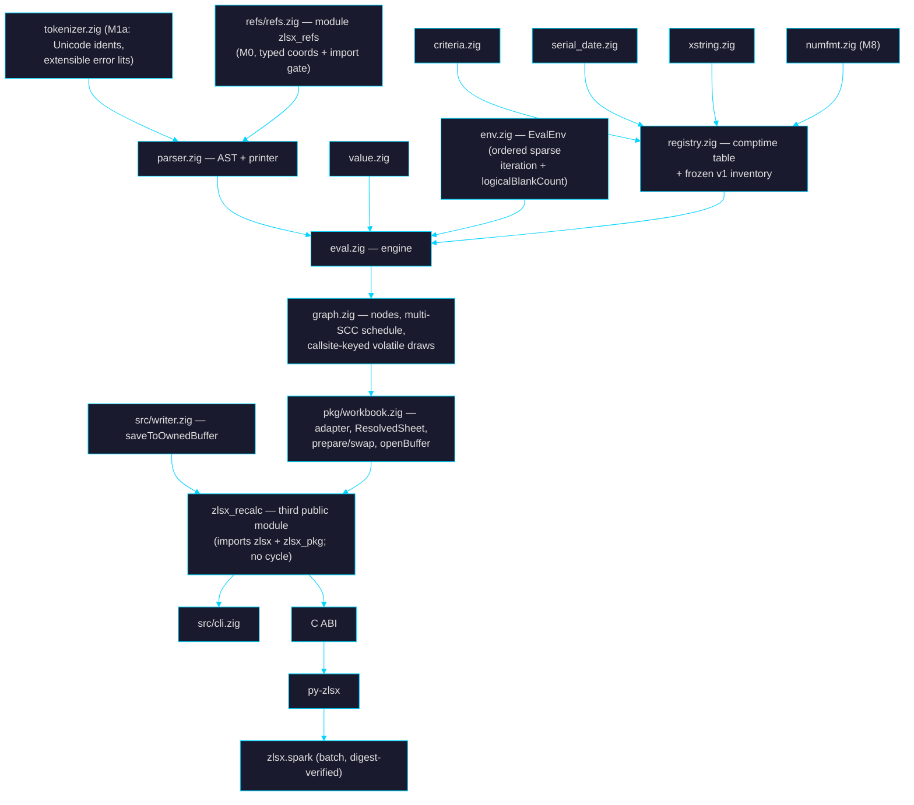

# 🎯 Goal — the zlsx formula interpreter (tier D1)

> Living plan for building, testing, and improving a **formula evaluation engine**
> inside zlsx, under the same constraints as the rest of the project: stdlib-only,
> Zig 0.16.0, TigerStyle-defensive, byte-splice fidelity, refuse-rather-than-half-do,
> measured performance. Companion to `goal.md` / `goal_plan.md`; detail specs in
> `docs/plans/formula-*.md`. **Self-contained: every normative contract appears in
> this document in full — no reference to any prior revision is normative.**

_Created: 2026-08-02 · Revision: **v21** (post Codex rounds 1–20 — 412 findings
dispositioned; see §15) · Status: **PARKED (2026-08-02)** — the SHIP-READY review
loop was stopped by owner directive after round 20; this document is committed as
the design record, not as scheduled work. Round 21 was never run._

---

## Table of contents

1. [What / Why — the D1 reversal](#1-what--why)
2. [Decision log (locked)](#2-decision-log)
3. [Constraints inherited](#3-constraints)
4. [What exists today](#4-what-exists-today)
5. [Architecture](#5-architecture)
6. [Milestone ladder](#6-milestone-ladder)
7. [Function registry](#7-function-registry)
8. [Testing & oracles](#8-testing--oracles)
9. [Performance & limits](#9-performance--limits)
10. [Refusal & error taxonomy](#10-refusal--error-taxonomy)
11. [Interactions with existing arcs](#11-interactions)
12. [API surface per layer](#12-api-surface)
13. [Documentation flips](#13-documentation-flips)
14. [Risks](#14-risks)
15. [Review log](#15-review-log)

---

## 1. What / Why

**What**: (a) workbook recalculation filling every formula cell's cached `<v>`,
including as part of save on the Workbook/Editor path and — via the `zlsx_recalc`
orchestrator module and `Writer.saveToOwnedBuffer` (§5.10) — the fresh-Writer
path; (b) standalone formula evaluation against a workbook context. One engine;
customer layers CLI, C ABI, Python, Spark-batch; Zig `pkg` as the source-visible
internal foundation (no core-source rights in any tier, `LICENSE:5-30`).

**Why now**: (1) `emitCell` drops cached values on rewritten/new formulas
(`pkg/workbook.zig:366,5476` — "Tier D1" named); edits leave non-uniform
staleness. (2) Non-Excel consumers (Spark source, UDF, Genie) read `<v>` —
stale caches are silent data corruption; the commercial argument. (3) #140's
refusal wants a real parser (`goal.md`: "highest-value remaining lift").

**Reversal recorded** at §13's enumerated checklist; the planning flip is
**M-1** and precedes all code.

**Non-goals** (deferred, do not drift): chart/pivot authoring; `.xls`/`.xlsb`;
VBA/add-in/UDF execution; external links; RTD/CUBE; Python-in-Excel; what-if
data tables (refusal); LAMBDA/LET (parse-and-refuse); relative-ref defined
names (refusal); localized function names; locale-sensitive *input* outside
pinned grammars (typed refusal, never a fabricated error value — §5.4b);
streaming-source recalc; namespace-prefixed SpreadsheetML (preflight refusal;
scanners match literal names today — `sheet_xml.zig:421`,
`xlsx_test_corpus.md:58`); **`fullPrecision="0"`
(precision-as-displayed) refuses through all of v1** — support is an M10+
capability after numfmt, not an M8 side effect; **top-level multi-area
reference results** (typed refusal at every public layer in v1 — §5.4c);
OS-timezone resolution (stdlib-only Zig 0.16 has no portable resolver —
**all layers default to UTC** unless an explicit `--utc-offset` is given;
TZif integration is an M10+ milestone). Compatibility Version 2 is **in
scope** (§5.4d) — CV2 is the default for new Current-Channel workbooks since
April 2026, so refusing it would refuse normal files.

---

## 2. Decision log

Locked 2026-08-02 by Laurent (axioms; changing one reopens the plan):

| # | Decision | Consequence |
|---|---|---|
| D-1 | Both recalc-on-save and standalone eval | `recalculate()` (in-memory transaction) + `saveWithRecalc` (file transaction, §5.7.9) + Writer path via orchestrator; eval at every layer |
| D-2 | Registry phased to 300+, Core ~60 first | Core gate = M4e (≈57 cumulative from the frozen inventory committed at M3a) |
| D-3 | Dual fidelity modes | §5.4; `.excel` carries `platform_profile` + `collation_v1` |
| D-4 | Dynamic arrays from the start | Array-first eval from M3a with the normative shape/coercion table (§5.3b); persistence staged behind proof gates; authoring via explicit `FormulaWrite.dialect` |
| D-5 | Iterative calc honoring `calcPr` | CalcState workbook-derived; multi-SCC schedule normative (§5.6c) |
| D-6 | Pinned clock/seed | RunInputs = instant + UTC offset + seed; volatile draw schedule keyed per call site (§5.6d) |
| D-7 | All customer layers in v1 (Spark batch-only) | v1 = **M9d** |
| D-8 | Four ground-truth sources | All adapters at M1b; volatiles excluded from **every external** value oracle (§8.2) |

---

## 3. Constraints

- Zero deps; Zig 0.16.0 — `std.Io` explicit in every file/buffer API
  (`AGENTS.md:250-260`; precedent `Book.openBuffer(allocator, io, bytes)`,
  `src/xlsx.zig:795-811`); TigerStyle; bounds-checked narrowing (`AGENTS.md:107`).
- **Module graph is law** (`build.zig:20-23` forbids
  `writer → zlsx_pkg → workbook → zlsx → writer`): Writer-path recalc composes
  in a **third public module `zlsx_recalc`** (§5.10) exported alongside the two
  existing public modules (`build.zig:143-157,408-438`), with a
  `tests/consumer` dependency test. `src/formula/` never imports `pkg/`
  (`EvalEnv` only; CI grep gate, M0). Fuzz wiring explicit (`build.zig:746`);
  wiring is part of each PR gate.
- Byte-splice fidelity with raw-entry identity assertions (§8.4;
  `store.zig:695`).
- Refuse rather than half-do.
- Performance under existing lanes; single-mode whole-graph bench builds
  (the `build.zig:1030` mixed-mode trap fixed in the bench PR) (§9).
- Five test layers; `checkAllAllocationFailures` incl. reports (prepared
  pre-swap, §5.7.4).
- C ABI: 3-file transaction; `zlsx_status_v1` numeric contract inline
  (§12.3); error channel on every fallible export; **write only
  `min(caller_size, known_size)` — bytes beyond the known prefix are never
  touched** (canary-tail tests); release fn per owned descriptor; field-width
  boundary tests.
- Licensing boundary; lazy-analysis gate.

---

## 4. What exists today

Verified 2026-08-02 on `main` @ `07c99f0`:

| Fact | Evidence | Consequence |
|---|---|---|
| Tokenizer round-trip lossless; `Table1[A1]` mis-tokenized; **identifier predicate ASCII-only; error whitelist closed** | `tokenizer.zig:77,266-274,309-339` | M1a: correction fixtures; **Unicode identifier grammar** (sheet/defined names are not ASCII-only) + **extensible error-literal rule** (unknown `#…!`/`#…?` lexemes tokenize as `.error_lit`, byte-preserved) with astral/combining/unknown-error round-trips |
| Many A1/ref helpers, mixed bases | rewriter; `xlsx.zig:241,2564`; writer; `workbook.zig:381,391,5396`; `sheet_plan.zig`; `sheet_edit.zig:117,1955`; `table_edit.zig:354`; `cli.zig:1065,4392` | M0: rg-derived consolidation + typed `SheetIndex`/`Row1`/`Col0` |
| Shared slaves recognized only self-closing; early slaves dropped | `xlsx.zig:2099` | M4b2: attribute-based classification + sheet-wide topology validation |
| Formula text + identifiers XML-escaped; **`<f>` attributes discarded by the typed parser** | `sheet_xml.zig:489-535`, `workbook_xml.zig:24,58` | M4b1 decode boundary + decoded symbol layer; M4b2 **complete `CT_CellFormula` attribute inventory** (§5.7.2) |
| Scanners literal-match `<sheetData>/<row>/<c>` | `sheet_xml.zig:421` | Namespace preflight refusal (M4b1) |
| Delta model can't carry formula+cache; **`Writer.save` is path-only; its archive inputs are private** | `workbook.zig:353,5410,6206`; `writer.zig:484-512,940` | `ResolvedSheet` (§5.7.3); **`Writer.saveToOwnedBuffer(allocator, io)`** producer API (M5c; allocator-first per `AGENTS.md:194`) — `pkg/fresh_emit.zig:107` alone cannot serve an external orchestrator |
| `PartStore.open` path-only, retains `io`; calcChain rels owner-relative (`Target="calcChain.xml"`), `removeRelationshipsTo` matches absolute | `store.zig:105-144,1510`; corpus `phpoi_test1.xlsx` | `Workbook.openBuffer(allocator, io, bytes)` — borrow ends at return, store copies (Book precedent); rel-target resolution relative to `xl/workbook.xml` (M5b2) |
| `calcPr` partial; `date1904` absent from typed view; CV extension unparsed | `workbook_xml.zig:89,286-318` | M4b2 full calc-state (§5.7.6) |
| `cm`/`vm` = one-based metadata indexes; no parser; **spec-vs-Office collection resolution differs** | MS-OE376 | M4a typed reader; **transition rows name the exact collection (cellMetadata vs valueMetadata), record type, indexing, and missing-record behavior — pinned empirically by byte-diffed Excel references at M7b**, not assumed from the base schema |
| Tables can carry `calculatedColumnFormula`/totals formulas | `table_edit.zig:39` | M4b3 producer inventory + refusal when member cells lack `<f>` |
| Cached text may need C0 controls; emitters reject forbidden XML bytes | `sheet_plan.zig:1153` | ST_Xstring codec (M4f) |
| ABI errors today: `0/-1` + error buffer; `write_row_with_formulas` has no dialect param | `c_abi.zig:1837-1920,1927` | New exports keep errbuf + add diag; **FormulaWrite stays Zig-only at M7c; the versioned C export lands at M9a2** |
| CLI reserves 130/143; flushes completed records on signal | `docs/cli.md:224-227,268`; `cli.zig:1718` | Exit tables include 130/143; **no-output guarantee applies to workbook-file mutation only; eval NDJSON streams may be prefix-valid on cancellation** (§12.2) |

Hazards fixed, not inherited: shared-attr strip; typed-overlay gaps;
`formula-literal-masking.md:42-48` misstatement (M-1 correction + cache policy
table).

---

## 5. Architecture

### 5.1 Module map



**M0 placement (decided 2026-08-03).** The coordinate module roots at
top-level `refs/`, not `src/formula/`, for the same reason as `unicode/`:
a file belongs to exactly one module's package tree, and the consumers
span `zlsx` (`src/`), `zlsx_pkg` (`pkg/`), `zlsx_sheet_plan`, and
`zlsx_workbook_xml_plan`. Under `src/` or `pkg/` the compile fails with
"file exists in modules 'zlsx' and 'zlsx_refs'".

M0 also found more duplication than the ladder row anticipated: **six**
A1 parsers and **seven** column-letter formatters, disagreeing on column
base (0- vs 1-based), case handling, and whether `A01` is a valid row —
including two structs both named `CellRef` with different bases, and one
file (`pkg/sheet_plan.zig`) that disagreed with itself. All are now
adapters over `zlsx_refs`, each preserving its own policy via explicit
options rather than being silently unified; `refs/import_gate.zig` runs
in `zig build test` and fails on any new hand-rolled base-26 codec.

### 5.2 Grammar contract

**Tokens (M1a)**: `.op_spill`, `.op_at`, `.structured_ref` (with `'[ '] '# '@`
escapes), `.external_ref` (refused typed); 3D/full-col structural. **Unicode identifiers (normative grammar)**: start = `XID_Start ∪ {_, \}`,
continue = `XID_Continue ∪ {_, .}` (**backslash start-only**; `a\b`
refuses, fixtured); max 255 code points; invalid UTF-8 →
typed refusal; **classification precedence**: cell reference → R1C1-shape
rejection → TRUE/FALSE → function/name. Fixtures: combining marks, astral
starts, cell-looking names.
**Extensible error literals**: known ten match the whitelist; any other
`#…!`/`#…?` lexeme tokenizes as `.error_lit` with bytes preserved (rich/future
errors round-trip). Round-trip holds for all. Compat gate: previously-
recognized constructs rewrite byte-identically; `Table1[A1]` correction
fixtured.

**M1a decisions (shipped 2026-08-03).** Nine points the row left open or
got wrong, pinned here because M2 builds directly on them:

1. **Refusals are out-of-band, not errors.** The tokenizer never fails
   on malformed input (only OOM) — failing would break the round-trip
   every downstream byte-identity gate rests on. `scan()` returns
   `{tokens, refusals}` with a typed `Refusal.Reason` per construct
   (`invalid_utf8`, `identifier_too_long`, `backslash_after_start`,
   `r1c1_reference`, `external_reference`, `unterminated_*`), each
   annotated with the §10 plane-2 error M2 raises for it. `tokenize()`
   keeps the pre-M1a signature for the rewriter.
2. **`?` dropped from the identifier set** (it was in the pre-M1a
   predicate). Excel does not accept `?` in defined names, and the
   normative grammar is `XID_Continue ∪ {_, .}`. Correction, fixtured.
3. **Extensible-error rule is bounded**: `#` + 1..62 bytes of
   `[A-Za-z0-9_/.]` + `!`/`?`, cap 64 bytes total. Unbounded, a stray
   `#` swallows the rest of the expression looking for a terminator. A
   `#` matching neither the whitelist nor this rule is `.op_spill`.
4. **Bare `RC` is NOT rejected as R1C1** — `RC` is also column 471, so
   `RC:RC` is a live A1 full-column reference and the A1 reading wins
   under the §5.2 precedence. Rejection covers `R<n>C<n>` (≥1 digit)
   plus `R[`/`C[` by lookahead. `RC1` never reaches the rule: it is a
   cell reference.
5. **`.external_ref` also covers the `[1]` workbook-index form**, and
   the *whole chain it qualifies* is untouchable — `[1]Sheet1!A1`
   tokenizes as an ordinary `name bang cell_ref` triple that the
   rewriter would otherwise happily shift. `isOpaqueQualifier` +
   `endOfExternalReference` in `rewriter.zig` are the guard; the compat
   suite is what proves it.
6. **`$1` needs its own scan branch.** Digits cannot start an
   identifier, so the `$` of the absolute full-row form `$1:$1` would
   otherwise strand as a lone lexeme and split a construct the pre-M1a
   tokenizer kept whole.
7. **`a\b` yields two adjacent names, not name-unknown-name.** `\` is
   start-only, so it terminates the first identifier and starts a
   second. The refusal is the signal; the token shape is incidental.
8. **The regen gate normalises through `zig fmt`** before diffing: the
   committed tables are formatted and `zig fmt` column-aligns long
   scalar lists, so a raw diff reports whitespace churn on byte-correct
   data. Running it also proved the committed casefold/NFC tables
   reproduce exactly from their pinned inputs.
9. **`refs/` was missing from `build.zig.zon` `.paths`** (M0 gap — the
   packaged module could not have built); added with
   `THIRD_PARTY_NOTICES.md`.

**Still open (owner action):** `LICENSE` needs the third-party-data
carve-out saying the Unicode-derived tables are licensed separately.
`THIRD_PARTY_NOTICES.md` flags it; the carve-out itself is not a code
change and is not made here.

**Parser (M2)**: AST + canonical printer (parse→print→parse structural
equality). Precedence (oracle-pinned rows): `:` > ` ` > `,`(ref) >
unary`±`(right; `=-1^2=1`) > `%` (interaction fixtures) > `^` (left; `2^3^2=64`)
> `*` `/` > `+` `-` > `&` > comparisons.

**Full-row references**: `1:1` / `1:5` join full-column refs as
structurally-recognized, evaluable constructs (bounds `[1, 1 048 576]`,
sparse `RangeSet` membership, graph range-node edges; fixtures `SUM(1:1)`,
`COUNTBLANK(2:3)`); structural *rewriting* of full-row/col refs remains the
rewriter's documented out-of-scope (`rewriter.zig:22`) and an M10+ item —
evaluation and rewriting are independent capabilities.

**Array constants**: `{…}`, `,` columns / `;` rows (re-disambiguated inside
braces), elements = signed numeric literals, strings, TRUE/FALSE, error
literals; rectangularity required (ragged → typed parse refusal); no
refs/calls/nesting. **Leading `=`**: stored text is body-only; standalone APIs
strip exactly one optional `=` after whitespace; `==` → parse refusal.
**Structured refs**: full item-specifier grammar (`#All #Data #Headers
#Totals #This Row`, `@`, column ranges, combined forms, escapes). **Prefixes**:
layered `_xlfn.` / `_xlfn._xlws.` / `_xlfn.SINGLE`→`@`; `_xlpm.` refused;
original spelling preserved.

**M2 decisions (shipped 2026-08-03).** Fifteen points the row left open
or got wrong, pinned here because M3a builds directly on them:

1. **Number literals are not converted.** The AST keeps the source
   spelling and defers `parseDecimal` to M3a1. Converting here would
   force a rounding policy before §5.4 pins one, and the canonical
   printer would then have to *re-render* every literal — turning a
   round-trip property into a formatting bet.
2. **The canonical printer is canonical, not byte-preserving.** Byte
   fidelity stays the tokenizer's contract (`format(tokenize(x)) == x`);
   the parser drops insignificant whitespace and normalises booleans to
   `TRUE`/`FALSE`. Everything a canonical form cannot re-derive rides in
   the AST verbatim: number spellings, string bodies, error spellings,
   sheet-name quoting and its `''` escapes, structured-ref column names,
   and the `_xlfn.` layers. Parenthesised groups keep an explicit node —
   dropping redundant parens would change the structure the round-trip
   is asserting.
3. **A call requires `(` adjacent to the name.** M1a's classification
   precedence is normative, so `SUM (A1)` keeps the kinds M1a assigned
   it and parses as an *intersection*, not a call. Excel would read it
   as a call; the divergence is unreachable through the workbook path
   because stored `<f>` never spaces a call. Fixtured, and preferred
   over shipping two classifiers that disagree.
4. **`A1 -1` is subtraction, not an intersection.** `+` and `-` are
   excluded from the primary-starter set that turns whitespace into the
   intersection operator. Without the exclusion every `A1 -1` in the
   corpus silently becomes an intersection with a negative literal.
5. **`_xlfn.SINGLE(x)` and `@x` unify into one node.** Same operator,
   two spellings: the node carries a `form` discriminator and the
   original callee text, so downstream sees one shape and the printer
   still hands back what was written. Unification requires exactly one
   argument; anything else stays an ordinary call for the registry to
   reject on arity.
6. **`;` outside braces is `FormulaLocaleSensitiveInput`, not a syntax
   error.** Inside braces it is the array row separator. The tokenizer
   emits `.arg_sep` for both bytes, so the parser re-disambiguates on
   the byte — the one place a token kind alone is not enough.
7. **Full-span references are matched on the tokens, before any node
   exists.** `A:A` and `1:1` are recognised speculatively, which keeps
   the flat node array free of orphaned operands and makes
   `max_ast_nodes` count only live nodes. Out-of-grid spans (`XFE:XFE`,
   `1:1048577`) are deliberately **not** full spans: they stay generic
   ranges over names and reach §5.9, which is where `#NAME?` is
   provable.
8. **Structured-ref item specifiers are a set.** The canonical form
   orders them `#All #Data #Headers #Totals #This Row` regardless of how
   they were written, so two spellings of one selection compare equal.
   `@` sets `this_row` and records `at_shorthand` purely as a print
   form. A bare part starting with an unescaped `#` **must** be a known
   item specifier — `Table1[#Nope]` is malformed, not a column named
   `#Nope` (that is `Table1['#Nope]`).
9. **Column names are kept raw, with their `'` escapes intact**, so
   printing needs no allocation and no re-escaping; `decodeColumnName`
   resolves them for the M4b1 symbol layer. The bracketing rule is
   stricter than the grammar needs — only `,` and `:` are genuinely
   ambiguous, but the canonical form brackets anything outside
   letters/digits/`_`/`.`/non-ASCII, because Excel writes
   `Table1[@[Col A]]` and a canonical `Table1[@Col A]` would be a
   spelling no other reader emits.
10. **Refusals are a union, not an error set.** A refusal without a span
    is not actionable and a Zig error carries no payload, so `parse`
    returns `Parsed{ok|refused}` and reserves `error.OutOfMemory` for
    the only real error. Tokenizer refusals are checked **before**
    parsing and the first in detection order wins, so the diagnostic
    names the construct rather than whatever syntax error it went on to
    cause.
11. **Three of the seven §9 parse limits are dominated at defaults.** A
    code point is at most four UTF-8 bytes and
    `max_formula_utf8_bytes = 4 × max_formula_chars`, so the byte cap
    can be *reached* but never exceeded first; every token spans at
    least one code point and `max_tokens > max_formula_chars`; nodes are
    bounded by tokens. All three stay enforced and boundary-tested at
    lowered ceilings, because `Limits` is caller-adjustable.
12. **"No lost bytes" is an invariant, not a test.** `parse` accumulates
    every consumed token's length — speculative matches rewind it with
    the cursor — and asserts the total equals the input length on
    success; `trailing_input` is what makes reaching the end mandatory.
    Since M1a proved the tokens tile the input exactly, that total is a
    proof no byte was skipped. The fuzz target adds the structural half:
    spans nest inside their parent, and siblings are ordered and
    disjoint.
13. **Oracle pinning is by fidelity.** `ieee` manifests are compared
    bit-exactly; `excel` manifests to 15 significant digits, which is
    §5.4's own display rule — an excel-fidelity manifest records
    `0.1+0.2` as `0.3`, so demanding exact bits there would test zlsx
    against a rounding policy M3a1 has not landed. The tolerance cannot
    blur a precedence question: the discriminating cases differ by a
    factor of 8 (`2^3^2` = 64 vs 512) and by sign (`-1^2` = 1 vs −1).
14. **`&` and the reference-operator ranks are spec-pinned, not
    oracle-pinned.** No committed manifest mixes `&` with `+` or with a
    comparison, and none exercises `,` or the intersection space. They
    ship as fixtures **labelled as such** rather than claimed as
    oracle-derived; closing that gap needs new oracle cases, not a new
    parser.
15. **§5.9 ships as a spec artifact plus classification, not
    resolution.** There is no workbook at M2. The parser records
    call-vs-value use, the peeled prefix layers, the original spelling,
    and the `_xlnm.` flag; both resolution orders are exported as
    checked arrays that M4b3 consumes.

**Deferred to M10+:** call classification when whitespace separates the
name from `(` (decision 3) — it needs a lexer-level rule the rewriter
shares, not a parser-local override.

### 5.3 Value model & array semantics

**5.3a Types**: `ScalarValue` = number(f64, finite) | text | boolean |
err(known|rich) | blank — the only Matrix element, **internal to the evaluator**; the public boundary uses `PublishedScalar`/`PublishedMatrix` (no blank variant) with **one mandatory blank→0 conversion** shared by Zig, CLI, C, and Python.
`Value` adds missing_arg / array(*Matrix, non-recursive) / reference(RangeSet)
at evaluator layer. Blank ≠ missing_arg ≠ `""`. Rich errors preserved,
never produced. **Per-form evaluation contracts** (each fixture-pinned with
volatile-draw, error, and dependency-capture tests in every branch position):
`IF` and `CHOOSE` are **lazy for scalar selectors** (taken branch only;
zero runtime draws in dead branches); **array selectors switch to
per-element masking** (both branches evaluate broadcast to the mask shape;
per-element errors stay per-element). **Static vs runtime split
(normative)**: the dependency GRAPH always carries static syntactic edges
for every arm; laziness governs only runtime evaluation and volatile draws.
Mixed-mask IF/IFERROR/IFNA fixtures at M4c; **CHOOSE fixtures at M4e**; `IFERROR`/`IFNA` evaluate the value arg, then the fallback only on
error; **`IFS` and `SWITCH` are EAGER** — Excel evaluates all arms
(observable via volatiles and dependencies), so zlsx does too; `AND`/`OR`
eager.
**Empty matrices are unrepresentable results**: any zero-row/zero-column
array normalizes to `#CALC!` at the producing function's boundary (Excel's
own answer; both modes — never persisted, never streamed). Criteria module
(M3b). Per-run arena.

**5.3b Shape & coercion table (normative, lands with M3a; dialect-indexed)**:

| Context | DA dialect | Legacy dialects |
|---|---|---|
| Scalar where array expected | lift to 1×1 | same |
| Binary op, shapes (r₁×c₁)·(r₂×c₂) | broadcast dims of size 1; result (max r × max c); incompatible (both >1 and unequal) → elementwise `#N/A` fill per Excel (fixture-pinned) | same evaluation, but result consumed per intersection rules |
| **Reference** where scalar expected | no implicit intersection (the reference spills/iterates per function DA-awareness) | **implicit intersection**: same-row → row-projected element; same-column → column-projected; else `#VALUE!` (fixture-pinned) |
| **Array** (non-reference) where scalar expected | spills/iterates per DA-awareness | **top-left reduction** — arrays reduce to their top-left element, NOT row/col intersection (Excel distinguishes references from arrays; fixture-pinned) |
| Reference in value context | dereference (single rect → matrix/scalar) | same + implicit intersection rules |
| `@expr`, expr is a **single-cell reference** | **the reference unchanged** (`=@A1` yields A1's value regardless of the evaluation row/col — Excel's single-item exception precedes intersection) | same |
| `@expr`, expr is a **multi-cell reference** | row/column intersection with the evaluation site: 1-D vector → element on the shared axis; **2-D range → the cell at the intersection of the evaluation row AND column iff the range spans both**; no intersection → `#VALUE!` | identical, explicit spelling |
| `@expr`, expr is an **array** | **top-left element** (`@SEQUENCE(3)` → 1) | same |

Oracle tests per row: operators, scalar-arg functions, array-arg functions,
spill references, legacy formulas, `@SEQUENCE(…)`, `@{1,2;3,4}`,
off-axis `=@A1`, 2-D `@` ranges (spanning and non-spanning),
horizontal/vertical ranges, out-of-range intersections.

**Standalone-eval dialect (normative)**: dialect is a stored-cell property
(`EvalEnv.dialectOf`), so standalone evaluation — which has no stored cell —
takes an explicit `dialect` at **every layer that has standalone eval**
(Zig: `RunInputs.dialect`, default `.dynamic_array`; CLI `--dialect
da|legacy`; C run-inputs field; Python kwarg), echoed in every
resolved-context record and in every cache/fingerprint key. **Spark has no
standalone-eval operation in v1**, so it exposes no dialect option — its
recalc derives dialect from workbook provenance like any stored-cell recalc.
Identical text can legitimately evaluate differently under `legacy`, which
is why the choice is the caller's, never inferred.

**Scalar coercion matrix (normative, M3a)** — provenance × context ×
fidelity. Provenances: numeric/text/bool literal, blank cell, text cell,
bool cell, error. Contexts: arithmetic op, comparison, `&`, function arg by
coercion class. The matrix (every cell = a fixture):

| Provenance ↓ / Context → | arithmetic | comparison | `&` concat | direct fn arg (numeric class) | via range (aggregate class) | lookup key | criteria operand | SORT element |
|---|---|---|---|---|---|---|---|---|
| blank cell | 0 | cross-type rules (pinned) | `""` | 0 | **skipped** | matches blank | blank rules | sorts first (pinned) |
| `""` text | `#VALUE!` | text compare | `""` | `#VALUE!` | skipped | text match | `""` criterion | text order |
| numeric text (invariant grammar) | coerced | **cross-type: number < text < logical; never cross-equal** (pinned) | as text | coerced | **NOT coerced** (Excel ignores text in ranges) | exact-text unless numeric-key (pinned) | coerced | text order |
| locale-flavored text | refusal | text compare | as text | refusal | ignored | text | refusal | text order |
| non-numeric text | `#VALUE!` | text compare | as text | `#VALUE!` | ignored | text | text | text order |
| boolean | 1/0 | logical > text > number (pinned) | `"TRUE"`/`"FALSE"` | 1/0 | **ignored via ranges, counted as direct args** (Excel split, pinned per aggregate) | logical match | logical rules | logical order |
| error | propagates | propagates | propagates | propagates | propagates (unless skip-class) | propagates | propagates | pinned position |

Rules: text in arithmetic parses **through the pinned
invariant grammar only** (plain decimal/scientific forms; `"1"+1=2`); text
that parses only under some locale (e.g. `"1,5"`) →
`FormulaLocaleSensitiveInput` refusal, never a guessed number and never a
guessed `#VALUE!`; non-numeric text in arithmetic → `#VALUE!` (that IS
Excel's locale-independent answer for e.g. `"abc"+1`). Every cell of the
matrix is a fixture. **Ordinary comparisons (`=`, `<>`, `<`, `<=`, `>`,
`>=`) are case-INsensitive on text** (Excel semantics; `EXACT` is the
case-sensitive function): equality and ordering use case-folded comparison
via the full non-Turkic fold (`src/unicode/casefold.zig` — the single
normative algorithm of `collation_v1`, §5.4b) — `A/a` equal, `ß/ss/SS`
fold-equal (fixtured), no Unicode normalization applied (code points as
stored); divergences from Excel's locale collation recorded per `collation_v1`.

**5.3c Error propagation order (normative)**: operator operands evaluate
left-to-right; the first error encountered is the result. Eager function
arguments evaluate in declaration order; first error wins unless the
registry's propagation class says otherwise (**provenance-aware per
function, never family-wide**: `COUNT` counts numbers only — errors in
ranges neither counted nor propagated, direct scalar args coerce;
**`COUNTA` counts error-valued cells and `""`**; `COUNTBLANK` per its blank
class; `COUNTIF(S)` criteria can match errors — direct/reference/error/
bool/text/`""`/blank fixtures each;
`observe` — ISERROR/IFERROR/IFNA; `per_element` — elementwise array ops keep
errors per cell). Errors inside ranges surface in the deterministic iteration
order of §5.6a (first stored error in area/sheet/row-major order wins for
propagating aggregates). Mixed-error fixtures: IF, AND/OR, SUM over
error-bearing ranges, VLOOKUP, array ops.

**M3a1 decisions (shipped 2026-08-03).** Sixteen points the row left
open or got wrong, pinned here because M3a2 builds directly on them:

1. **Two number constructors, not one.** `ScalarValue.fromNumber`
   asserts finiteness — an evaluator handing over a number it computed
   knows it is finite, and a non-finite one is a bug in the caller.
   `fromArithmetic` converts instead, because N4a's whole point is that
   an overflow *is* a legitimate outcome (`#NUM!`). One constructor
   doing both would either assert on a real overflow or let a
   non-finite value into a `ScalarValue`, and both are worse than
   having two names.
2. **`provenanceOf` returns null for an actual number.** The §5.3b
   matrix has seven rows and none of them is "already a number".
   Returning a row anyway would invite a caller to look up a
   disposition the normative table never stated.
3. **The locale classifier's bias runs one way, deliberately.** A false
   positive turns a case Excel answers with `#VALUE!` — a *successful*
   plane-1 result — into a plane-2 refusal that stops a whole
   recalculation; a false negative only costs a less informative error.
   So `LocaleSensitive` requires a specific shape: a single decimal
   comma, digit groups of exactly three under one consistent separator,
   or currency/percent affixes around an otherwise-invariant number.
   `1.2.3`, `1,23,456`, and `1 23` are not numbers under any locale and
   get `#VALUE!`. Both sides are fixtured.
4. **N1a applies to every ingress except `.cache_import`.** §5.4 pins
   `literal` → N1a and `cache_import` → N1b but leaves
   `text_coercion` / `function_arg` / `criteria` unstated. They round
   like literals — Excel's `="1.2345678901234567"+0` yields the
   15-digit value — and the cached `<v>` is the one input that is
   *already* binary64, where re-rounding would corrupt a value nobody
   asked us to reinterpret. Fixtured across all five ingresses in both
   modes.
5. **Space trimming is a property of the ingress, not of the text.**
   `.literal` and `.cache_import` are stored forms and take their bytes
   exactly; the three coercion ingresses trim ASCII spaces because that
   is what Excel does with user text. `" 1 "` therefore parses on one
   path and not the other — from one parser, which is the point of
   there being only one.
6. **N2's threshold is spec-pinned and provisional.** No committed
   manifest contains a zero-snap case and the Excel oracle leg is
   parked (M1b), so nothing on disk decides it. `2^-48` relative
   (`zero_snap_relative_shift_v1`) snaps the textbook cases —
   `1.1-1.0-0.1` and `0.1+0.2-0.3` — and is a **named constant** so
   pinning it later is a one-line change with a fixture behind it.
   Additive scope is enforced by construction rather than by comment:
   `multiply` and `divide` never call the snap at all.
7. **N5 has to choose between two renderings, and the choice is not
   cosmetic.** Zig's `{d}` and `{e}` share the shortest-round-trip
   digit generation and differ only in layout, so the shortest
   round-tripping text is simply the shorter of the two. Positionally,
   `5e-324` is **326 bytes** — a caller sizing a buffer for "a number"
   would be wrong by an order of magnitude. `formatNumber` therefore
   generates the positional form into private scratch and copies it out
   only when it wins; `format_buf_len` is 32 and is a real bound.
8. **`-0` is where the committed excel-fidelity evidence and §5.4
   disagree — and it is the adapter, not the rule.** §5.4 says `.excel`
   normalizes `-0` → `+0` at publication "(fixture-backed)". The only
   committed excel-fidelity manifest is **LibreOffice**, which records
   `-0` with bits `0x8000000000000000`. LibreOffice is not Excel and
   the Excel leg is parked, so nothing on disk can settle it. §5.4's
   rule is implemented as written; the row is listed in
   `excel_adapter_divergences` and skipped from the excel-leg oracle
   tie **by name**, with the skip count asserted — not silently
   dropped.
9. **Excel-fidelity manifests pin to 15 significant digits, not to
   bits.** LibreOffice records `0.1+0.2` as `0.3` (bits
   `0x3FD3333333333333`): its `<v>` carries the display-rounded value.
   That is a serialization property of the adapter, **not** evidence
   that excel-fidelity arithmetic rounds — §5.4 says publication is
   post-N2/N3 binary64 and says nothing about rounding results. So the
   tie compares excel manifests at 15 significant digits and `ieee`
   manifests bit-exactly. M2 reached the same rule independently for
   its precedence pins.
10. **Subnormals are oracle-decided; most of §5.4 is not.** Both
    manifests record `2^-1074` as `0x1` and `1E-308/10000000000` as
    `0x316A2`, across fidelities. Exactly **three** of the nine
    divergence points are oracle-backed — subnormals, overflow, and
    division by zero — *(M3a2 makes it four: see M3a2 decision 1)* —
    and each point carries an `evidence` field
    saying `oracle` or `spec_pinned` rather than implying support it
    does not have. A test asserts the count.
11. **The Divergence ×2 gate asserts agreement as well as
    disagreement.** A gate that only looked for differences would pass
    if the modes diverged *everywhere*, which is exactly as wrong as
    not diverging at all. Every point carries `must_differ` or
    `must_agree`, both halves are asserted to have fired, and the probe
    array is length-checked against the point array so a rule cannot be
    added without a probe.
12. **`collation_v1` takes the fold as a parameter, and the concrete
    fold is imported only by the test section.**
    `src/unicode/casefold.zig` already belongs to the `zlsx` module's
    package tree (`src/xlsx.zig:25` imports it relatively), so a named
    module rooted on the same file collides the moment `zlsx` imports
    the formula engine — the failure M0 hit with `refs/` and M1a with
    `unicode/xid.zig`. **Verified on 0.16.0**: a file-scope `const`
    referenced only from a `test` block is not resolved in a non-test
    build, so M3a2+ consumers compile `value.zig` without declaring the
    import and the collision never arises. Injection keeps the
    semantics independent of the build graph regardless.
13. **Fold-equal implies equal for *ordering*, not just equality**, and
    comparing folded sequences gives that for free: `A`/`a` and
    `ß`/`ss`/`SS` come back `.eq` under `<` and `>`. A raw tie-break
    would break it, which is why SORT/SORTBY's tie-break lives outside
    the comparator under its own name (`sort_tiebreak_policy`).
14. **Byte order over folded UTF-8 *is* code-point order**, so the
    comparator needs no decoding pass. A property of the encoding,
    recorded so nobody later "fixes" it into a slower loop.
15. **`collation_v1` deliberately does not normalize, unlike sheet-name
    dedup.** `casefold.excelSheetNameEql` applies NFC because
    composed/decomposed sheet names should dedup; §5.3b says text
    comparison uses code points as stored. Both behaviours are fixtured
    side by side — `café` precomposed vs decomposed is *equal* as a
    sheet name and *unequal* as text — so the difference reads as
    intentional rather than as a missing call.
16. **The shape and coercion tables ship as executable lookups.** Eight
    shape rows × two dialects and the 7×8 = 56 coercion cells are
    `switch` tables, with a fixture asserting every cell and a coverage
    check proving that neither the table nor the fixture can lose a row
    without the other noticing.

**Still open (needs the parked Excel oracle leg):** N2's zero-snap
*threshold* (decision 6) and the `.excel` signed-zero policy
(decision 8). M3a2 turned the snap's **existence** into oracle-backed
evidence (M3a2 decision 1), but the threshold is now only bounded
below — `> ~1.85e-16` relative — and nothing on disk bounds it above;
the signed-zero policy is unchanged and still `spec_pinned`. Neither
can be confirmed until the M1b Excel adapter runs.

**Deferred to M4f:** moving `src/unicode/casefold.zig` to top-level
`unicode/` (decision 12). M4f ships `casing_v1` from the same directory
and is the milestone that may touch it.

**M3a2 decisions (shipped 2026-08-03).** Seventeen points the row left
open, got wrong, or discovered — pinned here because M3b, M4b1, and
every F-batch build directly on them:

1. **The oracle decides a rule §5.4 never stated, and it upgrades N2
   from text to evidence.** `(0.1+0.2)=0.3` is recorded **TRUE** by the
   LibreOffice excel-fidelity manifest and **FALSE** by the hand-spec
   `ieee` one. A comparison is a subtraction against zero, which puts it
   inside N2's *additive* scope — and that reading is the only one under
   which both committed manifests are satisfied at once. Numeric
   comparison therefore routes through `applyZeroSnap`, the N2
   divergence point's `evidence` flips to `oracle` (three → four), and
   M3a1's "no committed manifest contains a zero-snap case" is
   superseded. This is the **one change M3a2 makes to `value.zig`**: one
   enum literal and the count assertion that guards it. Leaving the
   label at `spec_pinned` would have understated evidence that is now on
   disk, which is the failure mode the `evidence` field exists to
   prevent.
2. **`TRUE` and `FALSE` were missing from the frozen v1 list.** The
   ladder's M4c row enumerates 18 names; the committed manifests contain
   `TRUE()+1`, which M1a already tokenizes as a *call* (`.name`,
   `paren_open`, `paren_close`) and not as a boolean literal. A row the
   oracle can decide and the registry cannot answer is a gap, so both
   names join F1a-1: M4c goes 18 → 20 and the Core gate 57 → 59. The
   inventory file is the count source, so the ladder row was corrected
   to match it rather than the reverse.
3. **The frozen inventory is a committed TSV, not a Zig array.**
   `src/formula/function_inventory_v1.tsv` — 175 rows of
   `name<TAB>milestone<TAB>batch`, sorted, unique, tagged. Data because
   §7 makes it the authoritative count source for *every later PR*:
   regenerating a number from a file a shell can read is a different
   activity from re-reading a table someone has to compile. Three tests
   guard it — the total, per-milestone counts against the ladder, and
   strict ascending order (uniqueness and sort in one assertion).
4. **A formula's result is a value, so a top-level reference
   dereferences through the same §5.3b row as an operand.** `=A1:A3`
   spills under `dynamic_array` and intersects under `legacy` because
   `reference_in_value` says so, not because the top level is special.
   The one thing the top level *does* add is §10's multi-area refusal,
   checked before the dereference so `(A1:A2,C1:C2)` refuses while
   `SUM((A1:A2,C1:C2))` still works.
5. **Runtime dependency capture happens where a reference is
   CONSTRUCTED, not where it is read.** `IFS` is eager, so its untaken
   arms evaluate to references it never dereferences — and capturing at
   the point of read would report them as unread, which is exactly
   backwards. §5.3a's split is between *evaluated* and *not evaluated*;
   capture is placed to measure that.
6. **The volatile-draw counter lives in the seam.** `DrawSource.draw`
   increments before it calls out, so "zero draws in the dead branch" is
   a property of the evaluator rather than of how carefully a fixture
   was wired. M3b replaces the callback with `rng_v1`; the counter and
   its meaning do not move.
7. **Eagerness is asserted positively.** `IFS(FALSE,RAND(),TRUE,RAND())`
   draws **2** and `AND(FALSE,RAND()>2)` draws **1** — fixtures that
   fail if anyone "optimizes" a short-circuit in. A test that only
   checked results would pass either way.
8. **Coercion classes are behaviour, not documentation.** The dispatcher
   applies each slot's class before the implementation runs, so `SQRT`
   receives a number or an error and never re-derives a coercion. This
   is what keeps `SQRT(-1)` a statement about the radicand — `#NUM!` —
   with no possibility of it being a missing coercion in disguise.
9. **Whether an array lifts is the dialect's decision, not the
   function's.** `SQRT({4,9})` is `2` under `legacy` (the table's
   `top_left_reduction`, which is a reduction and explicitly *not* an
   intersection) and `{2,3}` under `dynamic_array`. A mixed signature —
   a range slot beside a scalar one — refuses as `NotYetImplemented`
   rather than guessing ahead of M7a's decision table.
10. **`SQRT(-1)` is a second excel-adapter divergence, and the two
    excel-fidelity manifests disagree with EACH OTHER about it.** The
    hand-spec suite records `#NUM!` (Excel's answer); LibreOffice
    records `#VALUE!`. That disagreement is itself the proof that the
    row is about the adapter and not about the rule, so it joins `-0` in
    a named `excel_adapter_divergences` list with the skip count
    asserted — never silently dropped.
11. **Wrong arity is `FormulaMalformedInput`, not `#VALUE!`.** Excel
    cannot store a formula whose argument count its own registry
    rejects, so such input did not come from a workbook. An unregistered
    *call* is `FormulaUnsupportedFunction` (§7) and an unresolvable
    *name* in value position is a plane-1 `#NAME?` (§5.9) — three
    different answers to three different questions.
12. **Not-yet-implemented is its own named refusal with an enumerated
    membership.** `NotYetImplemented` maps to
    `FormulaUnsupportedConstruct` but is listed separately in
    `not_yet_implemented`, currently one entry: 3D sheet spans (M4b3).
    A later row deletes a line and watches a test fail until it does —
    which conflating the two would have made impossible.
13. **The five required registry fields carry no defaults, and a test
    reads `@typeInfo` to prove it.** An omitted propagation class is how
    `COUNTA` quietly becomes `COUNT`. Three comptime checks back it up:
    the two parallel per-slot tables must agree on slot count, a
    `.plain` form must have an impl and no lazy slot, and a deferring
    form must have a lazy slot and no impl.
14. **The empty matrix normalizes at the call boundary and nowhere
    else**, and is tested by invoking a test-local `Function` whose impl
    returns `error.EmptyMatrix` — rather than by adding a fake entry to
    the shipped table. The first v1 function that can produce one is
    `FILTER` at M7a; the boundary is ready before it.
15. **The fake implements the merge, not a stub of it.** Entries sort by
    `(row, col, layer descending)` on insert, so ordered iteration is
    independent of insertion order *by construction* — there is no code
    path that could return backing order because there is no backing
    order — and a merged read is a lower bound rather than a scan. Both
    iterators carry their state inline behind a compile-time size bound,
    so iteration allocates nothing.
16. **Zig runs an imported file's tests only once something in it is
    referenced.** `eval.zig`'s test artifact reported *0 tests* while
    the file had no test of its own, silently taking `registry.zig`'s
    eleven with it. `test { _ = registry; _ = env; }` is not decoration.
17. **Operator chains are folded iteratively, and the evaluator's depth
    limit is its own field.** Every value operator is left-associative,
    so `1+1+1+…` parses as a tree as deep as it is long — and a
    5 000-term sum, comfortably inside Excel's 8 192-character limit,
    overflowed the stack when the walk recursed into it (caught by a
    fixture, not by a review). `Evaluator.binary` now descends the left
    spine on the heap and folds it back, which preserves §5.3c's
    left-to-right operand order exactly while leaving recursion bounded
    by *parenthesis* nesting — something §9 already bounds at 256. The
    residual `max_expr_depth` is a separate `Options` field. **Three
    depths exist and none substitutes for another**:
    `Limits.max_parse_depth` (256, recursing grammar productions),
    §9's `max_eval_depth` (512, dependency-closure recursion — M5a's
    graph, not an expression), and `max_expr_depth` (AST nodes on the
    stack). Reusing the parser's 256 would have refused a 300-term sum
    that parsed perfectly well; reusing §9's name would have collided
    two unrelated quantities. §9 gains a row for the new one.

**Spec-pinned at M3a2 (no committed manifest decides them):** `IF`'s
omitted third argument is `FALSE`; `CHOOSE` truncates its index toward
zero and is `#VALUE!` outside `1..n`; `IFS`/`SWITCH` with no match are
`#N/A`; `AND`/`OR` over no logical value at all is `#VALUE!`; a
disjoint `intersect` is `#NULL!`; a multi-area reference in a *value*
context is `#VALUE!`; `A1#` against a non-anchor is `#REF!`; a
reference to an unknown sheet is `#REF!`.

### 5.4 Numeric & text fidelity

**`excel_fp_rules_v1`** (fixture-pinned, oracle build recorded): N1a 15-digit
literal ingress (`.excel`) / N1b full-binary64 `<v>` import / N2 zero-snap (**additive scope only**: applies to `+`/`-` results near zero — never multiplication, division, or function results; counterexample fixtures for each) /
N3 subnormal & `-0` / N4 per-function quirks / **N4a finiteness** (overflow →
`#NUM!`, `0/0` → `#DIV/0!`; asserted at returns + pre-serialization) / N5
shortest-round-trip (+`fitsExactlyInF64`). Publication = post-N2/N3 binary64.
**One decimal-ingress primitive**: `parseDecimal(fidelity, ingress)` where
`ingress ∈ {literal (N1a), cache_import (N1b), text_coercion, function_arg,
criteria}` — the ONLY decimal-text→f64 path. **Caller→ingress table
(normative)**: formula literals → `literal`; **present numeric `<v>` values only** → `cache_import` (SST indices parse as bounded integers, and numeric-looking SST *content* stays text until §5.3b coercion — there is no SST-number ingress path); §5.3b arithmetic coercion → `text_coercion`;
`VALUE`/`NUMBERVALUE`/`DATEVALUE`/`TIMEVALUE` components → `function_arg`;
criteria operands → `criteria`. Paired fixtures push identical decimal text
through every path in both fidelity modes; a second parser diverging is
structurally impossible.

**`ieee_fp_rules_v1` (normative — the `.ieee` mode is a contract, not an
absence)**: literals convert binary64-nearest (full text, no truncation);
every operation is IEEE-754 binary64 round-to-nearest-even; **no zero-snap**;
**signed zero preserved bitwise**; **subnormals preserved**; N4 per-function
quirks still apply (they are correctness, e.g. `MOD` sign); N4a finiteness
still applies (overflow → `#NUM!` — Excel's value domain is shared by both
modes); N5 serialization identical. **Signed-zero comparison policy**:
`.excel` normalizes `-0` → `+0` at cell publication (fixture-backed);
`.ieee` preserves it; §8.3's bit-exact comparisons apply the mode's policy
consistently for scalars, arrays, cached values, and goldens. M3a's
"Divergence ×2" gate runs every divergence-point fixture under both rule
tables.

**5.4a Serial dates**: 0–60 domain (60 = fictitious 1900-02-29; 0 =
1900-01-00), 1904 clean; boundaries pinned; reader contract untouched.

**5.4b Locale, collation, platform**: locale-sensitive **parses**
(VALUE/DATEVALUE/TIMEVALUE/TEXT/NUMBERVALUE) carry pinned invariant grammars;
outside-grammar input → `FormulaLocaleSensitiveInput` refusal (never a
fabricated `#VALUE!`). **Locale-sensitive OUTPUT is pinned invariant in v1**
— there is deliberately no locale field in `RunInputs`: `TEXT`/`FIXED`/
`DOLLAR` render invariant en-US forms and `NUMBERVALUE`'s omitted separators
default to `.`/`,` — each a recorded, fixtured divergence from Excel's
locale behavior; a locale profile is an M10+ addition that would join every
fingerprint/cache key when it lands. **`collation_v1`** — ONE comparator, stated once: **lexicographic order of
full-non-Turkic-folded code-point sequences** (`src/unicode/casefold.zig`;
`ß` folds to `ss`) governs ordinary `=` `<>` `<` `<=` `>` `>=`, SEARCH,
wildcards, lookup equality AND ordering, criteria, and SORT/SORTBY.
**Positional matching over expanding folds**: the fold keeps a
folded-unit→original-unit map; `?` consumes **one code point — version-INdependent** (CV changes exactly
five functions' index units: LEN/MID/FIND/SEARCH/REPLACE — wildcards,
criteria, COUNTIF/MATCH/XMATCH are NOT CV-dependent; oracle-pinned);
`*`/`~` operate on original units; SEARCH returns positions in its
CV-dependent unit — fixtures: `ß` expansion, ligatures, combining marks,
astral. Comparator exceptions —
**MIN/MAX are NOT in this list** (they never compare text: direct text args
coerce-or-`#VALUE!`, text in ranges ignored, no numbers → 0 — §5.3b row,
fixtures); **one total preorder** governs ALL text ordering and caseless equality:
compare **full-folded code-point sequences, nothing else** — fold-equal
strings (`A`/`a`, `ß`/`ss`/`SS`) are EQUAL for `=`, `<>`, `<`, `>`, lookups,
and sorting semantics alike (a raw tie-break would make them unequal and is
therefore *not* part of the semantic order; the shipped fold primitive
defines equality this way, `src/unicode/casefold.zig:47-64`). SORT/SORTBY
use **stable source position** as a private, non-semantic tie-break among
fold-equal elements. Registry-level **match policies**: `.folded` (default — `=`, SEARCH, wildcard consumers), `.raw` (**FIND and SUBSTITUTE are case-sensitive**, like EXACT; CODE/UNICODE raw), `.arg_selected` (TEXTBEFORE/TEXTAFTER/TEXTSPLIT via `match_mode`). Every text function's policy is explicit registry data. Each divergence from Excel's
locale collation recorded; `ß`/`SS`/`ST` ordering fixtures included. Registry metadata flags every collation-touching
function. **`casing_v1` (module + SpecialCasing generator IN M4f with LOWER/UPPER; M8b adds only PROPER's word segmentation)**: versioned, locale-neutral **full Unicode casing** (**UnicodeData simple mappings + unconditional SpecialCasing + the locale-independent Final_Sigma rule; locale-conditional (tr/az/lt) rejected** — the generator stops before UnicodeData casing fields, `gen_unicode_tables.py:138-172`; SpecialCasing-backed — `ß`→`SS` is a length-changing full mapping that simple one-to-one mappings cannot express; a vendored SpecialCasing table joins the existing generator, `scripts/gen_unicode_tables.py`, which today emits only case-fold + NFC). Fixtures: every length-changing mapping, dotted/dotless I (invariant; Turkish divergence recorded), `ß`→`SS` (oracle-pinned), ligatures, combining marks, astral letters. `CHAR`/`CODE`: `platform_profile` (default `.windows_1252`);
Mac-oracle exclusion 128–255 + CP-1252 spec cases.

**5.4c Multi-area results**: a top-level result that is still a multi-area or
multi-sheet reference after evaluation → **typed refusal
`FormulaResultNotRepresentable` at every public layer in v1** (single rects
dereference; in-formula consumption of unions/intersections is unaffected;
Excel-match for top-level multi-area display is M10+ if demanded).

**5.4d Compatibility Version — BOTH versions in v1**: the 2024 workbook CV
extension changes **surrogate-pair (code-point) handling** — CV2 treats a
surrogate pair as one character in LEN/MID/FIND/SEARCH/REPLACE (not grapheme
clustering; variation selectors/modifiers stay separate). **CV2 is the
default for newly created Current-Channel workbooks since April 2026**, so
refusing it would refuse normal files. Parsed + preserved (M4b2);
`CalcState.text_compat` v1|v2; **absent CV metadata = CV1** (matches pre-CV workbooks; fresh Writer emits no metadata part, `fresh_emit.zig:45` → CV1; CV2 authoring for fresh files = M10+; oracles: absent/CV1/CV2/fresh); **both semantics implemented in M4f** (the
shared text layer counts UTF-16 code units for CV1 and code points for CV2
in the five affected functions); oracle fixtures authored under each version
where the host Excel permits, hand-spec cases otherwise (astral-plane
fixtures for both).

### 5.5 Run inputs vs workbook calc state

```zig
pub const RunInputs = struct {
    now_utc_ms: i64,
    utc_offset_min: i32 = 0,         // ABI int32_t; validated [-1440,1440]
                                     // pre-narrowing (AGENTS.md:107).         // fixed civil offset for NOW()/TODAY().
                                     // DEFAULT IS UTC AT EVERY LAYER — Zig 0.16
                                     // stdlib has no portable local-tz resolver
                                     // and zlsx is stdlib-only; callers pass an
                                     // explicit offset (CLI --utc-offset) or get
                                     // UTC, documented. TZif is M10+. DST and
                                     // midnight boundary fixtures both epochs.
    rng_seed: u64,                   // rng_v1 (xoshiro256**). Seeded randomness
                                     // is an INTENTIONAL DIVERGENCE from Excel in
                                     // both modes (Excel's RNG is unspecified);
                                     // RAND-family Excel-fidelity tests check
                                     // shape/type/range/same-context repeatability
                                     // only — never sequences.
    fidelity: FidelityMode = .excel,
    platform_profile: PlatformProfile = .windows_1252,  // v1 enum CLOSED: {windows_1252}.
                                     // --now: RFC 3339, 'Z'/numeric offset, seconds
                                     // precision, years 1900-9999; timestamp-offset
                                     // vs --utc-offset conflict = error.
    dialect: EvalDialect = .dynamic_array,  // standalone eval only. Effective-input
                                     // PROJECTIONS differ by operation: standalone
                                     // eval keys/echoes dialect; recalc derives
                                     // dialect per stored cell (EvalEnv.dialectOf),
                                     // NORMALIZES this field out of its fingerprint
                                     // and omits it from echoes — no phantom key.
    limits: Limits,
    deadline: ?std.Io.Timestamp = null,  // .awake clock of the SAME std.Io
                                     // (Zig 0.16 has no 'Instant'; Io.zig:778,793);       // absolute monotonic (std.Io.Clock.now(.awake, io));
                                     // same safe points as cancel; no helper thread;
                                     // first to fire wins. EXCLUDED (with cancel) from
                                     // EffectiveRunInputs — never fingerprinted/keyed;
                                     // an optional requested-timeout duration is echoed
                                     // separately; byte-determinism is scoped to runs
                                     // that complete uncancelled.
    cancel: ?CancelToken = null,     // no-alloc union over the two storage
                                     // kinds: *const std.atomic.Value(bool)
                                     // (multi-threaded) | *const volatile
                                     // sig_atomic_t-style flag (signal-safe,
                                     // single-threaded CLI); one
                                     // isTriggered() seam. Zig surfaces
                                     // cancellation as error.Cancelled in
                                     // RecalcError/EvalError, mapping to C
                                     // -5 / CLI 130-143-3.
                                     // EXCLUDED from EffectiveRunInputs: never part of
                                     // fingerprints, cache keys, or echoes — cancellation
                                     // appears only in terminal/report status.
                                     // cooperative cancellation:
                                     // polled between cell evaluations and at
                                     // bounded work intervals inside long ops;
                                     // §5.7.9 defines the non-cancellable commit
                                     // region. CLI --deadline arms it; C ABI
                                     // exposes a token (§12.3); Python maps
                                     // timeout= / KeyboardInterrupt onto it.
};
pub const CalcState = struct {       // WORKBOOK-DERIVED, never caller-writable
    date_system, iteration, full_precision, text_compat,
};
pub const EvalSite = struct { row_1based: Row1, col_0based: Col0 };
```

Adapters resolve defaults once and echo resolved values (report, manifests,
Spark plan) — **per-layer default table (normative)**: CLI — `now` = one
`std.Io` wall-clock read at startup (ms), `seed` = 8 bytes from the
`std.Io` random source (**entropy or clock failure → exit 6**, its own status — exit 4 stays exclusively allocator failure, §12.2), offset 0; Python — same
sources once per call; Spark — driver values; **Zig and C have NO defaults
— `RunInputs.now_utc_ms` and `.rng_seed` are required caller-supplied fields
and the library never reads a clock or an entropy source on its own; only the
CLI, Python, and Spark adapters resolve omitted values**; every layer echoes its exact
resolved values: CLI `--now/--utc-offset/--seed/--mode/--profile/--dialect`;
Python kwargs; Spark `zlsx.recalc` (activation, `"true"`), `zlsx.recalcNow`,
`zlsx.recalcUtcOffsetMin` (**default 0 = UTC**, like every layer),
`zlsx.recalcSeed`, `zlsx.recalcMode`, `zlsx.recalcProfile` (defaults:
driver instant / **UTC** / random-once / excel / windows_1252; no dialect
option — Spark has no standalone eval, §5.3b). Typed coordinates throughout (`SheetIndex`, `Row1`, `Col0`;
conversions at named boundaries only). `current_sheet` required at every
layer (CLI: shipped `--sheet N | --name NAME` grammar, one mandatory for
`eval`; Python: required positional). A1 never shifts at eval; `EvalSite`
only for argless ROW/COLUMN, `@` intersection row/col, `#This Row`; missing →
`FormulaAnchorRequired`. Determinism: equal RunInputs + bytes + build +
target ⇒ byte-equal; cross-target CI goldens; wall-clock only as cancellation.

### 5.6 Graph, order, cycles, dynamic refs

**5.6a `EvalEnv`** (M3a; typed coords; explicit error sets):
`cellValue(SheetIndex, Row1, Col0)`; `rangeIterator(range)` — a **sparse
LOGICAL iterator (normative)**: one ordered pass merging (a) stored cells,
(b) staged deltas/appends of the logical view, (c) values computed earlier in
this run, and (d) **virtual spill tails** — cells materialized by an
already-evaluated dynamic-array anchor that remain scratch-only until
transactional staging (§5.8). A stored-cells-only interface would make
`C1=SUM(A1:B2)` read stale or blank inputs for a 2×2 spill computed at A1 in
the same run. `cellValue` reads the same merged view. Layer precedence:
computed > staged > stored, with spill tails owned by their anchor
(§5.8a ownership). Iteration stays sparse (no 1M-coordinate walk) and is
ordered per area → sheet → row-major, independent of backing insertion order
and of which layer supplied a cell (randomized-insertion test);
**same-run spill-grow / spill-shrink range-dependency tests at M7a** — a
grow must be visible to dependents evaluated after the anchor, a shrink must
clear its tails from every subsequent read; **`logicalBlankCount(range, class)`** with **operation-specific blank
classification** (Excel's own split): `.isblank_class` = true blanks only;
`.countblank_class` = true blanks **plus cells whose (cached or computed)
value is the empty string** — COUNTBLANK counts `=""` results while
ISBLANK is false and COUNTA is true for them (fixture matrix: true blank /
`=""` / `0` / error, over sparse full columns); **both classes count over
the SAME merged logical view as `rangeIterator`** (a cell occupied only by a
same-run spill tail is not blank in either class — fixture-pinned); both
computed without walking 1M coordinates (A:A benches);
**criteria alignment (normative)** — `SUMIF`/`AVERAGEIF` **project** a
differently-sized sum/average range from its top-left cell using the
criteria range's dimensions (Excel's documented rule — the ranges need not
be same-shape); `*IFS` functions require equal-dimension ranges (else
`#VALUE!`, pinned) and use an **N-way sparse cursor** (not repeated pairwise
zips) over all criteria ranges + the aggregation range, with logical blanks
as runs. Fixtures: unequal SUMIF ranges, 3+-criteria SUMIFS, full-row and
full-column ranges; whole-column perf tests; lands before any criteria
function that takes a separate range; multi-area union overlap double-counting
fixture-pinned; `resolveSheet/Name/Table`, `spillShape`, `dialectOf`,
`calcState`. In-memory fake (M3a); pkg adapter (M4b1).

**5.6b Nodes** (M5a): formula cells; range nodes (interval buckets, no
O(F×R)); name nodes; spill-anchor nodes (+shape invalidation); table
producers. Topo order, tie-break (SheetIndex, Row1, Col0).

**5.6c Multi-SCC iteration schedule (normative)**: build the condensation DAG;
process components in topological order; an **SCC iterates to its own
convergence before any downstream node evaluates** (downstream sees final
values only); each SCC gets its own pass counter bounded by **both** the
semantic `iterateCount` (clamped to Excel's max 32 767) **and** the resource
ceiling `max_scc_iterations` — whichever binds first decides the outcome, and
the two outcomes differ (see the exhaustion rule below); defaults off/100/0.001; missing/zero/
out-of-range values per a pinned transition table; Gauss–Seidel visibility
inside a pass. **Order divergence, declared**: Excel iterates via a mutable
calculation chain whose order evolves during recalc; zlsx's fixed
coordinate-order Gauss–Seidel is an **intentional documented divergence**
(determinism requires it), gated by order-sensitive circular-workbook
fixtures that record where converged values differ from Excel's and assert
convergence itself agrees. Convergence per cell: numbers **`abs(new − previous) < iterateDelta`**
(magnitude — a raw signed difference would instantly 'converge' any
decreasing value; increasing/decreasing/sign-crossing + boundary + signed-
zero fixtures); text/bool/blank/errors two-pass equality; arrays: shape equality AND per-element convergence — same-type elements
use their type's rule; **any type transition or shape change = not
converged** (mixed/oscillating/error-transition fixtures; NaN impossible
per N4a). **SCC
seed table**: numeric cache → value; text/bool/error cache → 0; **absent `<v>` (uncached formula) → 0; malformed `<v>` → pre-mutation typed refusal, never a zero seed** (a malformed cache cannot be both 'unparseable input' and a number); array anchors **with a declared/metadata shape** → zero-filled
that shape; array anchors with **no recoverable shape** (e.g. newly authored
dynamic formulas) → a pre-iteration **shape pass** evaluates the anchor once
outside the cycle to fix its shape; if the shape then changes between
iterations → `#SPILL!` (indeterminate) — shape-mutating cycles never spin.
First-run vs resume pinned (`A1=(A1+1)/2` parity fixture). **Two distinct
exhaustion outcomes — semantic bound vs resource ceiling (normative)**: the
**semantic** bound is the workbook's own `calcPr@iterateCount` (clamped to
32 767); reaching it is Excel's documented behavior and returns **success +
`non_converged_cells`**. The **resource** ceiling `max_scc_iterations` (§9)
is caller-supplied; when it is lower than the workbook's `iterateCount` and
is the bound actually hit, the run returns **`FormulaLimitExceeded` with
zero mutation** — a resource cap must never silently write caches computed
with fewer iterations than the workbook requested (that would contradict D-5,
and §9 limits are Plane-2 refusals at every layer). Which bound fired is
recorded per SCC. Fixtures: caller ceiling above / equal to / below
`iterateCount`; convergence before either bound (success); ceiling hit in one
SCC while another converges (the whole run refuses, zero mutation).
Iteration-off cycles → `FormulaCycle`. Idempotence scoped to
acyclic/converged. Fixtures with interacting cyclic + acyclic components.

**5.6d Volatile draw schedule (rng_v1)**: draws keyed by **(invocation path, stable AST callsite ordinal, SCC-pass, element ordinal)** — the invocation path is the CALLING owner plus the chain of name/table expansion **edges, each segment carrying its reference-occurrence ordinal** (so `A1=N+N` with `N=RAND()` draws twice — the two `N` references are distinct occurrences; nested repeated names and repeated table/RANDARRAY producers likewise), plus the materialized row for table producers; standalone roots use a constant path. **Volatile oracle policy (unified — supersedes any other statement)**: external oracles verify only enumerated observable properties via statistical/property protocol — repeated-reference inequality (`N+N`), per-reference re-execution, result type/range; **draw counts and sequencing are internal-KAT-only** — two `RAND()` in one cell are
distinct call sites; `RANDARRAY` elements draw by element ordinal; memoized
for the rest of the recalc; dynamic-edge rebuild and shape-stabilization
passes **reuse** memoized draws. KATs: PRNG seed/sequence (M3b);
multi-callsite `RAND()+RAND()` (M4d); draw order under lazy branches (M4d);
graph-order + rebuild-reuse (M5a); RANDARRAY element ordinals (M7a);
iterative-SCC pass keys (M5a).

**5.6e Dynamic refs — outer/inner loop integration (normative)**: the
**outer loop** is graph rebuild (runtime-edge capture → recondense → at most
`max_dynamic_passes` = 3); the **inner loop** is per-SCC iteration (§5.6c).
After a topology change: SCCs whose membership changed (merged, split, or
gained/lost edges) **reset their pass counters and re-seed from current cell
values**; unchanged SCCs keep their converged state; the re-evaluation set is
the transitive dependents of every changed node plus all changed SCCs.
Volatile draws stay memoized across rebuilds (§5.6d) — discovery passes
cannot perturb results. Exhaustion → `FormulaDynamicRefUnstable`.
Volatile-shaped spills must repeat their shape across passes else `#SPILL!`
(indeterminate). Fixtures: INDIRECT flipping a cycle open/closed, OFFSET
merging two SCCs, spill-shape change re-splitting a component.

**5.6f Standalone eval staging**: M4b3 `Workbook.evaluate` is cache-based
(referenced formula cells yield cached `<v>`; missing → blank), labeled
internal; M5a adds dependency-closure evaluation. Exposure: **CLI at M6,
C ABI + Python at M9a, Spark at M9b** — all after closure semantics exist.
Both behaviors tested; no silent switch. **Purity contract**: `evaluate`
is scratch-only — closure evaluation, spills, volatile draws, and graph
state live in the run arena and never mutate Workbook logical state or
serialized bytes; gated by logical-state + serialized-byte identity tests
across success, refusal, cancellation, and injected OOM.

**5.6g 3D references**: inclusive sheet-span expansion in workbook order;
**frozen v1 eligible list — exactly {SUM, COUNT, COUNTA, AVERAGE, MIN,
MAX}**, each oracle-tested; every other reference-consuming function
refuses 3D spans typed; **context legality**: 3D refs inside CSE/DA array
formulas or intersection (`@`/implicit) contexts refuse pre-eval and
pre-persist (oracle cases); edges per member sheet;
missing/reordered endpoints → pinned `#REF!` semantics.

**5.6h Legacy CSE placement (normative, in declared-range terms)**: let the
declared range be D (rows_D × cols_D) and the evaluated array R (rows_R ×
cols_R). **Only a 1×1 scalar R broadcasts** — it fills every cell of D.
**Every non-scalar R — including 1×N and N×1 vectors — is placed by
coordinate, never replicated**: cell (i,j) of D takes R(i,j) when i ≤ rows_R
**and** j ≤ cols_R; **`#N/A` wherever D extends beyond R in EITHER
dimension**; surplus of R beyond D is **truncated** (discarded). The round-7
per-dimension broadcast rule was wrong — Excel replicates scalars only and
pads a CSE range larger than its returned array with `#N/A`. Error R
propagates to every D cell. 2D fixtures for each combination (D>R in both
dimensions, D<R, mixed per-dimension, and **1×N into M×N / N×1 into N×M,
each asserting the `#N/A` fill rather than replication** — oracle-pinned,
because that is precisely where the superseded rule diverged).

### 5.7 Recalc pipeline

`Workbook.recalculate(alloc, io, run, opts, diag) RecalcError!RecalcReport` —
an **in-memory transaction** (§5.7.9 separates the file transaction).

1. **Model build** over the logical view (staged deltas + appends); namespace
   preflight; XML decode boundary + decoded symbol layer; dataTable refusal;
   attribute-based shared classification + topology validation; slave translation via an **AST copy-translation matrix** (independent of the byte rewriter's M10+ full-row/col deferral): (Δrow,Δcol) over relative refs incl. **full rows/columns, mixed absolutes, 3D spans, spill refs, refs in lazy branches**; off-grid → `#REF!`; fuzzed + oracled per row; CSE per
   §5.6h; dialect via M4a metadata (ambiguity → refusal).
3b. **Embedding stale-coverage policy** (numbered where it RUNS — after
   step 3's staging, before candidate serialization; ordering normative): coverage hashes bind to canonical cell payloads
   (`docs/plans/embeddings-in-xlsx.md:455-462,610-618`; drift detection
   `pkg/workbook.zig:775,1942-1960`). After evaluation and staging, compare
   the **canonical before/after payload of EVERY staged cell intersecting
   ANY coverage** — incl. created/changed/cleared spill tails (value cells;
   stale-able even under `include_formulas=false`); AST reachability is
   never the test; any hash-affecting overlap **refuses in v1** (`FormulaStaleEmbeddings`, coverages in diag) —
   `zlsxER1` has no status field and `hashes.bin` no stale sentinel
   (`recovery_record.zig:29-33,112-150`; `embeddings-in-xlsx.md:540-558`);
   `.mark_stale` requires a versioned record migration, **M10+**.
   Never a silent commit of changed `<v>` under old hashes. Tests: success,
   refusal, cancellation, injected OOM.
2. **`CT_CellFormula` attribute policy (complete inventory)**: `t`, `si`,
   `ref` — modeled (§5.6h/shared); `ca` ("Calculate Cell") — an always-recalculate/dirty **hint**, preserved;
   NOT function volatility, never touches RNG scheduling; **`aca` (always-calculate-array) — CALCULATION GRANULARITY, not
   volatility**: `true` = the legacy array calculates whole; `false` =
   Excel may calculate cells individually. Parsed + preserved; zlsx
   evaluates CSE arrays whole under both values (identical results in
   acyclic graphs — oracle for both states); a **circular CSE array with
   `aca="false"` refuses** (per-cell granularity inside a cycle is
   semantics we don't reproduce) (M4b2);
   `dt2D`/`dtr`/`del1`/`del2`/`r1`/`r2` — data table machinery →
   `FormulaDataTableUnsupported`; `bx` → **`bx="true"` refuses** (name-assignment semantics, unsupported); `bx="0"`/`false` — which Office requires when present — is accepted + preserved; **`xml:space` parsed + preserved** (Excel emits it on `<f>`; whitespace-sensitive fixtures); **unknown attributes → pre-mutation
   typed refusal** (the current parser discards attributes,
   `sheet_xml.zig:489-535` — silent normalization is exactly what we refuse
   to do). Raw spans always preserved.
   **Input cell-type contract (M4b1)** — the mapping the current parser
   lacks (unknown `t` silently becomes a number today,
   `sheet_xml.zig:540-549`): `t` absent/`n` **with a present `<v>`** → `parseDecimal(cache_import)`; absent `<v>` on a non-formula cell → `blank`; absent `<v>` on a formula cell → uncached (§5.6c seeds / §5.6f pre-closure reads);
   `s` → SST index → decoded string (ST_Xstring input decode);
   `inlineStr` → decoded string; `str` → text; **`t` never overrides the
   uncached rule (normative precedence)**: formula-cell-plus-absent-`<v>` is
   decided FIRST and is always *uncached*, whatever `t` says — a formula cell
   may legitimately carry `t="b"`/`t="e"` with no cached value, and the b/e
   lexical tables below apply **only when `<v>` is present**; `b` → boolean via a **normative lexical table** — exactly
   `0` or `1`, whitespace-free (the reader's lax rule, `xlsx.zig:1981-1985`,
   is a reader concern); other tokens, or an **empty** `<v>`, → pre-mutation
   refusal; **absent `<v>` on a NON-formula `t="b"` cell → pre-mutation
   refusal** (nothing to interpret); `e` → `ErrorValue` via its table — known-ten
   grammar or rich `#…!`/`#…?` pattern, byte-preserved; malformed or **empty**
   `<v>` → pre-mutation refusal; **absent `<v>` on a NON-formula `t="e"` cell
   → pre-mutation refusal**; oracle rows are authored separately for the
   formula and non-formula cases of both `t="b"` and `t="e"`; `d` → serial via a **normative lexical table (M4b2, with `date1904`)**: accepted forms exactly `YYYY-MM-DD` and `YYYY-MM-DDTHH:MM:SS[.fff]` (≤3 fractional digits); **timezone offsets refuse** (Office supports a limited ISO-8601 subset, not the full grammar); range-checked against the active epoch; invalid text → pre-mutation typed refusal; Excel/LO fixtures per row; **unknown `t` →
   pre-mutation typed refusal**, never a silent number.
3. **Evaluate** (§5.6). **Stage into `ResolvedSheet`** — raw spans + (raw
   `<f>` + attrs) + new cached results + setCell replacements + appends;
   deltas consumed once. Transitions: number → `t` removed, shortest-rt;
   text → `t="str"` + ST_Xstring-encoded `<v>`; boolean → `t="b"` 0/1;
   error → `t="e"` literal (rich preserved); **blank publication → numeric 0**
   (`=A1` on empty A1 caches `<v>0</v>`; spill gaps publish 0; fixtures:
   `=A1`, omitted arg, spill-with-gaps, ISBLANK, `""`; internal blank exists pre-publication only — standalone eval publishes through the SAME blank→0 conversion, §12.2); `""` →
   `t="str"` + empty `<v></v>`. Slaves keep `<f>` any-shape, gain `<v>`.
   Pre-M7 gate: non-1×1 / DA anchor / CSE → `FormulaSpillPersistUnsupported`,
   zero mutation.
4. **Prepare/swap — ONE candidate, swap LAST**: every mutation — formula
   caches, spill mutations, **calcChain removal and calc-state changes
   (steps 5–6 describe staging components, not post-swap actions)**,
   report, diagnostics — stages into a single candidate; `recalculate()`
   swaps as the final pipeline operation; `saveWithRecalc` orders
   serialize-candidate → rename → swap (§5.7.9). No workbook/package bytes or candidate allocations
   mutate after the swap (sole exemption: the caller-owned report's
   preallocated durability slot, §5.7.9). Over complete PartStore state
   (parts, overrides, rels,
   `rels_by_owner`, typed views) **plus fully-constructed report +
   diagnostics** — all allocation in prepare. **Borrow-lifetime preservation
   (normative)**: `Workbook.sheet()` returns stable pointers
   (`workbook.zig:1119-1127`) and `cellByRef()` promises Workbook-lifetime
   validity (`:6484-6492`), while view replacement currently frees old
   arenas (`:4757-4761`) — the swap keeps worksheet-slot addresses stable **for nonstructural recalc
   only** (structural add/delete keeps its documented invalidation,
   `workbook.zig:3574`) and **retains the ENTIRE superseded generation — old PartStore (source handle + part arena)
   AND typed views — until `Workbook.deinit`** (sheet leaf strings borrow
   part bytes, `sheet_xml.zig:3-9`, not view arenas — retaining views alone
   would dangle); retention is **counted, not documentary**: `max_retained_generations`
   (default 4) plus retained-byte accounting — with `SourceBacking` (M5b0) all generations SHARE one ref-counted source handle (fd budget = one total); reclaiming requires
   **`Workbook.deinit` and reopen** (borrows are Workbook-lifetime,
   `workbook.zig:6484-6492`); repeated-recalc tests gate RSS, allocation accounting,
   borrow validity, and fd count; hold-across-REPEATED-recalc borrow tests across success,
   refusal, cancellation, and injected OOM; swap and everything after
   no-fail (failing-allocator-proven; post-failure reads; bounded report
   storage + truncation flags; the report carries a **preallocated dormant
   durability slot** — a fixed flag + errno field flipped without
   allocation if post-rename dir-fsync fails, since that outcome is
   discovered only after all allocation must be done). Cancellation polled
   during eval and before swap; cancelled runs leave memory untouched.
5. **calcChain removal**: rel target resolved relative to `xl/workbook.xml`
   (owner-relative norm, corpus-verified); part + rel + content-type removed
   atomically; relative/absolute/noncanonical tests; Excel-opens-clean.
6. **Calc-state policy** (complete; unknown attrs byte-preserved;
   round-tripped): `calcId` — see the truthful-producer state below (byte-level
   assertion: every successful recalc emits `calcId="0"` +
   `fullCalcOnLoad="1"`) · `calcMode` preserved
   (`markRecalcOnLoad` per-mode pinned) · iteration fields honored+preserved
   (clamps §5.6c) · `fullPrecision="0"` → **refusal through v1** ·
   **truthful producer state (supersedes both prior policies)**: after a successful zlsx recalc, `calcId` is set to `"0"` (unknown/older producer — preserving Excel's ID would claim Excel produced zlsx's caches, and Excel trusts calcId/calcFeatures when deciding whether to recalc) and `fullCalcOnLoad="1"` is SET (Excel re-verifies on open, harmlessly; non-Excel consumers — the commercial target — read the fresh `<v>` either way); `calcMode` + iteration settings preserved; `calcCompleted` per pinned oracle state; relaxation of these conservative signals = M10+ after Excel-open oracles across calcId/calcFeatures combos ·
   `calcCompleted` transition pinned · `calcOnSave`/`forceFullCalc`/`refMode`
   parsed+preserved · `concurrentCalc(ManualCount)` preserved · worksheet
   `sheetCalcPr@fullCalcOnLoad` **preserved in v1** (same provenance policy); `calcFeatures` parsed + preserved (M4b2) ·
   CV extension parsed+preserved · absent elements created only when needed.
7. **Refusals**: whole-recalc default + census; `.keep_stale_and_mark`
   (byte-identical except `fullCalcOnLoad="1"`) — **eligibility
   (normative): mark-only may suppress ONLY `FormulaUnsupportedFunction`/
   `FormulaUnsupportedConstruct`; `FormulaMalformedInput`, signature,
   embedding, limit, cancellation, and I/O failures ALWAYS refuse**;
   `markRecalcOnLoad()` honestly named. Purity baseline: staged-state save without recalc ≡ save
   after refused recalc.
8. **Report**: prepared pre-swap; counts, passes, `non_converged_cells`,
   dynamic passes, census, resolved-RunInputs echo.
9. **`saveWithRecalc` — the file transaction (ordering normative)**: run
   prepare fully → serialize output bytes **from the prepared (unswapped)
   state** → write temp → **`File.sync(io)`** (file contents durable) →
   **final cancellation poll** → atomic rename (**the commit point**) →
   swap in-memory state (no-fail, immediately after rename) → directory
   fsync on POSIX **after the swap** — a dir-fsync failure at that point is
   a **committed-with-durability-warning diagnostic** (the rename succeeded;
   memory and file are consistent; status stays success with a
   `durability_warning` flag), never an error that could contradict the
   already-committed state. **The rename-through-swap span is
   non-cancellable**; the last poll sits immediately before rename, so
   cancellation can never commit a file; the CLI's exit mapping is
   commit-aware — a signal arriving after rename reports success, not
   130/143. **Existing/overwritten destinations (incl. Python's permitted
   save-over-source, `__init__.py:2994`)**: the temp file lives in the
   destination's directory and rename replaces atomically, so the promise
   is precisely "**destination bytes are unchanged until the commit
   point**" — pre-commit failure leaves the prior destination intact;
   "no output file exists" applies only to initially-absent destinations.
   `pkg/atomic_file.zig:119-127` currently flushes without syncing:
   **`AtomicFile.finish` gains `File.sync(io)` before rename** (M5d scope);
   injected-failure tests around sync, rename, post-rename dir-fsync, and
   the state commit. Any failure before rename ⇒ memory untouched AND
   destination bytes unchanged (or destination still absent if it never
   existed) — tested at every injected failure point for BOTH cases;
   rename success ⇒ memory and file consistent.
   `recalculate()` alone swaps at step 4 with no file involved. Both
   allocation-failure-swept.

### 5.8 Dynamic arrays & spill

**5.8a Decision table** (fixture-pinned): fits+owned/empty → spill; foreign
non-empty → `#SPILL!`(obstruction); sheet edge → (edge); table → (table);
merge → (merge); volatile-shape unstable → (indeterminate); >
`max_matrix_cells` → `FormulaLimitExceeded`. Ownership: spilled cells record
their anchor; shrink clears own tails; competing anchors resolve in calc
order; tail mutations ride the transaction. Tests: shrink/grow/anchor-error/
overwritten-tail/racing.

**5.8b Persistence — approved mutation set**: M7b1 may mutate `<v>`+`t`,
anchor `f@ref`, owned tail create/clear, **worksheet `<dimension ref>`
expansion when a spill extends the used range** (dimension maintenance is
already a recognized distinct mutation, `docs/plans/structural-edits.md:100`;
byte-diff gate covers it; spills that would extend the dimension refuse
until this mutation is proven), and enumerated `cm`/`vm`
transitions — **each row names the exact metadata collection
(cellMetadata vs valueMetadata), record type, one-based index, and
missing-record behavior, pinned empirically from byte-diffed Excel-authored
references** (spec and Office behavior differ; we pin what Office writes).
Every transition carries an Excel-opens-clean proof or refuses. Others →
`FormulaSpillPersistUnsupported` until M7c (authoring; part-graph spec from
byte-diffed references). `#SPILL!` cached value vs rich metadata split
maintained.

**5.8c Authoring dialect**: `FormulaWrite{ text, dialect: .scalar (default) |
.dynamic_array | .cse(ref) }` — **Zig-only at M7c**; the versioned C export
(`…_v2` with dialect; existing `zlsx_sheet_writer_write_row_with_formulas`
untouched, `c_abi.zig:1837-1920`) + Python land at M9a2 with probes. v1
authors `.scalar`; M7b1 recalculates/persists **existing** CSE only; **both `.cse` and `.dynamic_array` authoring land at M7c**.

### 5.9 Name & identifier resolution

Call position → strip layered prefixes → registry; unregistered →
`FormulaUnsupportedFunction`. Value position → sheet-scoped name (shadowing)
→ workbook name → table → `_xlnm.` builtins → `#NAME?` (provable there). All
matching over the decoded symbol layer, case-folded. **`CT_DefinedName`
attribute inventory (M4b2, complete)**: refusal-when-referenced —
`function`, `vbProcedure`, `xlm`; inert-preserved — `functionGroupId`,
`publishToServer`, `workbookParameter`, `comment`, `customMenu`,
`description`, `help`, `shortcutKey`, `statusBar`, `xml:space`; **unknown
attributes → pre-mutation typed refusal** (typed view keeps
name/formula/scope/hidden, `workbook_xml.zig:58-68`); explicit M4b2
deliverable.
Name bodies = graph
nodes (M5a; depth-guard interim M4b3); opaque payloads inert unless
referenced; relative-ref names → typed refusal v1; `_xlpm.`/LAMBDA/LET refused.

### 5.10 Cycle-free composition (`zlsx_recalc`)

Third public module (importing `zlsx` + `zlsx_pkg`; no cycle;
`tests/consumer` dependency test): `writerSaveWithRecalc` = Writer
**`saveToOwnedBuffer(allocator, io)`** (new, gated — allocator-first per `AGENTS.md:194`; ownership documented,
size-limited, allocation-failure-swept, byte-equivalent to path save) →
`Workbook.openBuffer(allocator, io, bytes)` (borrow ends at return; store
copies — Book precedent `xlsx.zig:795-811`) → recalculate → save. CLI, C ABI
(`zlsx_editor_open_buffer`, `zlsx_writer_save_with_recalc`), Python compose
through it.

**Cancellation reaches BOTH pre-recalc stages (normative)**: fresh
serialization and buffer open can each process gigabytes *before* recalc
begins, so an uncontrolled Writer path would violate the §5.5 polling bound
that M5d1 promises. Each therefore gains a **control-aware variant** —
`Writer.saveToOwnedBufferControlled(alloc, io, ctl)` and
`Workbook.openBufferControlled(alloc, io, bytes, ctl)`, where
`ctl: Control = { cancel: ?CancelToken, deadline: ?std.Io.Timestamp }`; the
plain signatures remain and forward a null control, so §12.1 stays stable.
`writerSaveWithRecalc` threads the orchestrator's own cancel token and
deadline through **both**. They poll on the same M5d1 chunked seams
(compression, decompression, raw-entry copies, XML scans), return
`error.Cancelled` with the partial buffer freed, and mutate nothing — both
stages sit entirely before the commit point (§5.7.9). Tests: cancel
mid-fresh-serialization, cancel mid-buffer-open, deadline expiry in each, and
the polling-latency bound measured on a deliberately large fresh workbook.

---

## 6. Milestone ladder

Tier **D1**. One PR per row — **41 rows, M-1 … M9d** (count = the table; every v1 function name frozen — no ellipses);
counts regenerate from the frozen registry inventory (M3a). v1 = M9d.
`<xm:f>` route-through pullable after M2.

| PR | Ships | Own gate |
|---|---|---|
| **M-1** | Planning flip + §13 checklist + literal-masking correction + cache policy table | Docs-only |
| **M0** | `refs.zig` + typed coords + adapters + import gate | Byte-identical call sites |
| **M1a** | Tokenizer: new kinds + **Unicode identifiers incl. the XID data work item** (generated `XID_Start`/`XID_Continue` interval tables from pinned Unicode 17 `DerivedCoreProperties.txt` via a new `gen_unicode_tables.py` mode — stdlib has no XID tables; generator does casefold/nfc only, `:302`; SHA/version/license headers; allocation-free lookup; regen gate) + **`THIRD_PARTY_NOTICES`** (Unicode License V3 + header attribution; **`LICENSE` third-party-data carve-out = M-1 OWNER action, flagged**; notices in EVERY artifact — zon paths `build.zig.zon:7-19`, release staging `release.yml:81-96`, Homebrew, wheels+sdists `pyproject.toml:10-11,41-45` — with artifact-content gates) + **extensible error literals** + compat suite + correction fixtures + fuzz | Untouched-construct identity; astral/unknown-error round-trips; XID boundary tests |
| **M1b** | Oracle harness: 4 adapters, frozen extractor, semantic manifests, provenance, precedence rules, forced-full-calc + stale sentinel, reviewed regeneration | CI replay; sentinel proof |
| **M2** | Parser + printer + precedence + structured refs + array constants + leading-`=` + prefixes + refusals + name-resolution spec + parse limits | parse→print→parse; fuzz; alloc-failure |
| **M3a1** | `value.zig` (types, ScalarValue/Matrix invariants) + **shape/coercion table** (§5.3b) + **error-order contract** (§5.3c) + **`collation_v1`** (before any collation-dependent operator/function) + `excel_fp_rules_v1`/`ieee_fp_rules_v1` + `parseDecimal` primitive | Divergence ×2; collation fixtures |
| **M3a2** | `eval.zig` core (broadcast, lazy forms) + `env.zig` EvalEnv (+`logicalBlankCount`, `alignedRangeIterator`) + in-memory fake + registry framework + **frozen inventory** + minimal fns | Non-finite escape fuzz; env-fake unit suite |
| **M3b** | serial_date + criteria + RNG (PRNG KATs) + RunInputs + counted-allocator limits | Boundary oracles; criteria fuzz |
| **M4a** | metadata.xml typed reader + cm/vm resolution + dialect primitives; **every record type classified — only `XLDAPR` interpreted; `XLRICHVALUE`/unknown value metadata on any input or result cell → pre-mutation typed refusal** | Fixtures incl. rich-value refusal; fuzz |
| **M4b1** | EvalEnv adapter + decode boundary (**decoding split by carrier class (corrected)**: FORMULA carriers — `<f>` bodies, defined-name bodies, table formulas — **XML-entity decoding ONLY** (ST_Xstring does NOT apply; literal `"_x0041_"` in a formula survives byte-exact, round-trip oracle); STRING carriers — SST, inline, `t="str"` `<v>` — XML-entity THEN ST_Xstring, RICH strings concatenating all visible `<r>/<t>` runs in document order, `<rPh>` excluded (inline reader returns first `<t>` only, `sheet_xml.zig:552-563`; SST rich `sst_xml.zig:56-66`); authored STRING output ST_Xstring-encodes; authored FORMULA output XML-escapes only (raw borrowed XML today: `sheet_xml.zig:522`, `workbook_xml.zig:61`); authored formula text **XML-escapes ONLY — no ST_Xstring stage** (string carriers alone use ST_Xstring); authored-formula tests prove literal `_x0041_` stays literal; fixtures with `_x005F_`, encoded controls, and entity escapes in formulas AND names — `_xHHHH_`, escaped `_x005F_`, C0 controls, across SST/inline/`t="str"`; the SST view decodes XML entities only today, `sst_xml.zig:174-193`) + **input cell-type contract** (§5.7.2) + **implicit-coordinate reconstruction** (a `<c>` without `r` takes the column after the preceding cell — Office semantics, MS-OE376 §2.1.624; the parser SKIPS such cells today, `sheet_xml.zig:507`; fixtures: first-cell-no-r, gaps, formulas, out-of-grid) + symbol layer + namespace preflight | Decode/`'R&D'`/prefixed fixtures |
| **M4b2** | Full calc-state parse + **CT_CellFormula attribute inventory** + shared classification + topology validation + translation | Slave-shape + topology matrix; attribute fixtures |
| **M4b3** | Name resolution + table producers + 3D matrix + cache-based `evaluate` | Site semantics; opaque names; 3D fixtures |
| **M4c** | F1a-1 (20: operators; IF, AND, OR, NOT, IFERROR, IFNA, IFS, SWITCH; ISBLANK, ISNUMBER, ISTEXT, ISERROR, ISERR, ISNA, ISLOGICAL, NA, N, T; **TRUE, FALSE** — added at M3a2, see the decisions block) | Oracle-first |
| **M4d** | F1a-2 (~17: ABS, ROUND, ROUNDUP, ROUNDDOWN, INT, TRUNC, MOD, POWER, SQRT, EXP, LN, LOG, LOG10, SIGN, PI, RAND, RANDBETWEEN) + multi-callsite/lazy-branch draw KATs | Oracle-first; KATs |
| **M4e** | F1b (~22: SUM, COUNT, COUNTA, COUNTBLANK, AVERAGE, MIN, MAX, SUMIF, COUNTIF, AVERAGEIF, SUMPRODUCT; VLOOKUP, HLOOKUP, INDEX, MATCH, XLOOKUP, XMATCH, CHOOSE, ROW, ROWS, COLUMN, COLUMNS) — **Core gate 59** | Oracle-first |
| **M4f** | F1c-text (~19: LEFT, RIGHT, MID, LEN, LOWER, UPPER, TRIM, CONCAT, CONCATENATE, TEXTJOIN, SUBSTITUTE, REPLACE, FIND, SEARCH, EXACT, VALUE, REPT, CHAR, CODE) + **CV1/CV2 shared text layer** (§5.4d; collation_v1 landed at M3a) | Oracle-first; codec tests; per-CV fixtures |
| **M4g** | F1c-date (~15: DATE, YEAR, MONTH, DAY, HOUR, MINUTE, SECOND, TODAY, NOW, EOMONTH, EDATE, WEEKDAY, DATEVALUE, TIMEVALUE, TIME) | Oracle-first |
| **M5a1** | graph.zig: node model, SCC condensation, deterministic order, **seed table**, range-order contract; closure eval semantics | Scaling assertion; order fixtures; **randomized differential test vs a brute-force graph builder** (overlaps, full rows/cols, 3D spans, names, spill resize/invalidation — a missed edge passes perf tests but corrupts caches) |
| **M5a2** | Iteration engine (multi-SCC schedule, convergence, clamps) + callsite-keyed volatile schedule + rebuild-reuse KATs + dynamic-edge fixpoint + **complete oracle-gated INDIRECT + OFFSET contracts** (the fixpoint's test subjects; registered fully here so M6's public CLI never exposes a half-function) | Iteration oracles; stabilization fuzz; INDIRECT/OFFSET fixtures |
| **M5b0** | **`SourceBacking`** — ref-counted file/buffer backing shared across PartStore generations (each store exclusively owns + closes one `std.Io.File`, `store.zig:105-129,326-329`; shallow clone double-closes, moving breaks retention); backing unified; repeated-recalc + ownership tests. **Ladder-ordered FIRST of the M5b group — physically before M5b1/M5b2, because the transaction that requires it cannot land earlier than it** | Ownership tests; double-close fuzz |
| **M5b1** | `ResolvedSheet` projection + cached-value patcher + transitions (**incl. ST_Xstring output encoding**) + fuzz | Byte-confinement; round-trip |
| **M5b2** | Prepare/swap transaction (complete state, reports pre-swap) + calcChain rel-resolution + calc-state writes + `markRecalcOnLoad` + diagnostics. **Hard dependency on M5b0** — whole-generation retention (§5.7.4) is unsafe while `PartStore` exclusively owns and closes its own file, so M5b2's gate re-runs M5b0's ownership tests | No-fail-swap proof; post-failure reads; raw-entry identity; refusal purity; **M5b0 ownership tests green** |
| **M5c** | `Workbook.openBuffer(alloc, io, bytes)` + **`Writer.saveToOwnedBuffer`** + `zlsx_recalc` **importable shell** (module graph only — its public composition ops land in M5d, where the consumer test moves) | Module-graph gate; buffer≡path byte-equivalence |
| **M5d1** | Archive/durability substrate: **`AtomicFile.finish` fsync fix** + commit region + **cancellation-aware serialization seam** (the context-free `DeflateFn` at `pkg/zip.zig:64-68,140-144` AND PartStore's whole-input compression during preparation, `pkg/store.zig:370-385,498-512,638-656` — the shared compressor becomes context/callback-aware with 64 KiB chunks; the same chunking covers **decompression during model materialization** (`store.zig:881-916,1361-1384`), **raw-entry copies at save** (`:783-792`), XML scans, and temp-file writes, so the §5.5 polling bound holds across every long operation; cancel-inside-entry, cancel-inside-replacePart, and cancel-inside-materialization tests. **Control-aware buffer variants** — `saveToOwnedBufferControlled` / `openBufferControlled` (§5.10) wired to these seams, with cancel-mid-fresh-serialization and cancel-mid-buffer-open tests, so the Writer path meets the same bound. **Documented SLA exceptions: the blocking `File.sync` AND the post-commit POSIX directory fsync cannot be polled** — both uncancellable waits (no timeout; post-commit status is already success per §5.7.9), fault-injected tests for each, incl. Python worker-thread wait behavior) | Injected sync/rename failures; cancel-inside-* tests |
| **M5d2** | `recalculate()` + `saveWithRecalc` (ordering §5.7.9) + report + pre-M7 gate + logical-view gate + embedding-staleness preflight | Determinism; scoped idempotence; no-formula identity; confinement |
| **M5d3** | Writer compose + `zlsx_recalc` composition ops + **consumer dependency test** + committed bench workloads | Module-graph gate; bench baseline |
| **M6** | CLI: NDJSON schemas, exit tables (incl. 130/143 + prefix-valid stream rule), mandatory `--sheet/--name`, `--out` identity | Contract tests |
| **M7a** | DA evaluation + decision table + ownership + `A1#`/`@` + F2-DA natives (FILTER, SORT, SORTBY, UNIQUE, SEQUENCE, RANDARRAY, TRANSPOSE) + RANDARRAY KATs | Fixtures; obstruction fuzz |
| **M7b1** | DA + CSE **persistence** (approved set; cm/vm collection-pinned transitions; tail ownership; tolerated-state proofs) | Excel-opens-clean per transition |
| **M7b2** | F2 criteria batch (SUMIFS, COUNTIFS, AVERAGEIFS, MINIFS, MAXIFS; ADDRESS) — INDIRECT/OFFSET completed at M5a2 | Oracle-first; whole-column + multi-criteria benches |
| **M7b3** | F2 statistics batch (MEDIAN, MODE.SNGL, STDEV.P/S, VAR.P/S, PERCENTILE.INC, QUARTILE.INC, RANK.EQ, LARGE, SMALL) | Oracle-first |
| **M7c** | DA authoring (byte-diffed spec → impl) + `FormulaWrite` (**Zig-only**) | Byte-diff vs references |
| **M8a** | **`numfmt_v1` versioned grammar + support matrix FIRST** (sections ≤4, conditions, escapes/fills, fractions, scientific, elapsed `[h]`/`[mm]`, locale `[$-409]` tags — each row supported-with-exact-rendering or typed-refusal; the repo has only a date-detection heuristic today, `src/xlsx.zig:3909`) + numfmt + TEXT | Format fuzz; TEXT matrix; per-row grammar fixtures |
| **M8b** | PROPER (word segmentation over the M4f `casing_v1` module) | Segmentation fixtures |
| **M8c** | F3 batch (NUMBERVALUE, FIXED, DOLLAR, CLEAN, UNICHAR, UNICODE, TEXTBEFORE, TEXTAFTER, TEXTSPLIT; NETWORKDAYS(.INTL), WORKDAY(.INTL), DATEDIF, DAYS, DAYS360, YEARFRAC, ISOWEEKNUM, WEEKNUM) | Oracle-first |
| **M9a1** | C ABI part 1: `zlsx_status_v1` + descriptor types + editor recalc/evaluate + release fns + **`zlsx_engine_fingerprint()` export (header + `_HAS_FINGERPRINT` probe — M9b depends on it)** + **`zlsx_editor_mark_recalc_on_load` (header + `_HAS_MARK_RECALC` probe + old-dylib skip)** + narrowing tests + design note | 3-file txn; probes; ABI fuzz |
| **M9a2** | C ABI part 2: `save_to_buffer`, `open_buffer`, writer exports (incl. `…_with_formulas_v2` dialect) + Python Editor/Writer methods + `finally` cleanup | 3-file txn; probes; boundary tests |
| **M9b** | Spark batch recalc: `zlsx.recalc` activation, read-only guarantee, digest-verified partitions, driver-inference-on-recalced-snapshot, per-executor digest-keyed cache note, retry tests, streaming refusal | Integration; retries; serverless verification |
| **M9c1** | **Shared deterministic solver contract FIRST** (iterations ≤128 charged to a shared **`WorkBudget`** threaded through evaluator + solvers — units: node 1, solver iteration 4, nested callbacks re-charge; combined-exhaustion tests; poll points; Excel-compatible guesses — RATE/IRR 0.1 — and root selection; pinned tolerance; `#NUM!` on domain/convergence failure) + F4a-TVM (7, frozen: PMT, IPMT, PPMT, PV, FV, RATE, NPER) | Oracle-first; convergence/non-convergence/cancellation fixtures |
| **M9c2** | F4a-flows (8, frozen: NPV, IRR, XNPV, XIRR, SLN, SYD, DB, DDB) | Oracle-first; solver fixtures |
| **M9d** | F4b engineering (20, frozen: CONVERT, DELTA, GESTEP, BIN2DEC, DEC2BIN, HEX2DEC, DEC2HEX, OCT2DEC, DEC2OCT, BITAND, BITOR, BITXOR, BITLSHIFT, BITRSHIFT, COMPLEX, IMREAL, IMAGINARY, IMABS, IMSUM, IMPRODUCT); **v1 complete**; §13 release gate | Oracle-first; rg allowlist; **absolute + regression perf checks (§9)** |

**M10+ backlog**: F5 (census-ordered); `<xm:f>` route-through; namespace-aware
scanners; **future compatibility versions beyond CV2** (CV1+CV2 are v1 scope,
§5.4d); `fullPrecision` support; relative names; TZif local-timezone
resolution; streaming recalc; rewriter spill-shifting; LAMBDA/LET;
drop-cached-values; multi-area top-level Excel-match; rich-metadata authoring
beyond M7c.

---

## 7. Function registry

Framework (M3a): comptime table — name, arity + per-slot laziness, coercion
classes, volatility (`ca` excluded — cell scheduling only), propagation class
(`propagate|observe|per_element|per_function_provenance` — no generic
skip-errors class survives §5.3c), reference-producing,
DA-awareness, locale/collation/platform/CV flags, impl fn. **Frozen inventory
file (committed M3a) is the authoritative count source** —
`src/formula/function_inventory_v1.tsv`, **175 rows** of
`name<TAB>milestone<TAB>batch`, sorted and unique; every F-batch PR
regenerates its count from it. The five metadata fields carry no defaults and
a `@typeInfo` test proves it. Unregistered calls → typed refusal; `#NAME?`
only for value-position resolution failure. Batch contents are enumerated in
the ladder rows above (single source, no duplicate list to drift).

---

## 8. Testing & oracles

### 8.1 Fuzz/property targets (wired per PR)

tokenizer (M1a) · parser + limits (M2) · eval no-panic/leak/non-finite (M3a) ·
criteria + PRNG KATs (M3b) · metadata (M4a) · decode/symbols (M4b1) ·
topology + translation (M4b2) · draw KATs (M4d) · SCC + stabilization +
rebuild-reuse (M5a) · patcher confinement + ResolvedSheet round-trip (M5b1) ·
transaction post-failure + calc-state round-trip + refusal purity (M5b2) ·
buffer equivalence (M5c) · determinism + scoped idempotence (M5d) · spill
obstruction/ownership (M7a) · packaging transitions (M7b/c) · numfmt (M8) ·
ABI invalid-input + narrowing + canary-tail (M9a1/2).
`checkAllAllocationFailures` incl. reports.

### 8.2 Oracles (all landed M1b)

Excel-for-Mac AppleScript (isolated Excel instance, target workbook only →
**CalculateFullRebuild** — full calc *with dependency-tree rebuild*;
`CalculateFull` alone does not rebuild dependencies, which matters for
rewritten/dynamic refs → completion wait → save → close → reopen-extract;
recorded calc mode; **two sentinels**: a stale-*value* workbook AND a
stale-*dependency* workbook — both must come back changed or the run is
invalid) → independent frozen extractor (own
ZIP/XML decode; versioned; self-tested) → **semantic manifests** (decoded
typed values; binary64 bits; normalized error spellings; signed-zero policy;
NaN = hard error). Provenance: Excel build, LO build, OS, locale, extractor
version, workbook digest. **Volatile formulas are excluded from every
external value oracle (Excel AND LibreOffice)** — covered by KATs, draw-count
invariants, type/range checks instead. CHAR/CODE 128–255 excluded from Mac
goldens (CP-1252 spec cases). **LibreOffice leg hardened**: pinned invocation + dedicated profile; **hard recalc forced** (calculateAll macro); a **volatile sentinel must come back changed or the LO run is rejected** (else a save merely echoes stale caches). Screened corpus (screen out + count:
manual calcMode, fullCalcOnLoad, fullPrecision=0, external links, volatiles,
unknown provenance) = consistency signal. Hand-derived spec suite anchors
divergence points. Precedence is **fidelity-specific**: `.excel` mode — Excel > hand-spec >
corpus > LO; `.ieee` mode — the normative `ieee_fp_rules_v1` table +
hand-derived bit goldens lead, with Excel retained only as a recorded
divergence witness. Conflicts recorded, never averaged. Regeneration = reviewed command + manifest diff.

**M1b decisions (shipped 2026-08-03).** The harness lives in
`tests/oracle/` (replay, pure Zig, no application needed) and
`scripts/oracle/` (recording: Python, AppleScript, shell). Fourteen
points the row left open or got wrong:

1. **Independence is structural.** The oracle imports nothing from
   `zlsx` — it carries its own ZIP reader (`tests/oracle/zip_reader.zig`,
   own central-directory walk + `std.compress.flate`) and its own XML
   scanner (`xml_scan.zig`). An oracle that read workbooks through
   `pkg/zip.zig` and `pkg/sheet_xml.zig` would have the same bug on both
   sides of every comparison and would confirm zlsx against itself.
   `scripts/oracle/build_inputs.py` hand-authors the input XML for the
   same reason — plus the plain fact that no sane writer will emit a
   cached value that contradicts its own formula, which is exactly what
   a sentinel is.
2. **Recording and replay are separate programs.** Recording needs
   macOS, Excel and LibreOffice; replay needs a committed JSON file.
   `zig build test-oracle` therefore gates CI on a Linux box with no
   spreadsheet application installed — evidence gathered once keeps
   gating everywhere.
3. **The Excel leg is PARKED — it needs a human.** Excel 16.111.2
   answers AppleScript property queries (`version`, `name of every
   workbook`, `calculate full rebuild`) but every window operation is a
   no-op or refused: `open workbook`, `open -a`, `close … saving no`,
   and `quit` (which returns "User canceled", −128). That signature is a
   modal dialog nobody has dismissed. It cannot be diagnosed from here
   either: `osascript` lacks assistive access (−1728), so the dialog
   cannot even be read. **Ask:** bring Excel to the front, dismiss
   whatever is on screen, close any open workbook, then re-run
   `scripts/oracle/regenerate.sh`. The driver
   (`scripts/oracle/record_excel_mac.sh`) is complete and exits 3 with
   this instruction; the LO and hand-spec legs shipped without it.
4. **Excel silently refuses cells that are out of column order within a
   row.** Rows ascending and cells ascending *within* each row are both
   mandatory; violate either and Excel declines to open the file with no
   error an automated caller can see. zlsx and LibreOffice both accept
   the unsorted form, so nothing else in the tree reveals this.
5. **Excel is sandboxed.** A scripted open of a path outside its
   container fails silently and reports success. Inputs are staged into
   `~/Library/Containers/com.microsoft.Excel/Data/Documents/` first.
6. **LibreOffice: replace only `Standard/Module1.xba`.** Writing
   `user/basic/script.xlc` or `Standard/script.xlb` de-registers the
   Basic library; the macro then does not exist and `soffice` reports
   that by exiting 0 having done nothing. The profile must be
   materialised by one `--terminate_after_init` run before the macro is
   installed.
7. **The stale-dependency sentinel's discriminating power is
   UNVERIFIED.** It is built as specified — a three-deep chain with a
   deliberately inverted `calcChain` — but whether `CalculateFull` and
   `CalculateFullRebuild` actually differ on it could not be measured
   with the Excel leg parked. It functions today as a second,
   independent stale-value proof on a different formula shape. Measure
   it when the Excel leg runs; do not cite the discrimination until then.
8. **Sentinels are checked against the raw extraction, never a
   manifest.** A manifest excludes volatile cells by design, so checking
   the volatile sentinel there would pass by absence — the exact failure
   it guards against.
9. **An empty sentinel set cannot vacuously accept a run**
   (`sentinel.hasProof`), and neither can a set of volatile draws alone:
   Excel redraws volatiles on load without a full calculation.
10. **`hand_spec` has no workbook**, so its provenance digest pins the
    *input* workbook its values answer, and its `app_build` names the
    authority the values were derived from. Cases whose answer cannot be
    defended from a documented rule are deliberately ABSENT — a
    hand-spec entry that is really a recollection of Excel outranks the
    corpus and LibreOffice under §8.2 precedence.
11. **The corpus admits zero workbooks today**, all 28 screened out for
    unknown provenance. That is the correct answer, and it is why the
    corpus is a witness in both fidelities rather than an authority.
12. **Application-leg digests change on every run** — Excel and
    LibreOffice embed timestamps on save — so `regenerate.sh` classifies
    a digest-only diff explicitly. Without that, reviewers learn to skim
    past a diff that is usually noise and one day is not.
13. **`std.json.parseFromSlice` needs `allocate = .alloc_always`.** The
    default borrows escape-free strings from the input buffer, so a
    manifest outlives its JSON bytes as a struct full of dangling
    slices that still compare and print as though fine.
14. **First recorded divergences** (LibreOffice 26.2.5.2 vs the
    hand-derived suite), pinned as named tests in `replay.zig`:
    `SQRT(-1)` → `#VALUE!` in LO where the spec says `#NUM!`; `0.1+0.2`
    → `0x3FD3333333333333` in LO where IEEE gives `…334`; `1/3` one ULP
    low; and consequently `(0.1+0.2)=0.3` → TRUE. LO **preserved**
    signed zero (`-0` → `0x8000000000000000`). Ten other hand-derived
    `.excel` cases — operator precedence, error taxonomy, coercion,
    percent, overflow-to-`#NUM!` — were confirmed independently.

### 8.3 Comparison rule

Bit-exact parsed binary64; per-case documented tolerances only; decoded
text/bool; normalized-then-exact errors.

### 8.4 Fidelity levels

No-formula no-op → whole-file identity via the **pre-mutation fast path
(ordered)**: namespace preflight → **mutation-journal check** (staged
`cell_deltas`/`row_appends`, `workbook.zig:2553-2637`, disqualify identity —
recalc no-ops but save proceeds normally; staged edits never discarded;
byte tests both cases) → **carrier census** → **identity when journal empty
AND census zero — signed workbooks included** (the permitted signed no-op);
actual mutation on a signed workbook refuses. Prefixed `<x:f>` refuses;
table-formula-without-cell-`<f>` refuses at zero cells. Real recalc → exact overridden-part
set; raw LFH/payload identity for untouched entries (`store.zig:695`);
approved-node confinement inside changed parts. Mode-differential fuzz;
metamorphic edit-then-recalc; refusal purity (staged-edit baseline).

---

## 9. Performance & limits

Lanes: hyperfine ReleaseFast (`bench_ci.sh:34`); RSS ReleaseSafe
(`build.zig:897`); whole-graph single-mode builds asserted (fixes the
`build.zig:1030` trap). Report-only CI; `compare_bench.py` stats.
**Workloads are committed artifacts** (M5d bench PR): a checked-in generator
script producing fixed-topology workbooks (dependency fan-in/out recorded,
formula mix per the F1 profile, shared-string density, archive size), pinned
warm-up policy, N repetitions, gating statistic (median; p95 reported), and
per-target baselines; measured phases (model / evaluate / stage /
prepare+swap / serialize) reported separately, ZIP+XML time included and
labeled. **250 ms / 100k cells aspirational until the M5d baseline**
(thresholds frozen after). Parse ≥100 MB/s target; 10k-vs-100k ≤15×;
full-column sparse-range benches (§5.6a). **Milestone-local perf gates after
M5d** (a tree walker can pass M5d and regress later): M7a adds large-spill AND SORT/UNIQUE benches (they ship there); M7b2 adds
whole-column criteria (`SUMIF(A:A,…,B:B)`) and multi-criteria benches; M8
adds a TEXT-heavy bench; M9d adds a mixed full-registry workload
— each report-only against its own recorded baseline, same methodology. **Release gating**: once the M5d baseline is frozen, the local `compare_bench` regression check becomes **blocking for release cuts** (CI stays report-only), and v1 carries **absolute ceilings on ONE named workload — the 100k-cell F1-mix fixture, digest recorded at M5d3**: evaluate ≤ 500 ms and end-to-end ≤ 1 s in **ReleaseFast** (**warm-cache; N=20 runs matching `bench_ci.sh:50`; comparison via `compare_bench.py` EXTENDED in M5d3 with a `--gate` mode** — median-based, nonzero exit on regression for release cuts (today it compares means and always exits 0, `compare_bench.py:88,146`); CI keeps report-only mode; both exit behaviors tested; distribution + baseline commit reported; thermal/load controls); peak RSS ≤ 3× **model bytes = sum of the fixture's decompressed part bytes**, **baseline-adjusted** (pre-open process RSS subtracted), in the **ReleaseSafe RSS lane**; FIRST recalc, zero retained generations; host recorded at baseline. Owner waiver required to exceed; M9d runs absolute + regression checks.

**Limits (each named, typed refusal, boundary-tested; units explicit)**:

| Limit | Value | Unit |
|---|---|---|
| `max_formula_chars` | 8 192 | Unicode code points (Excel-aligned; algorithm oracle-pinned) |
| `max_formula_utf8_bytes` | 32 768 | **conservative zlsx safety cap on UTF-8 source bytes** — Excel's "16 384 bytes" is its internal *compiled* representation, which zlsx does not model; no equivalence is claimed |
| `max_tokens` | 16 384 | tokens |
| `max_ast_nodes` | 16 384 | nodes |
| `max_parse_depth` | 256 | nesting of any grammar production |
| `max_fn_nesting` | 64 | function-call depth (Excel's documented limit) |
| `max_args` | 255 | per call |
| `max_operand_stack` | 1 024 | evaluator stack slots |
| cell-text 32 767 cp | **Excel-domain rule, NOT a refusal**: producing longer text yields `#VALUE!` (Excel's own REPT behavior — a successful error value) | oracle-pinned |
| `max_text_bytes_safety` | 1 MiB | per-string resource cap (typed refusal; distinct from the Excel-domain rule) |
| `max_matrix_cells` | 4 M | elements |
| `max_eval_depth` | 512 | dependency-closure recursion (cell → cell; M5a) |
| `max_expr_depth` | 1024 | **expression-tree walk** (AST nodes on the stack; M3a2, `eval.Options`). Distinct from both `max_parse_depth` (recursing grammar productions) and `max_eval_depth` above. Left-associative operator chains are folded iteratively, so in practice only parenthesis nesting reaches it |
| `max_output_archive_bytes` | **2³²−1 bytes exactly** (matches the ZIP32 sentinel bounds `pkg/store.zig:720-742`) | serialized output archives — `saveToOwnedBuffer`, `save_to_buffer`, `saveWithRecalc`; identical typed outcome at every layer |
| workbook materialization | **`max_workbook_compressed_bytes` 1 GiB; `max_workbook_decompressed_bytes` 4 GiB; `max_modeled_cells` 64M** — PartStore allocations (own arena, 512 MiB/part, `store.zig:105-129,1340-1384`) sit outside `max_run_arena_bytes`; early-refusal tests | pre-model refusal |
| retained generations | `max_retained_generations` 4; **`max_retained_generation_bytes` 2 GiB; `max_retained_fds` 16** — in resolved limits + fingerprints; projected retention **preflighted before allocating or swapping** | pre-swap refusal |
| aggregates — **bytes** (counted allocator) | `max_run_arena_bytes` **1 GiB**, live matrix cells 8M, string payload 256 MiB, retained ASTs 128 MiB, diagnostics 1 MiB — defaults; hard maxima 4× each; caller-adjustable via `Limits`; resolved values echoed + fingerprinted | byte accounting |
| aggregates — **work** (explicit checked counters; can burn CPU without allocating) | `max_total_cell_evals` **50M**, dependency edges 50M, `max_scc_iterations` = **caller RESOURCE ceiling only, default 32 767 (hard max 32 767)** — never conflated with the workbook's semantic `calcPr@iterateCount`: hitting `iterateCount` = success + non-converged, hitting a lower caller ceiling = `FormulaLimitExceeded` + zero mutation (§5.6c), `max_dynamic_passes` default 3 (caller-adjustable, hard max 10), sort/comparison ops 500M — defaults; hard maxima 4× unless stated; caller-adjustable **in Zig/C only — CLI and Python fix limits at defaults in v1 (declared, no flags)**; resolved values echoed + fingerprinted | decrement sites named per counter; below/at/above boundary tests |

---

## 10. Refusal & error taxonomy

Plane 1: producible classic errors + preserved rich errors; **Excel error
values are successful results** (CLI exit 0). Plane 2 (merged into
`pkg/workbook.Error`; diag sink):

| Error | Fires |
|---|---|
| `FormulaUnsupportedFunction` | unregistered call |
| `FormulaUnsupportedConstruct` | **unsupported SEMANTICS only** (mark-eligible): external ref; R1C1; LAMBDA/LET/`_xlpm.`; ambiguous dialect; relative defined name; table formula w/o cell `<f>` (`aca` honored — non-refusal regression pinned) |
| `FormulaPrecisionAsDisplayed` | `fullPrecision="0"` — **always refuses, never mark-eligible** (keep-stale regression pins it) |
| `FormulaMalformedInput` | **malformed/unsafe input, NEVER mark-eligible**: malformed shared topology; namespace-prefixed parts; `bx="true"`/unknown `<f>` attrs; unparseable input |
| `FormulaLocaleSensitiveInput` | outside a pinned locale grammar |
| `FormulaDataTableUnsupported` | data-table formulas (`dt*`/`r1`/`r2`/`del*` incl.) |
| `FormulaSignedWorkbook` | signature parts present at model build — mutation invalidates signatures (embedding-arc precedent `embeddings-in-xlsx.md:646,847-855`); identity no-ops permitted; strip = M10+ |
| `FormulaStaleEmbeddings` | **any** coverage overlapping final staged replacements — independent of `include_formulas` (heads, caches, spill tails, ordinary values, appended rows; v1 refuse-only) |
| `FormulaAnchorRequired` | site-less site-dependent eval |
| `FormulaCycle` | cycle, iteration off |
| `FormulaDynamicRefUnstable` | fixpoint exhausted |
| `FormulaSpillPersistUnsupported` | outside the approved mutation set |
| `FormulaResultNotRepresentable` | top-level multi-area result (v1) |
| `FormulaLimitExceeded` | any §9 limit |

---

## 11. Interactions

`<xm:f>` route-through (post-M2, scheduled M10+); shared-strip hazard fixed
M5b/M5d; typed-overlay gaps M4b2; ResolvedSheet supersedes delta-write;
`zlsx_recalc` + `openBuffer` + `saveToOwnedBuffer` are general infrastructure
(also discharge the Databricks writer-half follow-on); literal-masking
correction M-1; calcChain plans superseded on the recalc path only;
embedding-arc names inert; rewriter unchanged for previously-recognized
constructs.

---

## 12. API surface

### 12.1 Zig

```zig
Workbook.recalculate(alloc, io: std.Io, run: RunInputs, opts, diag) RecalcError!RecalcReport
Workbook.saveWithRecalc(alloc, io, path, save_opts, run, opts, diag) SaveError!RecalcReport
Workbook.openBuffer(alloc, io: std.Io, bytes: []const u8) OpenError!Workbook  // borrow ends at return
Workbook.openBufferControlled(alloc, io, bytes, ctl: Control) OpenError!Workbook   // cancel/deadline-aware (§5.10)
Workbook.evaluate(alloc, current_sheet, site: ?EvalSite, formula, run, diag) EvalError!EvaluatedValue
Workbook.markRecalcOnLoad() Error!void
Writer.saveToOwnedBuffer(alloc, io: std.Io) SaveError![]u8                     // byte≡path-save; capped by max_output_archive_bytes
Writer.saveToOwnedBufferControlled(alloc, io, ctl: Control) SaveError![]u8     // identical bytes; polls the M5d1 seams
zlsx_recalc.writerSaveWithRecalc(alloc, io, writer, path, run, opts, diag) SaveError!RecalcReport  // threads Control into BOTH pre-recalc stages
```

CalcState workbook-derived; allocator-explicit; `deinit` everywhere; diag
pre-error.

### 12.2 CLI

Command syntax:

```
zlsx eval   <file.xlsx> --formula "<formula>" (--sheet N | --name NAME) [--anchor A1]
            [--dialect da|legacy] [--now ISO8601] [--utc-offset MIN] [--seed N]
            [--mode excel|ieee] [--profile windows_1252] [--deadline SECONDS]
zlsx recalc <file.xlsx> --out <out.xlsx> [--now ISO8601] [--utc-offset MIN]
            [--seed N] [--mode excel|ieee] [--profile …]
            [--on-unsupported refuse|keep-stale-and-mark] [--report]
            [--deadline SECONDS]
```

`--formula` carries the text (the shipped option parser rejects
leading-dash positionals, `cli.zig:613-645` — `--formula` makes `-A1`,
`--A1`, and flag-shaped text unambiguous; contract-tested). `--anchor`
supplies the `EvalSite` (validated A1; missing on a site-dependent formula →
exit 3 `FormulaAnchorRequired`); it and every resolved input appear in the
reproducibility metadata. NDJSON is a **stream
state machine** (versioned records; grammar normative — refusals and
cancellation can occur **before** any header exists):

```
eval stream   := refusal | cancelled
               | eval-header ( eval-cell* ) diagnostic* ( eval-complete | refusal | cancelled )
recalc stream := diagnostic* ( recalc-report | refusal | cancelled )   (only with --report)
```

Terminal states are explicit: success = `eval-complete`/`recalc-report`;
typed refusal = `refusal`; cancellation = a **`cancelled` record**
(`{"kind":"cancelled","v":1,"after":"…"}`) — **SIGPIPE exception**: a closed pipe cannot receive a terminal record — per the shipped contract (`cli.zig:1651-1666,1721-1729`, `docs/cli.md:224-227`) SIGPIPE ends the stream prefix-valid, no terminal, exit 0. Any OTHER EOF without a terminal = abnormal termination, distinguishable.

```jsonl
{"kind":"eval-header","v":1,"type":"number|text|bool|error|matrix","value":…,"rows":…,"cols":…,"resolved":{"now":"…","utcOffsetMin":0,"seed":"7","mode":"excel","profile":"windows_1252","dialect":"da","anchor":"B7"}}
{"kind":"eval-cell","v":1,"r":1,"c":1,"type":"number","value":1}
{"kind":"diagnostic","v":1,"severity":"note","message":"…"}
{"kind":"eval-complete","v":1,"cells":4}
{"kind":"refusal","v":1,"error":"FormulaCycle","cells":["Sheet1!A1"],"truncated":false}
{"kind":"recalc-report","v":1,"sheets":[…],"passes":1,"nonConverged":0,"dynamicPasses":1,"census":[],"resolved":{…}}
```

**`blank` is INTERNAL-ONLY (supersedes round-8)**: public results never
contain it — standalone eval coerces exactly as recalc publication (`=A1`
on empty A1 → 0 in BOTH APIs; fixtures: `=A1`, arithmetic, `&`, comparison,
COUNT, ISBLANK). NDJSON/C/Python `blank` variants removed. **`seed` serializes as a decimal string** (u64 exceeds
JSON/JS safe-integer range).

Scalar results carry `value` in the header and emit no `eval-cell` records;
matrix cells are row-major; completed records stand (prefix-valid) when a
`cancelled` terminal closes the stream (exit 130/143 or 3 for `--deadline`). Empty matrices cannot
occur (§5.3a — normalized to `#CALC!`). Exit codes:

| Code | `eval` | `recalc` |
|---|---|---|
| 0 | evaluated (incl. Excel error values) | recalced + written |
| 1 | usage | usage |
| 2 | open/parse | open/parse |
| 3 | typed refusal (**incl. `FormulaLimitExceeded`** — limits are refusals at every layer) / `--deadline` | refusal / cancellation — **destination untouched** (§5.7.9; "no file" only when initially absent) |
| 4 | allocation failure (genuine OOM only) | allocation failure |
| 5 | stdout write failure | output write/rename failure |
| 6 | **default-context acquisition failure** — the `std.Io` wall clock or random source could not be read while resolving an omitted `--now`/`--seed` (never reported as OOM; Python raises `ZlsxContextUnavailable`, a `ZlsxError` subclass; no C status is needed because the ABI has no defaults to resolve, §5.5) | same |
| 130/143 | SIGINT/SIGTERM (`docs/cli.md:268`) | same |

**Cancellation scope**: the no-output guarantee covers **workbook-file
mutation only** (recalc never leaves a partial file; the final poll sits
immediately before rename and the rename-through-swap span is
non-cancellable — §5.7.9). **Exit mapping is commit-aware**: a signal
arriving after rename reports success (0), never 130/143 — the current
override-at-exit behavior (`cli.zig:1718-1729`) is corrected for these
commands. `eval`'s NDJSON stream may be **prefix-valid** on cancellation
(§12.2 grammar) — matching shipped flush-on-signal behavior
(`docs/cli.md:224-227`). `--sheet N | --name NAME` mandatory for `eval`;
`--out` identity-checked.

### 12.3 C ABI + Python (M9a1/M9a2)

**`zlsx_status_v1` (frozen — NEW exports only; legacy exports keep shipped `0/-1`, `c_abi.zig:1927-1953`; mapping documented; old-binding-vs-new-library compat test)**: `0` OK · `-1` generic error
(message in the caller-supplied error buffer — existing convention,
`c_abi.zig:1927`) · `-2` typed refusal (structured diag populated — **this
includes `FormulaLimitExceeded`: limits are Plane-2 refusals at every layer**,
CLI exit 3, Python `ZlsxFormulaRefusal`; one normative outcome→layer mapping,
no per-layer reclassification) · `-3` allocation failure (genuine OOM only —
CLI exit 4) · `-5` cancelled (observed pre-commit). Every fallible
export takes `(char* errbuf, size_t errbuf_len)` AND (where applicable)
`zlsx_diag_v1*`. **`struct_size` rules**: readers use
`min(caller_size, known_size)`; writers touch only that prefix — **bytes
beyond the known prefix are never written** (canary-tail tests); minimum
accepted size = offset+size of the last v1 field (rejected below that with
`-1` + message); output params zero-initialized within the known prefix on
entry. Value descriptor: dims + element descriptors
`{uint8_t tag; double num; uint64_t payload_off, payload_len;}` + one payload
arena; references dereferenced before crossing; per-type release fns
(`zlsx_value_release`, `zlsx_recalc_report_release`, `zlsx_diag_release`,
`zlsx_buffer_release`); nullable pointer/length pairs documented per field;
feature probes per export (absent export = feature off). Field-width table +
boundary tests (negative, `UINT32_MAX`, `UINT64_MAX`, `INT32_MAX`,
`SIZE_MAX`, one-past-limit). Exact field layouts land in the **committed M9a1
design note** (a repo artifact, not a plan revision), reviewed before code.

**Cancellation across the ABI**:
`int32_t zlsx_cancel_token_new(zlsx_cancel_token_t** out, char* errbuf, size_t)`
(status-style like every fallible export — allocation can fail) /
`zlsx_cancel_token_trigger()` (thread-safe, any thread) /
`zlsx_cancel_token_free()`; fallible exports accept an optional token (NULL =
non-cancellable). **Semantics: cancellation is "observed before commit"** —
a trigger observed at a poll point before the commit point returns `-5` with
memory untouched; a trigger arriving after the commit point (§5.7.9) is
ignored for status: the call returns success with the report's
`committed=true` (+`cancelled_late` flag). C, Python, and CLI expose this
identically. **Polling bound (enforceable)**: the engine polls at least once
per 1 024 cell evaluations and per 65 536 matrix-element/sort/serialize work
units; §8 gains latency tests (pre-start, mid-SCC, mid-sort, mid-lookup,
mid-serialization, commit-race) with a deliberately long evaluation. Token
lifetime: caller-owned, outlives the call. **Build-mode reality (corrected)**: single-threaded is an *option*
(`build.zig:11`, forwarded at `:836-840`) and the `-Dsingle-threaded=true`
lane is CI-compiled — under it Zig lowers atomics to plain ops, so a
cross-thread token would be silently broken in exactly the supported
configuration. **M9a1 hard-sets the C ABI module to multi-threaded
regardless of the option** (compile-time assertion; the option narrows to
CLI-only; build help, `AGENTS.md`, and CI commentary updated); the CLI
binary uses the signal-safe flag kind of `CancelToken` (§5.5). Both
configurations tested.

**Python API (normative)**:

| Method | Signature | Returns / raises |
|---|---|---|
| `Editor.recalculate` | `(now=None, utc_offset_min=0, seed=None, mode="excel", profile="windows_1252", on_unsupported="refuse", timeout=None)` | `RecalcReport` dataclass; raises `ZlsxFormulaRefusal(error_name, cells, census)` on Plane-2; `TimeoutError` **only when cancellation is observed before commit** (post-commit trigger → normal return, `report.cancelled_late=True`) |
| `Editor.save_with_recalc` | `(path, now=None, …same ctx…, on_unsupported="refuse", timeout=None)` — the **atomic §5.7.9 transaction** via `zlsx_editor_save_with_recalc` (failure-injection tested) | `RecalcReport`; pre-commit failure ⇒ destination keeps prior bytes (or stays absent) + memory untouched; **`TimeoutError`/`KeyboardInterrupt` per shared mechanics — pre-commit only; post-commit ⇒ normal return + `cancelled_late`** |
| `Editor.evaluate` | `(formula, sheet, anchor=None, dialect="da", now=None, utc_offset_min=0, seed=None, mode="excel", profile="windows_1252", timeout=None)` | **`EvalResult`** dataclass. `.value` is a scalar (`float/str/bool` — blank never escapes, §12.2), an **`ExcelError(str)`** value wrapper for Excel error values (a *result*, not an exception — `ZlsxError` remains the binding's exception type, `__init__.py:195`), or a `Matrix` (`.rows`, `.cols`, list-of-lists; cells are float/str/bool/`ExcelError` — blanks publish as 0, §12.2). **`.resolved` echoes the exact resolved context** (now, utc_offset_min, seed, mode, profile, dialect, anchor) — the §5.5 echo requirement reaches Python *results*, not only reports, so a defaulted volatile evaluation is reproducible (test: two defaulted `evaluate()` calls differ; replaying either `.resolved` reproduces it exactly). Raises `ZlsxFormulaRefusal`; **`TimeoutError`/`KeyboardInterrupt` per shared mechanics (eval never commits)** |
| `Editor.save_to_buffer` | `()` | `bytes` |
| `Editor.mark_recalc_on_load` | `()` | `None` |
| `Writer.save` | `(path, recalculate=None)` — `recalculate=RecalcOptions(...)` composes via the orchestrator. **Save-generation tracking lives in CORE `Writer` (Zig)**: the retained artifact is keyed by **(writer_generation, EffectiveRunInputs, recalc options, engine fingerprint)** — a same-generation save with a DIFFERENT context re-recalculates, never reusing stale volatile caches (same-gen/different-context tests); every `Writer`/`SheetWriter` mutator invalidates; **all save paths route through it** — Zig path/buffer saves (`writer.zig:496`), the existing C export (`c_abi.zig:1927`), new exports, Python `save()`/auto-save (`__init__.py:2686-2697,2758`). Save-then-save, C-save-after-recalc, explicit-save-inside-`with`, mutate-then-save tests | `RecalcReport` or `None` |
| `SheetWriter.write_row_with_formulas` | existing signature (`__init__.py:1514`) + per-cell formula descriptors — a cell may be text (scalar) or `FormulaSpec(text, dialect, ref=None)`; a row-wide `dialect=` kwarg remains as sugar for uniform rows. **`.cse(ref)` legal ONLY on the anchor** — one `<f t="array" ref>` on the top-left, members carry `<v>`/no `<f>` (`xlsx.zig:2138-2142`); authored members are empty placeholders; the **CSE-rectangle state machine** refuses missing/duplicated/overlapping/formula-bearing members before finalization (the C v2 export mirrors this: per-cell descriptor {text ptr+len, dialect tag, optional ref ptr+len}, not parallel text arrays — the shipped per-cell text-array shape at `c_abi.zig:1850-1859` cannot encode a rectangle). Older-dylib probe keeps the legacy path | as today |

**Cancellation mechanics**: cancellable FFI calls run on a **worker thread**;
the main thread waits interruptibly and triggers the token on
`KeyboardInterrupt`/timeout (a Python signal handler cannot run while the
main thread is blocked inside a synchronous `ctypes` call); cancellation
latency is tested with a deliberately long evaluation.

`_ffi.py` feature-probes **every staged symbol group independently** —
`_HAS_RECALC` (recalculate), `_HAS_EVAL` (evaluate), `_HAS_SAVE_BUFFER`
(save_to_buffer/open_buffer), `_HAS_SAVE_WITH_RECALC` (save_with_recalc),
`_HAS_CANCEL` (token API), `_HAS_WRITER_RECALC` (writer save-with-recalc),
`_HAS_FORMULAS_V2` (dialect writer export) — each probe gates exactly the
Python methods named here, with the shipped older-dylib pattern; `test_basic.py`
skip-guards mirror it. Every call wraps release fns in `try/finally`
(tested); `Book` stays read-only.

### 12.4 Spark (batch-only)

`zlsx.recalc="true"` **activates**; source files are **never mutated**
(recalc is in-memory per open). Driver: open → recalc (resolved context) →
buffer → reopen → **schema inference and planning on the recalced snapshot**.
Partition inputs carry (path, **source digest**, resolved context, engine
version); executors **read source bytes ONCE, SHA-256 that buffer, compare to the
partition digest, and `open_buffer` THE SAME buffer** — verification and
parsing share one immutable snapshot (no verify-then-reopen window; driver
identical); refuse on drift; retries re-derive identically (tests incl. a
mutate-between-verify-and-open race fixture). Same wheel + same context + same bytes ⇒ identical results;
mixed-version fleets refused — "engine identity" is a **probed
fingerprint export** (`zlsx_engine_fingerprint()`: semantic version +
`excel_fp_rules`/`rng`/`collation` rule versions + target triple + build
hash; the bare package version at `c_abi.zig:51-54` is insufficient, and
`ZLSX_LIBRARY` can load arbitrary binaries — fingerprint mismatch refuses). The per-executor recalc cache is keyed by
**(workbook digest, every resolved run input — now, offset, seed, mode,
profile, limits — engine/build version, recalc options)**, never by digest
alone (two partitions with different contexts must never share a snapshot),
and is **byte-bounded**: `zlsx.recalcCacheMaxBytes` (default 512 MiB, `0` =
off) with LRU eviction and a per-entry cap of the workbook's buffer size —
long-running executors cannot retain unbounded archives; documented
optimization, not a correctness dependency. Spark's
default `zlsx.recalcUtcOffsetMin` is **0 (UTC)** like every other layer —
the driver's zone applies only via the explicit option, recorded in the
resolved context. Streaming + recalc refused at option validation.
Serverless-verified before documenting.

---

## 13. Documentation flips

M-1 ships this checklist (extended by an rg sweep at M-1; each entry
classified flip-at / historical-label):

| Doc | Claim | Action |
|---|---|---|
| `docs/plans/post-0.2.9-roadmap.md:144,203,208-211,487-488,596-607` | D1 deferred / exclusions | **M-1** flip |
| `goal_plan.md` D1 row + `:214-219` "Deliberately not on this list" (+ site rebuild per `goal_plan.md:3-7` at M-1 and M9d) | deferred | **M-1** flip |
| `goal_evol.md:48` scope line · `goal.md:219-222` follow-up 4 | out of scope / standalone | **M-1** flip |
| `docs/plans/formula-literal-masking.md:42-48` | misstates `<v>` preservation | **M-1** correction |
| `docs/plans/editor-rebase.md:359` · `docs/plans/workbook-overlay.md:287` · `docs/plans/writer-rebase.md:575` · `docs/plans/structural-edits.md:121` ("Excel will recompute") | no-evaluation statements | **M-1** historical labels |
| `README.md:452-455` | "Out (by design) … never computes" | **M5d/M6** flip |
| `docs/cli.md` | no eval/recalc | **M6** new sections |
| `docs/jq-for-excel.md:290-292` | "reader, not a spreadsheet engine" | **M6** historical label |
| `docs/vs_calamine.md:64,90` | claims zlsx skips `<f>` / cannot emit formulas — **already false** (`xlsx.zig:2070-2153`, `writer.zig:940-955`) | **M-1** correction |
| `docs/vs_calamine.md:5,130` | "no formula evaluation" (true until M5d2) | **M6** historical label |
| `docs/xlsx_test_corpus.md:27,56` | "don't need to evaluate" | **M6** flip |
| `docs/package-layer.md` | layer description | **M5d** update |
| `bindings/python/README.md:252` ("never") + **full new-API docs**: methods, `Matrix`, `ExcelError`, refusal/cancellation semantics | **M9a2** gate (docs land with the code PR) |
| `bindings/python/README.md:177-179` ("all batch options apply to streaming" — false once recalc refuses streaming) + **Spark option table (batch-only)** | **M9b** gate |
| `src/xlsx.zig:1-13` · `src/cli.zig:1,1141` · `pkg/workbook.zig:366,5477-5479` | in-source scope comments (incl. the "future evaluator (Tier D1)" promise at the emitCell branch) | with the code that changes them (**M5d/M6**) |
| ~~`src/formula/tokenizer.zig:566-575`~~ (scope note made false by the new token kinds) | tokenizer scope comment | **M1a — done**: module doc rewritten with the tokens; `rewriter.zig`'s matching "classifies these as `.unknown`" claim flipped too |
| `build.zig:891-893` ("zlsx and zlsx_pkg cannot coexist" — contradicted by `zlsx_recalc`) | module-graph comment | **M5c**; `build.zig` joins the release rg scan |
| `src/writer.zig:1645-1647` (claims the reader does not expose formula text — already false, `src/xlsx.zig:2070-2135`) | stale reader claim | **M-1** historical correction; sweep regex extended to read-side formula-text claims |
| `AGENTS.md` | add formula conventions + harness how-to | **M4c** |

**Release gate (M9d)**: `rg -in "formula evaluation|never computes|not
evaluated|out of scope|spreadsheet engine|auto-recalculate|don't need to
evaluate|recalcs on open|evaluator stays deferred|evaluat|interpret|recomput|recalculat"
README.md docs/ bindings/ goal*.md src/ include/ pkg/ build.zig` — every hit on a
**reviewed allowlist** (flips done, historical labels, this plan) or the
release blocks.

---

## 14. Risks

1. Excel folklore semantics → M1b harness-first + sentinel; bit-exact;
   per-rule fixtures.
2. Editor/PartStore/Writer/module-graph integration → named gates
   (ResolvedSheet, prepare/swap + pre-swap reports, §5.7.9 save ordering,
   `zlsx_recalc` consumer test, calcChain resolution, `saveToOwnedBuffer`
   equivalence).
3. Scope weight → 41 gated PRs; v1 = M9d; hard refusal gates.
4. DA/CSE persistence → approved mutation set + empirically-pinned cm/vm
   collections + proofs; explicit authoring dialect.
5. Dynamic/volatile oscillation → callsite-keyed memoized draws + bounded
   fixpoints + KATs.
6. Cross-target math variance → same-build/target contract; CI goldens;
   in-tree math on divergence.
7. Iterative statefulness → multi-SCC schedule + seed table + scoped
   idempotence + parity fixture.
8. Oracle platform skew → profiles; exclusions covered by spec cases;
   volatiles KAT-only everywhere external.
9. Performance → repo methodology; aspirational-until-baseline; sparse-range
   fast paths; escape hatches in-boundary.
10. ABI freeze → status contract inline; min-size rule; canary-tail tests;
    design-note-first.

---

## 15. Review log — Codex 5.6 challenge rounds

> Convergence gate: rounds continue until **ship-ready / 0 findings above
> NIT**. Dispositioned findings are not re-raised unless a fix is defective
> (defect must be cited).

| Round | Date | Findings (B/M/m) | Disposition |
|---|---|---|---|
| 1 | 2026-08-02 | 12/25/6 | All 43 → v2: precision model rebuilt; shared translation = new work; transactional commit + patcher; spill decision table; refusals over `#NAME?`; editor handle; Spark driver-side; v1 redefined; oracle re-rank; deterministic limits |
| 2 | 2026-08-02 | 7/21/5 | All 33 → v3: logical view; prepare/swap; EvalSite; fullPrecision; 15-digit ingress; finiteness; dialect classification; manifest goldens; ABI value descriptor; Spark `save_to_buffer` path |
| 3 | 2026-08-02 | 8/19/4 | All 31 → v4: ResolvedSheet; A1-never-shifts; decode boundary; saveWithRecalc; relative-name refusal; scoped idempotence; metadata reader; EvalEnv; ScalarValue; spill ownership; independent extractor; Spark batch-only |
| 4 | 2026-08-02 | 5/13/3 | All 21 → v5: Writer surface; std.Io; RunInputs/CalcState split; complete calc-state incl. sheetCalcPr; attribute-based slaves; executor recalc; M4a/M4b order; CSE at M7b; platform profile; coordinate bases; four-oracle M1b; RNG KATs; honest counts; exit tables |
| 5 | 2026-08-02 | 10/23/2 | All 35 → v6: namespace preflight; `zlsx_recalc` orchestrator + openBuffer; calcChain rel resolution; approved mutation set; CV text-compat; FormulaWrite; decoded symbols; locale refusal; utc offset; SCC seeds; draw schedule; ordered iteration; array constants; ST_Xstring; reports pre-swap; raw-entry identity; sentinel automation; status contract; NDJSON; digests; 29 PRs |
| 6 | 2026-08-02 | **6 B / 21 M / 1 m** | All 28 → v7 (this revision; **self-containment made structural — nothing normative references a prior revision**). Defective-fix corrections: **CSE rules restated in declared-range-vs-result terms** (truncate when D<R; `#N/A` fill when D>R; per-dimension broadcast) (B1); **volatile draws keyed by (cell, callsite ordinal, SCC-pass, element ordinal)** — `RAND()+RAND()` distinct (B2); **`fullPrecision="0"` refuses through all of v1**, support = M10+ (B3); `openBuffer(alloc, io, bytes)` with borrow contract per Book precedent (B4); **`Writer.saveToOwnedBuffer`** producer API — `fresh_emit` alone can't serve the orchestrator (B5); **empty matrices normalize to `#CALC!`** (B6). New: multi-SCC schedule normative + 32767 clamp (7); `zlsx_recalc` third public module + consumer test (8); shape/coercion table (9); `collation_v1` + registry flags (10); error-propagation order contract (11); Unicode identifiers + extensible error literals in M1a (12); CT_CellFormula attribute inventory — `ca` honored, `aca`/`bx`/unknown refused (13); **ABI never writes beyond the known prefix** (14); status contract inlined, layouts to a committed design note (15); FormulaWrite Zig-only at M7c, C export `…_v2` at M9a2 (16); cancellation scope split — file-atomic vs prefix-valid streams (17); Spark activation/read-only/inference-on-recalced-snapshot defined (18); **recalculate vs saveWithRecalc transaction ordering** — serialize from prepared state, rename, then swap (19); multi-area → typed refusal v1 (20); sparse iteration + `logicalBlankCount` (21); volatiles excluded from ALL external oracles (22); doc checklist fully inlined (23); self-containment (24); limits table de-conflated — 64 = fn nesting only (25); cm/vm collection resolution pinned empirically (26); M5b and M9a split → **32 PRs** (27); CV2 = surrogate-pair handling, not graphemes (28m) |
| 7 | 2026-08-02 | **2 B / 15 M / 6 m** | All 23 → v8 (this revision, applied as targeted edits). **Cancellation commit region** — final poll immediately before rename; rename-through-swap non-cancellable; commit-aware CLI exits (B1); **implicit intersection split by operand kind** — references intersect by row/col, arrays reduce to top-left, `@SEQUENCE(3)` → 1 (B2). IFS/SWITCH reclassified **eager** per Excel, per-form contracts (3); **`ieee_fp_rules_v1` made normative** + per-mode signed-zero policy (4+20m); **scalar coercion matrix** — provenance × context × fidelity; locale-flavored text in arithmetic refuses, `"abc"+1` → `#VALUE!` (5); **ordinary text comparisons case-insensitive** via the existing full fold, `EXACT` case-sensitive (6); oracle uses **CalculateFullRebuild** + isolated instance + stale-dependency sentinel (7); coordinate-order iteration declared an intentional divergence with order-sensitive fixtures (8); shape-pass seeding for authored dynamic-array cycles (9); **outer rebuild × inner SCC loop integration** — changed SCCs reset, unchanged keep state (10); **NDJSON stream state machine** — eval-header/eval-cell/diagnostic/eval-complete; absent terminal = cancelled (11); **cancellation primitive at every layer** — RunInputs.cancel, C token API, Python timeout/KeyboardInterrupt (12); **UTC default everywhere** — no OS tz under stdlib-only; TZif = M10+ (13); **CV2 implemented in v1** (default for new workbooks since 2026-04; refusal dropped; shared CV1/CV2 text layer in M4f) (14); **AtomicFile.finish gains fsync** + POSIX dir fsync + injected failures (15); M7b split into persistence/criteria-dynrefs/stats → **34 PRs** (16); **normative Python API table** + probe flags (17); committed bench workloads + phase labeling (18m); 16384 renamed to a zlsx UTF-8 safety cap — no compiled-representation equivalence claimed (19m); `workbook.zig:5477-5479` added to the flip checklist (21m); eval exposure sentence aligned to the ladder (22m); seeded RNG marked an intentional divergence in both modes (23m) |
| 8 | 2026-08-02 | **4 B / 13 M / 2 m** | All 19 → v9 (this revision, targeted edits). **Rename is the commit point** — swap immediately after; post-swap dir-fsync failure = committed-with-durability-warning, never a contradicting error (B1); **standalone eval takes an explicit `dialect` (default `da`) at every layer** — dialect is a stored-cell property standalone text doesn't have (B2); **Spark cache keyed by digest + every resolved input + engine version**, never digest alone (B3); **`@` single-cell exception** — single-item references pass through unchanged; 2-D spanning rule pinned (B4); `collation_v1` moved to M3a, before any collation-dependent fn (5); **`Editor.save_with_recalc` C export + Python method** — the atomic transaction reaches the bindings (6); NDJSON grammar admits **pre-header refusal/cancel** (7); **`blank` first-class in NDJSON/C/Python** (8); formula error values renamed **`ExcelError`** — `ZlsxError` stays the exception (`__init__.py:195`) (9); **worker-thread cancellation** — signal handlers can't run during a blocked ctypes call (10); **"observed before commit" semantics** — post-commit trigger returns success + `cancelled_late` (11); token constructor status-style (12); **CLI `--anchor` restored** + full command syntax (13); Spark UTC default aligned (14); CV2 removed from the M10 backlog (15); `write_row_with_formulas` dialect kwarg specified (16); **polling bound: ≥1/1 024 cell-evals, ≥1/65 536 work units** + latency tests (17); seed as decimal string in JSON (18m); ladder count corrected to **33** (19m) |
| 9 | 2026-08-02 | **2 B / 15 M / 4 m** | All 21 → v10 (this revision, targeted edits). **`aca` un-refused** — valid always-calculate-array semantics, parsed+preserved+honored; only `bx` stays refused (B1, round-6 fix defective); **`<dimension ref>` expansion joins the approved spill-mutation set** (B2); `dialect` lands in `RunInputs` + the Zig signature (3, round-8 fix incomplete); **collation = full non-Turkic fold everywhere** — the repo's existing algorithm; "simple fold" contradiction removed (4); **`alignedRangeIterator`** — sparse positional zipper for `SUMIF(A:A,"",B:B)`-class alignment (5); **locale-sensitive OUTPUT pinned invariant in v1** — no locale field; TEXT/FIXED/DOLLAR/NUMBERVALUE divergences fixtured (6); minimal INDIRECT/OFFSET moved into M5a2 so fixpoint fixtures precede their functions (7); **atomic-save promise corrected for existing/in-place destinations** — "destination bytes unchanged until commit" (8); **limits are Plane-2 refusals at every layer** — CLI 3, C −2, one mapping table (9); **Spark cache byte-bounded LRU** (10); Spark `evalDialect` removed — no standalone eval op there (11); **C ABI build flips multi-threaded at M9a1** — `-fsingle-threaded` atomics can't back a cross-thread token; CLI keeps sig_atomic_t (12); **dormant durability slot** — post-rename dir-fsync outcome needs no allocation (13); **full-row references** specified for evaluation (14); **single `parseDecimal` ingress primitive** with enumerated callers (15); M3a and M5a split → **35 PRs** (16); `saveToOwnedBuffer(allocator, io)` — allocator-first per AGENTS.md:194 (17); per-symbol-group probes (18m); `max_output_archive_bytes` named (19m); milestone-local perf gates after M5d (20m); structural-edits.md flip + `recomput|recalculat` rg terms (21m) |
| 10 | 2026-08-02 | **2 B / 16 M / 2 m** | All 20 → v11 (targeted edits). Blockers were v10 edit residues, fixed immediately: `aca` removed from the §10 refusal row (B1); residual "no file" phrasing replaced by prior-bytes-intact in §5.7.9 + Python row (B2). **Input cell-type contract** — unknown `t` refuses, `t="d"` pinned (3); **SUMIF top-left projection + N-way `*IFS` cursor** replace the pairwise zipper (4); **ST_Xstring decode moved to M4b1** (SST/inline consumers), encode at M5b1 (5); **`parseDecimal(fidelity, ingress)`** with a caller→ingress table (6); **one total preorder** — full-folded compare + raw tie-break for ALL ordering; only EXACT/CODE exempt (7); **borrow-lifetime preservation** — stable sheet slots, superseded arenas retained to deinit (8); **`CancelToken` union + `error.Cancelled`** across storage kinds (9); build premise corrected — single-threaded is an option; M9a1 hard-sets ABI multi-threaded + compile assertion (10); **chunked cancellation-aware deflate seam** at M5d (11); **byte vs work limits split** — counted allocator vs explicit counters (12); **`evaluate` purity contract** (13); INDIRECT/OFFSET completed at M5a2 — no half-functions behind M6 (14); **probed engine fingerprint** for Spark identity (15); **`--formula` flag** — parser rejects leading-dash positionals (16); explicit `cancelled` NDJSON terminal; EOF-no-terminal = crash (17); Python/Spark doc gates at M9a2/M9b incl. the stale streaming claim (18); dialect fingerprint projections per operation (19m); SORT/UNIQUE bench to M7a (20m). **Owner directive recorded: loop to SHIP-READY, then commit the plan via PR.** |
| 11 | 2026-08-02 | **3 B / 14 M / 2 m** | All 19 → v12. Second differently-wrapped "no file" residue excised — both destination cases now tested at every failure point (B1); **raw tie-break removed from the semantic preorder** — fold-equal IS equal; SORT stability via private source-position tie-break (B2); **operation-specific blank classes** — COUNTBLANK counts `=""`, ISBLANK doesn't (B3); borrow-lifetime preservation made normative in §5.7.4 — the v10 edit had silently failed to land, exactly as Codex inferred (4); M5c = importable shell, composition + consumer test at M5d (5); cancellation seam extended to PartStore preparation compression (6); `t="d"` deferred to M4b2 with `date1904` (7); **cache-state contract** — absent vs malformed `<v>` separated; malformed refuses, never zero-seeds (8); **cell-text 32 767 reclassified as Excel-domain `#VALUE!`** + separate 1 MiB safety refusal (9); N2 zero-snap scoped additive-only + counterexamples (10); **`EvalOwnerId`** — volatile determinism for names + standalone roots (11); SST-number ingress path removed (12); **numeric defaults for every aggregate limit**, echoed + fingerprinted (13); fingerprint export staged at M9a1 with probe (14); **cancel excluded from EffectiveRunInputs** (15); randomized differential graph test vs brute force (16); **`casing_v1`** — folding can't implement casing; UPPER("ß") oracle-pinned (17); tokenizer scope-comment flip at M1a (18m); `writer.zig:1645` stale claim + regex extension (19m) |
| 12 | 2026-08-02 | **3 B / 7 M / 2 m** | All 12 → v13. **Whole-generation retention** — sheet leaves borrow part bytes, so the old PartStore (source handle + arena) is retained, not just views (B1); **per-cell FormulaSpec descriptor + CSE-rectangle state machine** — parallel text arrays can't encode a rectangle (B2); **invocation-path volatile keys** — `N=RAND()` referenced twice draws twice, oracle-pinned (B3); `abs()` in convergence (4); `xml:space` preserved + `bx="0"` accepted (5); **`casing_v1` = full casing, SpecialCasing-backed** — simple mappings can't produce `ß`→`SS` (6); limits resolution completed — min(calcPr, caller, 32767), ZIP32-exact archive bound, CLI/Python fixed-at-defaults declared (7); cancellation chunking extended to decompression/raw-copies/XML-scans/temp-writes + documented `File.sync` SLA exception (8); **embedding stale-coverage policy** — recalc preflights `include_formulas` coverages, refuse-or-mark-stale, never silent hash drift (9); **perf becomes release-blocking post-baseline + M9d sign-off** (10); M5d and M8 split → **39 PRs** (11m); already-false vs_calamine claims → M-1 (12m) |
| 13 | 2026-08-02 | **5 B / 7 M / 1 m** | All 13 → v14 — and the apply process now asserts every replacement individually (three prior "fixes" had silently no-op'd on wrapping mismatches, exactly as Codex kept inferring). `abs()` convergence actually landed + array max-elementwise rule (B1); **Xstring decode for formula/name/table carriers + inverse encode** (B2); **`aca` = calculation granularity, not volatility** — whole-array under both values, circular `aca=false` refuses (B3); **reference-occurrence ordinals** — `N+N` draws twice; property-based volatile oracles admitted (B4); **Writer context-exit save-generation guard** (B5); embedding policy normative as §5.7.1e with transaction ordering + tests (6); **counted generation retention** — max 4, byte/fd accounting, pre-swap refusal (7); coercion matrix is an actual table incl. cross-type ordering and direct-vs-range asymmetry (8); **array-selector masking for lazy forms** (9); one comparator stated once (10); dir-fsync joins the SLA exceptions (11); **absolute release ceilings** — 500 ms eval / 1 s total / 3× RSS, owner-waiver only, wired into M9d (12); CSE authoring unified at M7c (13m) |
| 14 | 2026-08-02 | **3 B / 12 M / 3 m** | All 18 → v15. `.mark_stale` deferred (M10+) — `zlsxER1` has no status field; v1 refuses (B1); save-generation guard covers every save (B2); static-edges vs runtime-lanes split + v14 fragment repaired; CHOOSE at M4e (B3); blank publication → 0 (4); rich-string run concatenation (5); CSE anchor-only authoring (6); Unicode identifier grammar (7); MIN/MAX out of comparator (8); `FormulaSignedWorkbook` (9); CT_DefinedName inventory (10); volatile-oracle unified (11); pre-mutation zero-formula fast path (12); utc_offset i32 (13); pinned perf environment (14); function names frozen — **40 PRs** (15); `ca` = dirty hint (16m); closed profile enum + RFC 3339 (17m); `build.zig:891` flip (18m) |
| 15 | 2026-08-02 | **5 B / 11 M / 3 m / 1 nit** | All 20 → v16. **One candidate, swap LAST** (B1); **save-generation guard in core Writer**, all paths route through (B2); **preflights-first fast path** (B3); **embedding overlap post-staging on canonical payloads incl. DA tails** (B4+6); **casing_v1 in M4f** (B5); zero-cell path runs the carrier census (7); absent CV = CV1 (8); **retained byte/fd limits + preflight** (9); **XID tables from pinned Unicode 17** + License V3 notices + carve-out (10+16); **Spark one-buffer digest rule** (11); **3D list frozen to six** (12); **solver contract before M9c1** (13); measurable perf gate (14); **folded→original position map** (15); CT_DefinedName completed (17m); pointer stability scoped nonstructural (18m); `_xlpm.` fixed (19m); `ca` residue gone (20n) |
| 16 | 2026-08-02 | **6 B / 13 M / 3 m** | All 22 → v17. **ST_Xstring removed from formula carriers** (B1, corrects round-13); **fast path requires empty mutation journal** (B2); **embedding invalidation = any coverage overlap** (B3); **engine provenance — no flag clearing in v1** (B4); **3D context-legality gate** (B5); **licensing deliverable** — LICENSE carve-out (owner action) + notices in every artifact (B6); embedding step renumbered 3b (7); signed no-op via census-first (8); monotonic deadline (9); **blank internal-only** (10); typed per-element convergence (11); mark_recalc_on_load export (12); taxonomy scoped (13); WorkBudget (14); LO hard-recalc + sentinel (15); casing sources corrected (16); warm-cache (17); materialization caps (18); backslash start-only (19); deinit-and-reopen (20m); build.zig scanned (21m); post-swap invariant narrowed (22m) |
| 17 | 2026-08-02 | **5 B / 5 M** | All 10 → v18. Surviving inverse-ST_Xstring clause in M4b1 deleted — authored formulas XML-escape only (B1); **truthful producer state** — calcId set to "0" + fullCalcOnLoad set on every zlsx recalc; preserving Excel's ID would misattribute zlsx caches to Excel (supersedes both prior calc-flag policies) (B2); blank residues swept from ScalarValue comment/NDJSON union/Python Matrix — evaluator-internal, publishes as 0 (B3); **registry match policies** — FIND/SUBSTITUTE raw like EXACT; TEXTBEFORE-family arg-selected (B4); **wildcards are CV-independent** — CV touches exactly five functions' index units (B5); deadline joins cancel outside EffectiveRunInputs (6); **fidelity-specific oracle precedence** — ieee led by its rule table, Excel demoted to divergence witness (7); `t="d"` normative lexical table — two forms, no zones, epoch-checked (8); **`numfmt_v1` grammar + support matrix before M8a** (9); bench tooling aligned — N=20, `compare_bench.py --gate` mode added in M5d3 (10) |
| 18 | 2026-08-02 | **3 B / 6 M** | All 9 → v19. calcId residue deleted + byte-level assertion (B1); **implicit `c@r` reconstruction** (B2); **Writer artifact keyed by full context** (B3); **Published types + single blank→0 conversion** (4); **provenance-aware COUNT policies — COUNTA counts errors** (5); `deadline: ?std.Io.Timestamp` (6); **AST copy-translation matrix** (7); **SourceBacking before M5b2** (8); **FormulaMalformedInput split + mark-eligibility table** (9) |
| 19 | 2026-08-02 | **3 B / 4 M / 2 m** | All 9 → v20 — apply script hard-asserts every edit. **SourceBacking → M5b0** (B1); **COUNT provenance normative** (B2); **XLRICHVALUE/unknown metadata refuses** (B3); **FormulaPrecisionAsDisplayed always-refuse** (4); **b/e lexical tables** (5); **per-layer clock/seed defaults** (6); **SIGPIPE exception, exit 0** (7); Python cancellation unified (8m); vs_calamine split M-1/M6 (9m) |
| 20 | 2026-08-02 | **3 B / 5 M / 1 m** | All 9 → v21 — apply script hard-asserts every edit. **CSE broadcasts scalars ONLY** — 1×N/N×1 vectors are coordinate-placed with `#N/A` padding, not replicated (B1, corrects round-7); **semantic `iterateCount` split from the resource ceiling** — workbook exhaustion succeeds non-converged, a lower caller cap refuses with zero mutation (B2); **M5b0 physically moved ahead of M5b1/M5b2** + M5b2 gate re-runs its ownership tests (B3); **formula-plus-absent-`<v>` outranks `t`** — b/e lexical tables apply only when `<v>` is present (4); **Python `EvalResult{value, resolved}`** + explicit "Zig/C have no defaults" row (5); **entropy/clock acquisition failure = exit 6**, exit 4 stays OOM-only (6); **`rangeIterator` is a logical iterator** merging stored + staged + computed + virtual spill tails, with same-run grow/shrink tests (7); **control-aware `saveToOwnedBufferControlled`/`openBufferControlled`** so Writer-path pre-recalc stages meet the polling bound (8); ladder count corrected to **41** (9m) |
| 21 | — | pending | — |
