# goal_plan.md — zlsx plan of record

> **Authoritative source for knowledge-base section 08, "the plan"**
> (`Built, next, and what depends on what.`). `docs/kb/build_site.py`
> parses the table below at build time — it is no longer hardcoded in
> the generator. Edit this file, re-run `python3 docs/kb/build_site.py`,
> and the site follows.

_Last updated: 2026-07-26 · `main` at `b3a34ea` (v0.5.0, Zig 0.16.0) ·
embedding arc + E4B on `feat/emb-0.16-forward-port` → PR #123_

Sibling goal files: `goal.md` (north star + active track),
`goal_evol.md` (2026-07-25 nemonym work order — CLOSED).

---

## How to read this

Every piece of work gets a row: what it is, whether it is built, what it
cost, and **what had to exist before it could start**. The dependency
column is the point of the file — it is what makes "what's next"
answerable without re-deriving the graph each time.

Estimates are the **originals**, kept deliberately so they can be checked
against what actually happened. Where a row is new and unestimated the
cell reads `—`.

Status vocabulary is fixed by the site's pill styling — use only these:

| Status | Meaning |
|---|---|
| `done` | Shipped on `main`, gates green. |
| `partial` | Shipped, but with a documented gap in scope. |
| `planned` | Scoped and unblocked; nobody has started. |
| `todo` | Small, known, unblocked — no design work needed. |
| `blocked` | Cannot start; the blocker is named in the Needs column. |
| `deferred` | Deliberately out of scope. Not a backlog item. |

---

## The plan

<!-- ROADMAP:BEGIN -->

| ID | Piece | Status | Estimate | Needs | What it does |
|---|---|---|---|---|---|
| A1 | Sheet-name handling | done | 2-4 wk | — | Name sheets the way Excel does, including non-Latin scripts. |
| A2 | Windows testing | done | 1 wk | — | Prove it runs on Windows, not just that it compiles for it. |
| A3 | Performance guard | done | 1 wk | — | Catch slowdowns automatically instead of noticing months later. |
| B0 | Archive model | done | 4-6 wk | — | A model of the file itself: every part and what it points at. |
| B1 | Checked structures | done | 6-10 wk | B0 | Validated views over each part instead of raw byte wrangling. |
| B2 | Editing rebuild | done | 4-6 wk | B1 | Edits flow through the checked structures, so mistakes are caught before they reach disk. |
| B3 | Writing rebuild | done | 4-6 wk | B2 | One shared path for writing and editing. |
| BF | Crash hunting | done | 3-4 wk | — | Machine-generated hostile inputs, continuously. |
| Z1 | Compiler migration | done | — | — | Move to the current compiler so sibling projects can depend on zlsx. |
| Z3 | Metadata scrub | done | — | B0 | Find and remove author names and company details hidden in the file. |
| Z4 | Hidden sheets | done | — | B1 | Report sheets a person cannot see in Excel but that still hold data. |
| C2a | Extract and replace objects | done | 3-5 wk | B0 | Pull images and charts out, or swap them, without disturbing anything else. |
| C1 | Formula handling | partial | 10-14 wk | B1 | Keep formulas correct when rows move. References work; text inside formulas does not. |
| C2b | Create images | planned | 2-3 wk | C2a | Add new images to a workbook from scratch. |
| E1 | Embedding wire format | done | 2-3 wk | B0 | The on-disk shape for vectors stored inside the workbook. |
| E2 | Embedding read side | done | 1-2 wk | E1 | Open a workbook and get its vectors back, validated. |
| E3 | Embedding write side | done | 2-3 wk | E2 | Write vectors in, and point the workbook at them so tools keep them. |
| E0 | Embedding compiler catch-up | done | — | E3, Z1 | Re-apply the embedding work on the current compiler after the migration. |
| E4 | Tool survival test | done | 1-2 wk | E3 | Measure which spreadsheet apps keep the vectors when they save. |
| E4W | Tool survival, Excel on Windows | blocked | 1 d | E4, a Windows host | The one untested app, and the one that decides whether the promise is real. |
| E4B | Carrier survival test | partial | 1 wk | E4 | Measure which *other* hiding places survive the apps that erase the vectors. Six carriers measured against openpyxl, LibreOffice and Excel-mac; three survive both rebuilders. Numbers + Excel-Win legs still manual. |
| ER | Recovery record | planned | 1 wk | E4B, durability decision | Write and read the ~200-byte provenance record that makes a stripped vector set detectable. Hidden `<definedName>` + `docProps/custom.xml`. |
| E5 | Embeddings from Python | planned | 2-3 wk | ER | Reach the vectors from Python. Unblocked 2026-07-26: the durability contract is decided, so the API can express it. |
| E6 | Embeddings from the command line | planned | 2-3 wk | E5 | Add, prune and strip vectors without writing code. |
| D1 | Compute formulas | deferred | — | C1 | Deliberately out of scope. Reading and editing is the product. |
| D2 | Author charts | deferred | — | B1 | Deferred on the same reasoning. |

<!-- ROADMAP:END -->

---

## What depends on what

```mermaid
%%{init: {'theme': 'base', 'themeVariables': {'primaryColor': '#1a1a2e', 'primaryTextColor': '#e0e0e0', 'primaryBorderColor': '#00d4ff', 'lineColor': '#00d4ff', 'secondaryColor': '#16213e', 'tertiaryColor': '#0f3460', 'fontFamily': 'monospace'}}}%%
graph TD
    B0["B0 archive model ✅"] --> B1["B1 checked structures ✅"]
    B1 --> B2["B2 editing rebuild ✅"]
    B2 --> B3["B3 writing rebuild ✅"]
    B0 --> C2a["C2a extract objects ✅"]
    C2a --> C2b["C2b create images 📋"]
    B1 --> C1["C1 formulas ◐ partial"]

    B0 --> E1["E1 wire format ✅"]
    E1 --> E2["E2 read side ✅"]
    E2 --> E3["E3 write side ✅"]
    Z1["Z1 compiler migration ✅"] --> E0["E0 compiler catch-up ✅"]
    E3 --> E0
    E0 --> E4["E4 tool survival ✅<br/>bar NOT met"]
    E4 --> E4W["E4W Excel/Windows ⛔<br/>needs a host"]
    E4 --> E4B["E4B carrier survival ◐<br/>3 carriers survive<br/>both rebuilders"]
    E4B --> DEC{{"durability contract<br/>DECIDED 2026-07-26"}}
    E4W -.->|"affects 2a only"| DEC
    DEC --> ER["ER recovery record 📋"]
    ER --> E5["E5 Python 📋"]
    E5 --> E6["E6 CLI 📋"]

    style DEC fill:#0f3460,stroke:#00d4ff,stroke-width:2px
    style E4 fill:#16213e
    style E4W fill:#16213e
    style ER fill:#16213e
```

---

## The critical path, stated plainly

Everything structural is built. `B0→B1→B2→B3` closed the archive model,
the checked structures, and the unified read/write path; that is the
product and it is done.

**The only live arc is embeddings. It was stalled on a decision; that
decision is made (2026-07-26) and the arc is unblocked.**

> **The contract: Excel-durable vectors, universally-durable evidence.**
> zlsx guarantees that a workbook which loses its vectors *says so*. It
> does not guarantee every tool keeps them — two of the four v1 targets
> provably do not.
>
> Silent best-effort was rejected on the same standard as the row/col
> edit contract: either the operation is correct or it refuses, never
> silently wrong. Putting the vectors somewhere universally durable was
> rejected too — the only carrier that survives everything *and* could
> hold them is cell data, which is user-visible, pollutes the SST, and
> costs 4× in size to serve two of four targets.
>
> What ships instead is a ~200-byte **recovery record** — model id,
> dim, dtype, coverage ranges, hash digest — in a hidden
> `<definedName>` (primary) and `docProps/custom.xml` (secondary),
> carried in both because their removal mechanisms are disjoint. It
> cannot reconstruct the vectors. It makes their absence detectable and
> attributable, so a caller re-embeds deliberately instead of silently
> getting nothing. Full reasoning:
> `docs/plans/embeddings-in-xlsx.md` §Durability contract.
>
> **Live risk:** Numbers is the most aggressive rebuilder and is
> unmeasured. If it strips the record too, the contract weakens to
> "detectable except through Numbers" — survivable, but it must be said
> out loud. That leg is the highest-value open measurement in the arc.

`E4` did its job: it measured, and the measurement was bad news. Of the
three reachable targets, only Excel for Mac preserves the vectors on
save. Numbers and LibreOffice **delete** them — parts removed, not merely
unreferenced, so nothing recovers them afterwards. The matrix's own bar
was *PASS on all four*; that bar is not met.

Two measurements would make the decision straightforward, and neither is
expensive:

- **`E4W`** — Excel for Windows is the largest install base and is
  untested. If it preserves, "Excel-durable" is a real promise. If it
  strips, the promise is "durable in zlsx and Excel-for-Mac", which is a
  materially weaker product. One Windows CI runner closes this; the
  `emb4-*` steps already cross-compile to `x86_64-windows-gnu`.
- **`E4B`** — the vectors live in a custom package part because that
  part is invisible to Excel's Document Inspector. Cell data survives the
  apps that rebuild archives, but *is* enumerated by the Inspector. The
  two failure modes do not overlap, which is the argument for carrying a
  small recovery record in a second place rather than choosing one
  hiding spot. `E4B` measures which second places actually survive
  instead of guessing.

  **Measured 2026-07-26 (openpyxl + LibreOffice legs).** Three carriers
  survive both rebuilders: `docProps/custom.xml`, cell data, and
  `<definedName>`. A recovery record — model id, dim, dtype, coverage
  ranges, content hash, ~100–200 bytes, *not* the vectors — can
  therefore be carried durably through a tool that erases the vectors.
  `<extLst>`, the ECMA-sanctioned vendor extension point and the
  intuitive first choice, is stripped by both; `customXml/` survives
  LibreOffice but not openpyxl, so it is strictly worse than the top
  three on durability *and* on Inspector exposure. `defined_name` ranks
  first — it survives both and no Document Inspector module enumerates
  it — and it was never considered in the design doc's "Why NOT"
  section. Numbers and Excel legs are still manual; Numbers could
  change the ranking. Full matrix:
  `docs/plans/emb-4b-carrier-matrix.md`.

`E5` was `blocked` on purpose: the Python surface has to *express* the
durability contract — what an absent vector set means, whether there is
a recompute entry point — and building it first would mean reworking a
public API after it shipped.

**That reason is discharged.** The contract is decided, so `E5` is now
`planned`, behind one new piece: `ER`, the recovery record itself. `ER`
is what gives `E5` something to express. The Python surface can now
distinguish three states that were previously indistinguishable —
vectors present, vectors stripped *with known provenance*, and never
embedded — where before it could only say "nothing here".

`E4W` no longer gates `E5`. It settles how strong clause 2a is
("Excel-durable" vs "zlsx-durable"), which is a documentation question
about an already-decided contract, not an API-shape question.

---

## Deliberately not on this list

`D1` (compute formulas) and `D2` (author charts) are `deferred`, not
backlog. Reading and editing is the product; evaluation and chart
authoring are different products. They appear here so the question stops
being re-asked, not because they are queued.

Loose ends that are not plan items — the stale Homebrew recipe, the
unpublished Python package, the unverified benchmark columns, the
vendored compiler file — live in knowledge-base section 09, "open work",
sourced from `OPEN_ITEMS` in `docs/kb/build_site.py`.
