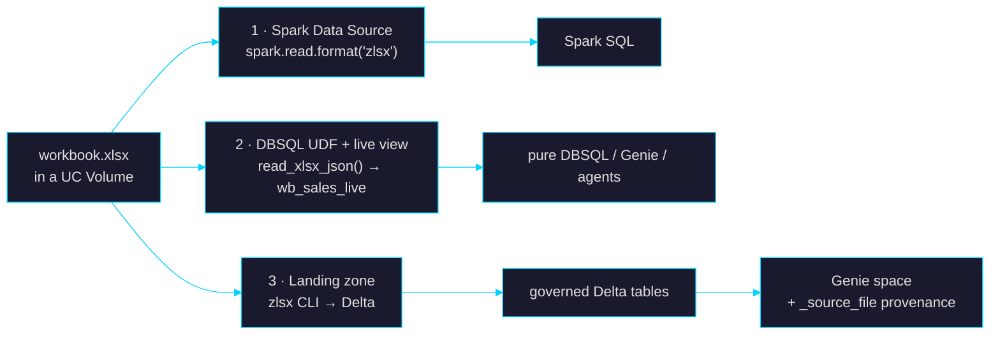

# zlsx × Databricks

*Query, land, and produce Excel workbooks on Databricks — using only released zlsx artifacts.*

Databricks has no native xlsx path: `read_files()` has no xlsx format, Auto Loader stops at
`binaryFile`, and the common workarounds are JVM/POI (heap-hungry) or driver-side
openpyxl (single-node, slow). The experiments in this directory prove that the released
`py-zlsx` wheels close that gap on three different surfaces, today.

> Status: **verified experiments, not a supported API.** Each script ran successfully
> against a real workspace on the date noted. Paths/catalog names are the reference
> setup — adapt to yours.

---

## The three surfaces



| # | Surface | File | Verified | What it proves |
|---|---------|------|----------|----------------|
| 1 | **PySpark Data Source** — the workbook is a Spark table, no Delta copy | `spark_datasource_demo.py` | 2026-07-30, serverless job, SUCCESS | The Python Data Source API + a Zig-backed wheel work on serverless (Graviton) |
| 1b | **Productized source: `zlsx.spark`** (py-zlsx 0.7.0+, in the wheel) — per-(file×sheet) partitions, row-range splits, sample-wide type widening, permissive/failfast, single-file & `part-*.xlsx` writer | `bindings/python/zlsx/spark.py` | local Spark 4.0, 9/9 integration tests | The demo's v0 caveats (first-row-only inference, single partition, no writer) are closed |
| 1c | **Streaming source — Auto Loader for Excel** — `spark.readStream.format("zlsx")`, fingerprint-map offsets, exactly-once per landed workbook | `bindings/python/zlsx/spark.py` (`ZlsxStreamReader`) | serverless job, two `availableNow` drains over one checkpoint: existing files → +1 landed file → no duplicates | Serverless REQUIRES `Trigger.AvailableNow` (infinite triggers rejected); Python stream sources run it via Spark's single-batch fallback |
| 1d | **SDP / Lakeflow pipeline** — declarative streaming table over the landing zone | `sdp_pipeline.py` | 2026-08-01, serverless pipeline `zlsx-excel-landing`, 2 updates, 5/5 rows exactly-once | Custom Python data sources work in serverless SDP: Volume wheel via pipeline `environment`, register in the pipeline file, /Volumes FUSE present on pipelines compute |
| 2 | **DBSQL UDF + live view** — the workbook is a SQL object; edits to the file show up in the next query | `read_xlsx_udf.sql` | 2026-07-31, PRO warehouse | The wheel loads *inside the UC Python UDF sandbox* (ctypes + tempfile allowed); liveness: +1 row in the file → +1 row in the view, zero re-ingestion |
| 3 | **Landing zone + Genie** — workbook → Delta with provenance → natural-language Q&A | `create_genie_space.py` | 2026-07-30, Conversation API | Genie answers cross-table and provenance questions over zlsx-landed tables |
| — | Demo fixture generator (2 sheets: Sales × Targets, deterministic) | `make_fixture.py` | — | — |

---

## Reproduction

### 0. Prerequisites

- A PAT in the environment. If a stale OAuth profile hijacks the CLI, force PAT auth:

```bash
set -a && source .env && set +a   # DATABRICKS_HOST / _TOKEN / _WAREHOUSE_ID
export DATABRICKS_AUTH_TYPE=pat DATABRICKS_CONFIG_FILE=/dev/null
```

- The **aarch64** wheel from the [release assets](https://github.com/laurentfabre/zlsx/releases)
  staged in a UC Volume (serverless compute is Graviton — the x86_64 wheel is rejected):

```bash
databricks fs cp py_zlsx-<ver>-py3-none-manylinux_2_28_aarch64.whl \
  dbfs:/Volumes/<cat>/<schema>/<vol>/
```

- The fixture: `python3 make_fixture.py && databricks fs cp fy2026_sales.xlsx dbfs:/Volumes/<cat>/<schema>/<vol>/`

### 1. Spark Data Source (serverless job)

The script must live under `/Workspace/…` — `spark_python_task` cannot read its
`python_file` from a Volume.

```bash
databricks workspace import /Users/<you>/zlsx/spark_datasource_demo.py \
  --file spark_datasource_demo.py --format RAW --language PYTHON --overwrite

databricks api post /api/2.2/jobs/runs/submit --json '{
  "run_name": "zlsx-direct-query",
  "tasks": [{"task_key": "q",
             "spark_python_task": {"python_file": "/Workspace/Users/<you>/zlsx/spark_datasource_demo.py"},
             "environment_key": "default"}],
  "environments": [{"environment_key": "default",
                    "spec": {"client": "3",
                             "dependencies": ["/Volumes/<cat>/<schema>/<vol>/py_zlsx-<ver>-py3-none-manylinux_2_28_aarch64.whl"]}}]
}'
```

Expected output ends with per-region aggregates and
`path used: PYSPARK DATA SOURCE spark.read.format("zlsx")`.

### 2. DBSQL UDF + live view

Run `read_xlsx_udf.sql` (adapt catalog/schema/Volume paths) in the SQL editor or via
the statement API. First invocation pays the UDF environment build (~10 s), then it's
cached. The view is **live**: overwrite the workbook in the Volume and re-query.

### 3. Landing zone + Genie

Land the two sheets as Delta tables (any loader works; the reference run used
`zlsx --header --format jsonl` piped into `INSERT` statements, with a `_source_file`
column carrying the Volume path), then:

```bash
python3 create_genie_space.py   # prints the space_id
```

Ask it questions via the Conversation API or the UI — including
*"Which Excel workbook did this data come from?"*, answered from `_source_file`.

---

## Platform gotchas (each cost one failed run)

| Gotcha | Symptom | Fix |
|---|---|---|
| Serverless compute is **Graviton** | `not a supported wheel on this platform` | Use the `manylinux_2_28_aarch64` wheel |
| `spark_python_task` can't read Volumes | `Cannot read the python file /Volumes/…` | Put the script under `/Workspace/…` |
| Genie `serialized_space` v2 validator | `column_configs must be sorted by column_name` | Sort them (see `create_genie_space.py`) |
| Stale OAuth profile hijacks the CLI | `refresh token is invalid` despite a valid PAT | `DATABRICKS_AUTH_TYPE=pat DATABRICKS_CONFIG_FILE=/dev/null` |
| ~~py-zlsx opens **paths**, not bytes~~ | ~~UDF needs a tempfile shim~~ | Resolved in 0.6.0: `zlsx.open_bytes()` parses the buffer directly (`zlsx_book_open_buffer` in the C ABI). `read_xlsx_udf.sql` uses it with a tempfile fallback for 0.5.0 wheels |

## What the productized versions need

The feasibility questions are settled; the remaining work is engineering:
per-(file×sheet) partitioning and row-range splits, type widening beyond the first data
row, the `df.write.format("zlsx")` half, a streaming source (Excel-in-a-Volume as a
Lakeflow streaming table), and `open_bytes()` in the C ABI / py-zlsx.

## License

Same license as the repository — see [LICENSE](../../LICENSE).
