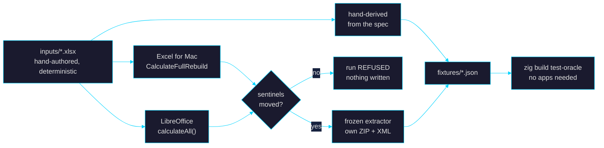

# Oracle harness (M1b)

> What does Excel actually do? Not what the docs say, not what we
> remember — what it does, recorded, with a receipt.

The formula evaluator is measured against external ground truth. This
directory is where that truth is recorded, checked, and replayed.
Specified in [`goal_formula.md`](../../goal_formula.md) §8.2–§8.4.

---

## The split that matters

**Recording** needs macOS, Excel and LibreOffice. **Replay** needs a
committed JSON file and nothing else.



`zig build test-oracle` is the gate. It runs in CI on Linux, where no
spreadsheet application exists.

---

## Why nothing here imports zlsx

An oracle that read workbooks through `pkg/zip.zig` and
`pkg/sheet_xml.zig` would carry the same bug on both sides of every
comparison, and would confirm zlsx against itself. So `zip_reader.zig`
walks the central directory by hand and `xml_scan.zig` is its own
scanner. `scripts/oracle/build_inputs.py` hand-authors input XML for the
same reason — and because no sane writer will emit a cached value that
contradicts its own formula, which is precisely what a sentinel is.

> This is the documented exception to "use zlsx for all xlsx work".

---

## Sentinels: the receipt

Ask Excel to recalculate and it might not — manual calc mode, a
swallowed event, a dialog. The file still saves, the extractor still
reads it, and every value in it is whatever was there before. The oracle
would then record the OLD values as ground truth and confirm them
forever. **Nothing errors.**

So every input carries cells whose cached values are deliberately
impossible. If they come back unchanged, the run is refused.

| Cell | Formula | Planted | Catches |
|---|---|---|---|
| `Sentinels!B1` | `=1+1` | `999` | no calculation happened at all |
| `Sentinels!B2` | `=C2*2` over an inverted `calcChain` | `111` | a calculation that did not rebuild dependencies |
| `Sentinels!B3` | `=RAND()` | `0.123456789` | LibreOffice re-saving a document it only loaded |

All-or-nothing: a run where two of three moved is a run whose behaviour
we do not understand.

---

## Running it

```bash
# Replay the committed evidence — the CI gate.
zig build test-oracle

# Re-record. Rebuilds inputs, runs every available leg, shows the diff,
# and changes nothing until you have read it.
scripts/oracle/regenerate.sh
scripts/oracle/regenerate.sh --apply
```

<details>
<summary>Individual legs</summary>

```bash
python3 scripts/oracle/build_inputs.py --out tests/oracle/inputs
python3 scripts/oracle/build_hand_spec.py \
    --input tests/oracle/inputs/oracle_suite.xlsx --out tests/oracle/fixtures

scripts/oracle/record_libreoffice.sh <in.xlsx> <out.xlsx>
scripts/oracle/record_excel_mac.sh   <in.xlsx> <out.xlsx>

zig-out/bin/zlsx-oracle-record <recalculated.xlsx> <provenance.json> \
    <case> <excel|ieee> <out.json>
```

Exit code `3` from a driver means **parked** — it needs a human, and the
message says what to do. Exit `2` from the recorder means the run was
**refused** by the sentinel check.

</details>

---

## ⚠️ The Excel leg is parked

Excel answers property queries but every window operation is a no-op or
refused (`quit` returns "User canceled", −128) — the signature of a
modal dialog nobody has dismissed. `osascript` also lacks assistive
access, so the dialog cannot be read from here.

**To unblock:** bring Excel to the front, dismiss whatever is on screen,
close any open workbook, then run `scripts/oracle/regenerate.sh`.

---

## Precedence

Fidelity-specific, because the two modes ask different questions
(§8.2). Conflicts are **recorded, never averaged** — an averaged golden
matches nothing that exists.

| Fidelity | Question | Order |
|---|---|---|
| `.excel` | what does Excel do? | Excel → hand-spec → corpus → LO |
| `.ieee` | what does IEEE-754 require? | hand-spec decides; **Excel is a witness only** |

Excel cannot decide its own exam: its departures from IEEE are the thing
`.ieee` measures.

---

## Recorded divergences

LibreOffice 26.2.5.2 vs the hand-derived suite, pinned as named tests in
`replay.zig` so a behaviour change surfaces instead of quietly agreeing:

| Case | Hand-derived | LibreOffice |
|---|---|---|
| `SQRT(-1)` | `#NUM!` (domain failure) | `#VALUE!` |
| `0.1+0.2` | `0x3FD3333333333334` | `0x3FD3333333333333` — rounded |
| `1/3` | `0x3FD5555555555555` | `0x3FD555555555554F` |
| `(0.1+0.2)=0.3` | `FALSE` | `TRUE` |
| `-0` | `0x8000000000000000` | `0x8000000000000000` ✓ |

Ten other cases — operator precedence, error taxonomy, coercion,
percent, overflow-to-`#NUM!` — were confirmed independently.

---

## Files

| File | Role |
|---|---|
| `zip_reader.zig` | own ZIP decode; CRC-verified |
| `xml_scan.zig` | own XML pull scanner + entity/ST_Xstring decoding |
| `extractor.zig` | **frozen**, versioned; bump = reviewed regeneration |
| `manifest.zig` | typed values, binary64 bits, error normalization |
| `provenance.zig` | six mandatory facts; blank is a failure |
| `sentinel.zig` | the receipt check |
| `sentinel_set.zig` | the planted cells; verified against the builder script |
| `adapters.zig` | capability matrix — each leg's blind spots |
| `precedence.zig` | fidelity-specific resolution; no arithmetic in the file |
| `screen.zig` | corpus screening + counts |
| `replay.zig` | the CI gate and test aggregator |
| `record.zig` | `zlsx-oracle-record` |
